# Sprawozdanie z przedmiotu Metody DevOps Jan Święs

# Etap 1 - Przygotowanie systemów (klienta i serwera)
W tym etapie pobrano obrazy systemu Fedora (wersja 36 netinstall), skonfigurowano oraz jej zainstalowano z widocznymi poniżej ustawieniami:

- Uruchomienie instalatora

- Wybranie języka instalacji

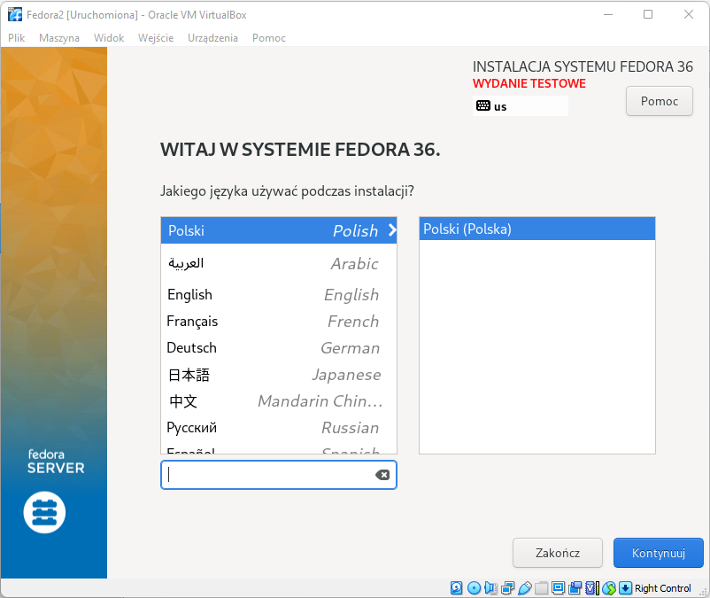

- Włączenie konta root'a. Należy tutaj pamiętać o zaznaczeniu checbox'a **zezwolenie na logowanie jako root przez SSH za pomocą hasła**, ponieważ jest to wymagane w celu przesłania artefaktów naszego programu na serwer.

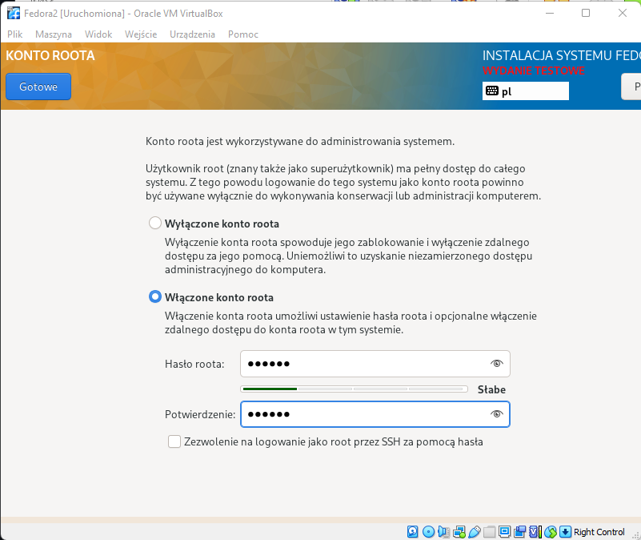

- Utworzenie partycji. Po dwukrotnym kliknięciu dysku, który nas interesuje należy zaznaczyć opcję **niestandardowa**.

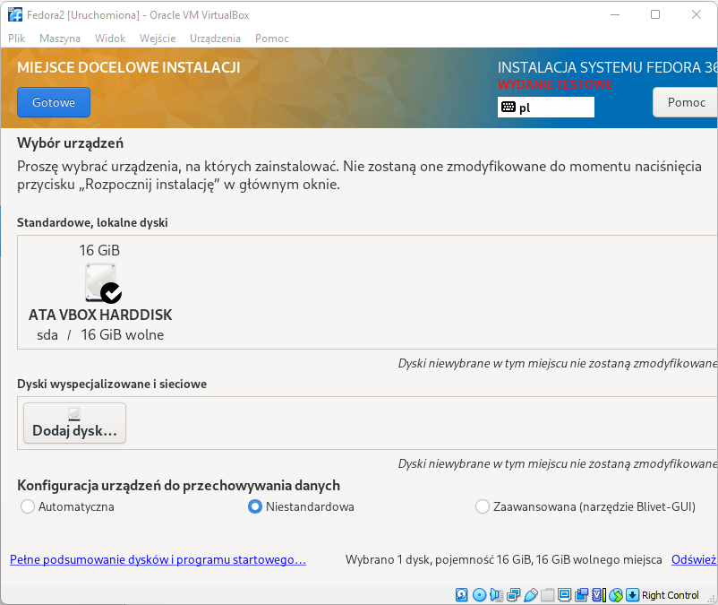

- Po klikcnięciu przycisku *gotowe* ukazuje się poniższy ekran. Należy wybrać opcję **Kliknąć tutaj, aby utworzyć je automatycznie**, zatwierdzić podsumowanie zmian oraz wrócić do głównego ekranu.

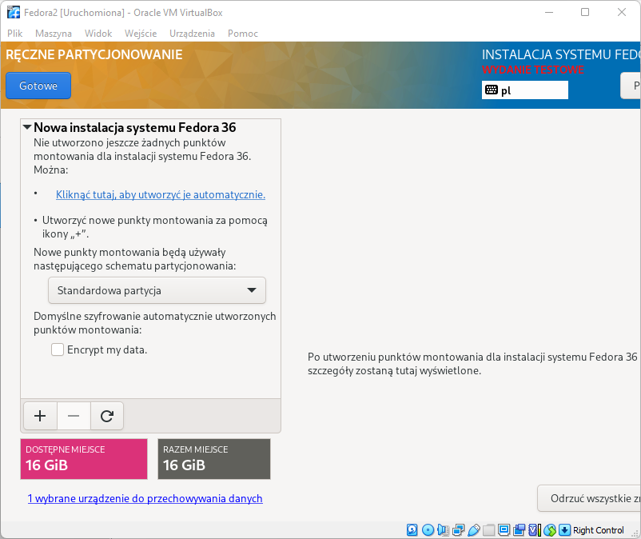

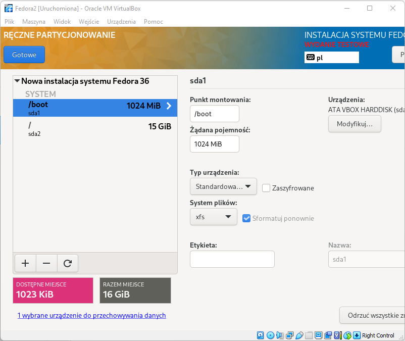

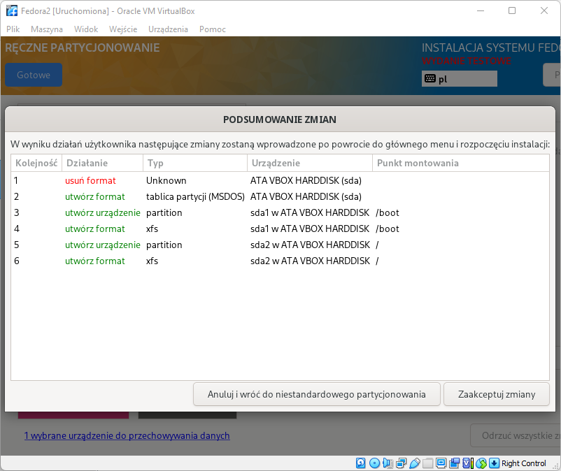

- Po wykonaniu powyższych kroków ukazuje się ekran **Wybór oprogramowania**. Należy tutaj zaznaczyć **minimalna instalacja**.

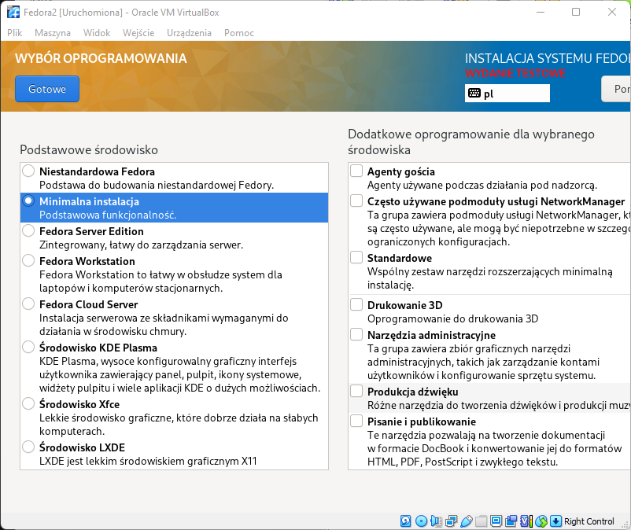

- Sprawdzenie adresu IP maszyny, w celu pobrania pliku anaconda-ks.cfg przez SSH.

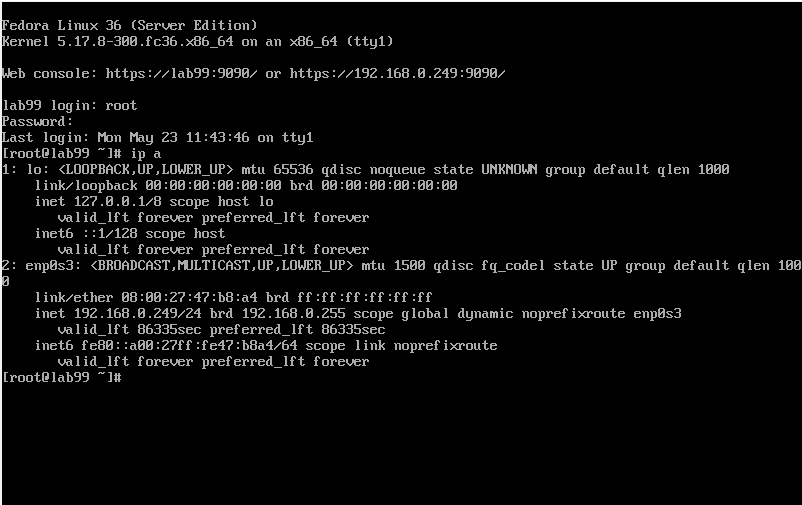

- Pobranie pliku przy pomocy WinSCP

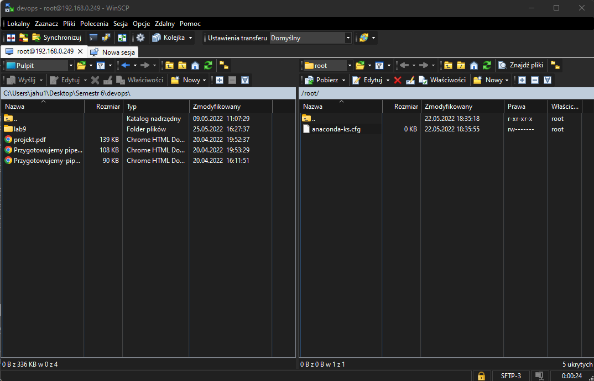

# Etap 2 - konfiguracja serwera

- Instalacja httpd

- Dodanie wyjątków w zaporze sieciowej i jej przeładowanie

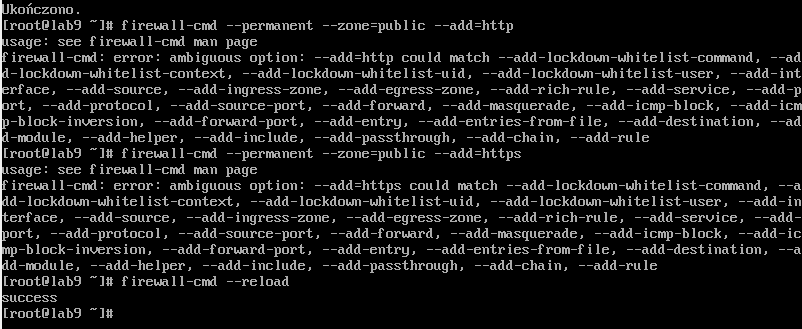

- Włączneie usługi httpd i sprawdzenie jej działania

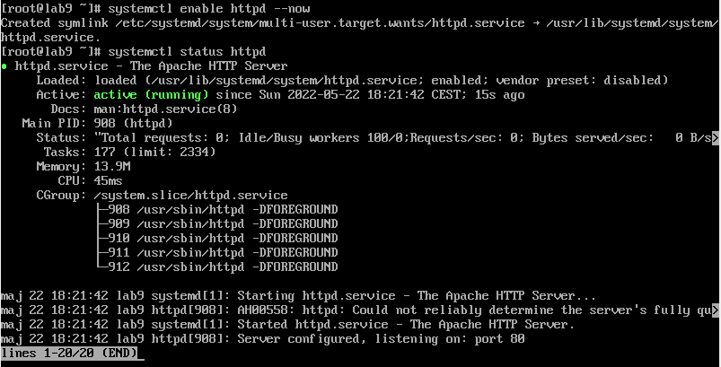

- Pobranie artefaktu z Jenkins's

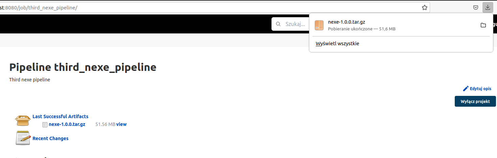

- Sprawdzenie adresu IP maszyny i przesłanie artefaktu za pomocą scp na serwer.

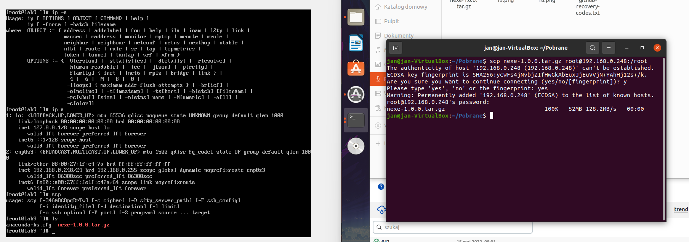

- Utworzenie katalogu **/var/www/html/nexe** skopiowanie do niego artefaktu.

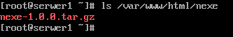

# Etap 3 - pobranie artefaktu z serwera

- Instalacja pakietu wget.

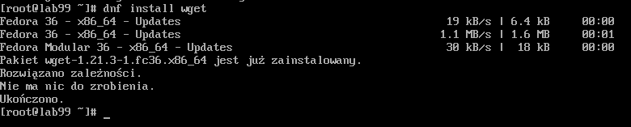

- Pobranie artefaktu

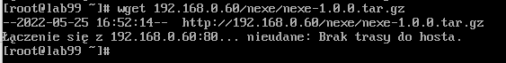

Na tym etapie pracy napotkałem problem, którego nie udało mi się naprawić. Mianowicie maszyna nie była w stanie nawiązać połączenia z serwerem przy pomocy narzędzia wget. Występował tutaj błąd `nieudane: Brak trasy do hosta`. Wcześniej wykonane kroki sprawdzałem kilkukrotnie, dokonałem reinstalacji obu maszyn (klienckiej oraz serwera) z upewnieniem się, że dostęp przez SSH jest dozwolony oraz, że konfiguracja obu maszyn jest przeprowadzona poprawnie. Karty sieciowe obu maszyn zostały ustawione na mostkowane. Dodatkowo sprawdzałem, czy maszyny pingują się (robiły to obustronnie). Inne narzędzia, takie jak WinSCP nawiązywały z maszynami połączenie bez problemu i miały dostęp do ich plików. Problemu nie udało mi się rozwiązać, w związku z czym poniżej napiszę, jakie kroki następnie nalezało wykonać, aby zakończyć zadanie.

- Instalacja pakietu npm
- Instalacja mojego programu (nexe)

**Instalacja nienadzorowana:**

- Modyfikacja pobranego wczesniej pliku (dodanie instalacji pakietów wget i npm, sekcja post, polegająca na pobraniu artefaktu z serwera, tryb instalacji z graficznej na tekstową) anaconda-ks.cfg i wysłanie go na repo na githubie.
- Instalacja fedory, przy pomocy w.w. pliku.
- Zamontowanie w napędzie optycznym obrazu Fedory.
- Utworzenie katalogu /media/iso i zamontowanie w nim obrazu z napędu.
- Skopiowanie pliku anaconda-ks.cfg do obrazu i zmiana jego nazwy na ks.cfg
- Modyfikacja pliku isolinux.cfg
- Zainstalowanie pakietu genisoimage
- Utworzenie nowego obrazu ISO
- Pobranie przy pomocy WinScp wygenerowanego obrazu ISO
- Utworzenie nowej maszynę wirtualnej
- Uruchomienie instalacji z obrazu