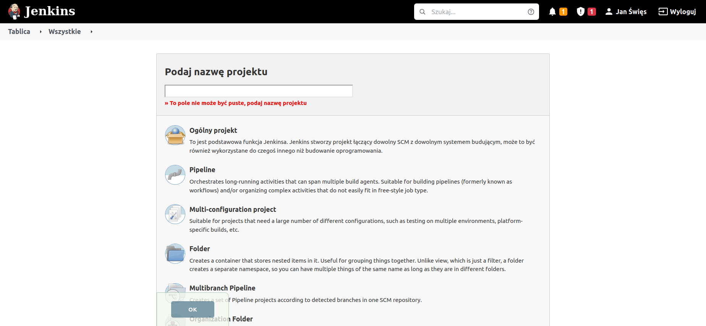
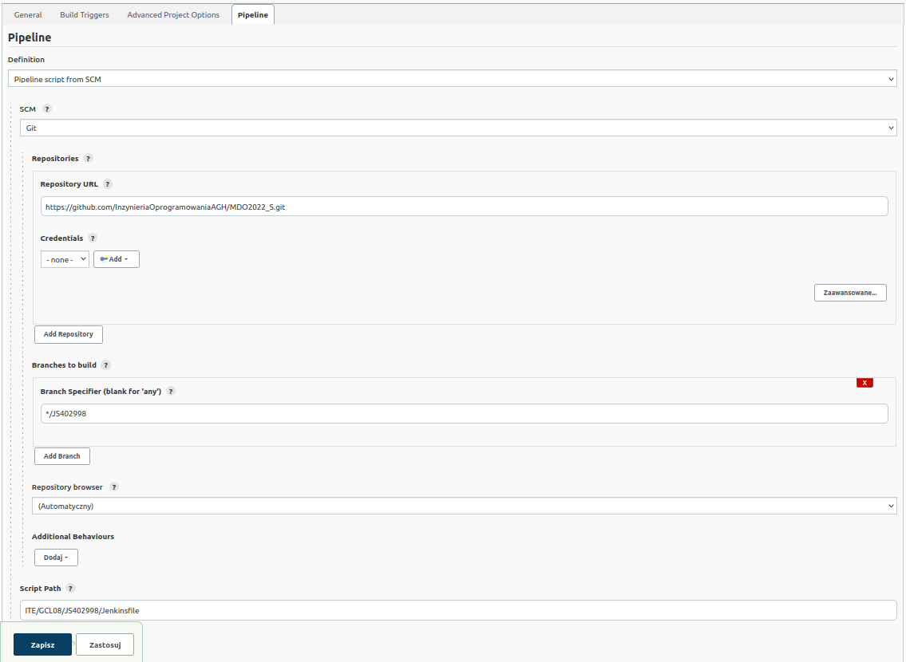
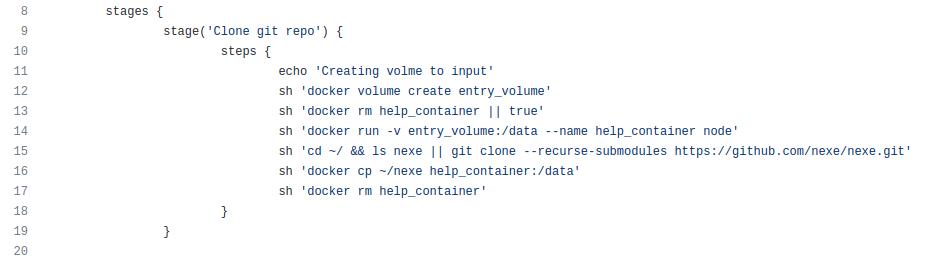
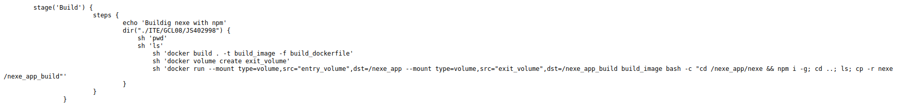
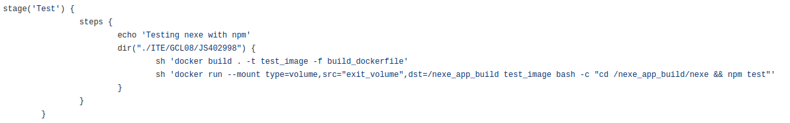
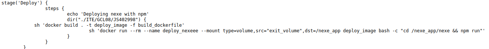
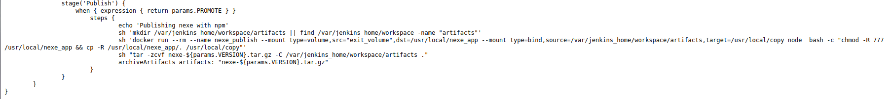
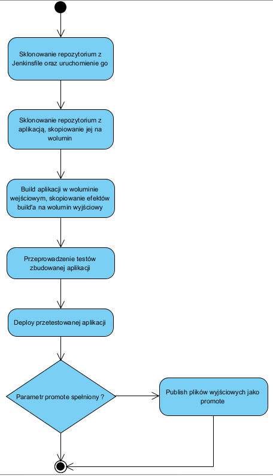
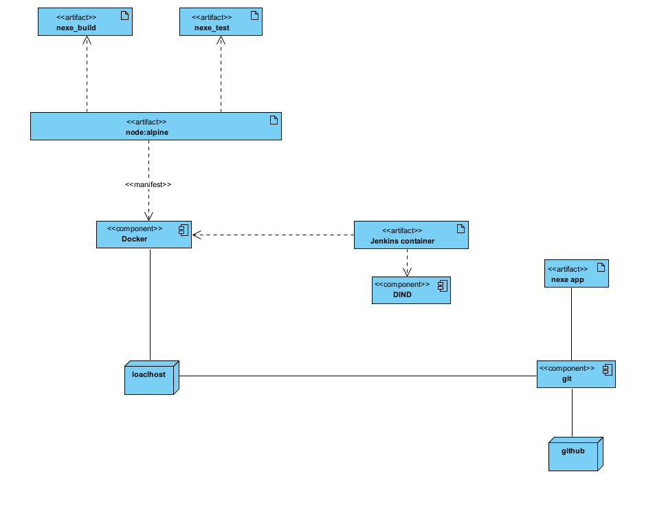

# Metodyki devops - projekt "Przygotowujemy pipeline!"

Jan Święs

## Cel projektu:
Założenie poniższego projektu to wykonanie znanych już nam kroków procesu wydawania aplikacji, które wykonywaliśmy przy użyciu innych narzędzi w Jenkinsie. Oznacza to skumulowanie etapów: build, test, deploy, publish w jeden spójny pipeline, który jednym kliknięciem będzie wykonywany za nas, zakładając jego poprawną konfigurację.

## Repozytorium programu Nexe: 

https://github.com/nexe/nexe

```Nexe``` to narzędzie konsolowe, które kompiluje aplikację Node.js w pojedynczy plik wykonywalny.

## Przygotowanie środowiska kontenerowego Jenkins with Docker:

Uwaga : Cały proces instalacji oraz konfiguracji Jenkins'a widnieje w moim poprzednim sprawozdaniu, w związku z czym etap ten pomijam.

## Zawartość repozytorium przed rozpoczęciem pracy

W celu utworzenia poniżeszgo pipeline należy na swoim repo umieścić 2 typy plików konieczne do dalszej pracy : `dockerfile` oraz `jenkinsfile`. Pierwszy to plik konfiguracyjny pozwalający, w którym określamy to, co znajdzie się wewnątrz obrazu oraz jak będzie się zachowywać kontener po uruchomieniu. Plik Dockerfile to zbiór instrukcji, gdzie zwykle każda z instrukcji dodaje kolejną warstwę do finalnego obrazu.
Drugi plik to plik konfiguracyjny nsazego pipeline, to on określa schemat działania oraz kroki, jakie będą sekwencyjnie wykonwane w celu zbudowania działajądej aplikacji.

## Etap 1: Konfiguracja Jenkinsa do budowy Pipeline

Aby utworzyć projekt, gdy znajdujemy się w ekranie głównym (tablicy), wybieramy ``Nowy projekt``. Następnie wybieramy ``Pipeline``, nadajemy mu nazwę oraz zatwierdzamy.



Kolejnym krokiem jest konfiguracja naszego projektu. Z poziomu tablicy wybieramy wcześniej utworzony przez nas projekt i przechodzimy do zakładki `Konfiguruj`. W niej nawigujemy do zakładki `Pipeline`, gdzie ustawiamy `Pipeline script from SCM`. Po wybraniu tej opcji musimy ustawić SCM na `Git` oraz wprowadzić kolejno : `Link do naszego repozytorium`, `branch`, na którym znajdują się w.w. pliki konfiguracyjne oraz `ścieżkę` do nich.



## Etap 2: Klonowanie repozytorium

Celem tej części jest sklonowanie wybranej przez nas aplikacji oraz umeiszczenie jej na woluminie wejściowym kontenera

Etap ten rozpoczynamy od utworzenia voluminu `entry_volume`. Warto tutaj sprawdzić, czy kontener został już utworzony, jeśli nie to tworzymy go i montujemy do niego volumin `entry_volume`. Następnie klonujemy repozytorium aplikacji i kopiujemy je do foleru `/data` na woluminie. Po wykonaniu powyższych kroków, dane po usunięicu kontenera pozostaną na w.w. woluminie.



## Etap 3: Budowanie aplikacji

W tym etapie zależy nam na zbudowaniu aplikacji oraz umieszczeniu jej na woluminie `exit_volume`.

Aby utworzyć obraz przy pomocy Dockerfile należy wykorzystac polecenie `dir`, które przenosi nas do wybranego katalogu, w którym chcemy pracować, w tym przypadku znajduje się tam nasz plik deockerfile.

Uruchamiamy kontener z woluminami `entry_volume` oraz `exit_volume`, bazując na utworzonym wcześniej obrazie. Wykorzystanie `node:alpine` pozwala na oszczędność pamięci, gdzyś jest on sporo lżejszy. Warto jednak sprawdzić, czy wybrany przez nas obraz posiada wszystkie potrzebne nam komponenty. Te brakujące warto uwzględnić i zainstalować w w.w. pliku dockerfile. W naszym przypadku potrzebujemy `bash'a`, którego node:apline default'owo nie posiada.

Aby zbudować program na woluminie `entry_volume` korzystamy z polecenia `npm i`. Po wykonaniu tego kroku, efekt build'a kopiujemy do woluminu `exit_volume`. O sukcesie lub ewentualnym niepowodzeniu procesu jesteśmy informowani na końcu w sekcji post.



## Etap 4: Test aplikacji

W etapie tym ponownie usltawiamy się w odpowiednim katalogu roboczym przy pomocy polecenia `dir`. Tworzymy ponownie kontener na podstawie porpzedniego obrazu a następnie montujemy do niego volumin `exit_volume`. Do przeprowadzenia testów wykorzystujemy polecenie `npm test`. O ich efekcie zostaniemy poinformowani komunikatem na końcu.



## Etap 5: Deploy

W etapie Deploy zależy nam na sprawdzeniu poprawności działania oraz stabilności zbudwoanej przez nas aplikacji.

W tym celu ruchamiamy kontener o wybranej przez nas nazwie i montujemy w nim wolumin `exit_volume`. Potem uruchamiamy `npm run`. Jeżeli kontener zwróci exit code świadczący o sukcesie, możemy go usunąć i przejść do kolenjego etapu.



## Etap 6: Publish

W tym etapie zależy nam na utworzeniu katalgu `artifacts` w odpowiedniej ścieżce w kontenerze Jenkinsa oraz wypromowanie pliku do artefaktu i jego publikacja.

Dokonujemy podpięcia nowego agenta z obrazem node:apline oraz rozwiązujemy problem uprawnień dzięki czemu posiadając uprawnienia root'a możemy opróżnić katalog `artifacts`.

Warto tutaj wspomnieć o dwóch parametrach : `VERSION` - służy do nadania wersji aplikacji oraz `PROMOTE` - pozwalający sprawdzić czy dany etap zostanie wykonany.

Aby spakować naszą aplikację używamy narzędzia `tar`. Po spakowaniu przenosimy archiwum do katalogu artifacts i archiwizujemy artefakt.



# Diagram aktywności



# Diagram wdrożenia


