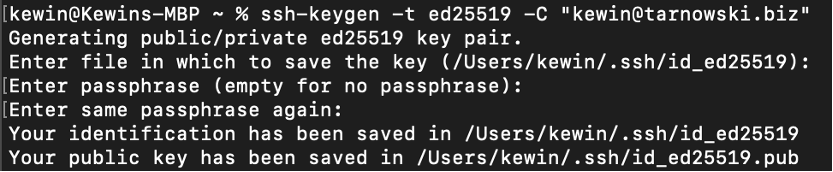
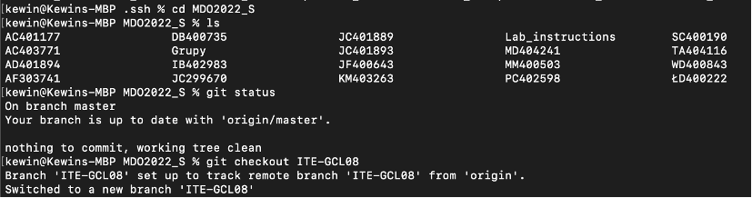
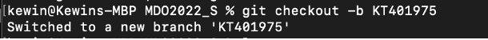
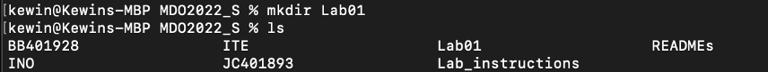
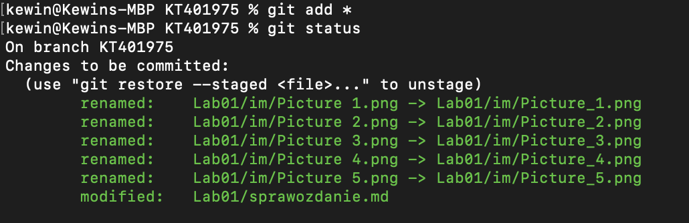
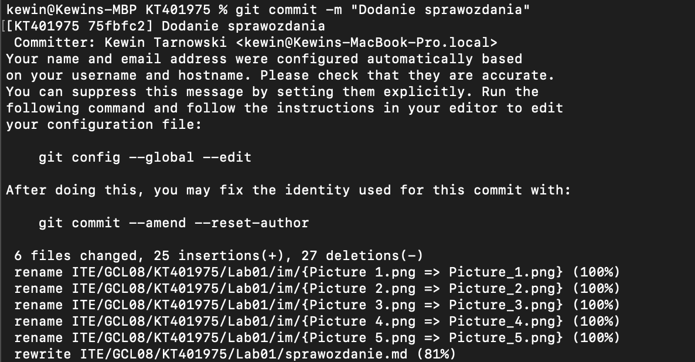
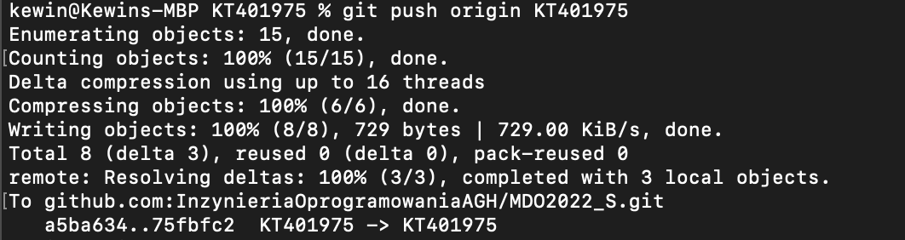

Kewin Tarnowski,
Informatyka Techniczna,
Gr. 8, nr albumu: 401975

Metodyki DevOps
Lab 1

Przebieg ćwiczenia:
## 1.	Klient Git na komputerze został zainstalowany przy pomocy Xcode Command Line Tools. 
## 2.	Utworzono klucze SSH inne niż RSA oraz skonfigurowano klucz jako metodę dostępu do GitHuba.

## 3.	Klonowanie repozytorium:

## 4.	Przełączenie na gałąź main, a potem na gałąź grupy:

## 5.	Utworzenie gałęzi z inicjałami oraz numerem indeksu:

## 6.	Utworzenie katalogu Lab01:

## 7.	Pull request

