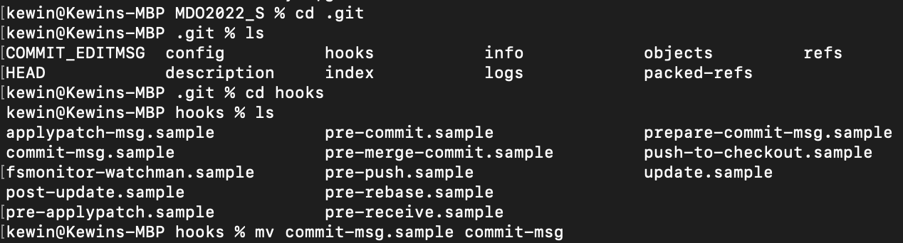
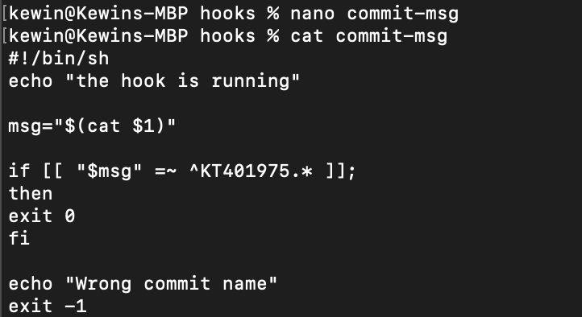
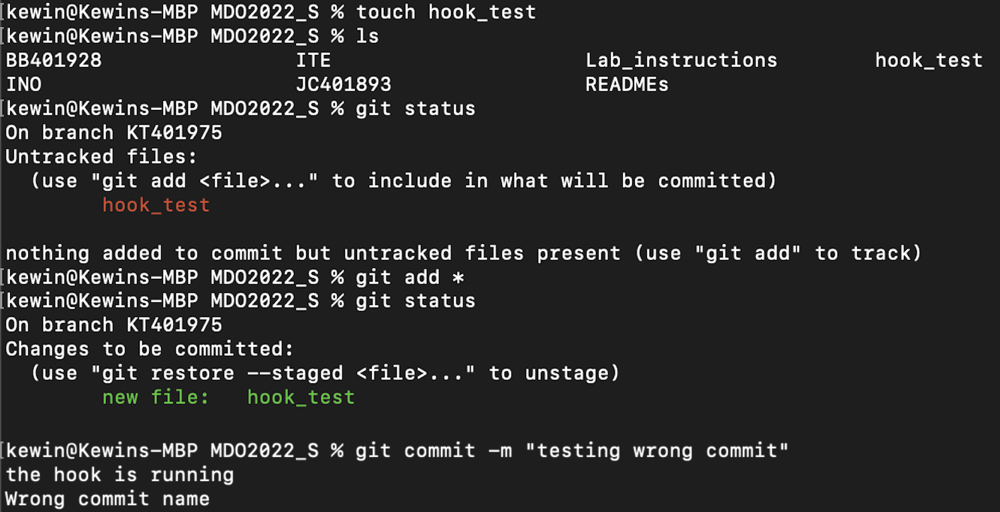
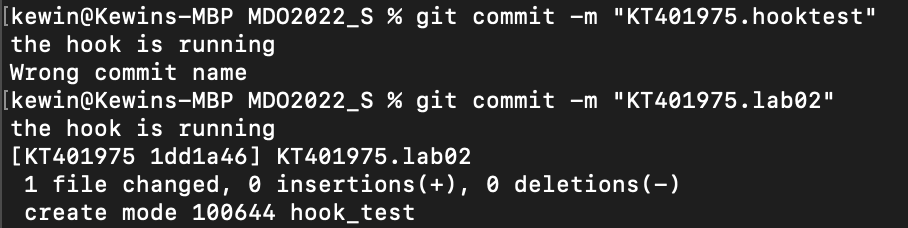
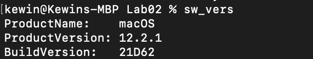
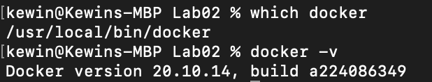
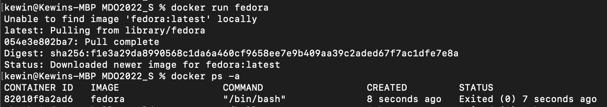
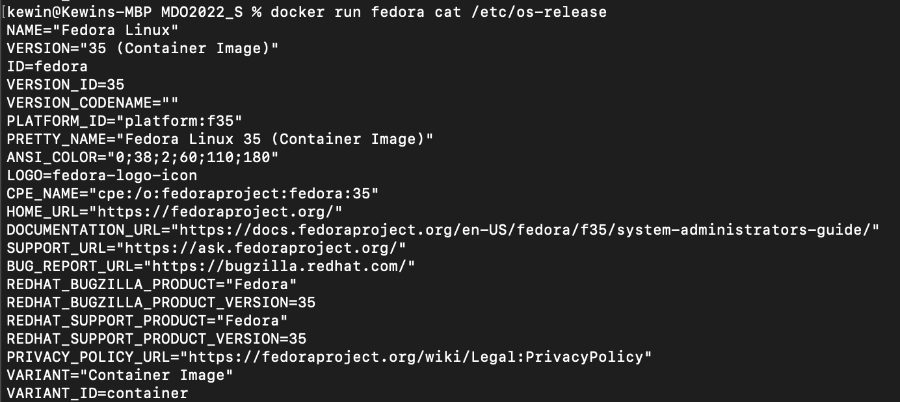
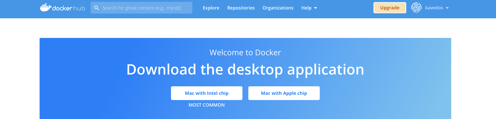

Kewin Tarnowski,
Informatyka Techniczna,
Gr. 8, nr albumu: 401975

Metodyki DevOps
Lab 2

Przebieg ćwiczenia:
## 1. Przygotowano Git Hook sprawdzający, czy tytuł commita zawiera inicjały i nr indeksu:
- Napisano git hook w folderze `./git/hooks`

- Test hooka

- Modyfikacja hooka, aby wymagany był numer laboratorium

- Test

## 2.  Przygotowanie środowiska Dockerowego
- Praca na komputerze Mac

- Dockera zainstalowano wcześniej, wersja i lokalizacja:

- Uruchomiono kontener z Fedorą:

- Wersja Fedory:

## 3.  Konto na Docker Hub

