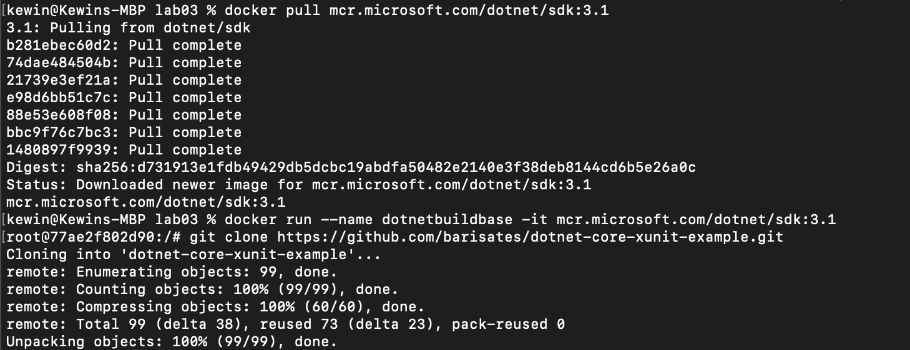
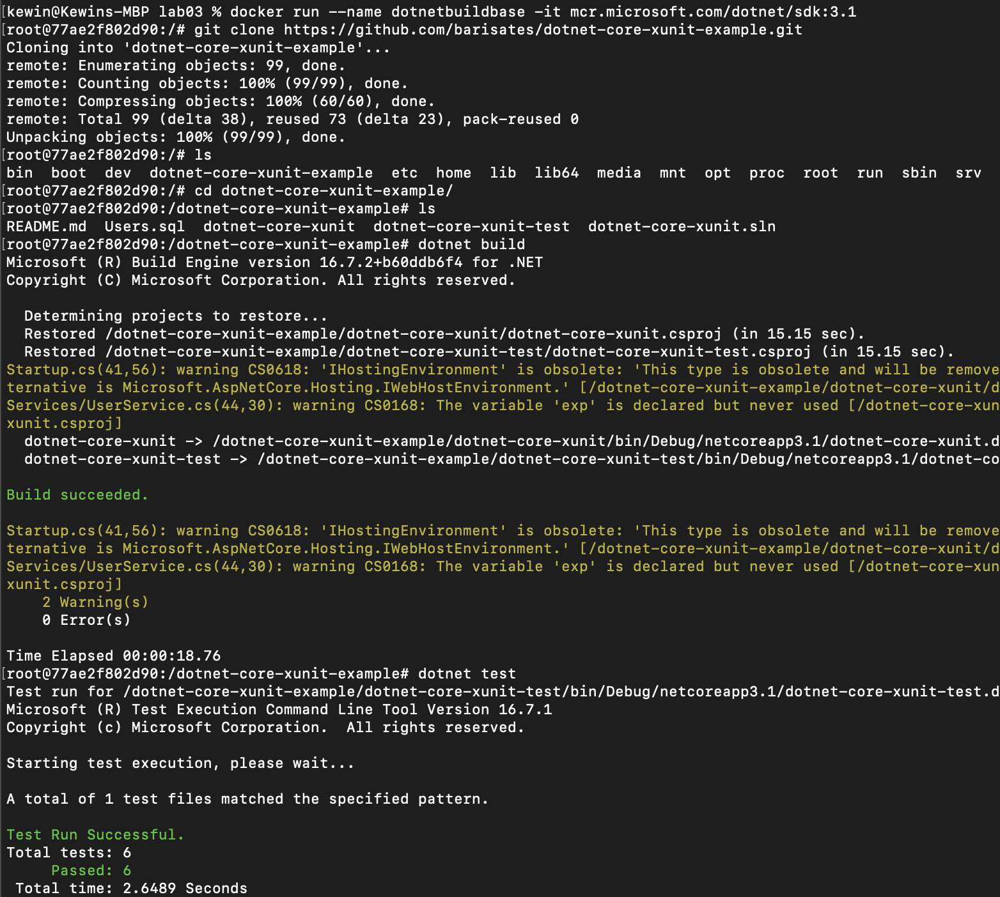
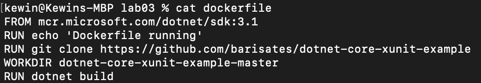
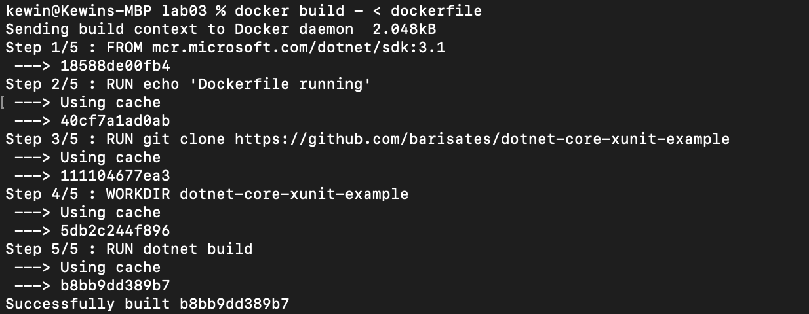
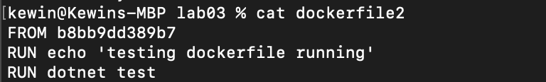
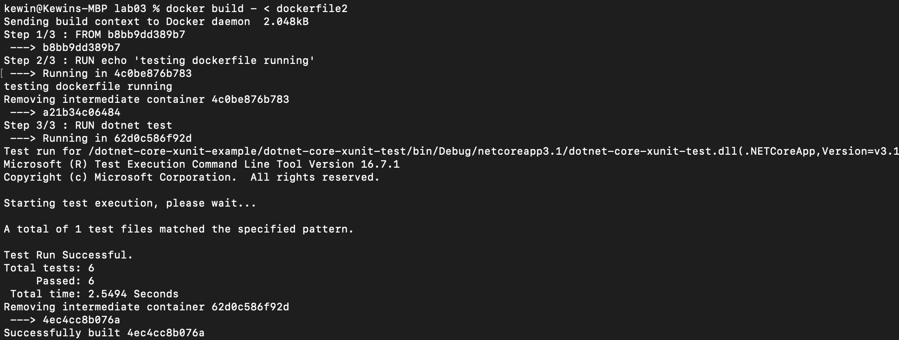

Kewin Tarnowski,
Informatyka Techniczna,
Gr. 8, nr albumu: 401975

Metodyki DevOps
Lab 3

Przebieg ćwiczenia:

## 1. Znalezienie repozytorium

- Wybrano program oparty na .Net Core 3.1 z publicznego repozytorium:

https://github.com/barisates/dotnet-core-xunit-example

## 2. Kontener

- Pobrano obraz .Net Core dla kontenera oraz go uruchomiono:

- Ściągnięto repozytorium i przetestowano budowanie oraz testowanie aplikacji na kontenerze:

- Stworzono plik dockerfile dla pierwszego kontenera, ściągający repozytorium oraz budujący projekt:

- Działanie:

- Stworzono plik dockerfile2 bazujący na pierwszym kontenerze i wykonujący testy:

- Działanie:

