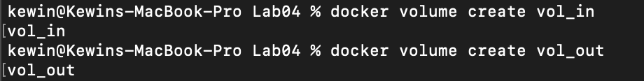
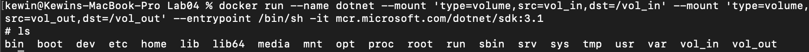
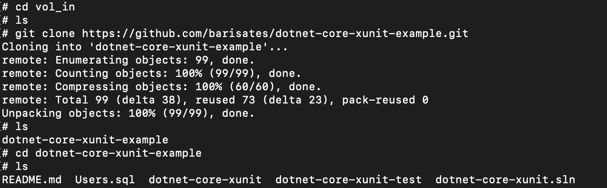
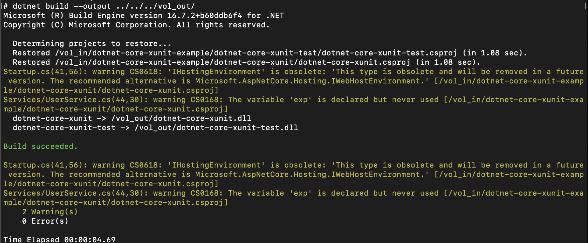
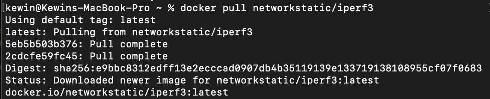
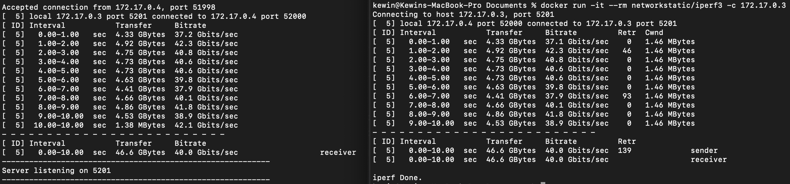
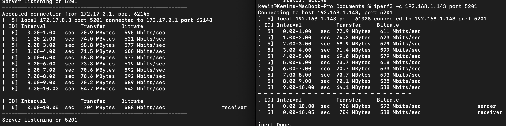
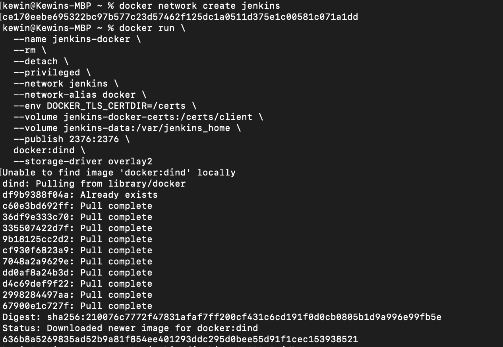
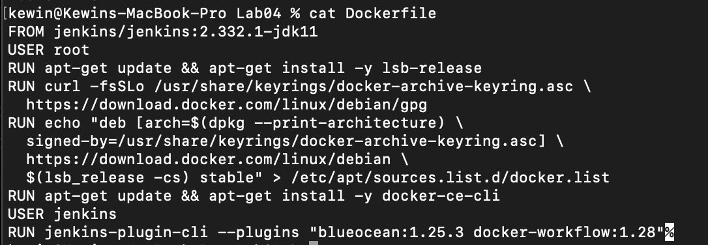

Kewin Tarnowski,
Informatyka Techniczna,
Gr. 8, nr albumu: 401975

Metodyki DevOps
Lab 4

# Przebieg ćwiczenia

## 1. Przygotowano woluminy do użycia oraz uruchomiono za ich pomocą kontener:

## 2. Sklonowano repozytorium z projektem do woluminu wejściowego:

## 3. Zbuildowano aplikację, a output został wrzucony do woluminu wyjściowego:

## 4. Pobrano obraz iperf3, a następnie uruchomiono server wewnątrz kontenera:

## 5. Połączenie kontener-kontener:

## 6. Połączenie host-kontener:

# Jenkins

## 1. Instalacja:

## 2. Utworzono Dockerfile:

-Uruchomiono kontener z Jenkinsem oraz użyto hasła z kontenera do konfiguracji Jenkinsa

