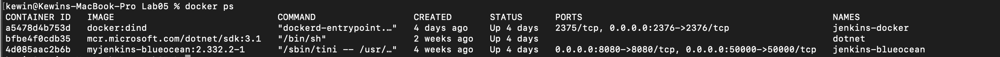
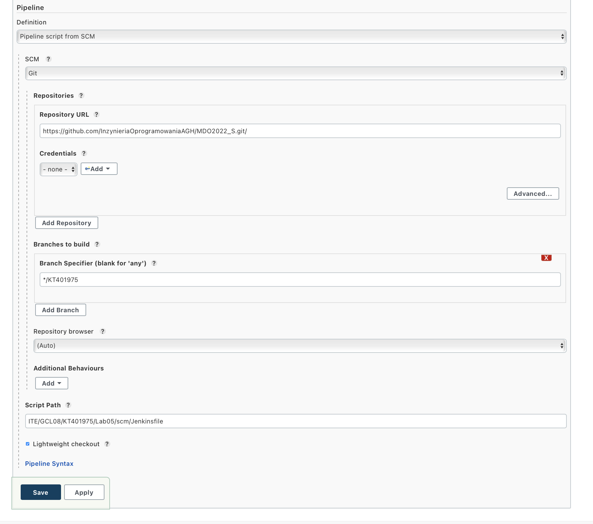
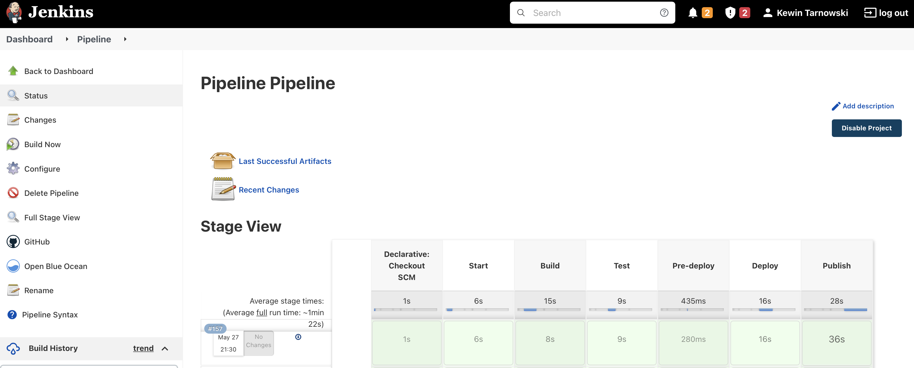
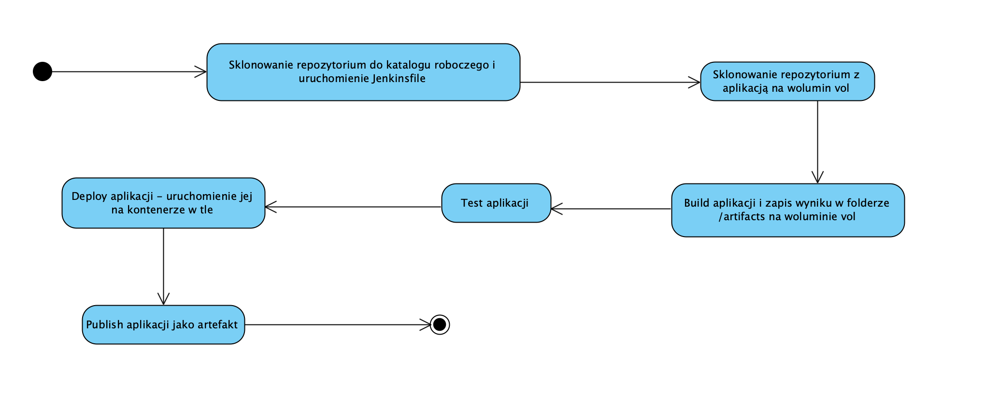

# Pipeline
## Cel projektu

Celem projektu jest zaprojektowanie Pipeline'a służącego do buildu, testu i publisha wybranej aplikacji - w moim przypadku została ona ściągnięra z publicznego repozytorium i bazuje na .NetCore.

Link do repozytorium: https://github.com/barisates/dotnet-core-xunit-example/tree/master/dotnet-core-xunit

Projekt wymagał skonfigurowanych wcześniej i uruchomionych kontenerów Jenkins i DIND:



## Budowa Pipeline

Skonfigurowano Pipeline aby korzystał z repozytorium Git z możliwością logowania z poziomu Jenkinsa:



Po skonfigurowaniu stage'y uzyskano konkretny Pipeline:



## Poszcze gólne etapy

- **```Stage Start```**

		`stage("Start") {
			steps {
				sh 'docker volume create vol'
          	  	git 'https://github.com/InzynieriaOprogramowaniaAGH/MDO2022_S.git'
				sh 'git checkout origin/KT401975'
				sh 'git config --global user.email kewin@tarnowski.biz ; git config --global user.name kawelos'
				sh 'git pull'
				sh 'cd ITE/GCL08/KT401975/Lab05/dockerfiles/buildfile ; docker build -t builder:latest .'
			}
		}`

Tworzymy tutaj volume przechowujący później artefakty po buildzie. Następnie klonowane jest repozytorium oraz zgodnie z zaleceniami Jenkinsa podajemy nasz email na githubie wraz z loginem - pipeline nie pozwalał mi na pracę w przeciwnym wypadku. Po przełączeniu się na odpowiednią gałąź, tworzony zostaje obraz dockerowy ```builder``` z dockerfile w folderze buildfile, definiujący odpowiednie środowisko dla naszej aplikacji.


- **```Stage Build```**

      	`stage('Build') {
			agent {
			    docker {
				image 'builder:latest'
				args '--mount source=vol,target=/vol -u root:root'
			    }
			 }
         	 steps {
				  sh 'cd /vol && rm -r dotnet-core-xunit-example || true && git clone https://github.com/barisates/dotnet-core-xunit-example && cd dotnet-core-xunit-example && dotnet build --output ../artifacts/'        
             }
		  }`
 
Skorzystałem tutaj z agenta dockerowego, co rozwiązało występujące problemy przy integracji dockera z Jenkinsem. Agentowi podany został obraz ```builder``` stworzony w poprzednim kroku oraz parametry montujące volume ```vol```. Na wolumin zostało sklonowane repozytorium z aplikacją, która następnie została zbuildowana - otput został zachowany w folderze artifacts na woluminie, gdyż zdecydowałem się korzystać z jednego podzielonego woluminu.


- **```Stage Test```**

		`stage('Test') {
			agent {
			    docker {
				image 'builder:latest'
				args '--mount source=vol,target=/vol -u root:root'
			    }
			}
		    steps {
				sh 'ls -a'
		 		sh 'cd /vol/dotnet-core-xunit-example && dotnet test'
		 	}
		}`
		

Korzystając z tego samego obrazu co wcześniej i wykorzystując ponownie agenta dockerowego, przechodzimy do woluminu i uruchamiamy testy. 


- **```Stage Pre-deploy```**

		`stage('Pre-deploy') {
		    steps {
		 		sh 'cd ITE/GCL08/KT401975/Lab05/dockerfiles/runfile ; docker build -t runner:latest .'    
		 	}
		}`

Aby upewnić się, że nasza aplikacja będzie działała poza środowiskiem buildowym, wykorzystano nowy obraz ```runner``` stworzony przy pomocy Dockerfile zalecanego przez Microsoft. Obraz ten posiada dotnetowe dependencje pozwalające na poprawne uruchomienie aplikacji bez SDK.


- **```Stage Deploy```**

		`stage('Deploy') {
		    steps {
				sh 'docker rm -f dep || true'
				sh 'docker run -d --name dep --mount source=vol,target=/vol -u root:root runner:latest bash -c "cd /vol/artifacts && ./dotnet-core-xunit"'
				sh 'sleep 15; exit $(docker inspect dep --format="{{.State.ExitCode}}")'
				sh 'docker rm -f dep'
		    }
		}`

W stage'u Deploy chcemy uruchomić aplikację na naszym nowym obrazie. Aby to zrobić, korzystamy z woluminu zawierającego zbudowaną już aplikację, uruchamiając kontener z parametrem -d. Dzięki temu kontener będzie działał w tle, przez co działająca aplikacja nie będzie zakłócała pracy Pipeline'a. Po 15 sekundach kontener kończy pracę i jest usuwany.


- **```Stage Publish```**

		`stage('Publish') {
			agent{
				docker{
					image 'mcr.microsoft.com/dotnet/sdk:3.1'
					args '--mount source=vol,target=/vol -u root:root'
				}
			}
		    steps {
			    sh 'cd /vol/dotnet-core-xunit-example && dotnet publish -c Release -r win-x64 -p:UseAppHost=true --output ../publish/'
			   	sh "cp -R /vol/artifacts ${WORKSPACE}/publish"
			    archiveArtifacts 'publish/*'
		    }
		}`

Celem tego etapu jest spakowanie zbudowanej aplikacji do archiwum i zarchiwizowanie artefaktu. Korzystając ponownie z agenta dockerowego, wybrano obraz dotnet sdk:3.1 aby możliwe było wykonanie komendy `dotnet publish`. W argumentach podano wolumin z poprzednich etapów.

Wykonując polecenie dotnet publish ustalono środowisko (w naszym przypadku Windowsowe) za pomocą -r win-x64. W efekcie końcowym uzyskano folder publish zawierający naszą aplikację. Niestety zamiast jednego pliku z wszystkimi dependencjami uzyskano mnóstwo plików z plikiem wykonywalnym. Stało się tak z powodu nieudanej próby użycia parametru -p:PublishSingleFile=true. Wygenerowany błąd informował o braku identyfikatora Runtime, co jedynie udało się obejść w sposób pokazany wyżej.

Wygenerowany folder z aplikacją:


## Diagram aktywności

