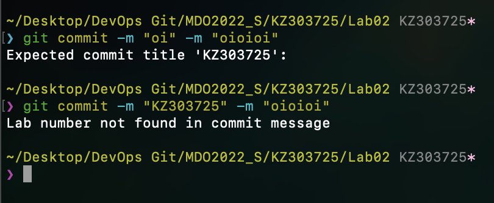
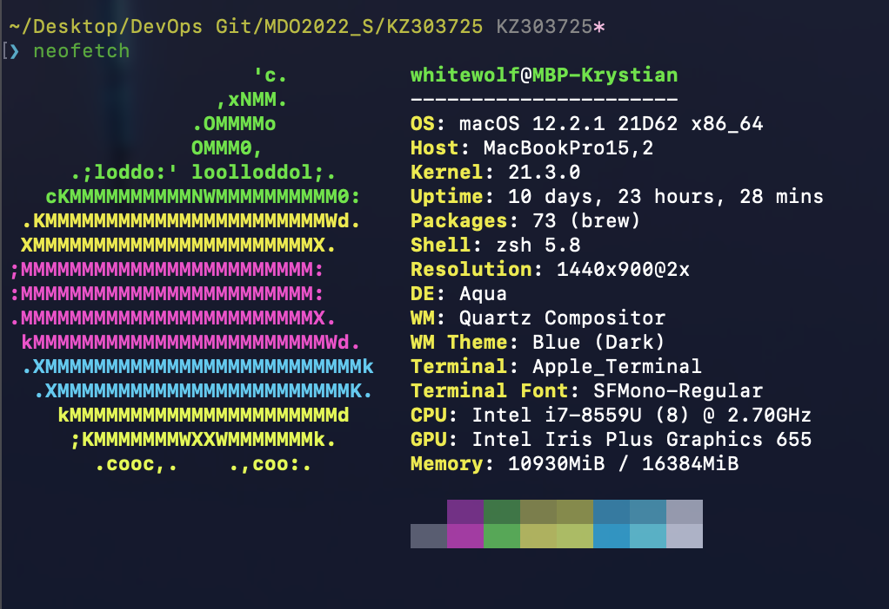
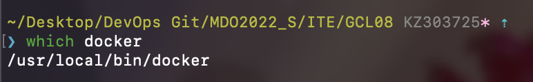
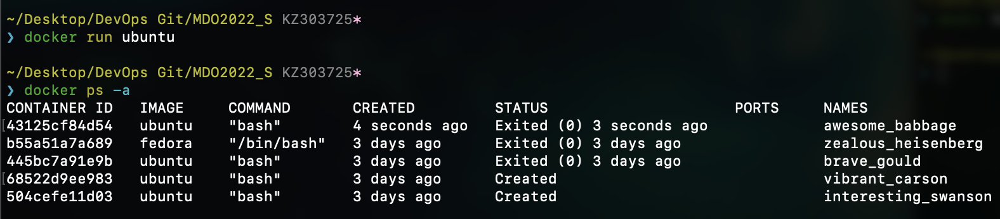

# Krystian Zapart - Lab02
## Stworzenie git hook'a dla commit-msg

```
#!/bin/bash

commit_title=`head -n1 $1`

commit_message=`tail -n1 $1`


if ! [[ "$commit_title" = 'KZ303725' ]]; then
    echo "Expected commit title 'KZ303725':"
    exit 1
fi

echo $commit_message | grep -q 'Lab0[0-9]' || 
{	
	echo "Lab number not found in commit message"
	exit 1
} 
```

# Sprawdzenie działania git hook'a



# Weryfikacja systemu 



# Potwierdzenie obecności dockera




# Uruchomienie i historia kontenerów



# Potwierdzenie konta Docker ID


