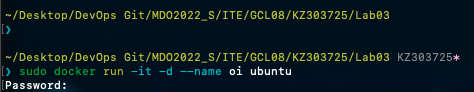
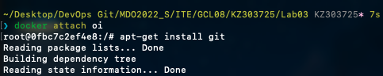
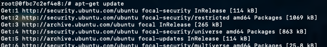
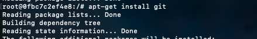
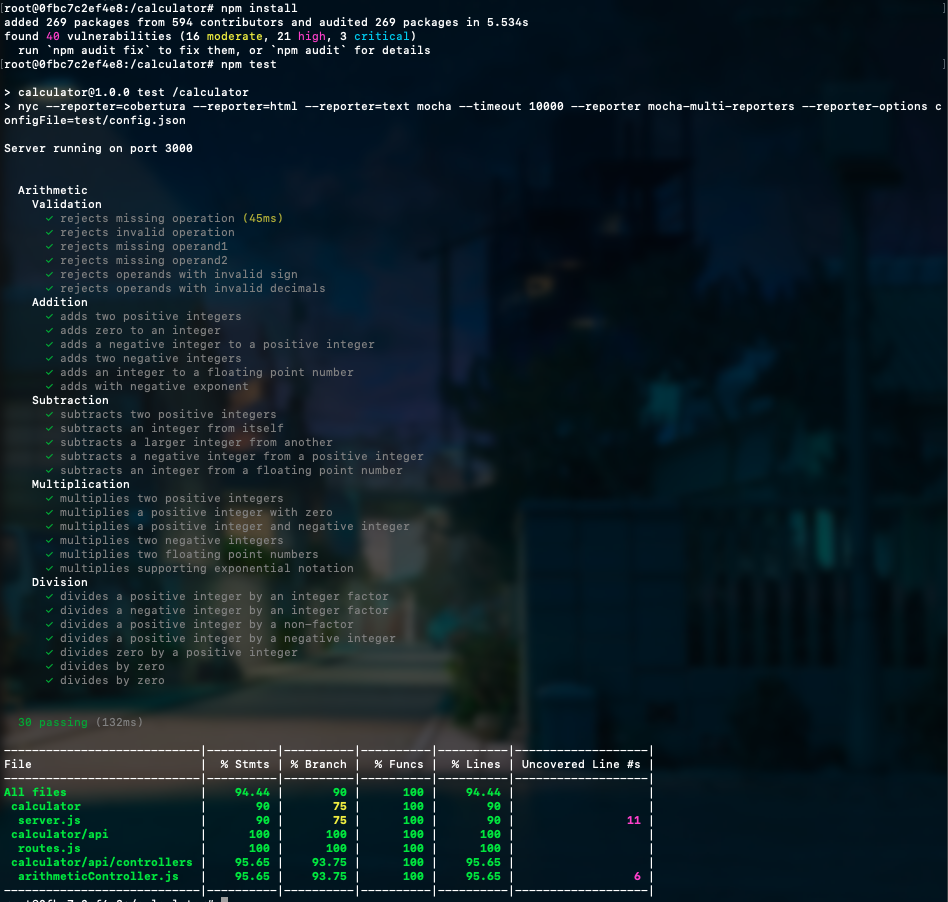
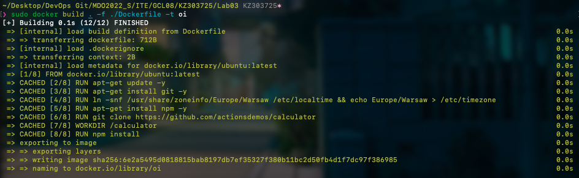
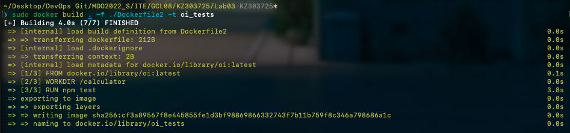

# Sprawozdanie Krystian Zapart Lab03

1. Link do open-source'owego repo użytego w ramach labolatorium.

```https://github.com/actionsdemos/calculator```
 
2. Uruchomienie kontenera



3. Podpięcie się do kontenera



4. Zaopatrzenie kontener w wymagane pakiety 



5. Klonowanie repozytorium 



6. Build & Test



7. Napisanie i uruchomienie Dockerfile'a do buildowania 

```
FROM ubuntu:latest
RUN apt-get update -y
RUN apt-get install git -y
ENV TZ=Europe/Warsaw
RUN ln -snf /usr/share/zoneinfo/$TZ /etc/localtime && echo $TZ > /etc/timezone
RUN apt-get install npm -y
RUN git clone https://github.com/actionsdemos/calculator
WORKDIR "/calculator"
RUN npm install
```


8. Napisanie i uruchomienie Dockerfile'a do Testowania

```
FROM oi:latest
WORKDIR "/calculator"
RUN npm test
```



W kontenerze stworzonym za pomocą naszego obrazu pracuje nasz program,który dzięki kontenerowi jest odizolowany od głównego systemu. 
