# Sprawozdanie Krystian Zapart Lab04

1. Utworzenie woluminów.

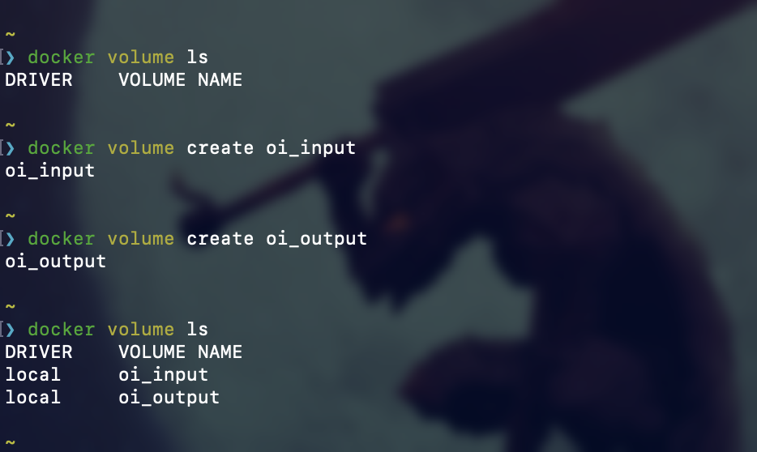
 
2. Uruchomienie konterena za pomocą woluminów.

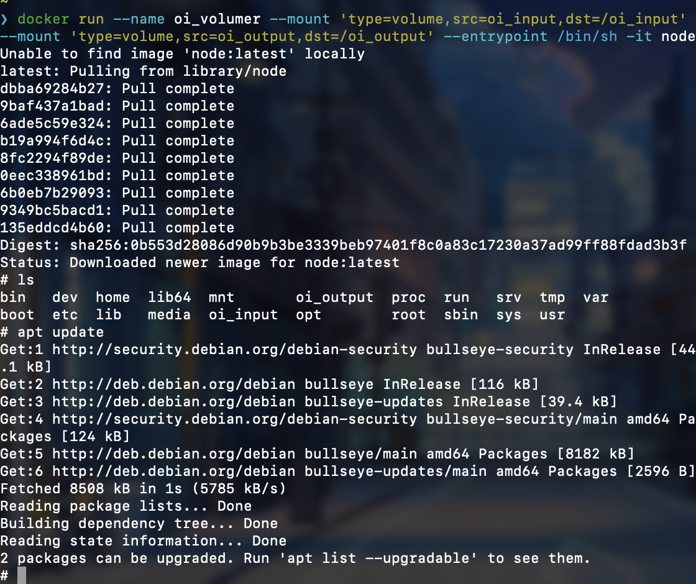

3. Sklonowanie repo w woluminie wejściowym.

 Żeby dostać się do katalogu woluminu potrzebne było podpięcie się do dockera poprzez kontener:
``` docker run --rm -it -v /:/docker ubuntu ```
za pomocą kontenera byłem w stanie dostać się do katalogu "docker/val/lib/docker/volume/_data/oi_input"

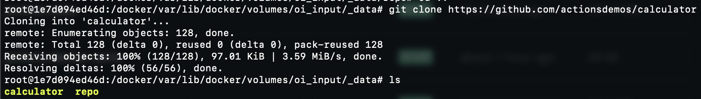

4. Potwierdzenie obecności sklonowanego repo w kontenerze.
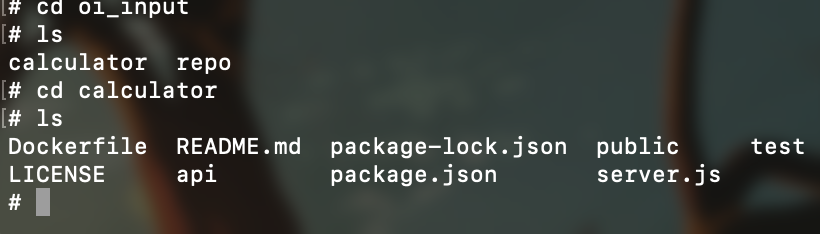

5. Budowanie.

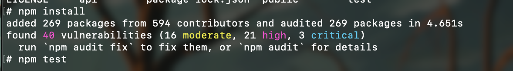

6. Test.

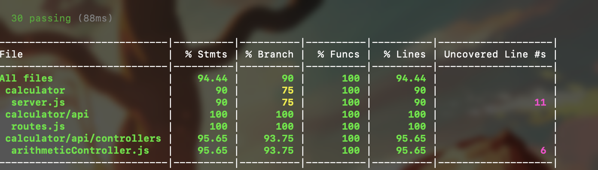

7. Skopiowany build do woluminu wyjściowego.

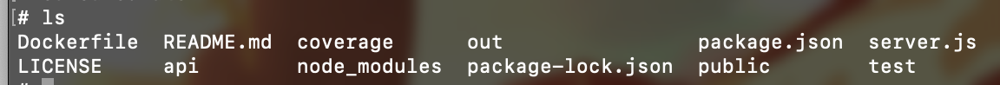

8. Uruchomienie serwera iperf3 na kontenerze. 

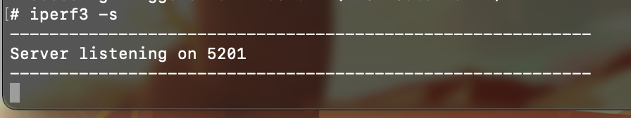

9. Połączenie kontener-kontener.

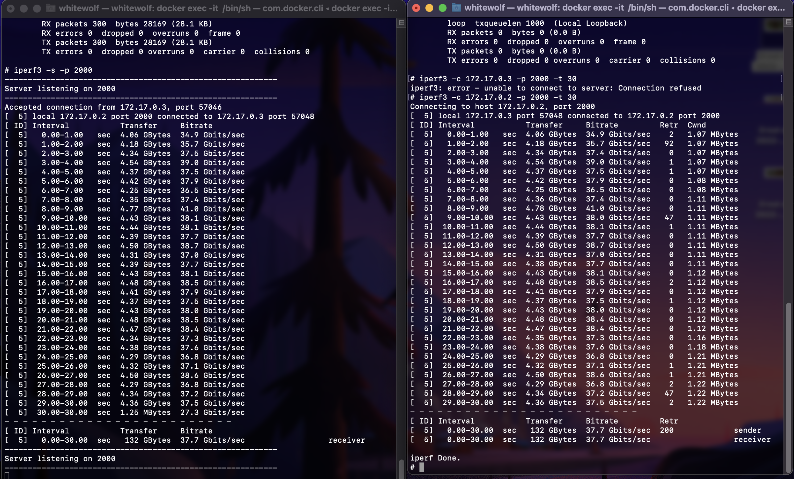

10. Połączenie host-kontener.

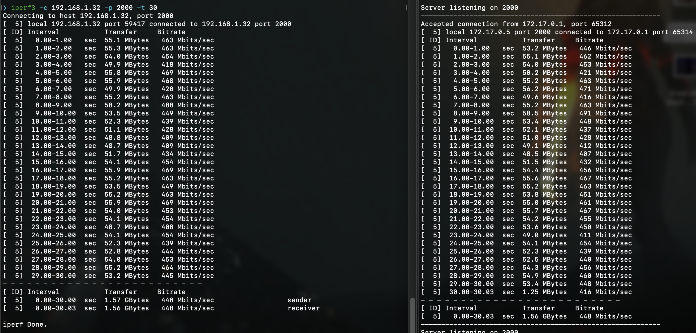

11. Instalacja Jenkinsa.

Jenkins został zainstalowany przy pomocy dokumentacji  https://www.jenkins.io/doc/book/installing/docker/

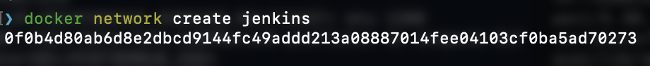

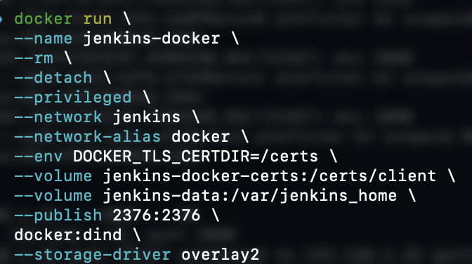

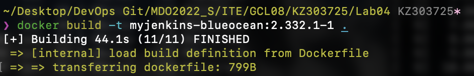

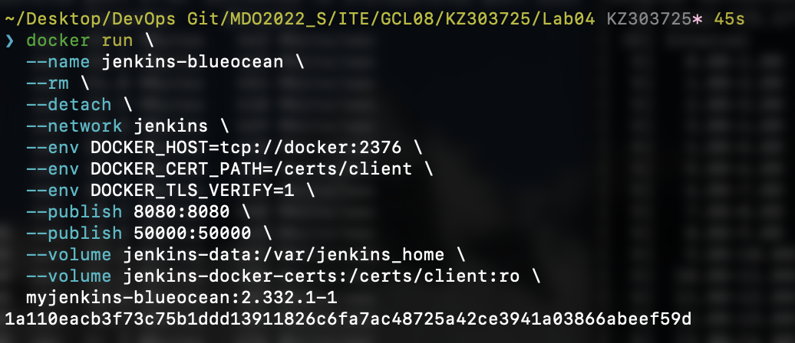

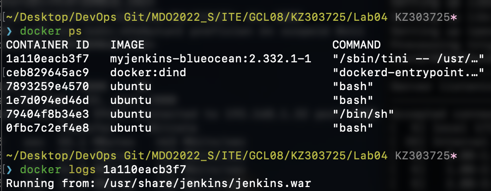

12. Pomyślne odpalenie Jenkinsa.
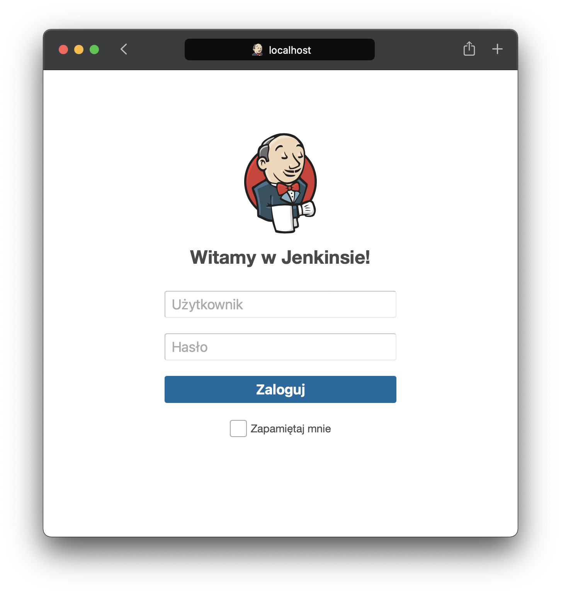


