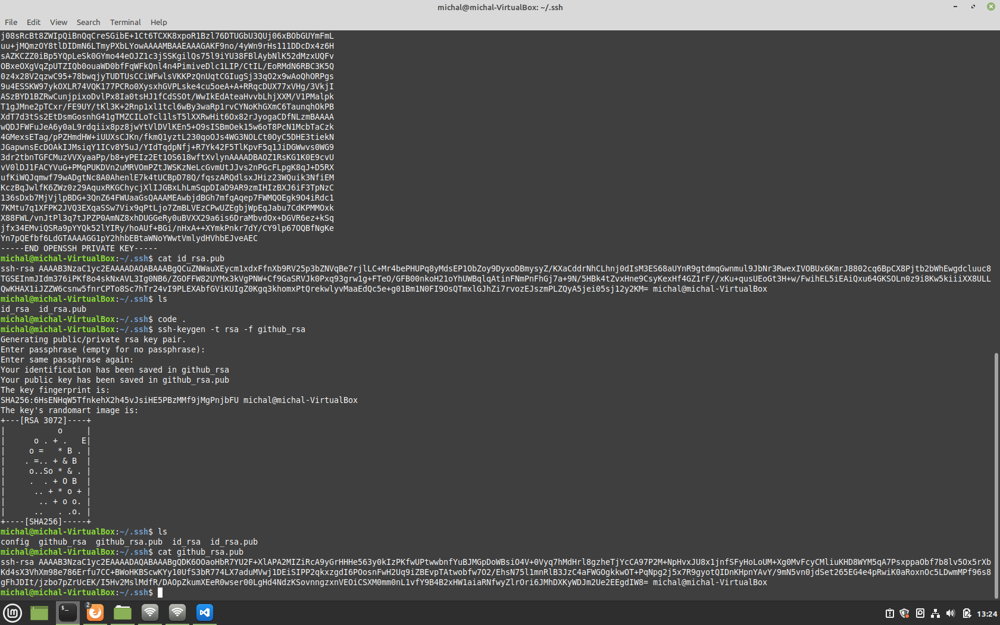
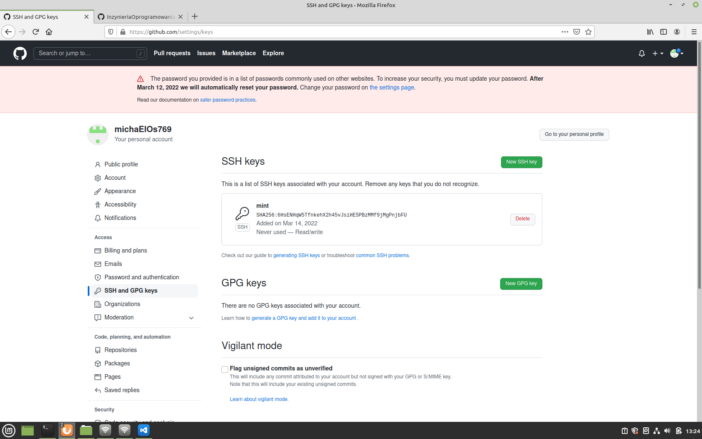
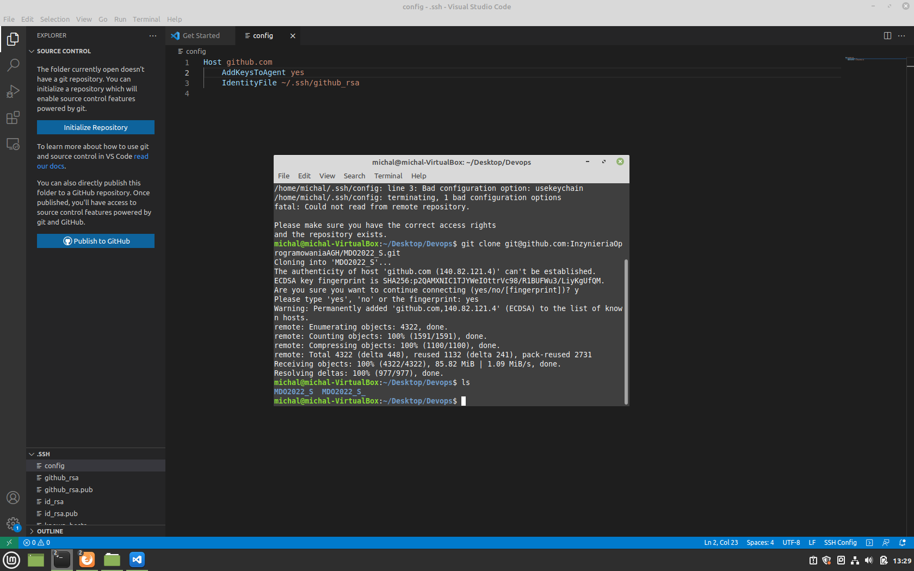
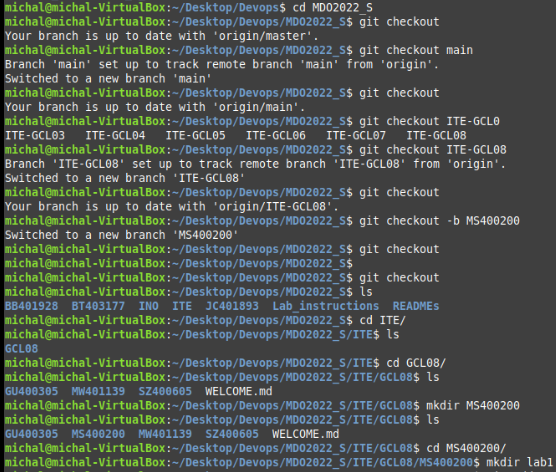
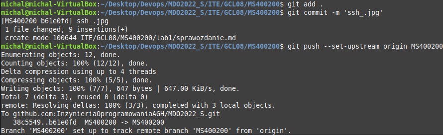
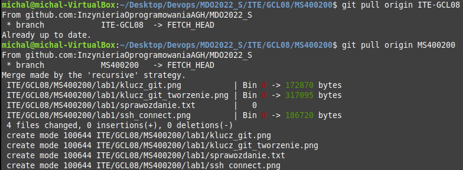

# Sprawozdanie Lab01 Michal Szymanski

## Cel cwiczenia
Konfiguracja srodowiska git

## Przebieg cwiczenia
1. Zainstalowano klienta git
2. Stworzono i skonfigurowano klucze ssh

3. Nastepnie sklonowano repopzytorium za pomoca SSH

4. Przelaczono sie na odpowiednia galaz (main) a nastepnie stowrzono wlasna galaz

5. Rozpoczeto prace na branchu, stworzono commit i dodano go do repo

6. Wciagnieto galaz do galezi grupowej

