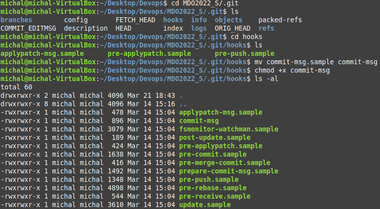
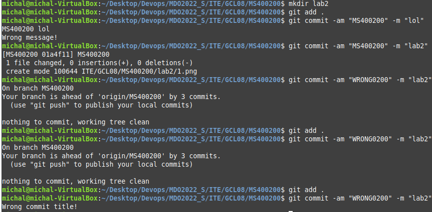
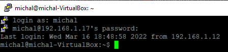
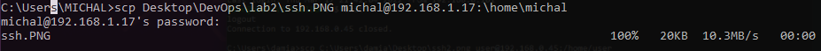
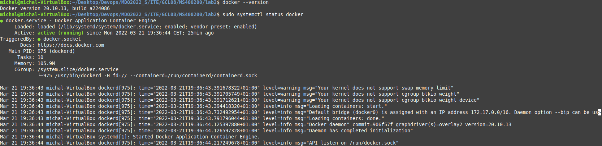
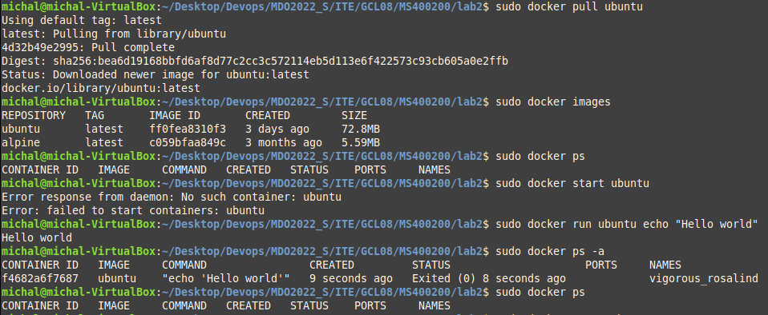
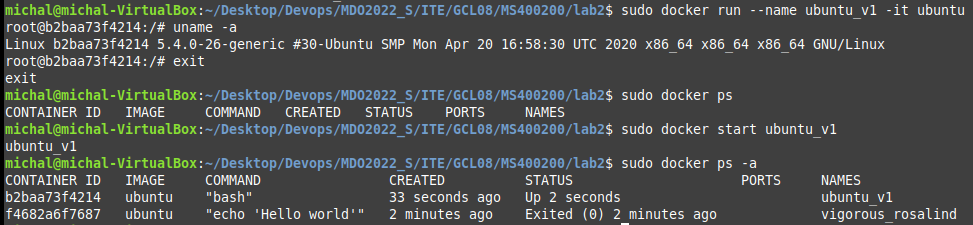

# Sprawozdanie Lab02 Michał Szymański ITE-GCL08

## Cel ćwiczenia
Kontrolowanie zawartości commita, konfiguracja środowiska i testowanie działania konteneryzacji.

## Przebieg

1. Przygotowano git hook, który rozwiąże najczęstsze problemy z commitami:
    - hook sprawdzający, czy tytuł commita nazywa się ```<inicjały><numer indeksu>```
    - hook sprawdzający, czy w treści commita pada numer labu, właściwy dla zadania
    - sprawdzono zawarość folderu ```.git/hooks```, zmieniono uprawnienia hooka ```commit-msg```
    

2. Stworzono skrypt sprawdzający podane wymagania
    ```
    #!/usr/bin/python3

    import sys

    pathToFile = sys.argv[1]
    opened = open(pathToFile, 'r') # 
    content = opened.read()

    title = content.split('\n')[0]
    msg = content.split('\n')[2]

    if ("MS400200" != title):
        print("Wrong commit title!")
        exit(1)

    if ("2" not in msg):
        print("Wrong commit message!")
        exit(1)

    else:
        exit(0)
    ```
    - sprawdzono działanie powyższego skryptu:
    

3. Rozpoczęto przygotowanie środowiska Dockerowego:
    - zapewniono dostęp przez SSH i wykazano ten fakt przesyłając plik tunelem:
    
    

4. Działanie środowiska:
    - wersja oraz status Dockera:
    

    - pull obrazu ubuntu oraz wylistowanie wykonanych operacji:
    

    - numer wersji obrazu:
    

5. Założono konto na Docker Hub:

    


