# Sprawozdanie Lab03 Michał Szymański ITE-GCL08


## Cel ćwiczenia
Przeprowadzenie buildu repozytorium: https://github.com/opentracing/basictracer-python.git z narzedziem make w kontenerze.


## Przebieg

1. Uruchomiono kontener i podlaczono TTY:
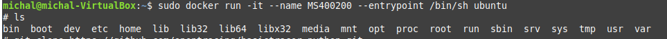

2. Sklonowano do niego wybrane repozytorium:  
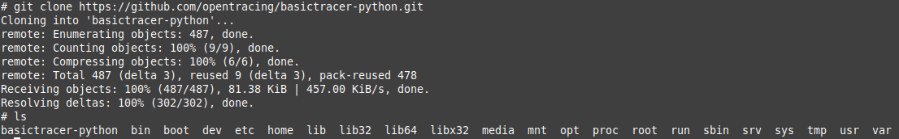

3. Doinstalowano potrzebne narzedzia:<br/>
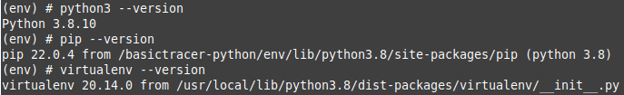

4. Zbudowano program za pomoca targetu ```make bootstrap```:
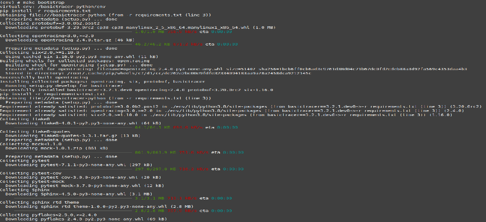

5. Uruchomiono testy za pomoca targetu ```make test```:
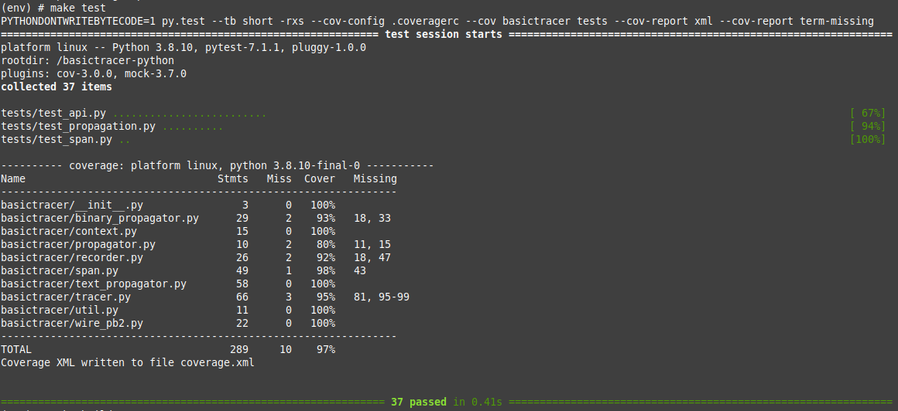

6. Stworzono Dockerfile ktory odpowiadal za build:
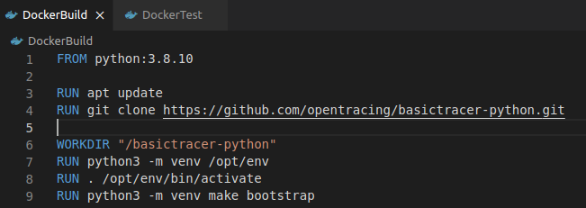

7. Uruchomiono ```DockerBuild```:
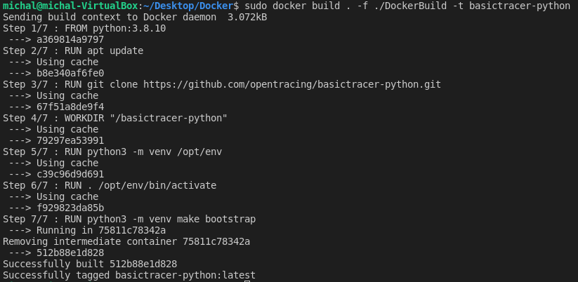

8. Stworzono Dockerfile ktory odpowiadal za testy:<br/>
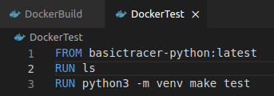

9. Uruchomiono ```DockerTest```:
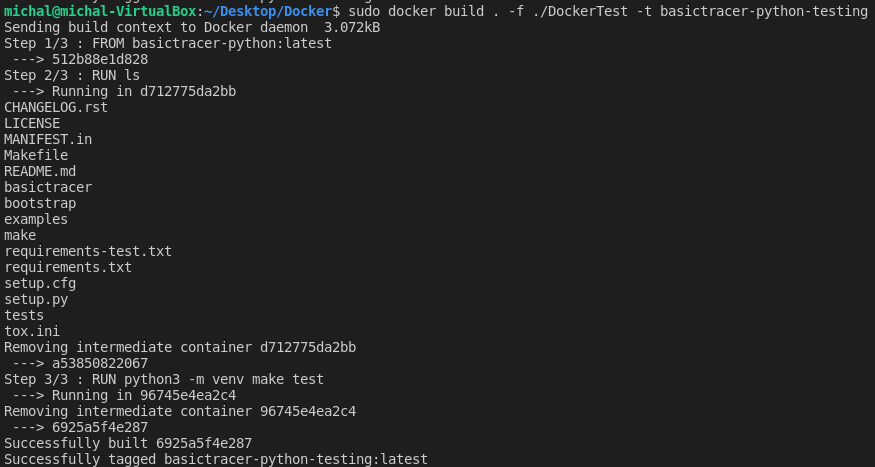

10. Sprawdzono poprawnosc dzialania powyzszych Dockerfile:
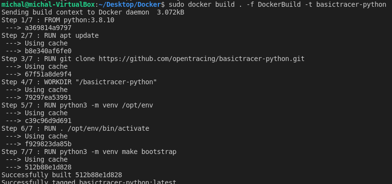
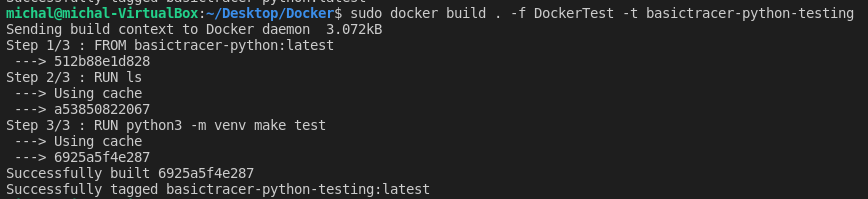
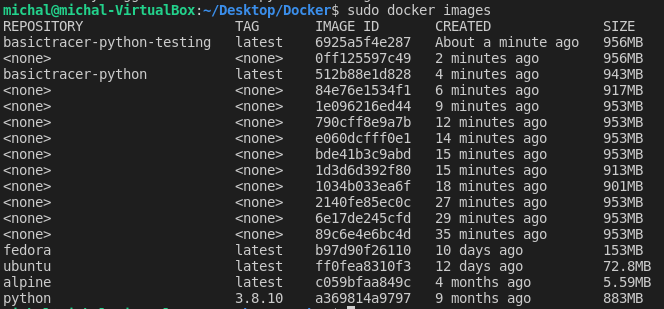


## Wnioski- Kontener a obraz
Kontener umozliwia uruchomienie programu w odizolowanym od systemu srodowisku, obraz stanowi podstawe konteneryzacji.
