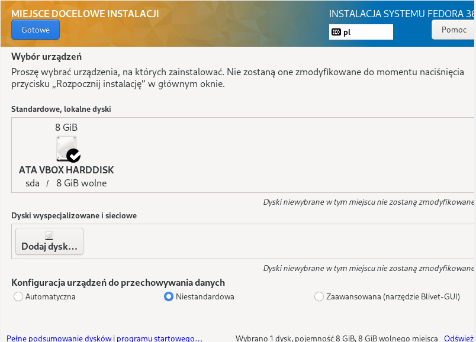
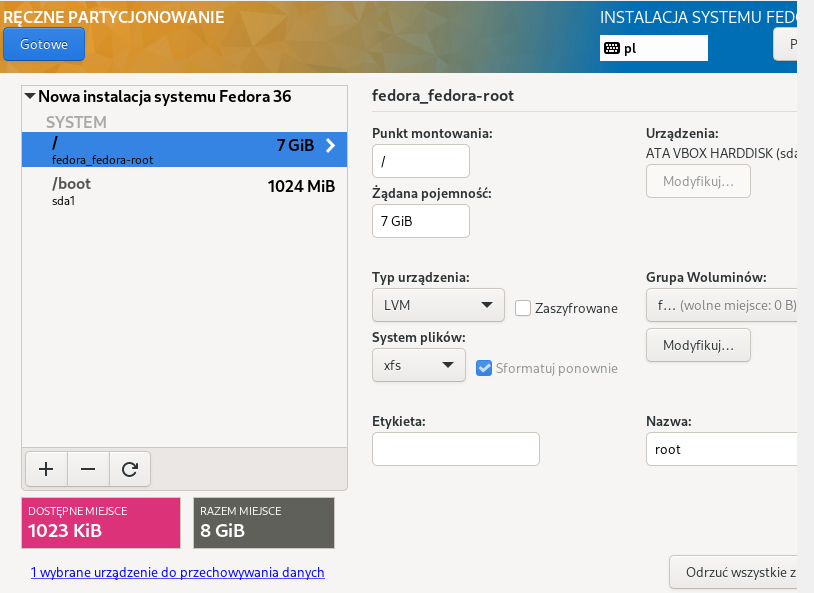
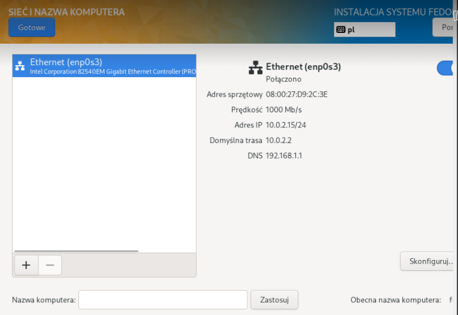
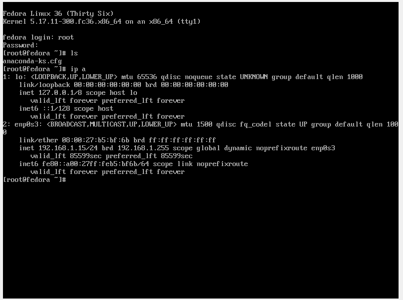
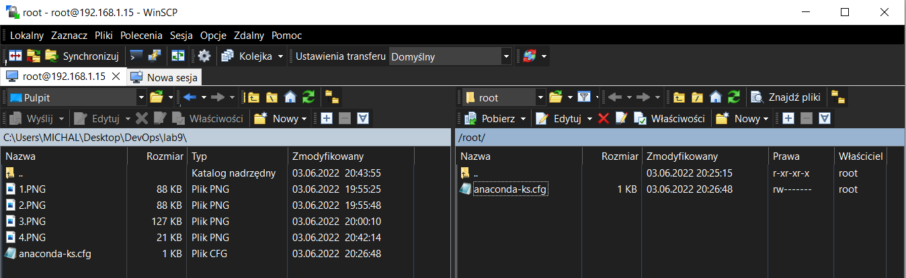
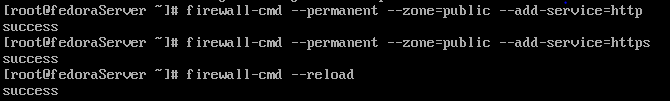
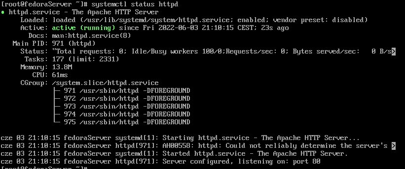
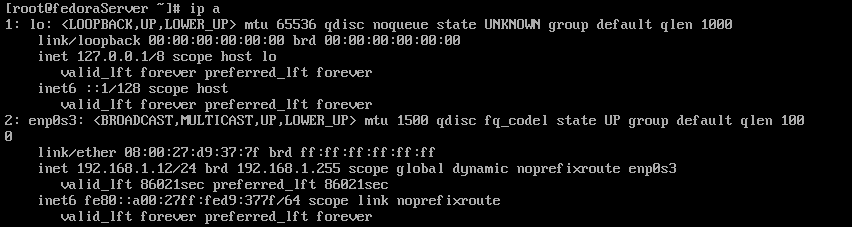
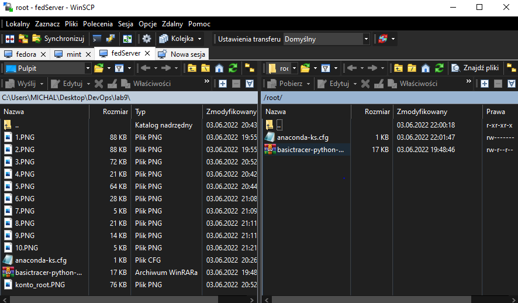
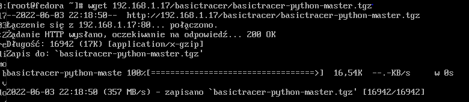

# Sprawozdanie Lab09 Michał Szymański ITE-GCL08

## Cel ćwiczenia
Przygotowanie systemu pod uruchomienie, Instalacja nienadzorowana, Infrastructure as a code

## Przygotowanie systemu pod uruchomienie
Pobrano obraz Fedory '''Fedora-Server-netinst-x86_64-36-1.5''' i przeprowadzono jego instalację:

Następnie sprawdzono adres IP maszyny, w celu pobrania pliku `anaconda-ks.cfg` przez SSH za pomocą  WinScp:

## Instalacja serwera Fedory
Instalacja w ten sam sposób jak powyżej, zmieniono jedynie nazwę urządzenia.

- Instalacja httpd:

- Dodanie reguł firewalla oraz przeładowanie go:

- Sprawdzenie statusu usługi httpd:

- Adres IP sprawdzono w celu przesłania artefaktu przez WinScp do serwera:

- Stworzono folder html dla artefaktu i skopiowano do niego paczkę:

## Pobranie artefaktu z serwera:

- Zainstalowano pakiet wget i pobrano artefakt:

## Instalacja nienadzorowana

Zmodyfikowano plik '''anaconda-ks.cfg''':
    - Tryb instalacji tekstowy,
    - Dodanie repozytoriów Fedory,
    - Dodanie pakietów wget i python3,
    - Sekcja post, w której pobierany jest artefakt z serwera.

Uruchomiono instalację za pomocą komendy:

`vmlinuz initrd=initrd.img inst.stage2=hd:LABEL=Fedora-S-dvd-x86_64-36 inst.ks=https://raw.githubusercontent.com/InzynieriaOprogramowaniaAGH/MDO2022_S/MS400200/ITE/GCL08/MS400200/lab9/anaconda-ks.cfg`

