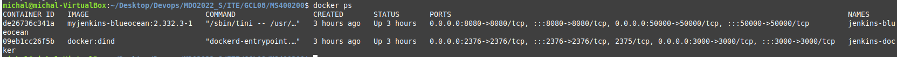
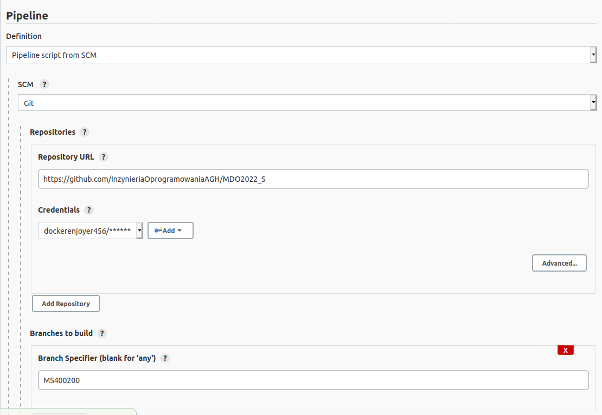
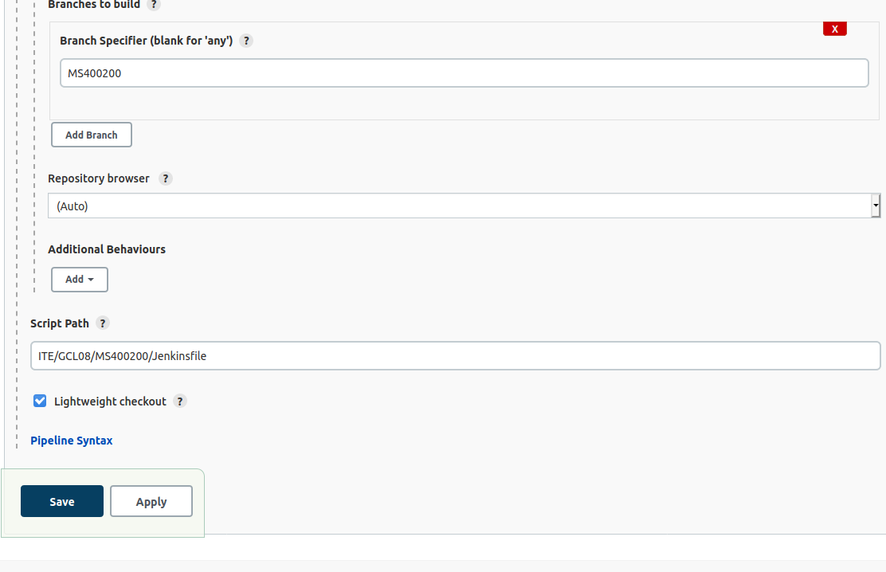
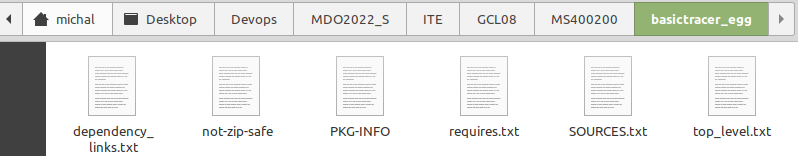

# Sprawozdanie 


## Cel ćwiczenia
Przygotowanie Pipeline

## Przebieg
Stworzono kontenenery Jenkins-bluocean oraz DIND:


Niezbedne byly rowniez pliki Dockerfiles:

DockerBuild
```
FROM python:3.8.10

RUN apt update
RUN git clone https://github.com/michaElOs769/devops.git

WORKDIR "/basictracer-python"
RUN python3 -m venv /opt/env
RUN . /opt/env/bin/activate
RUN python3 -m venv make bootstrap
```

DockerTest
```
FROM basictracer_build:latest
RUN ls
RUN python3 -m venv make test
```

DockerPublish
```
FROM basictracer_build:latest
RUN cd .. && tar cfJ archive.tar.xz basictracer.egg-info
RUN cd .. && mv archive.tar.xz basictracer.egg-info
```

Skonfigurowano pipeline na Jenkins:




Plik Jenkinsfile jest pobierany z brancha repozytorium przedmiotu.


### Stage Build
```
stage('Build') {
            steps {
                echo 'building basictracer'
				dir("${params.Build_files}") {
                    sh 'docker build . -f DockerBuild -t basictracer_build'
				}
                
            }
        }
```
Budowany jest kontener za pomoca pliku DockerBuild gdzie klonowane jest repozytorium z kodem oraz inicjowane jest srodowisko Python.

### Stage Test
```
stage('Tests') {
            steps {
                echo 'testing basictracer'
				dir("${params.Build_files}") {
                    sh 'docker build . -f DockerTest -t basictracer_test'
				}
            }
        }
```
Tworzony jest kontener na bazie najnowszej wersji kontenera budujacego (basictracer_build:latest), nastepnie komenda ```make test``` uruchamia testy w Dockerfile.

### Stage Deploy
```
stage('Deploy') {
            steps {
                echo 'deploying basictracer'
                sh 'echo $DOCKERHUB_CREDENTIALS_PSW | docker login -u $DOCKERHUB_CREDENTIALS_USR --password-stdin'
                sh 'docker tag basictracer_build:latest dockerenjoyer456/basictracer-devops-deploy'
                sh 'docker push dockerenjoyer456/basictracer-devops-deploy'
            }
        }
```
W tym momencie pobierane sa dane uwierzytelniajace mojego konta na Dockerhub ktore trzeba bylo wprowadzic do Jenkinsa. Obraz deploy jest wysylany do mojego Dockerhuba.

### Stage Publish
W tym miejscu folder z plikami .egg powinien byc pakowany i nastepnie archiwizowany na Jenkinsie. Przy lokalnym uruchamianiu projektu folder ten jest widoczny po zbuildowaniu poleceniem ```make bootstrap```.


Niestety jednak, przy uruchomieniu stage:
```
stage('Publish'){
    when {
        expression {return params.Promote}
    }
    steps {
        echo 'Publish'
        dir("${params.Build_files}") {
            sh 'ls -a'
            sh 'docker build . -f DockerPublish -t basictracer_publish'
            
        }
        sh "docker run --volume /var/jenkins_home/workspace/basictracer:/finalArchive node-red_publish mv archive.tar.xz /finalArchive"
            dir('/var/jenkins_home/workspace/basictracer'){
            sh "mv archive.tar.xz archive-${params.Version}.tar.xz"
            archiveArtifacts artifacts: "archive-${params.Version}.tar.xz"
        }
        
    }
}
```

Oraz pliku DockerPublish
```
FROM basictracer_build:latest
RUN cd .. && tar cfJ archive.tar.xz basictracer.egg-info
RUN cd .. && mv archive.tar.xz basictracer.egg-info
```

Folder basictracer_egg pozostaje niewidoczny i stage Publish nie dochodzi do skutku.


