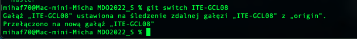
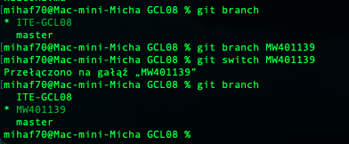
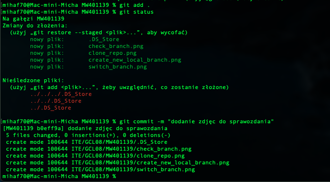
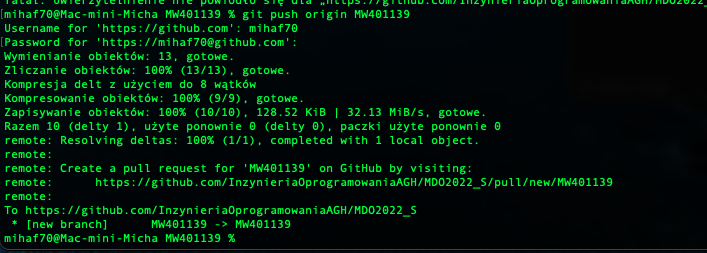

# Michał Wojdyła 401139

# instalacje gita oraz obsługę kluczy ssh pominięto, gdyż git był już używany urządzeniu

 Sklonowanie repozytorium

 

 Sprawdzenie aktualnej gałęzi

 

 Zmiana gałęzi

 

 Utworzenie nowej lokalnej gałęzi i przełączenie się na nią

 

 Dodanie zmian oraz utworzenie commita

 

 Dodanie zmian do zdalnego repozytorium

 