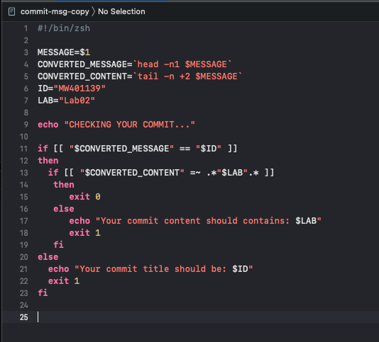
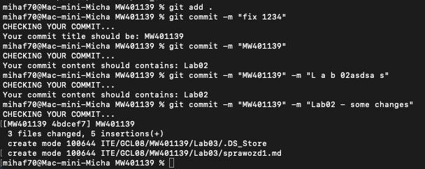
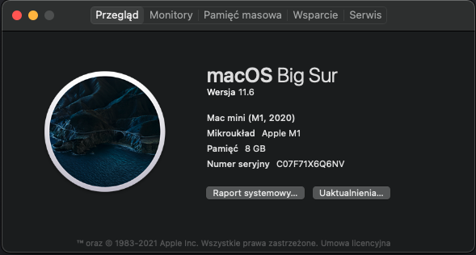
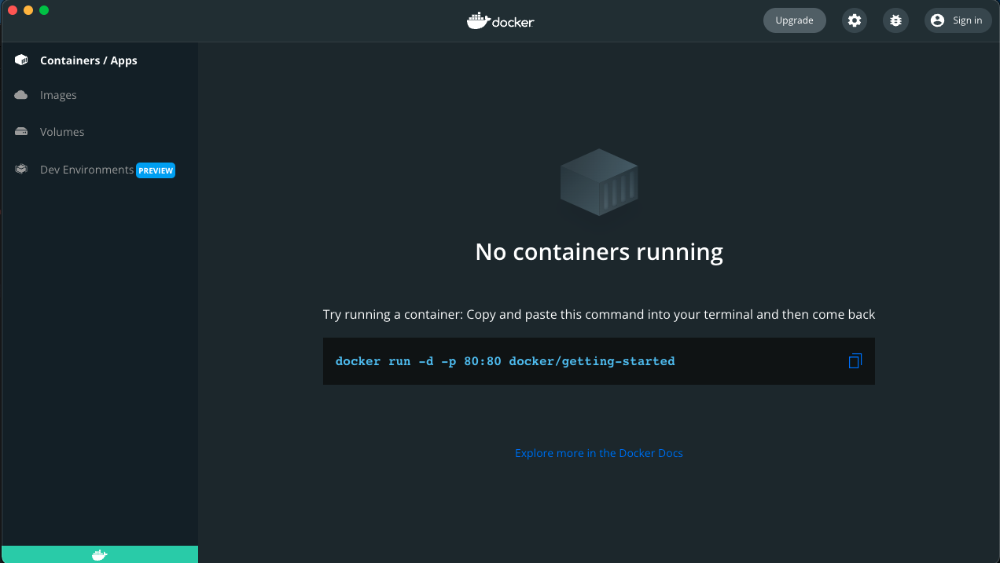
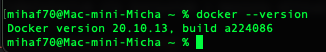
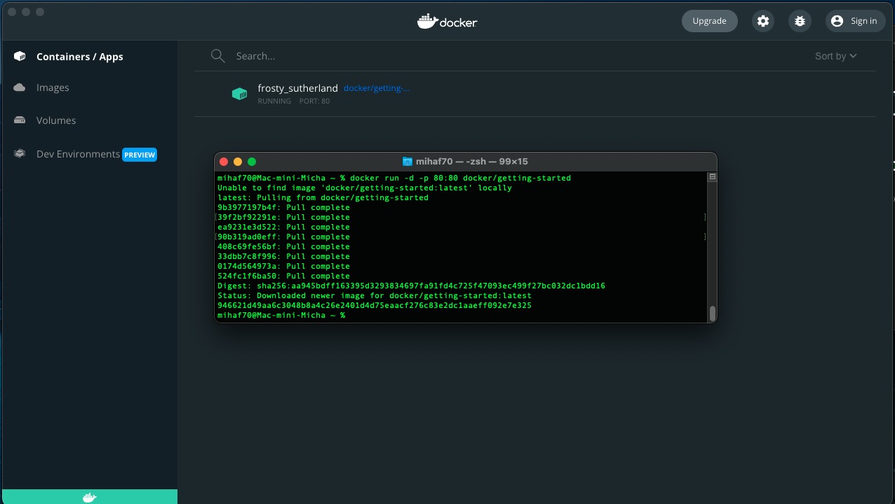
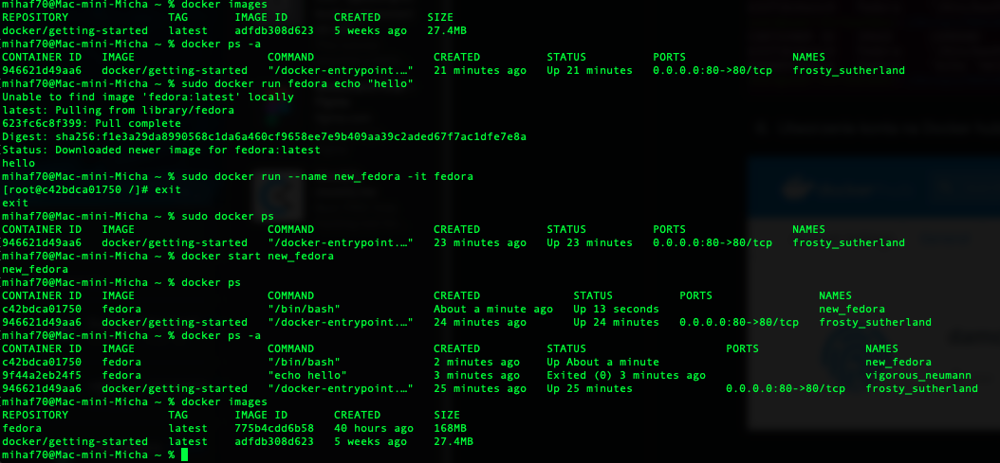
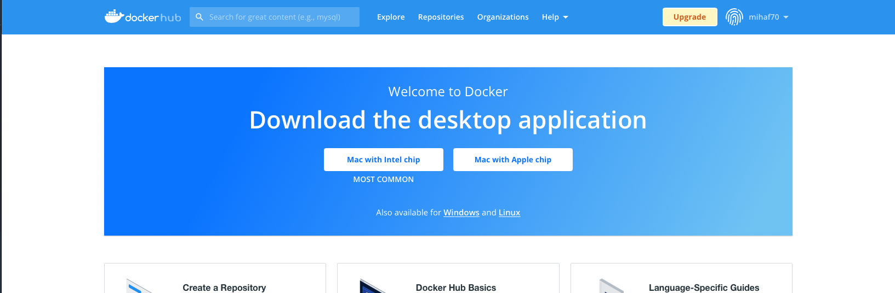

# Michał Wojdyła 401139

 Utworzenie hooka (commit-msg) który wywołuje się w momencie polecenia "git commit", hook został napisany w zsh:

 

 Działanie hooka (w tytule muszą być inicjały + index a w treści numer akutalnego laboratorium):

 
 
 W celach labolatorium nie korzystam z maszyny witrualnej tylko z komputera mac, zrzut ekranu przesyłam poniżej:

 

 Aplikacja desktopowa Docker:
 
 
 
 Wersja Dockera w terminalu:
 
 
 
 Uruchomienie środowiska Dockerowego:
 
 
 
 Działanie Dockera:
 
 Użyte komendy:
    
- docker images: wyświetlenie repozytoriów i obrazów
- docker run fedora echo "hello": utworzenie kontenera fedora oraz wykonanie w nim polecenia echo
- docker run --name new_fedora -it fedora: utworzenie nowego kontenera o nazwie new_fedora
- docker ps: wylitowanie kontenerów (-a: pokazanie wszytkich, nie tylko uruchomionych)
- docker start: rozpoczęcie dzialania kontenera
        
 
 
 Utworzenie konta na Docker Hub:
 
 
 

 
 

