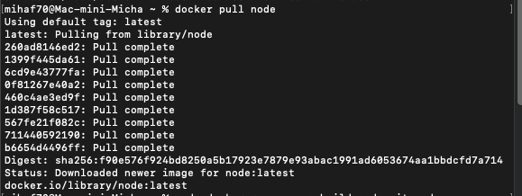
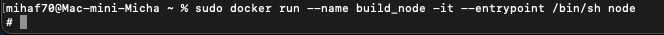
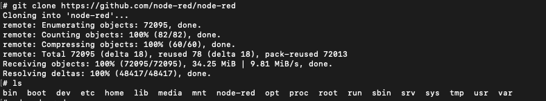
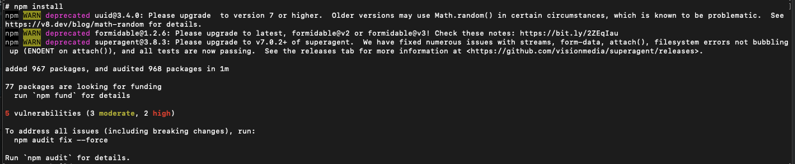
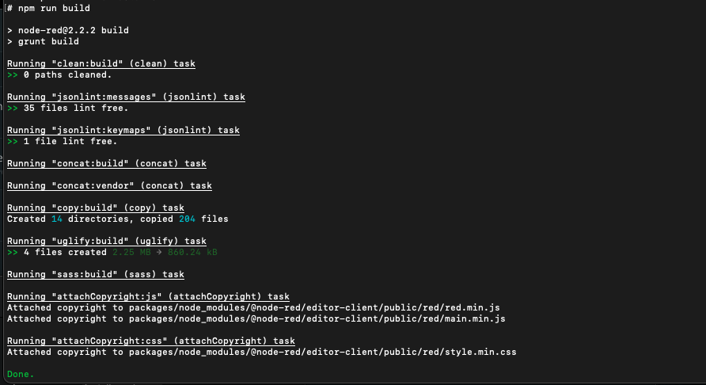
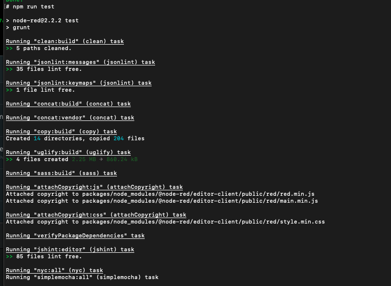
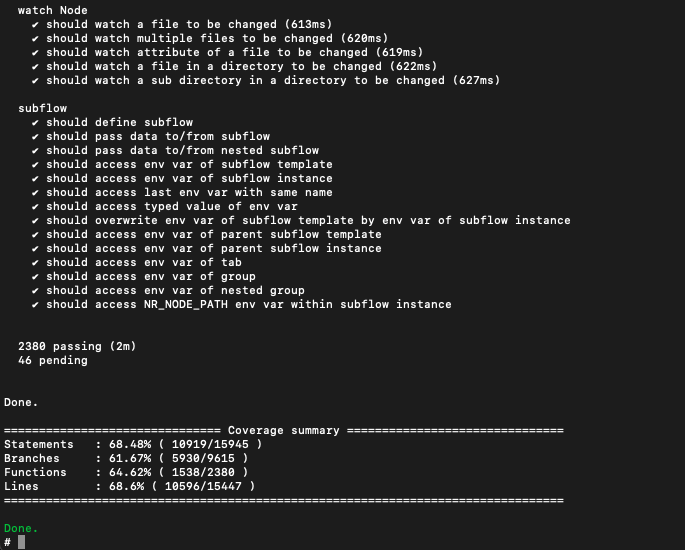
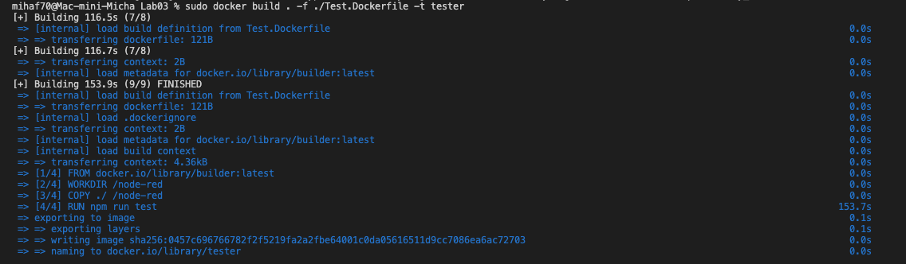

# Michał Wojdyła 401139

 ## Pobranie obrazu node:

 

  

 ## Utworzenie kontenera:

 

  
 
 ## Sklonowanie repozytorium projektu node'owego:

 

  

 ## Instalacja zalezności, bibliotek:
 
 

  
 
 ## Zbudowanie projektu:
 
 

  
 
 ## Uruchomienie testów:
 
 
 

  

 ## Utworzenie dwóch plików dockerfile:
 
  

 #### 1) Kontener wykonujący wszystkie kroki do builda:
 `FROM node:latest`

 `RUN apt update`

 `RUN git clone https://github.com/node-red/node-red`

 `WORKDIR /node-red`

 `COPY ./ /node-red`

 `RUN npm install && npm run build`

 

   

  #### 2) Kontener bazujący na pierwszym, wykonujący testy:
 `FROM builder:latest`

 `WORKDIR /node-red`

 `COPY ./ /node-red`

 `RUN npm run test`

 
 
 

 
 

