# Michał Wojdyła 401139

## Zachowywanie stanu
 

 ### Utworzenie dwóch woluminów:

 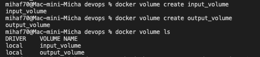

 
 ### Utworzenie kontenera node + podpięcię do niego wolumniów (wejściowy i wyjściowy):

 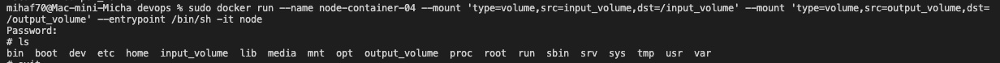

  
 
 ### Sklonowanie repozytorium projektu node'owego:

 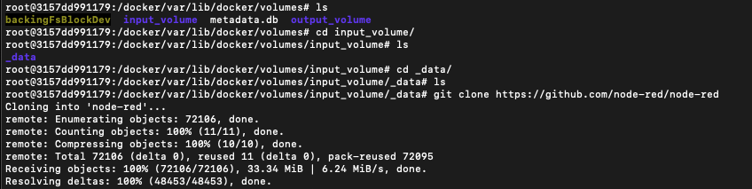

  

 ### Zawartość woluminu:
 
 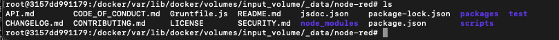

  

 ### Zawartość woluminu z poziomu kontenera node:
 
 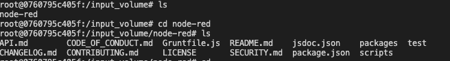

  
 
 ### Zbudowanie projektu:
 
 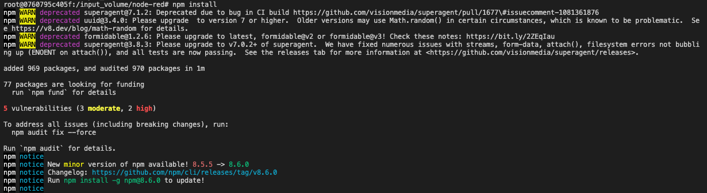
 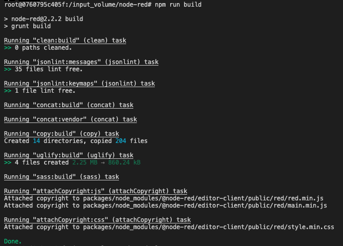

  

 ### Skopiowanie zbudowanego projektu do wyjściowego woluminu:
 
 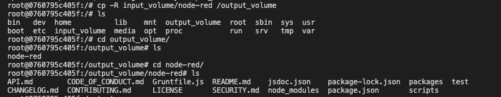

 
 

 ## Zachowywanie stanu
 

 ### Zainstalowanie iperf3 oraz net-tools w kontenerze:
 
 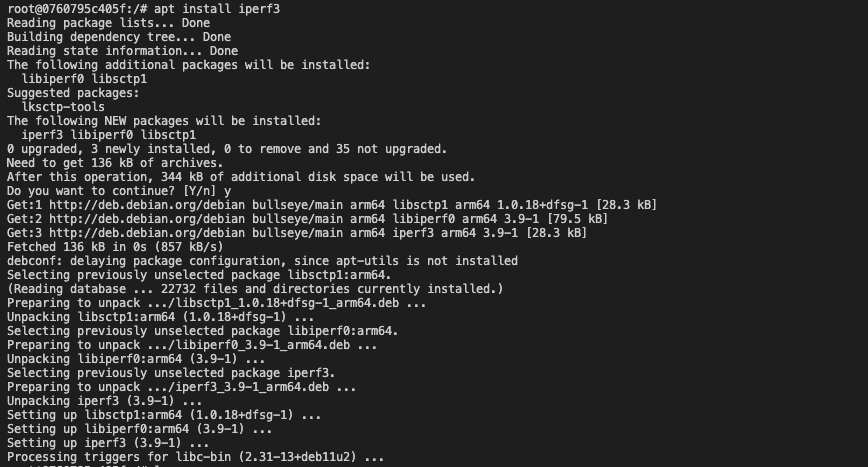
 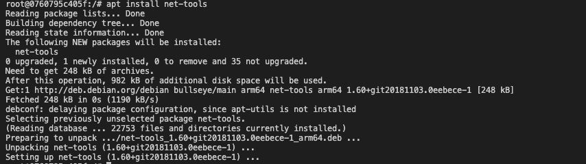

  

 ### Zainstalowanie iperf3 na hoście oraz sprawdzenie połącznenia między kontenerami:
 
 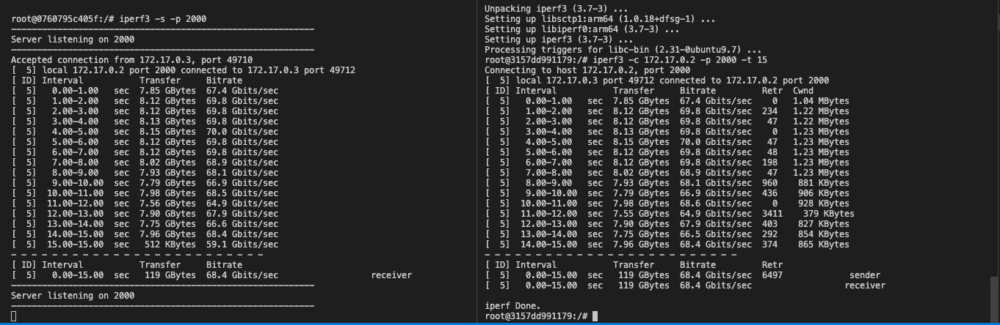

  

 ### Utworzenie nowego kontenera z opcją --publish oraz sprawdzenie połączenia między kontenerem a komupterem (pominięto połączenie z hostem, gdyz nie uzywam maszyny wirtualnej):
 
 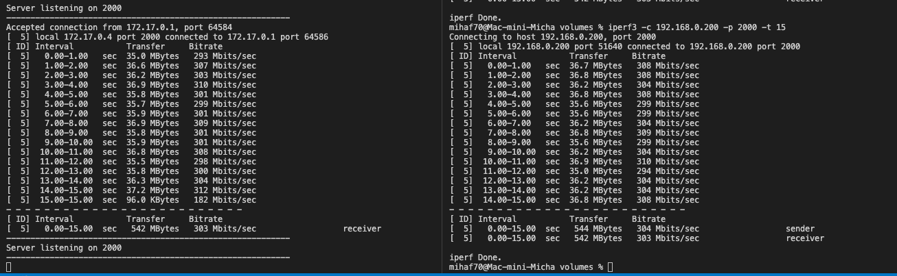

 #### Najszybsze połączenie było pomiędzy kontenerami, o wiele większe niz pomiędzy kontenerem a komuptuerem. Mogło być to spowodowane problemami sieciowymi.
 
  
  

 ## Instalacja jenkins
  

 ### Utworzenie sieci mostkowanej w Dockerze:
 
 
 
  

 ### Pobranie obrazu docker:dind i uruchomienie:
 
 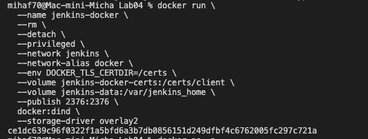
 
  

 ### Utworzenie obrazu na bazie dockerile:

 `FROM jenkins/jenkins:2.332.1-jdk11`

 `USER root`

`RUN apt-get update && apt-get install -y lsb-release`

`RUN curl -fsSLo /usr/share/keyrings/docker-archive-keyring.asc \`
  `https://download.docker.com/linux/debian/gpg`

`RUN echo "deb [arch=$(dpkg --print-architecture) \ `
  `signed-by=/usr/share/keyrings/docker-archive-keyring.asc] \`
  `https://download.docker.com/linux/debian \ `
  `$(lsb_release -cs) stable" > /etc/apt/sources.list.d/docker.list`

`RUN apt-get update && apt-get install -y docker-ce-cli`

`USER jenkins`

`RUN jenkins-plugin-cli --plugins "blueocean:1.25.3 docker-workflow:1.28"`
 
 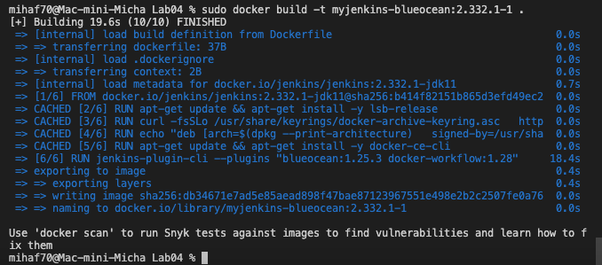
 
  

  ### Uruchomienie kontenera jenkins:
 
 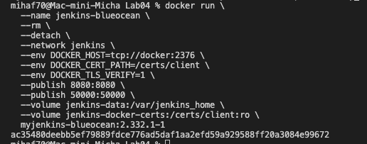
 
  

  ### Wyświetlenie logów (dostęp do hasła admina):
 
 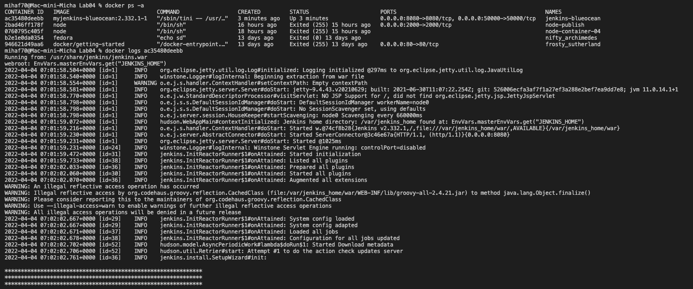
 
  

 ### Ekran logowania Jenkins:
 
 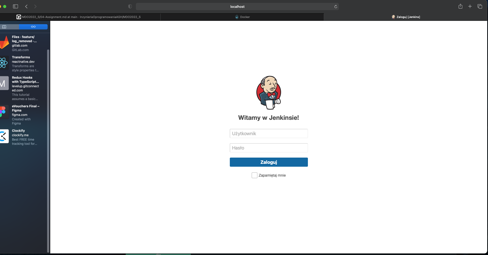
 
  

 
 

