## Michał Wojdyła 401139

### Sprawozdanie zostało wykonane tym razem na systemie windows, gdyz na macu z M1 nie ma vboxa.

 

# Przygotowanie systemu pod uruchomienie

- Instalacja systemu fedora

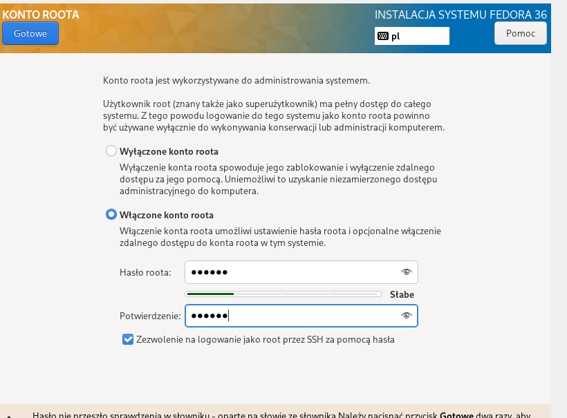

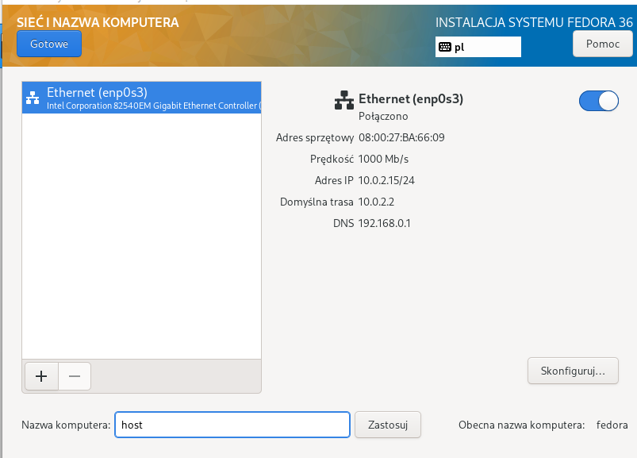
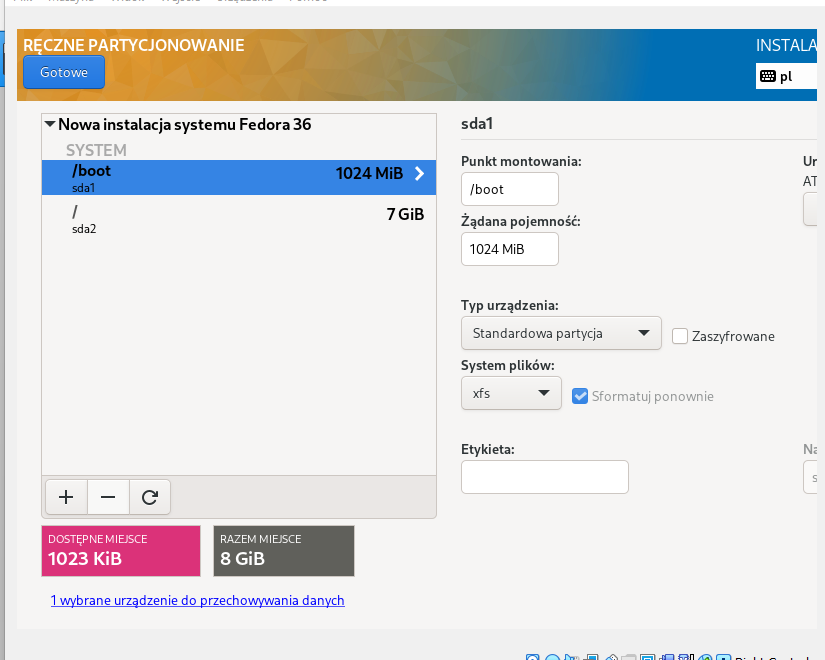

- Wyswietlenie adresu ip maszyny w celu pobrania pliku anaconda-ks.cfg za pomocą WinScp (SSH):

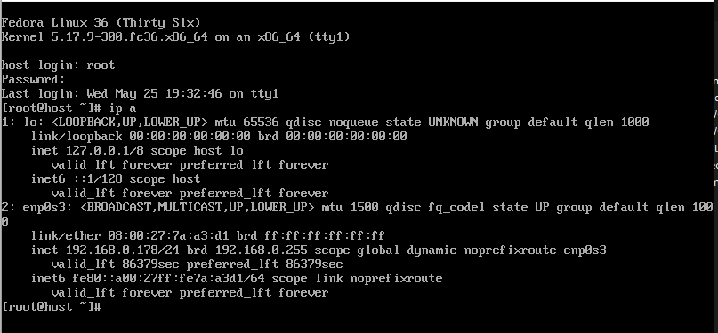
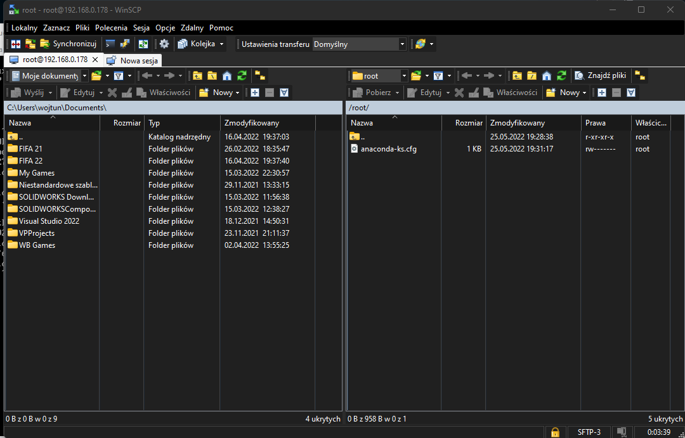

 

# Instalacja oraz konfiuracja serwera

### Instalację przeprowadzono w taki sam sposób jak poprzednio.

- Zainstalowanie httpd:

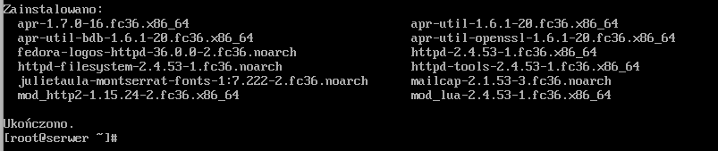

- Dodanie wyjątków do zapory sieciowej i przeładowanie jej:

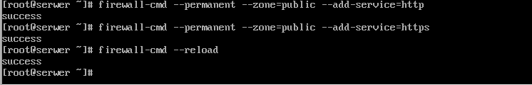

- Włączenie httpd:

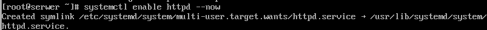

- Sprawdzenie poprawności działania:

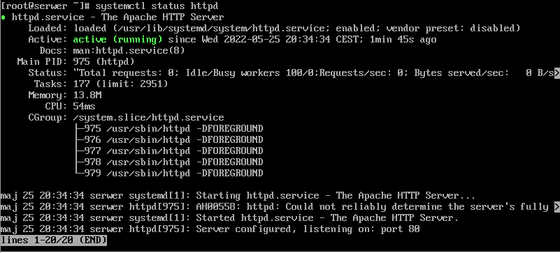

- Sprawdzenie adresu ip serwera oraz przesłanie na niego artefaktu wcześniej pobranego z Jenkinsa:

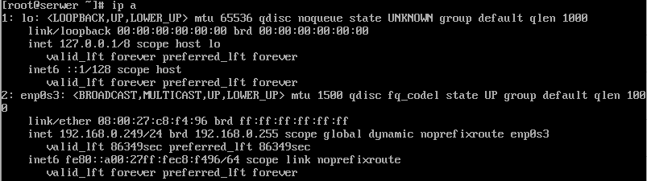
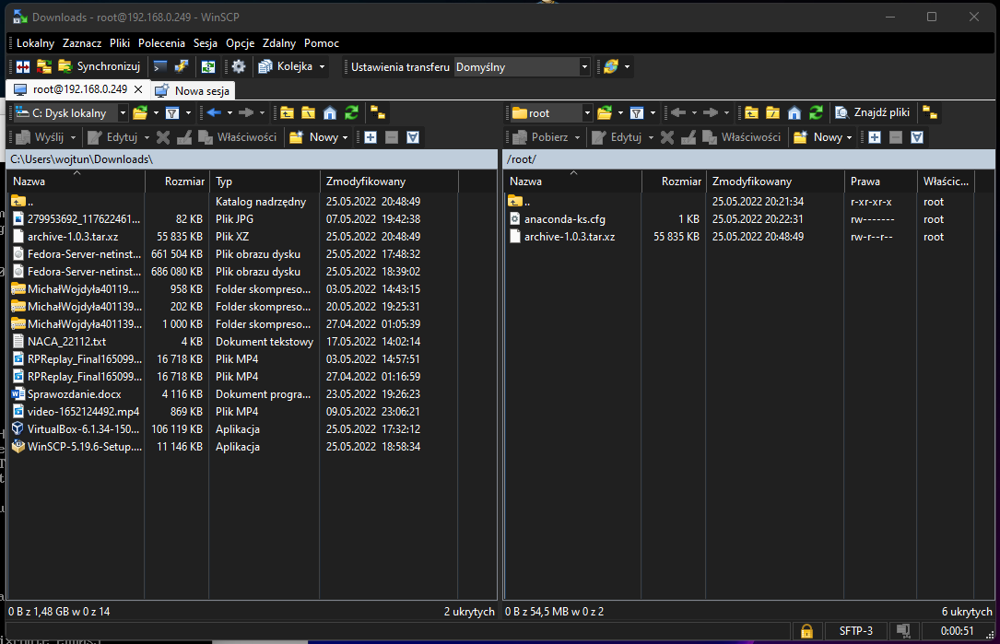

- Utworzenie oraz skopiowanie artefaktu do /var/www/html/node-red (jest to domyślnie udostępniany katalog przez httpd):

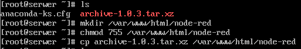

 

# Pobranie artefaktu z serwera

- Pobranie artefaktu (po zainstalowaniu pakietu wget):

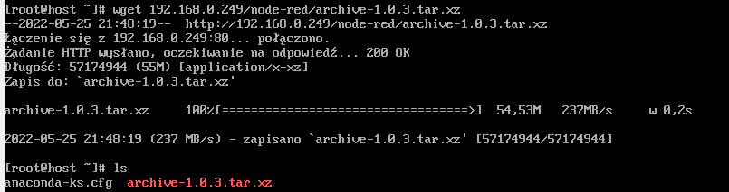

- Następnie rozpakowano artefakt, zainstalowano npm oraz zalezności projektu (node_modules) oraz uruchomiono aplikacje w celu sprawdzenia poprawności działania:

 

# Instalacja nienadzorowana

### Zmodyfikowano plik anaconda-ks.cfg oraz przesłano go na githuba.

### Komenda uzyta do instalacji:

`vmlinuz initrd=initrd.img inst.stage2=hd:LABEL=Fedora-S-dvd-x86_64-36 inst.ks=https://raw.githubusercontent.com/InzynieriaOprogramowaniaAGH/MDO2022_S/MW401139/ITE/GCL08/MW401139/Lab09/anaconda-ks.cfg`

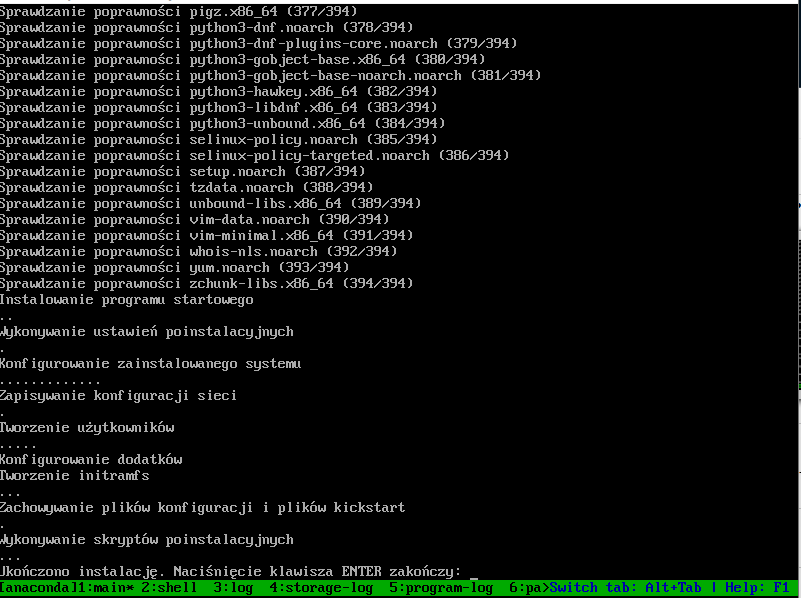

 

# Infrastructure as a code

- Zamontowanie obrazu fedory w napędzie optycznym maszyny

- utworzenie katalogu /media/iso oraz zamonowanie iso

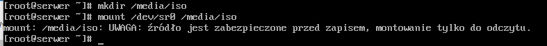

- Utworzenie katalogu roboczego oraz skopiowanie do niego plikow w celu usyskania uprawnień do modyfikacji oraz skopiowanie pliku anaconda-ks.cfg do katalogu isolinux oraz zmiana jego nazwy

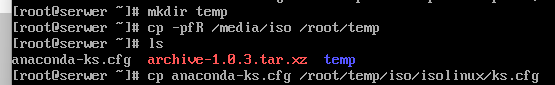

- Modyfikacja pliku isolinux.cfg

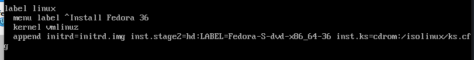

- Wypalenie obrazu ISO

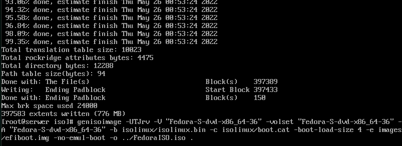
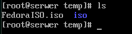

### Na końcu przesłano plik ISO z maszyny na system Windows (host) za pomocą WinSCP oraz utworzono z niego kontener.
