## Michał Wojdyła 401139

 

# Instalacja klastra Kubernetes

- Instalacja oraz uruchomienie minikube:

- Instalacja oraz setup kubectl:

- Uruchomienie dashboard'a:

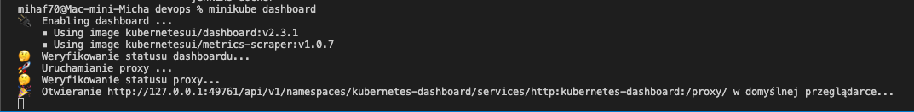

 

# Analiza posiadanego kontenera

- Zbudowanie obrazu z pliku dockerfile:

### Zbudowany obraz przesłałem na dockerhuba (push)

 

- Pokazanie działania aplikacji jako kontener:

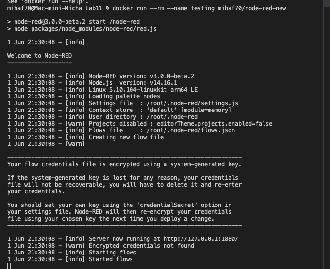

 

# Uruchomienie oprogramowania

- Uruchomienie kontenera na stosie k8s oraz pokazanie działania:

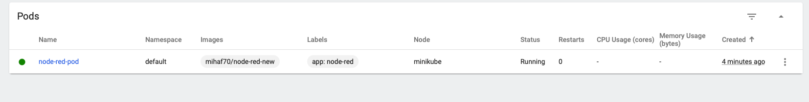

- Wyprowadzenie portu celem dotarcia do eksponowanej funkcjonalności:

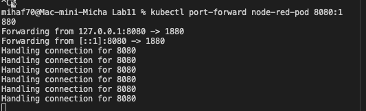

- Działanie aplikacji

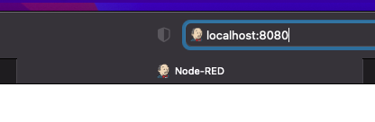

 

# Przekucie wdrożenia manualnego w plik wdrożenia (wprowadzenie)

### Plik yaml został zawarty w sprawozdaniu

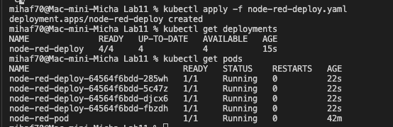

 
 

## Część 2

# Konwersja wdrożenia ręcznego na wdrożenie deklaratywne YAML

- Upewnij się, że posiadasz wdrożenie z poprzednich zajęć zapisane jako plik -Wzbogać swój obraz o 4 repliki -Rozpocznij wdrożenie za pomocą kubectl apply -Zbadaj stan za pomocą kubectl rollout status:

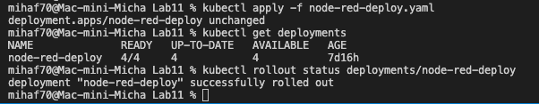

- Zarejestrowanie nowej wersji obrazu:

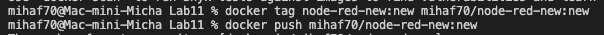

- Przygotowanie nowej wersji obrazu z błędem:

### Usunąłem instalacje dependencji z dockerfile, plik zamieściłem na repozytorium.

- Zarejestrowanie nowej wersji obrazu z błędem:

 

# Zmiany w deploymencie

- Zwiększenie liczby replik do 6:

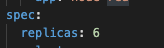

- Zmniejszenie liczby replik do 1:

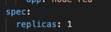
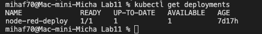

- Zmniejszenie liczby replik do 0:

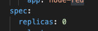
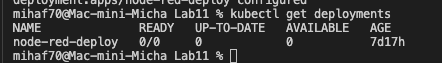

- Zastosowanie nowej wersji obrazu:

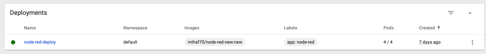

- Zastosowanie wersji obrazu z errorem:

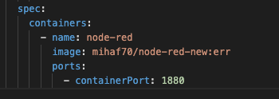
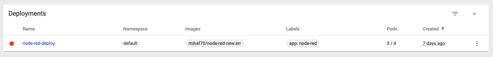

- Przywrócenie poprzedniej wersji wdrożeń:

 

# Kontrola wdrozenia

- Skryt weryfikujący, czy wdrozenie zdązyło się wdrozyć w 60 sekund:

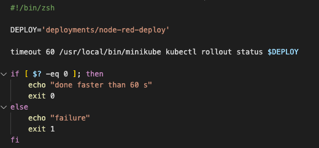

### Skrypt zamieściłem na repozytorium.

 

# Strategie wdrozenia

### Pliki yaml zamieściłem w sprawozdaniu

- Recreate:

### W tej strategii zabijane są stare wersje aplikacji po czym następuje wdrożenie nowych.

- RollingUpdate:

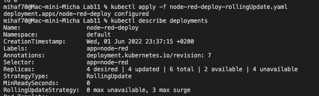

### W tej strategii zatrzymywane jest działanie wszystkich podów i następnie ponowne ich uruchomienie.

`maxSurge` - ilość podów które mogą zostać dodane
`maxUnavailable` - ilość podów które mogą być niedostępne podczas wdrazania

- Canary:

### W tej strategii następuje wdrozenie nowych wersji aplikacji obok innych stablilnych wersji.
