# Michał Zając - sprawozdanie z DevOps z lab03

### Podjęte kroki podczas wykonywania zadania

1. Znalezienie repozytorium z kodem dysponującego otwartą licencją oraz narzędziami makefile, a także zawierające testy.

Link: https://github.com/restic/restic

2. Sklonowanie repozytorium
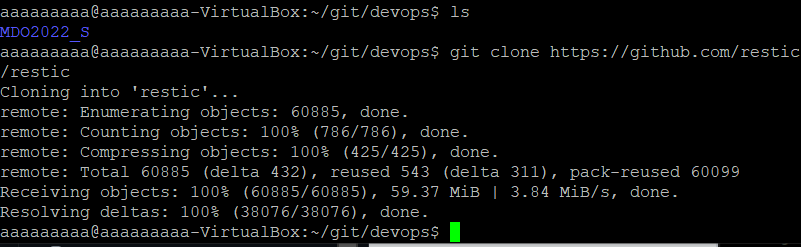

3. Zbudowanie projektu za pomocą <code>make all</code>

> Aby projekt mógł zostać zbudowany należy zainstalować dodatkowo pakiet ***Go***. Instalujemy go za pomocą komendy <code>sudo apt install golang-go</code>

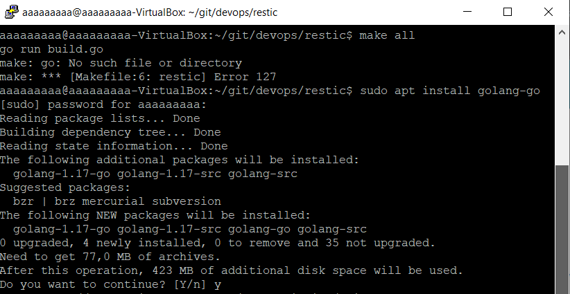

> Po zainstalowaniu Go ponawiamy <code>make build</code>

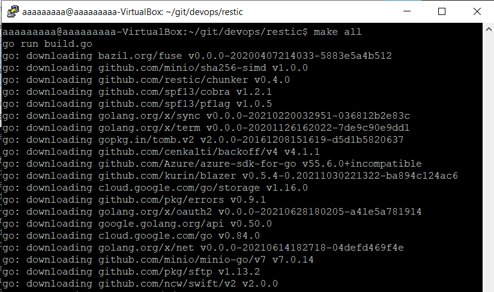

4. Uruchomienie testów jednostkowych za pomocą <code>make test</code>

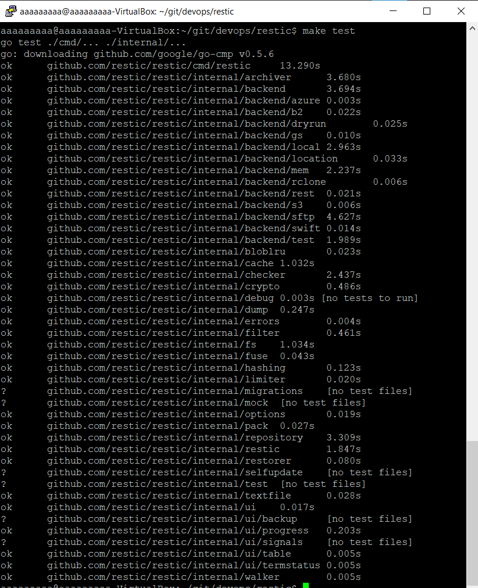

5. Uruchomienie kontenera z Node. **Jako, że obraz node'a pobrałem dwa tygodnie temu, nie będę go pullować ponownie**

> Jeśli nie posiadamy obrazu Node'a, należy co pullnąć za pomocą komendy <code>sudo docker pull node</code>

Uruchamiamy następnie kontener i w środku tworzymy nowy folder do którego będziemy klonować repo
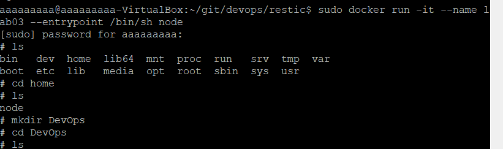

6. Zaopatrzenie kontenera w wymagania wstępne wiązało się z utworzeniem folderu, gdzie będzie klonowane repo, **a także doinstalowanie pakietu *Go*. Aby można było wszystko poprawnie uruchomić, należało także doinstalować <code>apt-get update</code> oraz <code>apt-get install sudo</code>**. 

> Tutaj apt-update
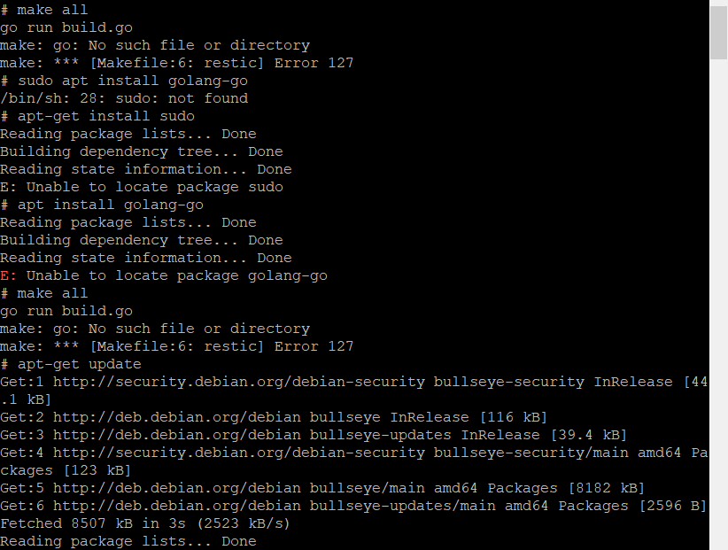

> Tutaj install sudo
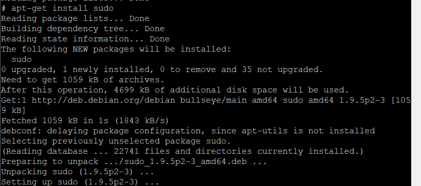

> Tutaj install *go*
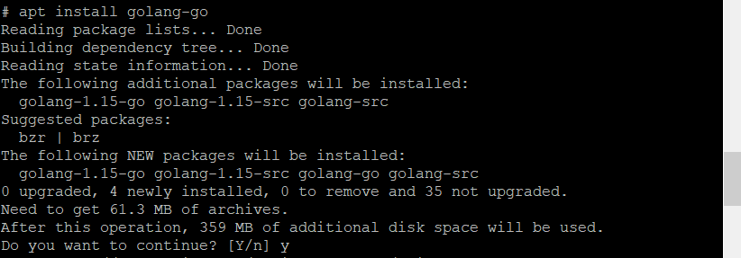

7. Po pobraniu wszystkich wymaganych paczek możemy za pomocą komendy <code>make all</code> zbudować projekt.
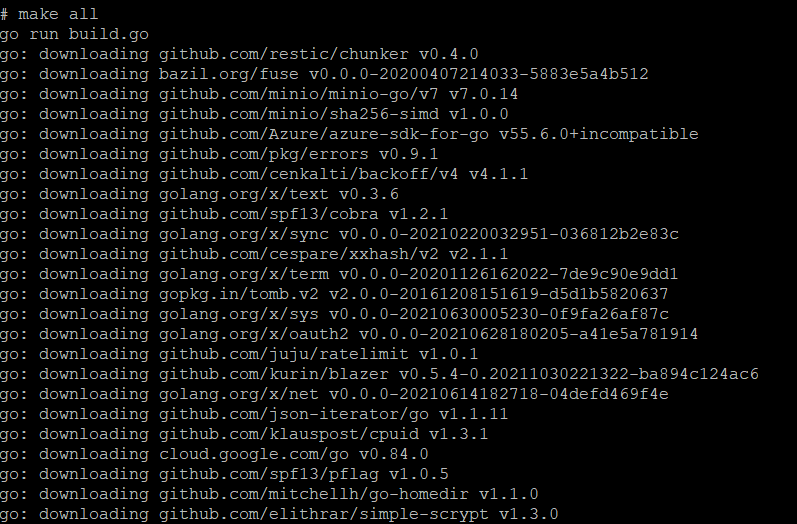

8. Na sam koniec wykonujemy testy za pomocą <code>make test</code>. Pod spodem kilka zrzutów ekranu z testów.

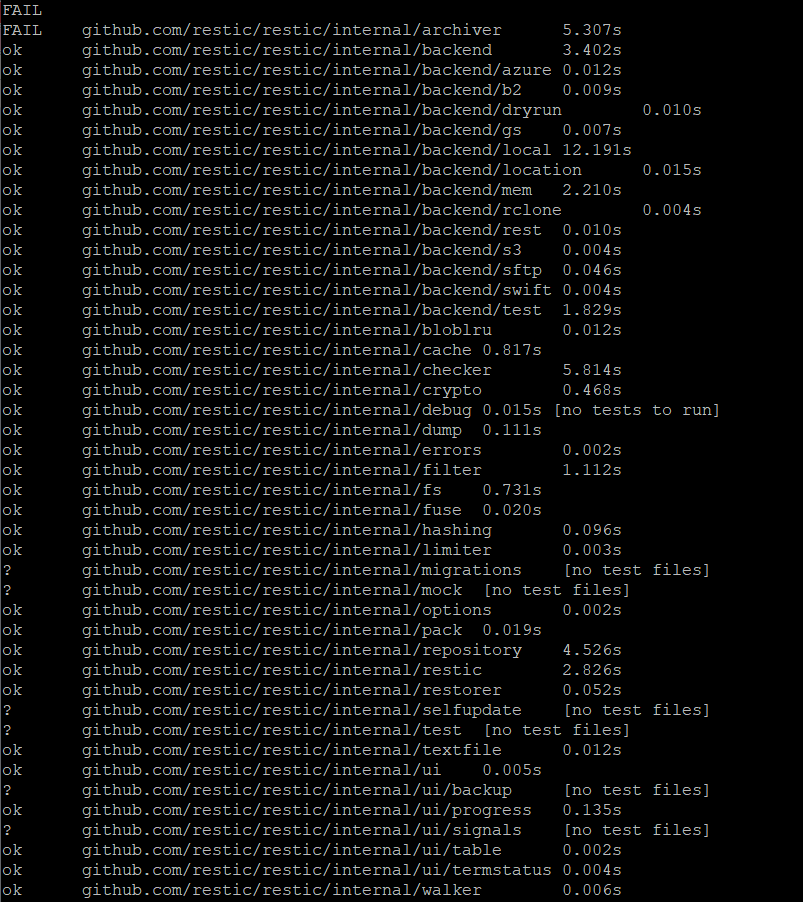

9. Tworzenie docker file'ów.
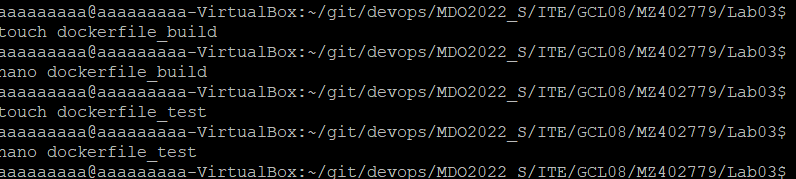

10. Treść dockerfile wykonującego wszystkie kroki aż do builda.
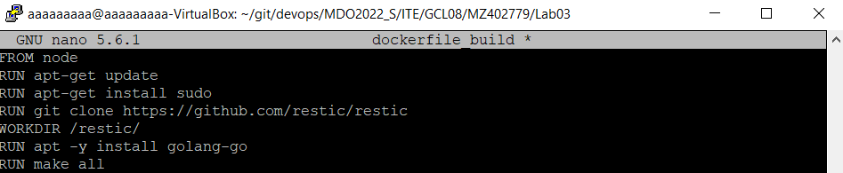

11. Treść dockerfile bazującego na pierwszym i wykonującego testy.
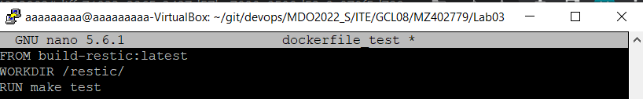

12. Potwierdzenie działania kontenera budującego:
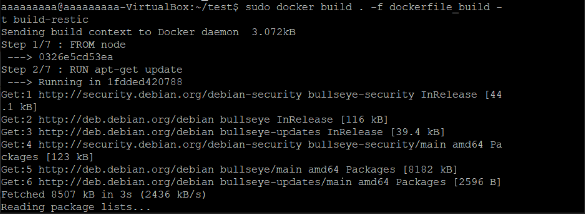

Oraz:
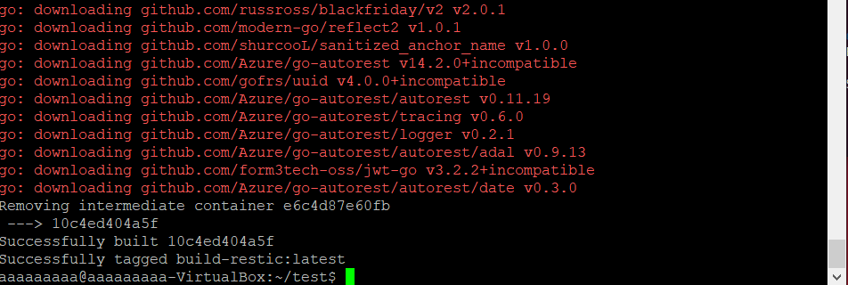

13. Potwierdzenie działania testów w kontenerze:
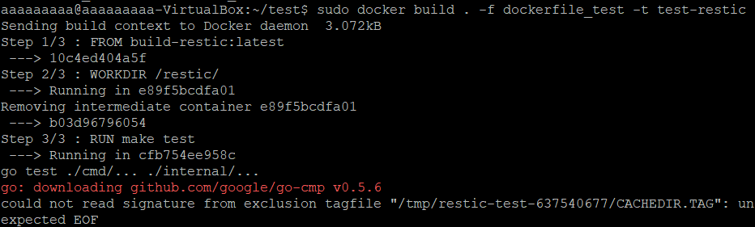
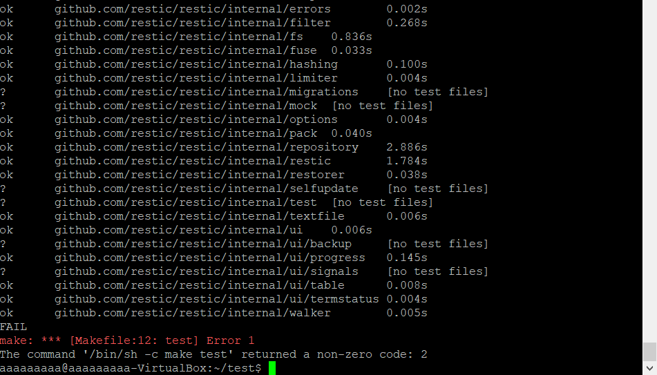

14. W stworzonym przez nas kontenerze pracuje nasz program. Poprzez uruchomienie go w kontenerze możemy go odizolować od systemu.
