# Michał Zając - sprawozdanie z DevOps z lab04

## Podjęte kroki podczas wykonywania zadania:

### Zachowywanie stanu

1. Utworzyłem dwa woluminy za pomocą komendy <code>docker volume create nazwa_woluminu</code>. Jeden wejściowy o nazwie **input_volume**, drugi wyjściowy o nazwie **output_volume**.


2. Następnie na podstawie obrazu node'a z poprzednich zajęć, utworzyłem kontener o nazwie **node_lab04**. Dodatkowo podpiąłem do niego dwa utworzone woluminy - wejściowy i wyjściowy.

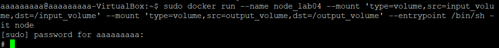

3. Zainstalowałem do tego kontenera wszelkie niezbędne wymagania wstępne za pomocą komendy <code>apt update</code>. Na sam koniec zainstalowałem jeszcze pakiet ***Go*** za pomocą komendy <code>apt install golang-go</code> oraz upewniłem się, że jest zainstalowana najnowsza wersja *make* za pomocą <code>apt install make</code>.

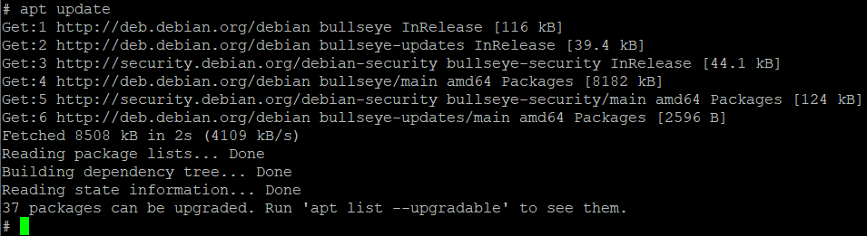
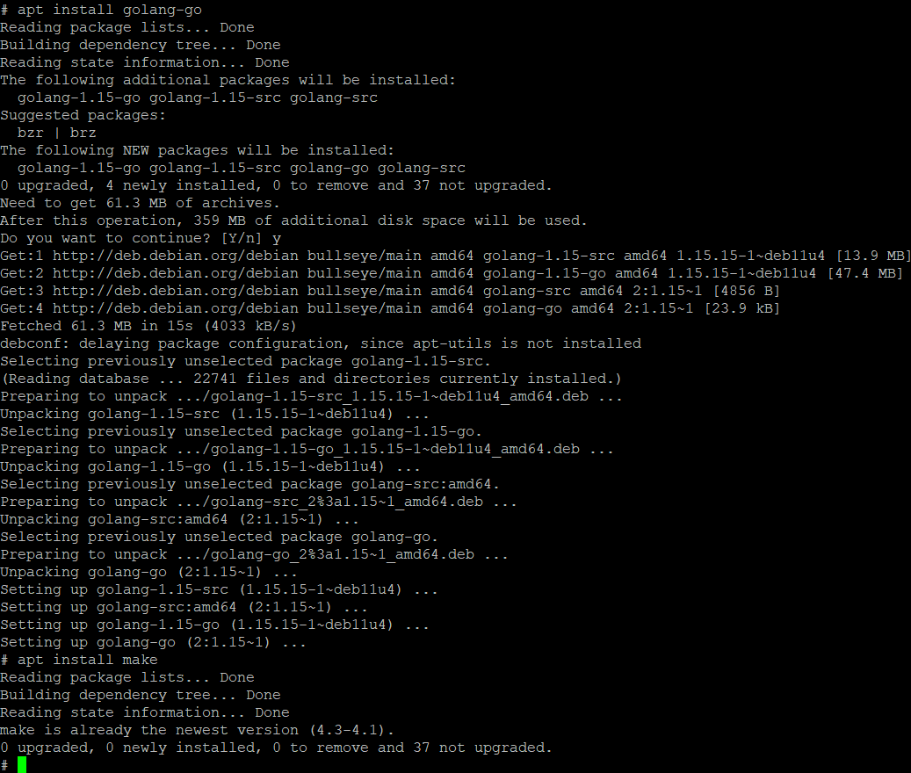

> Jako, że ścieżka */var/lib/docker/* jest chroniona, nie możemy niej wyświetlić bez posiadania uprawnień administratora. Dodatkowo oznacza to, że nie możemy przejść do niej za pomocą **cd**, będziemy musieli sprawdzić jego zawartość za pomocą **ls**.

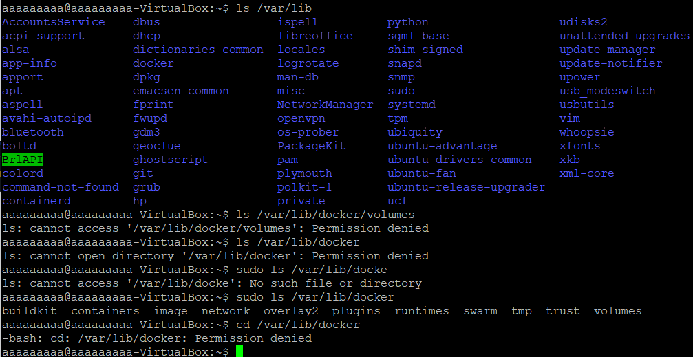

> Tutaj pod spodem sprawdzenie zawartości kontenerów. Weryfikację kontenera możemy przeprowadzić za pomocą komendy <code>sudo docker volume inspect nazwa_woluminu</code>

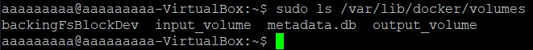
- Tutaj wolumin wejściowy:
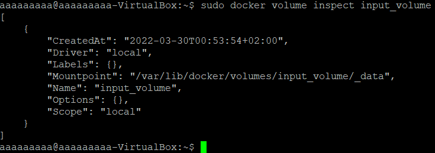

- Tutaj wolumin wyjściowy:
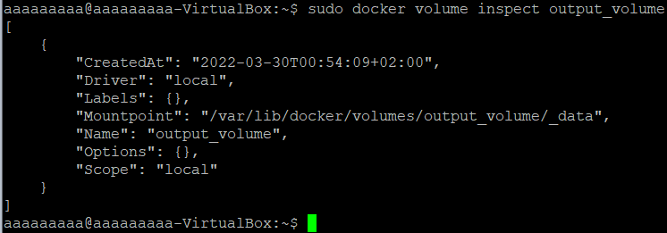

4. Następnie przeszedłem do klonowania repozytorium na wolumin wejściowy. Przed samym sklonowaniem stworzyłem nowy katalog **rustic**, gdzie będzie umieszczone sklonowane repo z poprzedniego zadania -> https://github.com/rustic/rustic
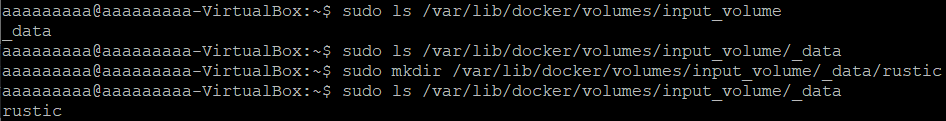

> Należy się upewnić przy klonowaniu repozytorium, że repozytorium zostanie sklonowane na wolumin wejściowy.

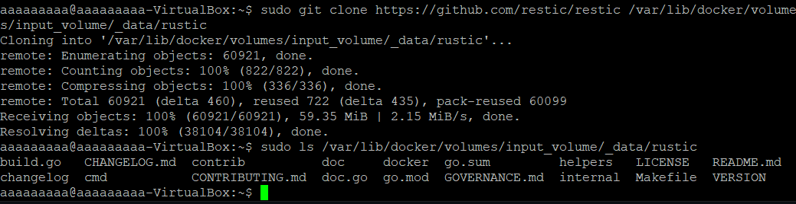

5. Następnie wewnątrz kontenera sprawdzam, czy repozytorium zostało poprawnie sklonowane do zadeklarowanego katalogu, po czym w katalogu ze sklonowanym repo buduję projekt za pomocą <code>make all</code>.
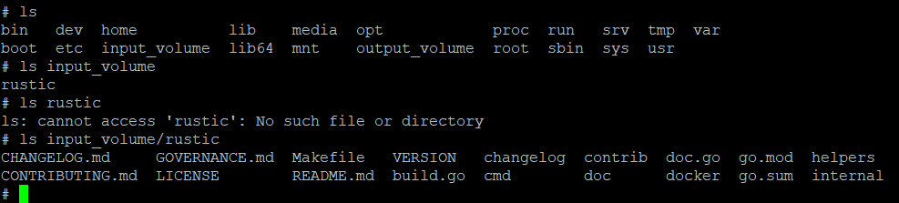

- Tutaj początek make'a dokumentujący brak błędów.
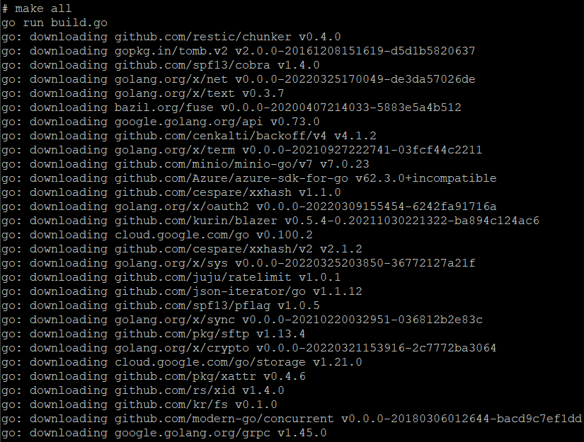

- A tutaj koniec make'a również bez błędów.
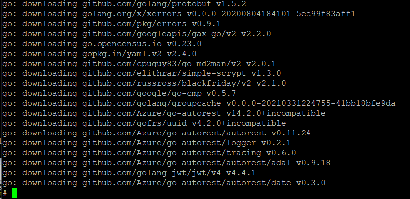

> Klonowanie zbudowanych plików odbywa się za pomocą komendy <code>cp -R ścieżka_kopiowana ścieżka_wyjściowa</code>.
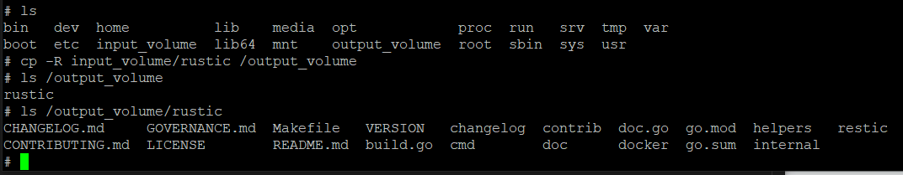

### Eksponowanie portu

6. Wewnątrz kontenera zainstalowałem serwer **iperf3** oraz **net-tools** aby móc łączyć się z kontenerem.

- Tutaj instalacja **iperf3**
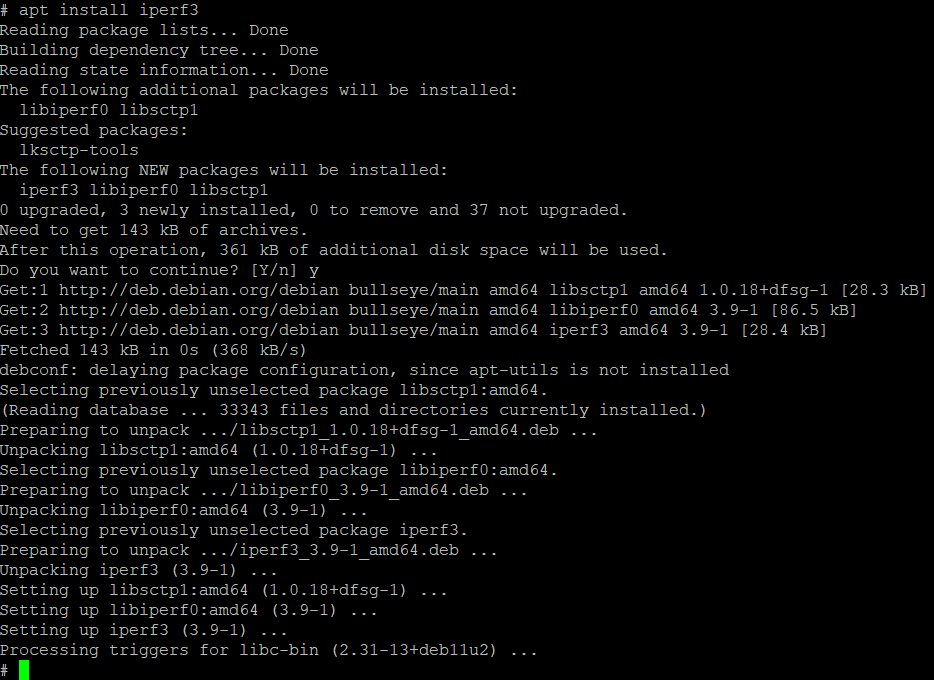

- A tutaj instalacja **net-tools**
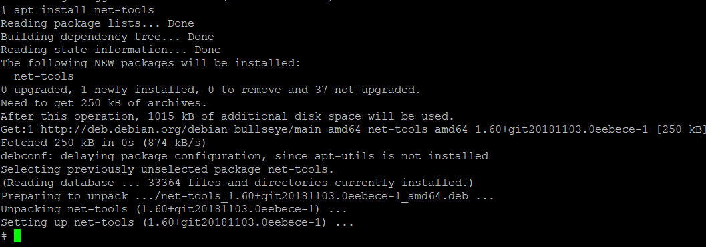

7. Aby połączyć się pomiędzy dwoma kontenerami, uruchomiłem drugi kontener w osobnym oknie, zainstalowałem na nim wszystkie wymagania (update, iperf3, net-tools), po czym za pomocą komendy <code>iperf3 -c adres_ip_serwera -p 2000 -t 30</code> połączyłem się z pierwszym kontenerem, na którym został uruchomiony serwer za pomocą komendy <code>iperf3 -s -p 2000</code>.
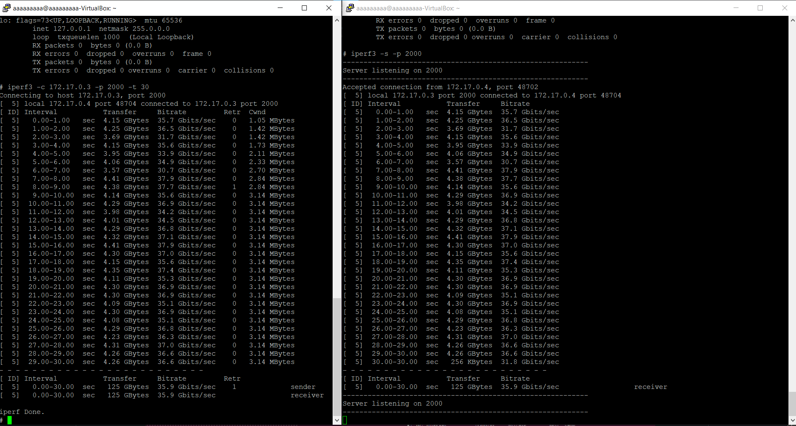

8. Aby połączyć się między kontenerem a hostem, potrzebujemy na hoście zainstalować **iperf3**, po czym łączymy się za pomocą wcześniejszej komendy <code>iperf3 -c adres_ip_serwera -p 2000 -t 30</code> do hosta.

- Tutaj pobranie adresu ip hosta:
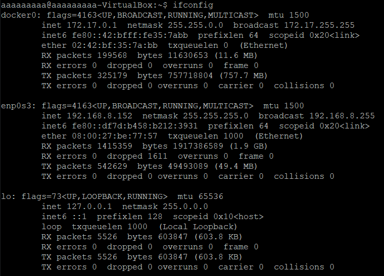

- A tutaj udokumentowanie połączenia między hostem, a kontenerem:
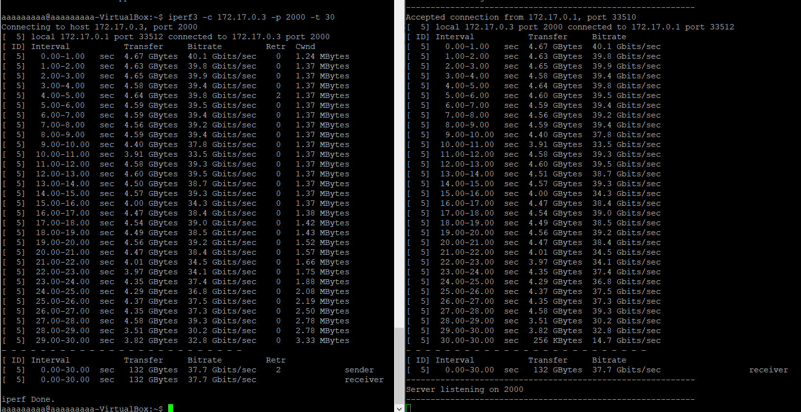

9. By połączyć się między kontenerem, a klientem spoza hosta (w tym przypadku np. na Windowsie), musimy tak jak we wcześniejszym przypadku zainstalować najpierw **iperf3**. Po zainstalowaniu iperf3 na Windowsie, uruchamiamy połączenie za pomocą komendy <code>iperf3.exe -c adres_ip_serwera -p 2000 -t 30</code>.

- Tutaj próba połączenia spoza hosta do kontenera. Po uruchomieniu funkcji jest zwracany błąd - Connection timed out.
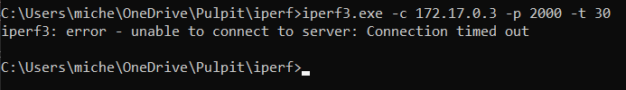

- Tutaj za pomocą komendy <code>ping</code> sprawdzam, czy w ogóle jest ustanowione połączenie między serwerem, a klientem. Niestety nawet pomimo wyłączenia wszelkiej zapory internetowej, utrata pakietów jest na poziomie 100%. Udokumentowanie tego połączenia w moim przypadku nie wystąpi.
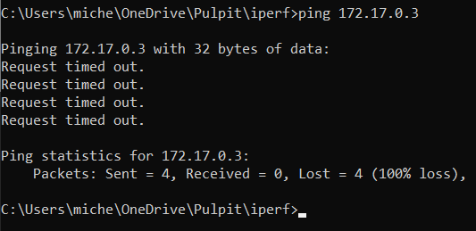

> Sprawdzając uzyskane wyniki przepustowości możemy zauważyć, że największa przepustowość jest w przypadku połączenia host-kontener (37.7 Gbit/s), lekko mniejszą przepustowość możemy odnotować w przypadku połączenia kontener-kontener (35.9 Gbit/s). Połączenia spoza hostem, a kontenerem nie udało mi się ustanowić, ale na podstawie materiałów z zajęć przedstawianych przez prowadzącego można spodziewać się iż będzie ona znacznie niższa niż we wcześniejszych dwóch przypadkach.

### Instalacja Jenkinsa

10. Korzystając z dokumentacji na stronie: https://www.jenkins.io/doc/book/installing/docker/ przystąpiłem do instalacji Jenkinsa. Najpierw za pomocą komendy <code>docker network create jenkins</code> stworzyłem sieć mostkowaną w Dockerze.

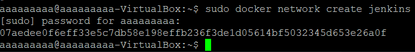

11. Następnie pobrałem i uruchomiłem obraz **docker:dind** za pomocą następującej komendy:

```
sudo docker run \
  --name jenkins-docker \
  --rm \
  --detach \
  --privileged \
  --network jenkins \
  --network-alias docker \
  --env DOCKER_TLS_CERTDIR=/certs \
  --volume jenkins-docker-certs:/certs/client \
  --volume jenkins-data:/var/jenkins_home \
  --publish 2376:2376 \
  docker:dind \
  --storage-driver overlay2
```

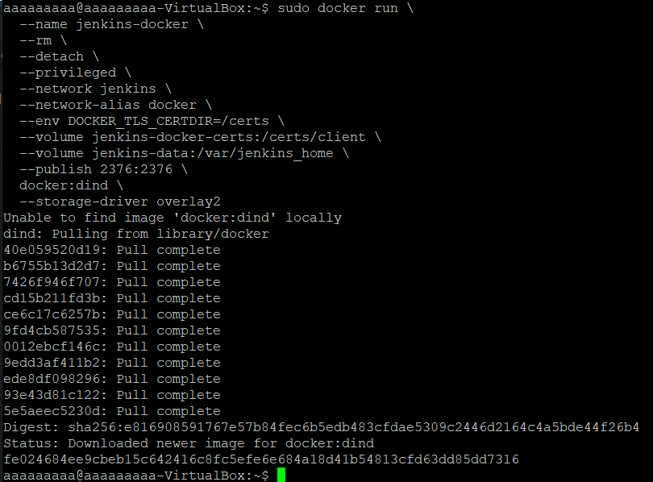

12. Stworzyłem dockerfile'a z następującą zawartością:
```
FROM jenkins/jenkins:2.332.1-jdk11
USER root
RUN apt-get update && apt-get install -y lsb-release
RUN curl -fsSLo /usr/share/keyrings/docker-archive-keyring.asc \
  https://download.docker.com/linux/debian/gpg
RUN echo "deb [arch=$(dpkg --print-architecture) \
  signed-by=/usr/share/keyrings/docker-archive-keyring.asc] \
  https://download.docker.com/linux/debian \
  $(lsb_release -cs) stable" > /etc/apt/sources.list.d/docker.list
RUN apt-get update && apt-get install -y docker-ce-cli
USER jenkins
RUN jenkins-plugin-cli --plugins "blueocean:1.25.3 docker-workflow:1.28"
```
13. Na podstawie stworzonego dockerfile utworzyłem obraz za pomocą komendy <code>docker build -t myjenkins-blueocean:2.332.1-1 .</code>

- Tutaj zrzut ekranu dokumentujący początek wywołania komendy:
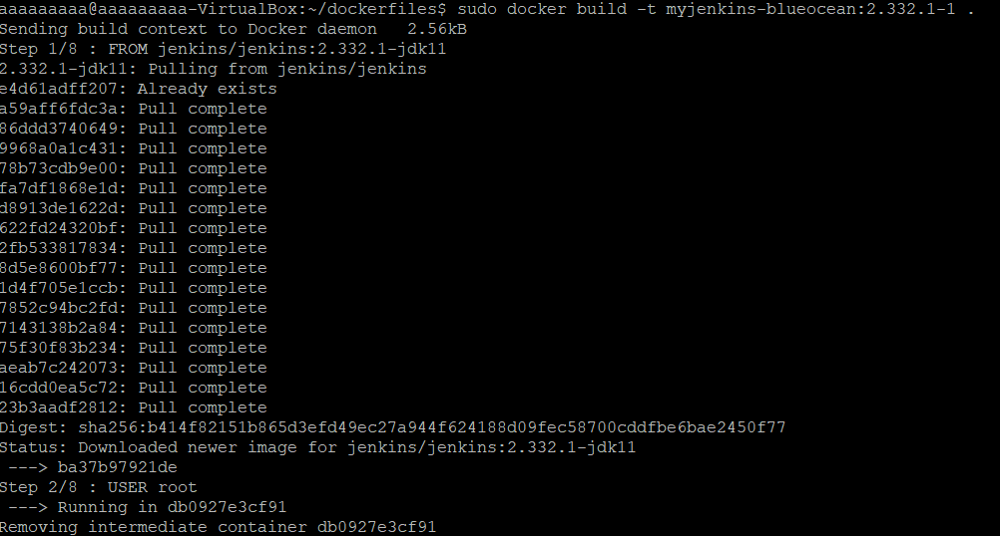

- A tutaj zrzut ekranu dokumentujący poprawne wykonanie komendy:
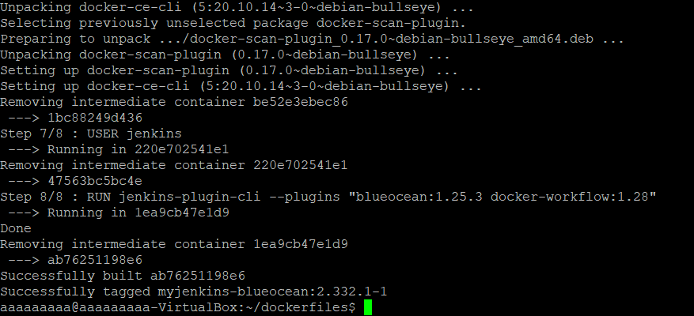

14. Po utworzeniu obrazu uruchomiłem kontener za pomocą stworzonego obrazu komendą:
```
sudo docker run \
  --name jenkins-blueocean \
  --rm \
  --detach \
  --network jenkins \
  --env DOCKER_HOST=tcp://docker:2376 \
  --env DOCKER_CERT_PATH=/certs/client \
  --env DOCKER_TLS_VERIFY=1 \
  --publish 8080:8080 \
  --publish 50000:50000 \
  --volume jenkins-data:/var/jenkins_home \
  --volume jenkins-docker-certs:/certs/client:ro \
  myjenkins-blueocean:2.332.1-1 
```
- Tutaj zrzut ekranu dokumentujący uruchomienie tej komendy:
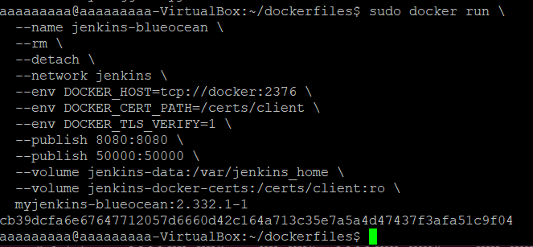

15. Po uruchomieniu kontenera za pomocą komendy <code>sudo docker ps</code> wylistowałem uruchomione kontenery:
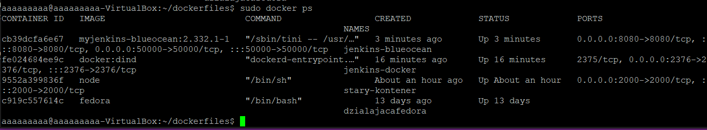

16. Następnie w przeglądarce połączyłem się ze stroną: http://localhost:8080 w celu kontynuowania konfigurowania Jenkinsa.
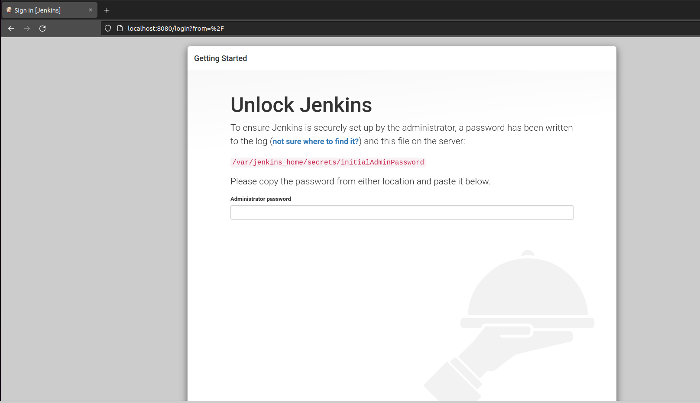

17. Kolejnym krokiem było uzyskanie hasła w celu zainstalowania Jenkinsa. W tym celu w terminalu korzystamy z komendy <code>sudo docker exec cb39dcfa6e67 cat /var/jenkins_home/secrets/initialAdminPassword</code>, gdzie **cb39dcfa6e67** jest identyfikatorem kontenera z Jenkinsem. Użycie tej komendy wypisze w terminalu hasło wymagane do kontynuowania inicjalizacji Jenkinsa.
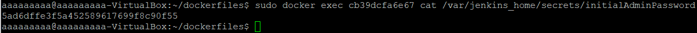

18. Po wprowadzeniu hasła i przeprowadzeniu instalacji powinien ukazać się nam ekran logowania. 
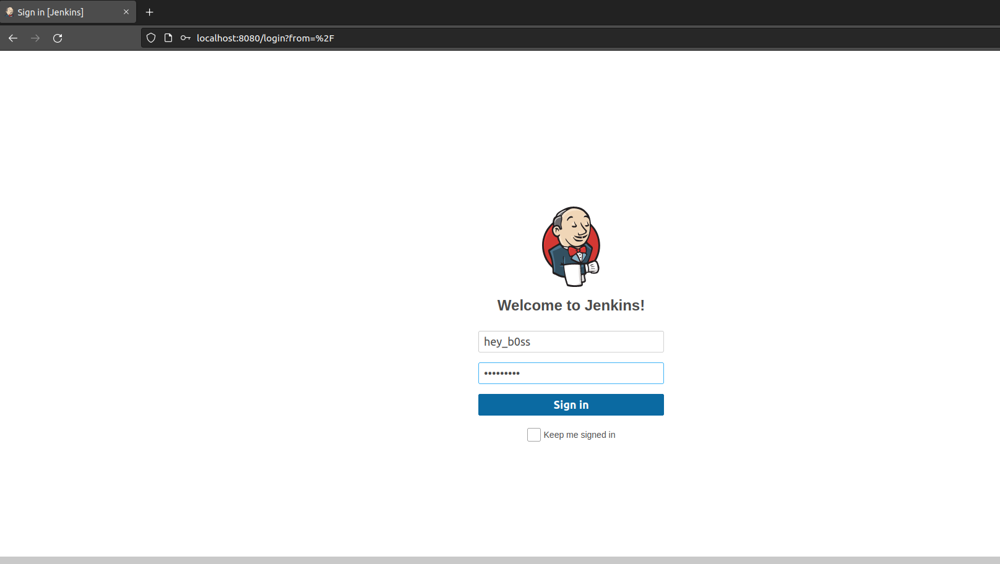

