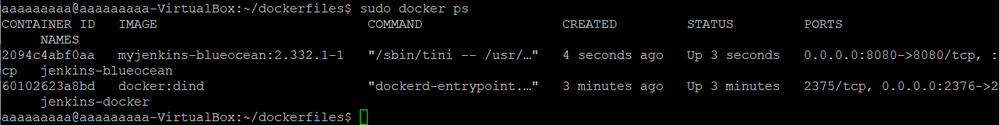
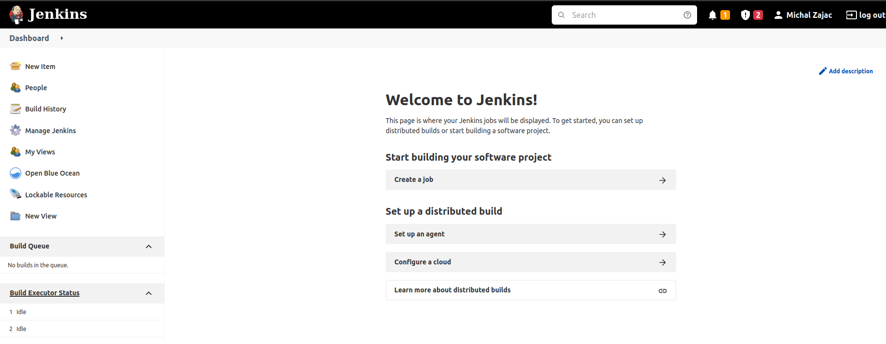
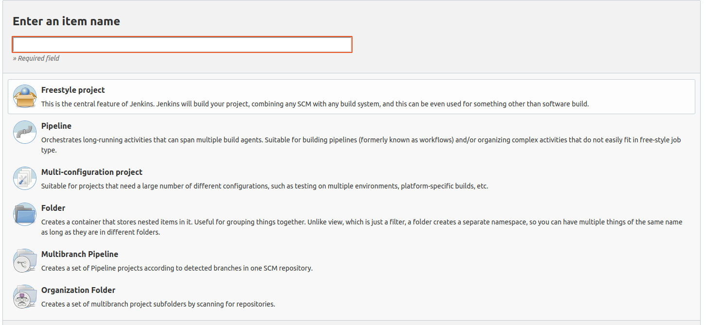
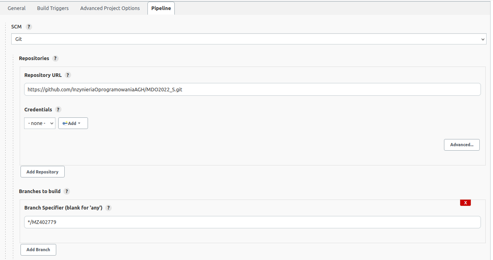
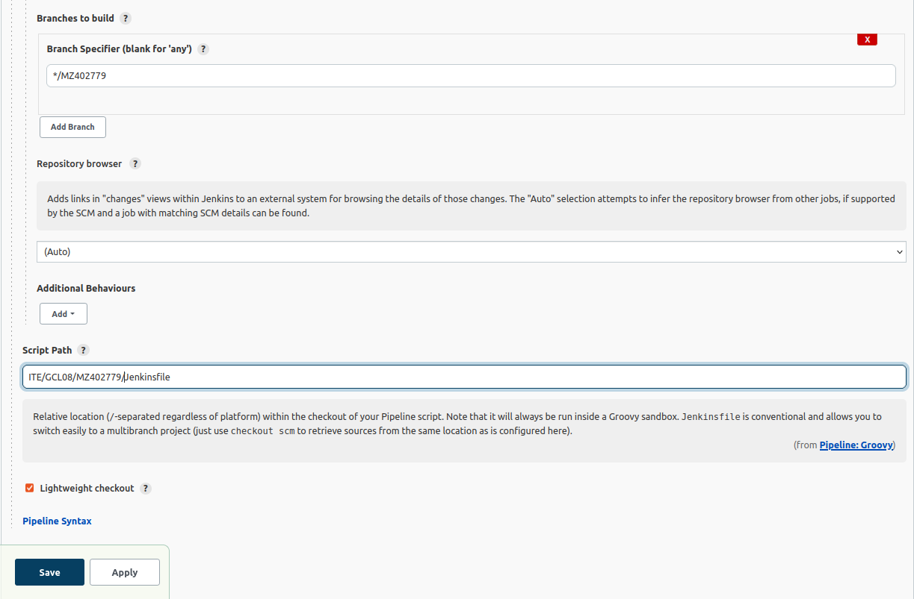
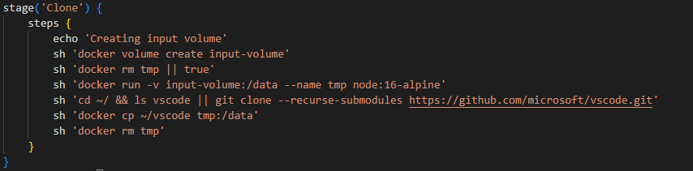
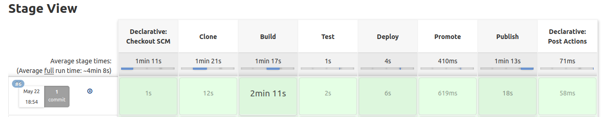
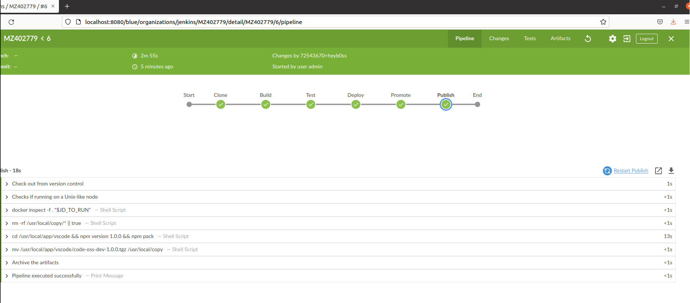

# Michał Zając - sprawozdanie z DevOps z lab05

## Cel projektu:

Celem tego projektu jest stworzenie pipeline'u w ramach continous delivery, w oparciu o program z poprzednich laboratoriów. Pipeline pozwala nam zaautomatyzować procesy build, test, deploy i publish w jeden wykorzystując jeden plik konfiguracyjny. Dzięki jednemu kliknięciu program wykona za nas wszystkie etapy, czego efektem będzie otrzymanie programu w wersji gotowej do wydania. Sprawozdanie zawiera szczegółowy opis jak krok po kroku dojść z punktu startowego - setupu Jenkinsa, do punktu końcowego - deploy aplikacji.

>Ze względu na występowanie problemów na etapie buildowania oraz testowania podczas korzystania z projektu z poprzednich laboratoriów (https://github.com/restic/restic), do wykonania tego projektu wybrałem program z innego repozytorium: https://github.com/microsoft/vscode

---
## **Setup początkowy:**

Warto na wstępie zaznaczyć, że w ramach tego projektu jako obraz bazowy wykorzystano `node:alpine`, głównie ze względu na swój mały rozmiar (co przekłada się szybsze uruchamianie), a także zawartość bazowych komponentów takich jak `npm`. Obrazowi bazowemu brakuje jednak basha, którego należy doinstalować. 

Inną opcją jest wykorzystanie domyślnego `node:version` jako obrazu bazowego, gdyż posiada on wszystkie potrzebne komponenty i nie wymaga instalacji dodatkowych pakietów. Jednak ze względów na swój rozmiar (obraz waży około **990MB**, w porównaniu do `node:alpine` ważącego około **170MB**) nie został on wykorzystany jako obraz bazowy.

W celu przystąpienia do wykonania zadania musimy mieć najpierw zainstalowanego Jenkinsa. Jako, że w lab04 przechodziłem przez proces instalacji krok po kroku, w tym sprawozdaniu sposób instalacji Jenkinsa nie zostanie pokazany (instalacja była oparta na instrukcji instalacji ze strony: https://www.jenkins.io/doc/book/installing/docker/).

Gdy będziemy mieli zainstalowanego Jenkinsa należy się upewnić, że kontenery `jenkins-docker` (na podstawie obrazu `docker:dind`) oraz `jenkins-blueocean` (na podstawie obrazu `myjenkins-blueocean`) są uruchomione. Jeśli nie są, należy je uruchomić za pomocą poniższych komend (najlepiej wkleić je do okna terminala):

> Kontener `jenkins-docker` uruchamiamy za pomocą komendy:
```
sudo docker run \
  --name jenkins-docker \
  --rm \
  --detach \
  --privileged \
  --network jenkins \
  --network-alias docker \
  --env DOCKER_TLS_CERTDIR=/certs \
  --volume jenkins-docker-certs:/certs/client \
  --volume jenkins-data:/var/jenkins_home \
  --publish 2376:2376 \
  docker:dind \
  --storage-driver overlay2
```

> Kontener `jenkins-blueocean` uruchamiany jest natomiast za pomocą komendy:
```
sudo docker run \
  --name jenkins-blueocean \
  --rm \
  --detach \
  --network jenkins \
  --env DOCKER_HOST=tcp://docker:2376 \
  --env DOCKER_CERT_PATH=/certs/client \
  --env DOCKER_TLS_VERIFY=1 \
  --publish 8080:8080 \
  --publish 50000:50000 \
  --volume jenkins-data:/var/jenkins_home \
  --volume jenkins-docker-certs:/certs/client:ro \
  myjenkins-blueocean:2.332.1-1 
```

Po uruchomieniu kontenerów pozostaje tylko wylistować działające kontenery, w celu upewnienia się, że działają one poprawnie. Kontenery listujemy za pomocą polecenia `sudo docker ps`


Następnie należy zalogować się do Jenkinsa. W tym celu lączymy się w przeglądarce do **localhost:8080** (domyślnie) i logujemy się na swoje konto. W przypadku gdy nie posiadamy konta na Jenkinsie należy je stworzyć.

W przypadku gdy nie pamiętamy hasła, zawsze możemy zalogować się na admina, podając za login: admin, natomiast za hasło podajemy to samo hasło, z którego korzystaliśmy w celu zainstalowania Jenkinsa. W tym celu w terminalu wpisujemy komendę `sudo docker exec {CONTAINER_ID} cat /var/jenkins_home/secrets/initialAdminPassword` , gdzie {CONTAINER_ID} jest identyfikatorem kontenera z Jenkinsem.

Po zalogowaniu się na swoje konto, powinien ukazać nam się poniższy ekran:


---
## **Budowa Pipeline**

Kolejnym etapem będzie stworzenie pipeline w Jenkinsie. W tym celu w menu głównym po lewej stronie ekranu klikamy w zakładkę New Item.  

Naszym oczom ukaże się następująca strona:


Wybieramy z listy **Pipeline** oraz nadajemy projektowi nazwę i zatwierdzamy. Po zatwierdzeniu automatycznie przejdziemy do konfiguracji projektu. Klikamy na zakładkę **Pipeline** i w definicji zmieniamy na **Pipeline script from SCM**. Po wybraniu tej opcji zmieniamy w **SCM na Git**, a następnie w repository URL wprowadzamy link do repozytorium projektu, w Branch Specifier wpisujemy branch, na którym znajdują się nasze pliki, a w Script Path podajemy ścieżkę do pliku Jenkinsfile, którego kod wykona się w naszym Pipeline. Resztę opcji podczas tej konfiguracji pomijamy.





Następnie przejdziemy do konfiguracji Jenkinsfile, w celu dodania poszczególnych etapów do naszego Pipeline (całe wprowadzone zmiany zostały umieszczone jako zrzut ekranu pod opisem dla poszczególnego etapu). Należy tutaj zaznaczyć, że jeśli pracujemy na repozytorium lokalnym, to wszelkie lokalne zmiany w Jenkinsfile muszą zostać pushnięte do repozytorium, które wskazaliśmy w naszym Pipeline. Dzieje się tak, gdyż w celu budowy naszego Pipeline, Jenkinsfile jest uzyskiwany, pullowany ze specyfikowanego przez nas repo.

---

Przed sekcją clone należy dodać zmienne parametryzujące, z których będziemy korzystać. Jednym parametrem będzie zmienna `Version`, oznaczająca do której wersji mamy deploy'ować nasz program, drugim jest parametr `Promote` oznaczający, że dana wersja po przejściu builda, testa i deploya będzie zasługiwać na wydanie.  


---
## **Clone**

Celem etapu clone jest sklonowanie wybranego przez nas repozytorium z linka githubowego do kontenera wejściowego. 

Klonowanie odbywa się przy wykorzystaniu kontenera pomocniczego, gdyż nie posiadamy dostępu do folderu gdzie Docker przechowuje dane w woluminie. Najpierw tworzymy wolumin `input-volume`. Następnie sprawdzamy, czy kontener pomocniczy jest utworzony, jeśli nie to tworzymy go i za pomocą `docker run -v` montujemy do tego wolumina wolumin `input-volume`. Następnie klonujemy repozytorium programu, poprzez `git clone`. Wykorzystanie flagi `--recurse-submodules` pozwala automatycznie zaaktualizować każdy podmoduł znajdujący się w repozytorium. Po sklonowaniu repozytorium jest ono kopiowane do folderu `/data` na woluminie, dzięki temu jeśli usuniemy kontener dane pozostaną na woluminie.


  

---
## **Build**

Celem etapu build jest zbudowanie programu za pomocą wymaganego polecenia. Repozytorium jest klonowane na wolumin wejściowy, a efekt zbudowanego katalogu jest kopiowany na wolumin wyjściowy.

Przy pomocy polecenia `dir`, przechodzimy do wybranego katalogu w którym znajduje sie nasz plik dockerfile, plik ten zostanie wykorzystany w celu stworzenia obrazu. Następnie tworzymy wolumin wyjściowy `output-volume`, po czym uruchamiamy kontener z woluminami `input-volume` i `output-volume`, bazując na utworzonym wcześniej obrazie. Następnie na woluminie wejściowym budujemy program za pomocą polecenia `yarn`. Efekt builda kopiujemy do woluminu wyjściowego za pomocą polecenia `cp`.
  

---
## **Test**

Celem etapu test jest uruchomienie testów na poprzednim kontenerze - woluminie wejściowym, wykorzystując testy z repozytorium programu.

W tym etapie ponownie korzystamy z polecenia `dir`, w celu przejścia do katalogu gdzie znajduje się nasz dockerfile. Robimy w nim ponownie kontener na podstawie poprzedniego dockerfile, jednak w tym wypadku zostanie on użyty do testów. Po stworzeniu kontenera montujemy do niego wolumin `output-volume`, po czym przeprowadzamy na nim testy za pomoca polecenia `npm test`.
 

---
## **Deploy**

Główną ideą etapu deploy jest sprawdzenie poprawności działania i stabilności zbudowanej aplikacji przed publikacją.

W tym etapie uruchamiamy program na woluminie wyjściowym poprzez uruchomienie go na danym kontenerze za pomocą komendy `npm run` Po poprawnym uruchomieniu kontenera program czeka 5 sekund. Po sprawdzeniu `exit code` usuwamy go za pomocą `docker rm`.
  

---
## **Promote**

Celem promote jest sprawdzenie czy istnieje wymagany katalog artifacts. Jeśli katalog nie istnieje to zostaje on utworzony w odpowiedniej ścieżce w kontenerze Jenkinsa.

Ten etap zostaje uruchomiony tylko jeśli wartość parametru promote jest równa `true`.
  

---
## **Publish**

Celem etapu publish jest spakowanie zbudowanego programu do archiwum i zarchiwizowanie artefaktu. Dodatkowo etap publish umieszcza stworzony arfifact jako build artifact dla odpowiednego przejścia Pipeline'u,  korzystając z argumentu `fingerprint: true`
  


---
## **Post**

Sekcja post powiadamia użytkownika o powodzeniu lub niepowodzeniu wykonywaniu Pipeline'a.


> **Po wykonaniu pipeline'a warto sprawdzić stage view, w celu sprawdzenia czy wszystkie kroki przebiegły pomyślnie.**




