# **Michał Zając - Sprawozdanie z DevOps lab09**

## **Cel laboratoriów:**
 Celem tych laboratoriów było przygotowanie systemu pod instalację nienazdorowaną.

---
## **Przygotowanie systemu pod uruchomienie**

Aby zainstalować system Fedora na maszynie wirtualnej należy najpierw pobrać plik **.iso** ze strony: [getfedora.org](https://getfedora.org/en/server/download/?msclkid=bf9cf71bcbb711ecb80edcc952ba9f18).
Wersja, która została wykorzystana podczas wykonywania tych laboratoriów to **Fedora 36 w wersji netinstall**.

Po pobraniu pliku obrazu tworzymy dwie maszyny wirtualne. Dla każdej maszyny zostało przydzielone 20 GB pamięci. Gdy maszyna zostanie stworzona, montujemy na niej obraz i przechodzimy do instalacji Fedory. Obydwie maszyny wirtualne zostały zainstalowane z poniższymi parametrami:

**Język:**
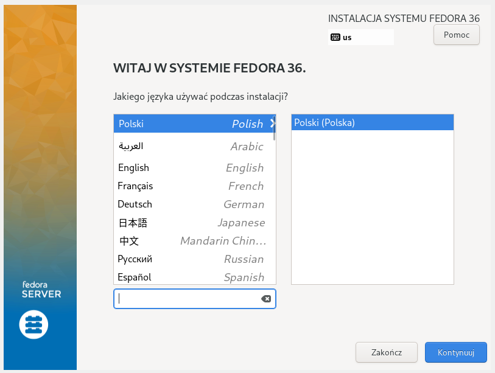

**Konto roota:**
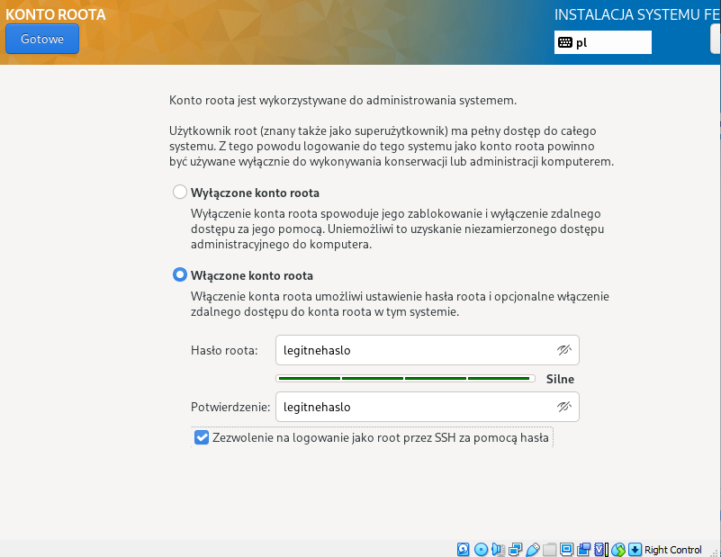

**Dysk instalacyjny:**
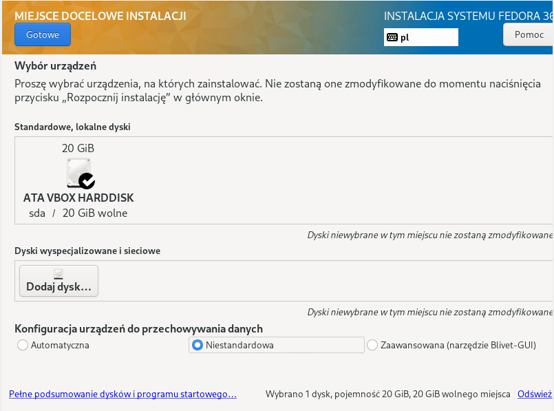

**Partycja:**


**Sieć i nazwa komputera (nazwa została zmieniona dla drugiej maszyny):**
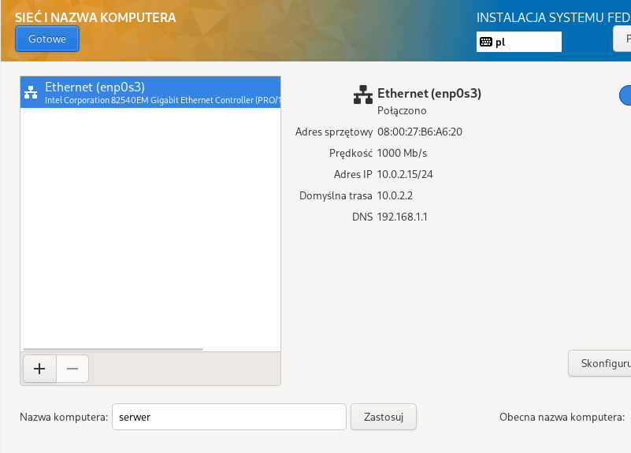

**Źródło instalacji:**


**Oprogramowanie:**
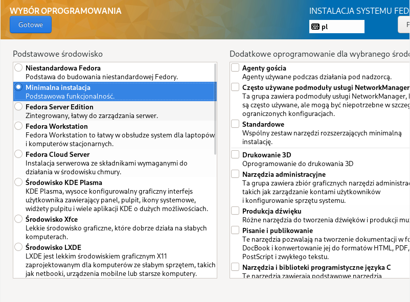


>Po zainstalowaniu maszyn należy pamiętać aby zmienić kolejność bootowania w BIOSie. W przypadku VM Virtual Boxa, po odpaleniu maszyny klikamy **F12** (domyślnie) i wybieramy bootowanie z dysku. W przeciwnym wypadku maszyna wirtualna będzie próbować ponawiać instalację Fedory. Dodatkowo należy pamiętać, aby zmienić kartę sieciową w ustawieniach maszyny wirtualnej na **mostkowaną**. Umożliwi to pobranie pliku `anaconda-ks.cfg`, z wirtualki na komputer. Plik ten będzie wykorzystywany do poźniejszej instalacji nienadzorowanej.


**Tutaj zmiana karty sieciowej w maszynie wirtualnej:**


---
## **Pobranie pliku konfiguracyjnego i artefaktu**

Następnie uruchamiamy serwer fedory i logujemy się do niego za pomocą roota i hasła określonego podczas instalacji w celu pobrania pliku `anaconda-ks.cfg`, a także pobrania artefaktów programu. By móc ustanowić połaczenie między komputerem a wirtualką pobieramy adres ip serwera za pomocą komendy `ip a`.

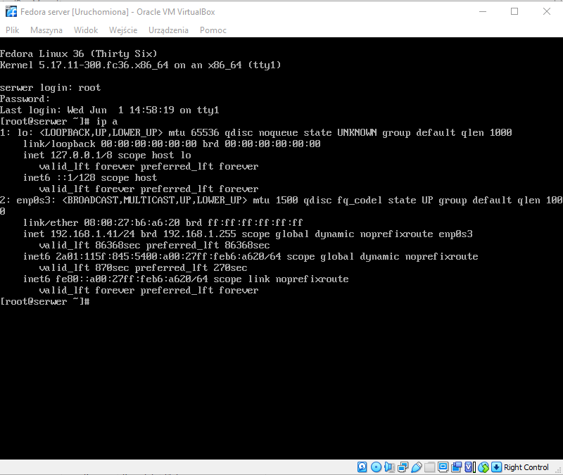

Po pobraniu adresu ip łączymy się z serwerem przez np. **Filezillę** w celu transferu pliku. Jako port wpisujemy **22**, gdyż łączymy się przez ssh. Następnie pobieramy z maszyny wirtualnej plik `anaconda-ks.cfg` na nasz komputer.

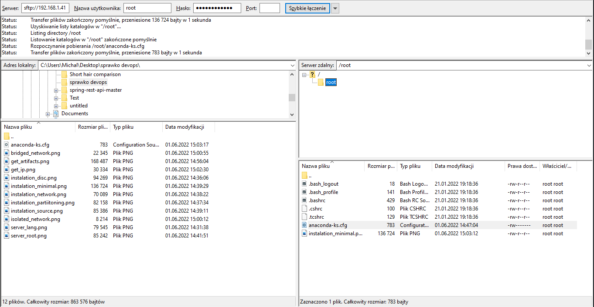

Następną częścią będzie ustawienie serwera fedory na maszynie wirtualnej. Celem tego serwera będzie hostowanie artefaktu. By to zrobić potrzebujemy pobrać artefakt z poprzedniego projektu z Jenkinsa.

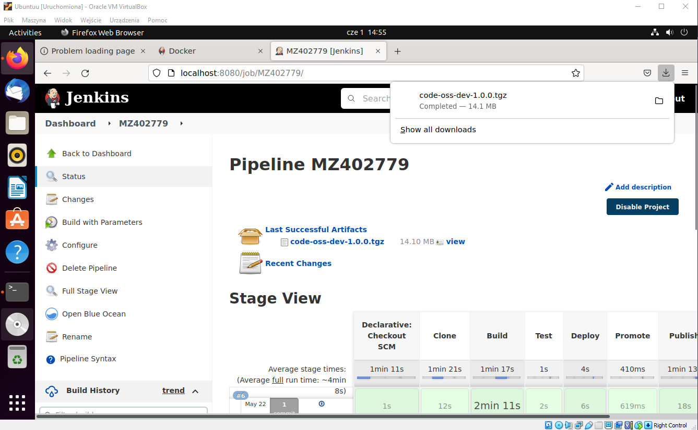


Gdy pobierzemy artefakt z Jenkinsa należy do umieścić na serwerze fedory. W celu transferu plików wykorzystałem ponownie Filezillę.
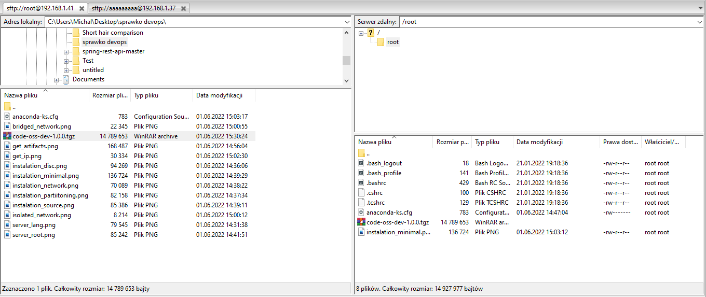

Po przeniesieniu artefaktu na serwer upewniłem się, że plik istnieje. W tym celu pobrałem lokalizację pliku za pomocą `find -name nazwa_artefaktu`
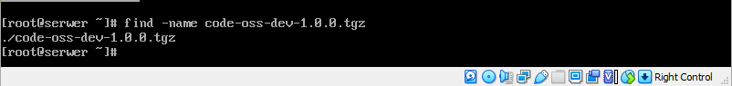

---
## **Konfiguracja hosta**

Po przeniesieniu wszystkich wymaganych plików przystąpiłem do konfiguracji hosta. W tym celu zainstalowałem na serwerze Fedory pakiet **httpd** za pomocą komendy `dnf install httpd`.

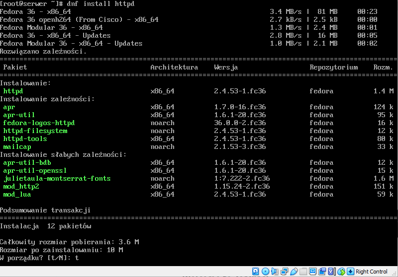
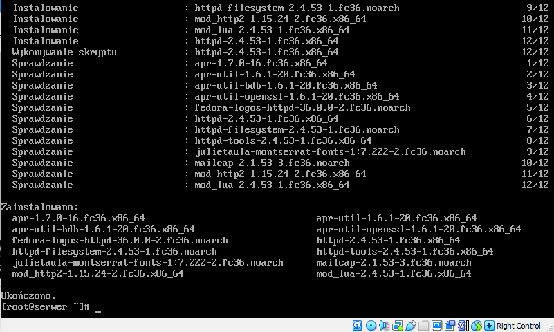

Po zainstalowaniu **httpd** należy dodać wyjątki do firewalla i przeładować go. Wyjątki dodajemy za pomocą komendy `firewall-cmd --permanent --zone=public -add=nazwa_wyjątku`. Przeładujemy firewalla za pomocą `firewall-cmd --reload`.

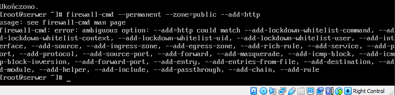
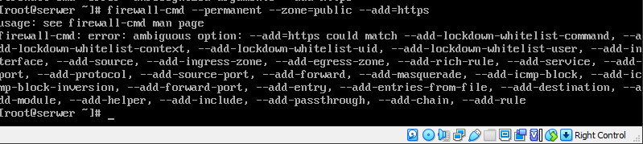
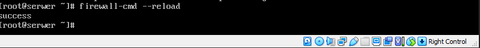


Po skonfigurowaniu firewalla należy włączyć usługę **httpd** za pomocą komendy `systemctl enable httpd --now`. 

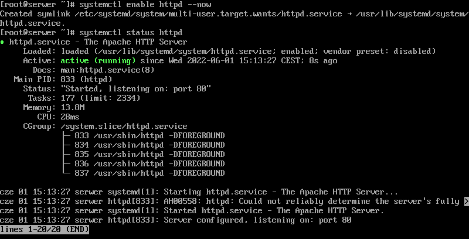

Na sam koniec w celu transferu artefaktu utworzyłem katalog `/var/www/html/vscode` i umieściłem w nim artefakt. Lokalizacja jest ważna, gdyż katalog `/var/www/html` jest domyślnie udostępniany przez usługę httpd.

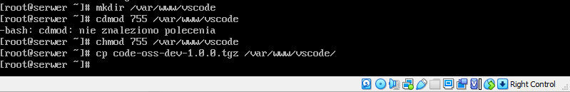

---
## **Konfiguracja klienta**

Konfiguracja **httpd** na serwerze została zakończona, kolejnym krokiem jest uruchomienie drugiej maszyny wirtualnej z fedorą i pobranie jej adresu ip w celu transferu artefaktu. Adres ip klienta pobieramy za pomocą `ip a`.

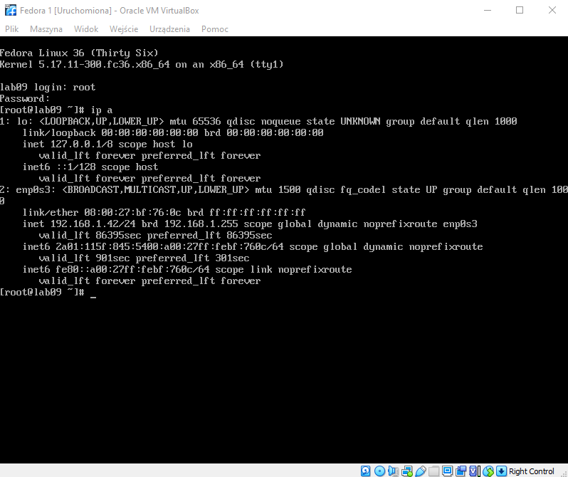

Następnie należy zainstalować na wirtualce pakiet `wget` w celu pobrania pliku z hosta. Instalujemy go poprzez `dnf install wget`.

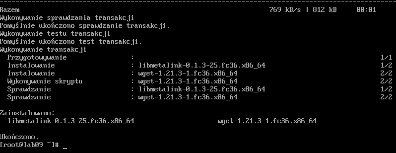


Po zainstalowaniu `wget` pobieramy artefakt z hosta za pomocą komendy `wget adres_hosta/vscode/code-oss-dev-1.0.0.tgz`. W momencie transferu artefaktu napotkałem problem, który udało się rozwiązać. Podczas uruchamiania powyższej komendy dostałem informację o błędzie: **nieudane: Brak trasy do hosta**.

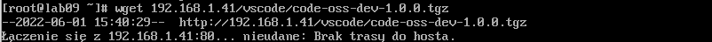

Aby rozwiązać ten problem należy dodać obslugę portu 80/tcp do firewalla.
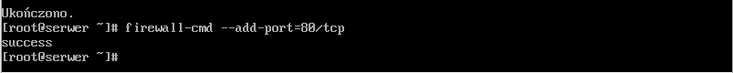


Pod spodem ponowne uruchomienie komendy `wget`, jednak tym razem udane.
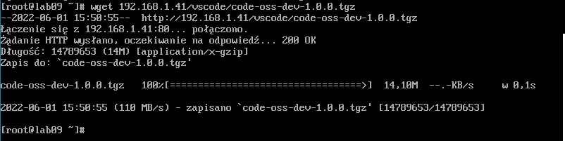

Następnie należy pobrać wszystkie zależności do obecnego projektu. W tym celu instalujemy pakiet **npm** za pomocą komendy `dnf install npm -y`:
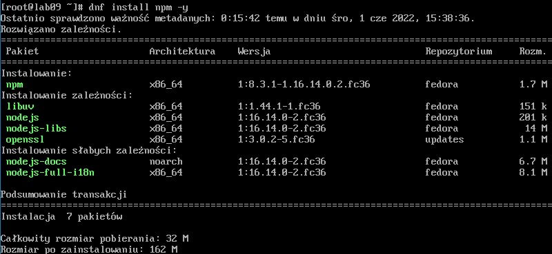
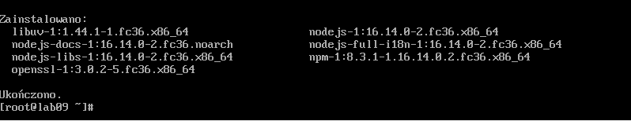

Po instalacji zależności możemy zainstalować nasz program za pomocą artefaktu. Instalacja odbywa się poprzez użycie komendy `npm install code-oss-dev-1.0.0.tgz`.
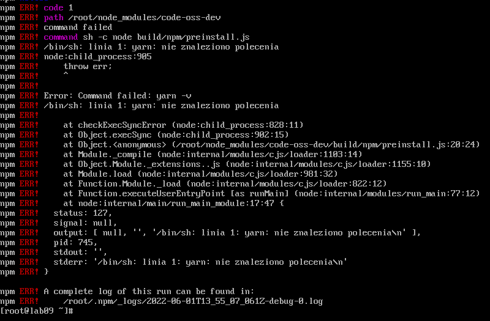

Po uruchomieniu instalacji programu otrzymujemy powiadomienie o błędzie, iż nie znaleziono pakietu **yarn**. Można go zainstalować za pomocą komendy `npm install --global yarn`. Po zainstalowaniu pakietu, dodatkowo sprawdzam jego wersję.
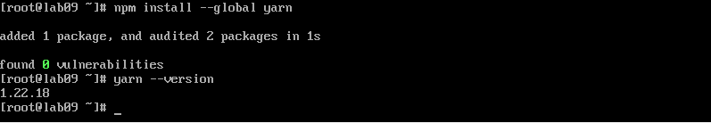

Po zainstalowaniu **yarn** ponawiamy próbę instalacji programu.
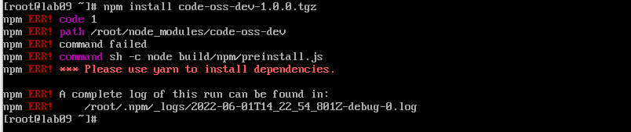

W tym momencie po instalacji **YARN** napotkałem problem, którego nie dałem rady rozwiązać. Instalacja kończyła się pomyślnie. Próbowałem jeszcze raz instalować yarn, projekt, dodawać zależności do projektu, lub podążać za podobnym problemem rozpisanym na gicie i edytować plik preinstall.js. korzystając z linku https://github.com/microsoft/vscode/issues/93119 , jednak ostatecznie problem nie został rozwiązany. Dlatego pominę część instalacji spakowanego programu i przejdę do dalszej części zadania - instalacji nienadzorowanej.

---
## **Instalacja nienadzorowana - setup**

Musimy zmodyfikować plik **anaconda-ks.cfg**

Aby przyspieszyć instalację możemy zmienić tryb instalacji z graficznej na tekstową, aby tego dokonać należy pod zmienić linijkę pod `# Use graphical install` z `graphical` na `text`. Możemy także poprzez zmianę `--hostname=` zmienić nazwę hosta, jednak nie będzie to w tej sytuacji wykorzystywane.

Następnie należy dodać instalacje wszystkich dependencji. W tym celu pod `%packages`
`@^minimal-environment` dodajemy pakiety z których korzystaliśmy. W przypadku tego programu będzie to `wget` oraz `npm`. 

Należy do pliku konfiguracyjnego dodać także definicje repozytoriów Fedory. Dodajemy je poprzez wklejenie następującego polecenia do pliku konfiguracyjnego.

```
# Repo
url --mirrorlist=http://mirrors.fedoraproject.org/mirrorlist?repo=fedora-$releasever&arch=x86_64
repo --name=updates --mirrorlist=http://mirrors.fedoraproject.org/mirrorlist?repo=updates-released-f$releasever&arch=x86_64
```
Na sam koniec do pliku konfiguracyjnego należy dodać proces pobierania nazego artefaktu. Jako, iż do pobierania istniejącego artefaktu z serwera wykorzystano `wget`, w tym przypadku także zostanie on wykorzystany.

By tego dokonać możemy zdefiniować sekcję post. Komendy z tej sekcji wykonają się po zakończeniu instalacji i pobierania wszystkich dependencji na wirtualkę. Sekcję post umożliwiającą pobranie istniejącego artefaktu z serwera definiujemy poprzez:

```
%post
wget http://192.168.1.41/vscode/code-oss-dev-1.0.0.tgz
%end
```
---
## **Instalacja za pomocą pliku konfiguracyjnego**

Następnie należy przeprowadzić weryfikację poprawności zmodyfikowanego pliku `anaconda-ks.cfg`. W tym celu tworzymy nową maszynę wirtualną i konfigurujemy ją tak jakbyśmy ponownie chcieli zainstalować na niej Fedorę. Należy dla danej maszyny przydzielić miejsce w pamięci o takiej samej wielkości lub nawet większej niż rozmiar partycji ``--size`` zdefiniowanej w pliku `anaconda-ks.cfg`. Jeśli tego nie zrobimy, instalacja zostanie zakończona niepowodzeniem.

Po stworzeniu maszyny wirtualnej należy uruchomić instalację z wykorzystaniem pliku konfiguracyjnego. Plik został umieszczonym na moim repozytorium w katalogu `Lab09` i właśnie z githuba będzie on pobierany. Uruchomienie instalacji przy pomocy pliku konfiguracyjnego dokonujemy poprzez kliknięcie klawisza `tab` w menu instalacyjnym. Na dole ekranu powinna pojawić się komenda

```
vmlinuz initrd=initrd.img inst.stage2=hd:LABEL=Fedora-S-dvd-x86_64-36 rd.live.check quiet
```

Aby wykorzystać przygotowany przez nas plik `anaconda-ks.cfg` dopisujemy do niej następującą linijkę

```
inst.ks=https://raw.githubusercontent.com/InzynieriaOprogramowaniaAGH/MDO2022_S/MZ402779/ITE/GCL08/MZ402779/Lab09/anaconda-ks.cfg
```
Tutaj zrzut ekranu dokumentujący całą komendę użytą do instalacji:
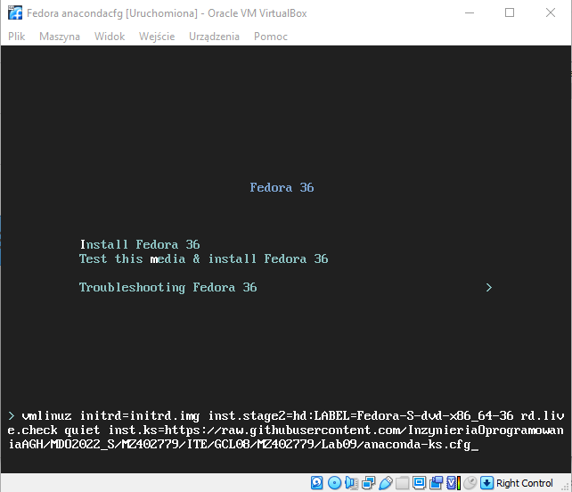

>Należy pamiętać, aby podczas instalacji serwer z którego mamy pobrać artefakt był dostępny! W przeciwnym wypadku instalacja zawiesi się na sekcji post i nie zostanie wykonana.

Tutaj komunikat o poprawnym zainstalowaniu Fedory przy wykorzystaniu pliku `anaconda-ks.cfg`:
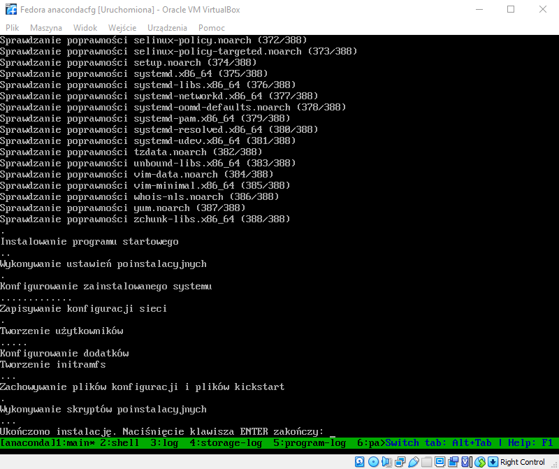

---
## **Infrastructure as code**

Po instalacji maszyny wirtualnej uruchamiamy ją ponownie (i ponownie zmieniamy sposób bootowania na bootowanie z dysku). Po uruchomieniu powinno pojawić się nam okno maszyny, do której należy się zalogować:
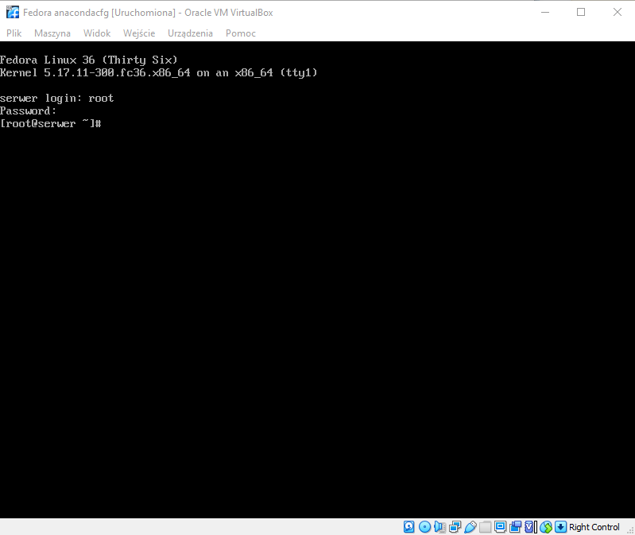

Po zalogowaniu się montujemy obraz Fedory na naszej wirtualce, w napędzie optycznym:
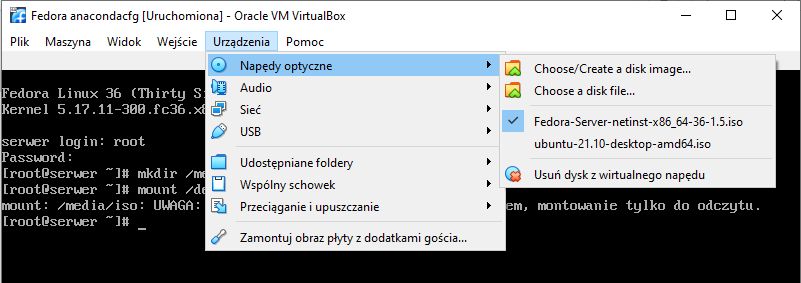

Tworzymy katalog `/media/iso/` po czym montujemy w nim obraz z napędu naszej wirtualki za pomocą komendy `mount /dev/sr0 /media/iso`:
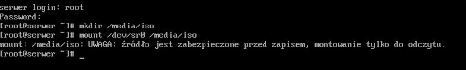

Tworzymy katalog roboczy `fedora_iso` i kopiujemy do niego obraz z katalogu `/media/iso/`.
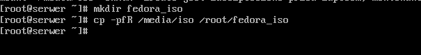

Kopiujemy plik `anaconda-ks.cfg` do naszego obrazu:
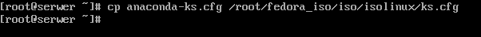


Następnie edytujemy plik isolinux.cfg (można użyć `nano`) aby dodać do niego linijkę `inst.ks=cdrom:/isolinux/ks.cfg`
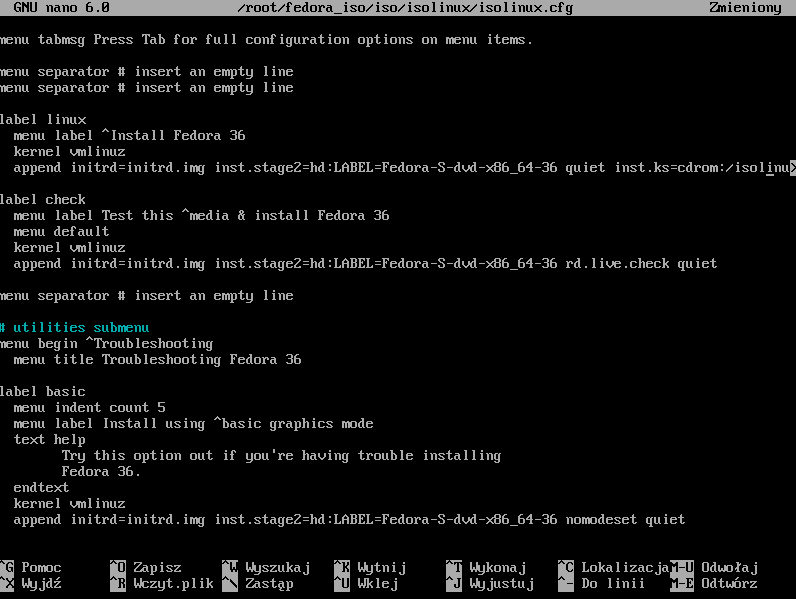

Za pomocą komendy `dnf install genisoimage` instalujemy pakiet umożliwiający tworzenie obrazu ISO.
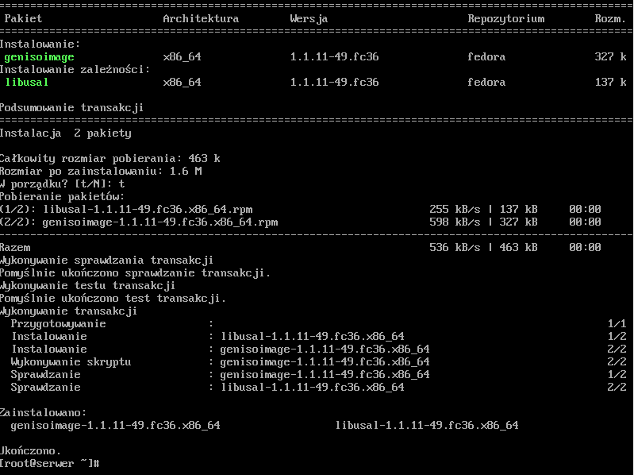

Za pomocą poniższej komendy tworzymy iso. 
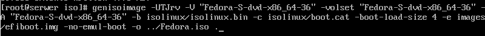

Należy pamiętać aby uruchomić komendę w folderze, którego podfolderem jest **isolinux**!
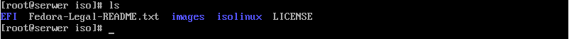

Pod spodem rezultat komendy tworzącej plik `.iso`:
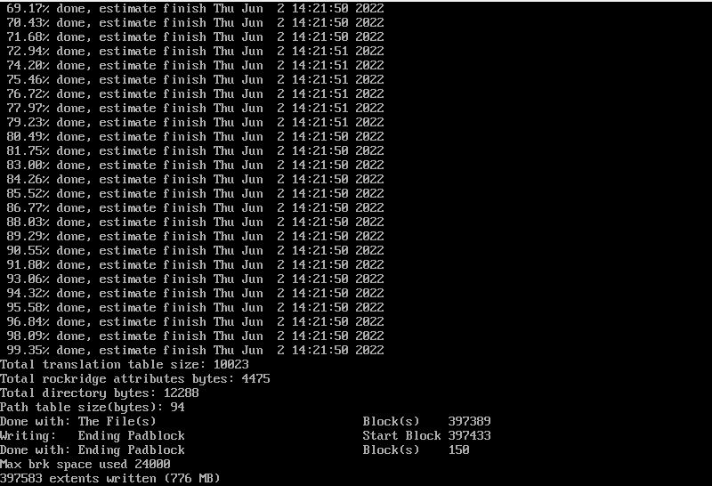

I jeszcze na sam koniec lokalizacja pliku `Fedora.iso`
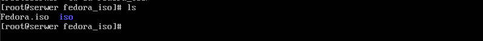

Po stworzeniu ISO możemy go pobrac na swój komputer, po czym zainstalować maszynę wirtualną jeszcze raz, tym razem za pomocą stworzonego ISO. W celu transferu pliku łaczymy się ponownie przez Filezillę.

Na tym etapie napotkałem problem, który ostatecznie udało się rozwiązać. Nie mogłem z początku w żaden sposób ustanowić połączenia ze stworzoną maszyną wirtualną, na której znajdował się plik `Fedora.iso` który miałem z niej pobrać. Próbowałem łączyć się przez Filezillę, sprawdzałem czy może port **22** nie został zablokowany i dodatkowo zainstalowałem i włączyłem usługę `ssh-server` jednak te kroki nie rozwiązały problemu. Na szczęście, rzecz która rozwiązała problem to powtórzenie wszystkich kroków wykonywanych przy setupie `httpd`, ale w tym przypadku na maszynie z plikiem `Fedora.iso`. Poniżej kroki, które zastosowałem w celu rozwiązania problemu:
- Zainstalowanie pakietu httpd. 
- Uruchomienie usługi httpd.
- Dodanie wyjątków http oraz https do firewalla.
- Dodanie portu 80/tcp do firewalla.
- Transfer pliku `Fedora.iso` do folderu `/var/www/html/fedoraiso`.
- Pobranie pliku `Fedora.iso` za pomocą komendy `wget`.
- Pobranie za pomocą Filezilli obrazu na komputer.

Po pobraniu pliku iso na komputer zainstalowałem fedorę za pomocą pobranego obrazu. Instalacja przebiegła pomyślnie.