# Lab 03 - Paweł Waresiak

### Repo

https://github.com/apollographql/apollo-server

### Uruchomienie kontenera z node i połączenie się na tty
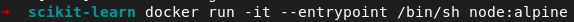

### Instalowanie aplikacji
#### Konfiguracja środowiska
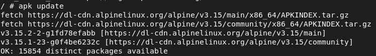
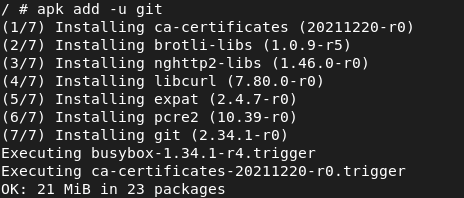
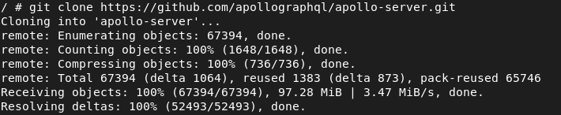
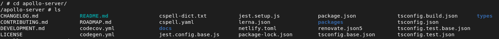

#### Instalacja dependencji
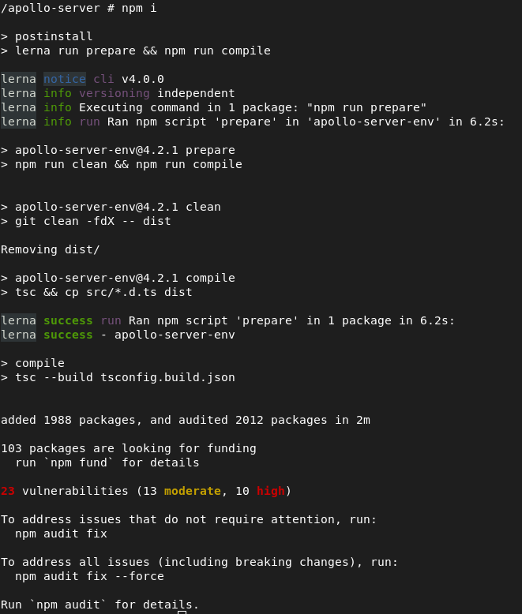

#### Uruchomienie testów
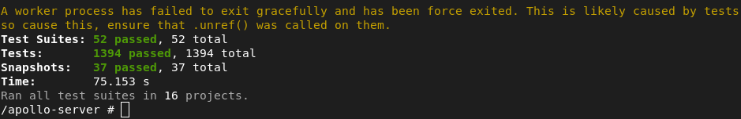

### Utworzenie z poprzednich kroków Dockerfile'ów

#### Dockerfile - build
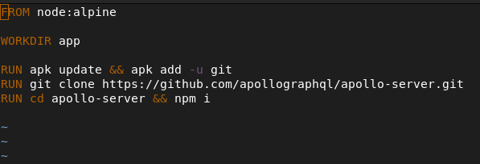

#### Dockerfile - test
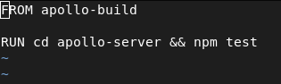

### Sprawdzenie czy obrazy się budują
#### Apollo build
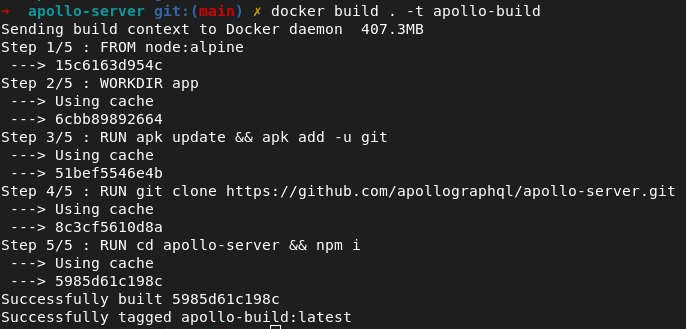

#### Apollo test
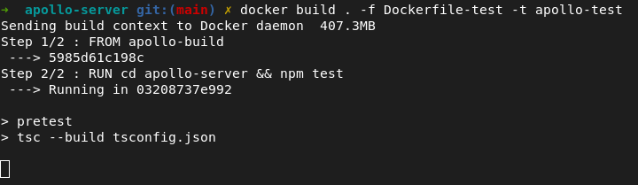
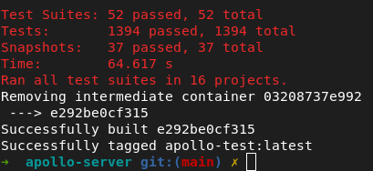

Obrazy zbudowały się poprawnie i testy również wykonały się w 100%.  
Uruchomienie z nich kontenerów zakończy się powodzeniem i zakończą one swoją pracę zaraz po uruchomieniu.  
Niestety nie jest to aplikacja web'owa i nie mogę uruchomić jej poprzez 'npm start', dlatego wytłumaczę tylko różnicę między obrazem a kontenerem.  
Obraz - stanowi podstawę do stworzenia kontenera.  
Kontener - pozwala na uruchomienie programu w odizolowanym środowisku zawierającym wszystkie zależności wymagane do jego działania.  

