# Lab 04 - Paweł Waresiak

### Voluminy

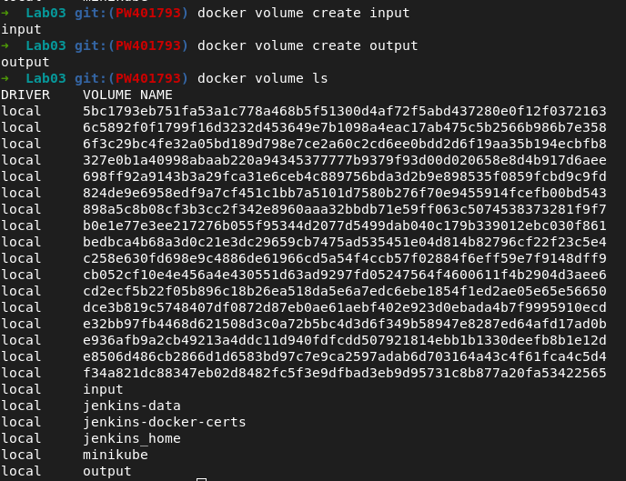

### Połączenie voluminów do kontenera
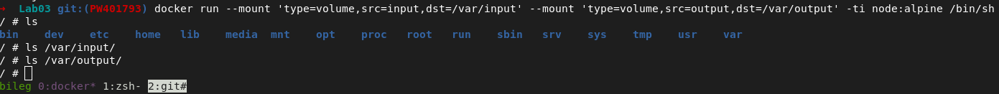

### Sklonowany projekt w voluminie

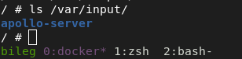

### Build
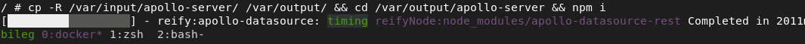
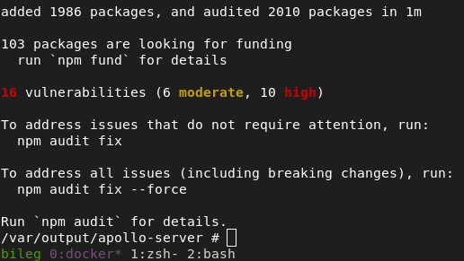

### Wynik builda z modułami w voluminie
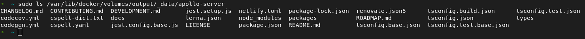

### Uruchomienie serwera iperf-3 w kontenerze
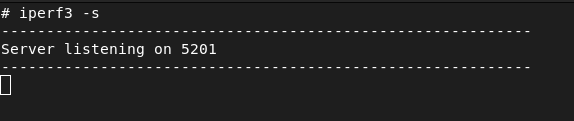

### Test kontener - kontener

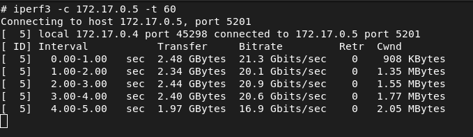
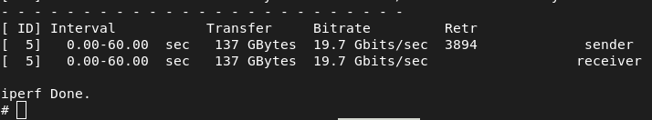

### Test host - kontener

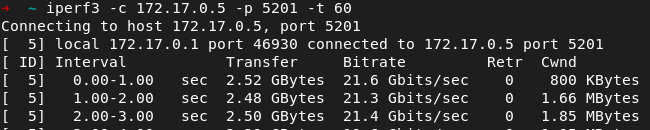
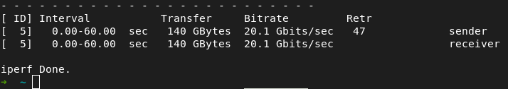

### Test moja maszyna - kontener

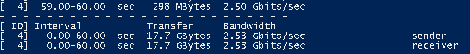

### Wynik testów

Najszybszą komunikację miała konfiguracja host-kontener, ale nieznacznie większą niż kontener-kontener.

### Instalacja Jenkins'a

Ja już miałem zainstalowanego, pokazane tylko kontenery i strona logowania Jenkins'a

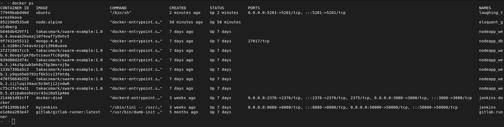
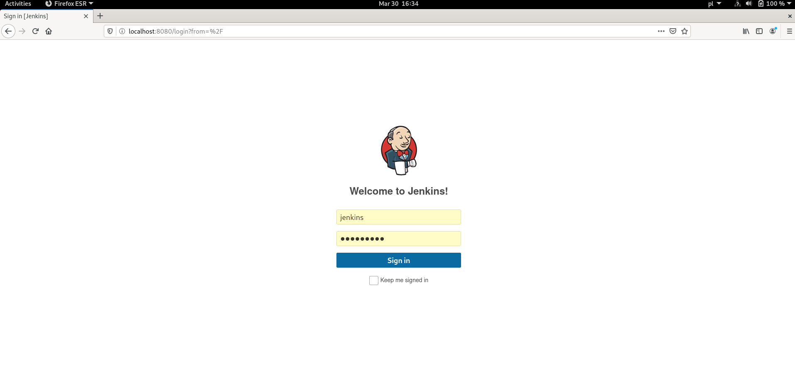
