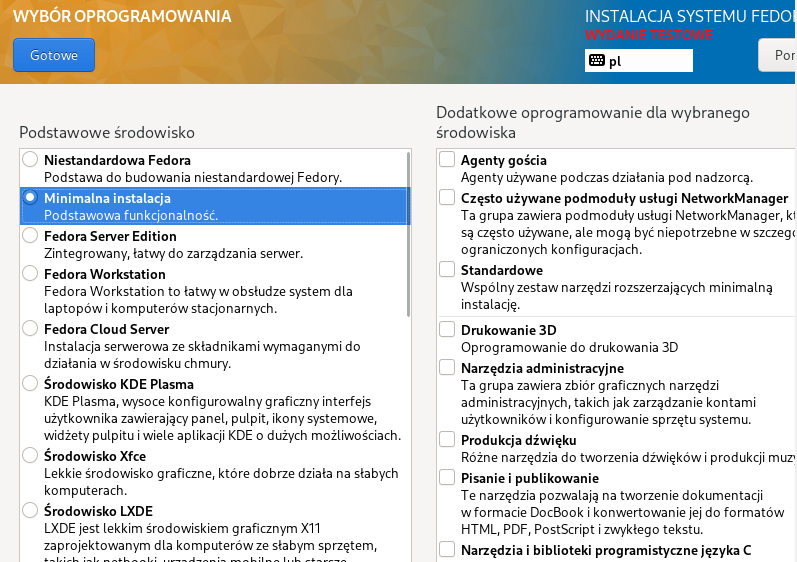
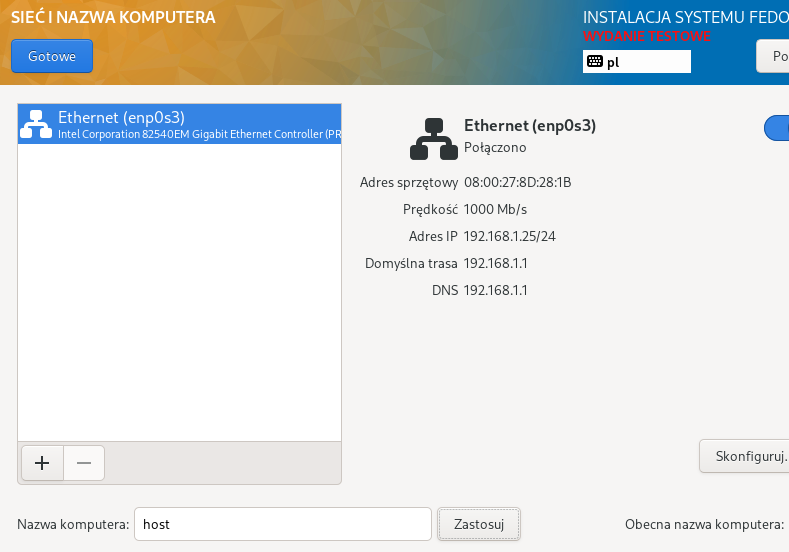
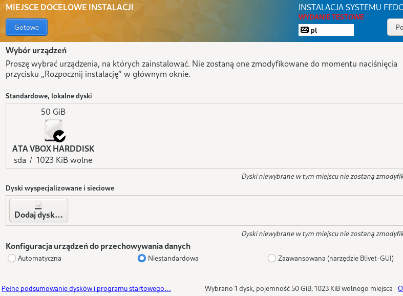
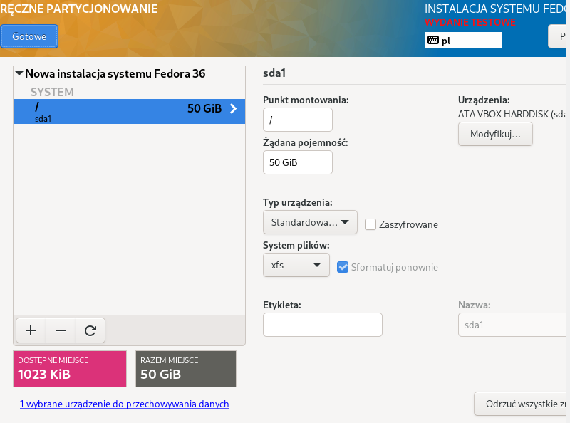
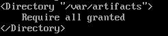
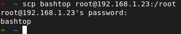
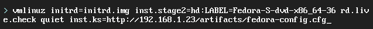
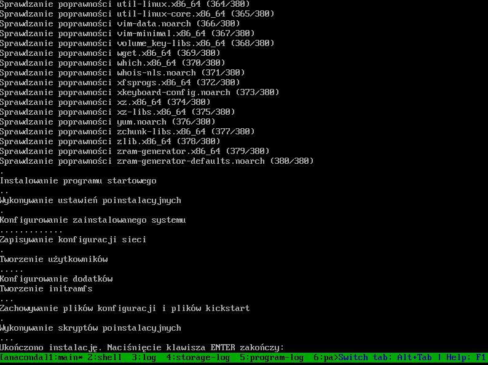
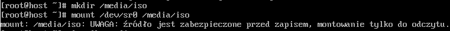

# Lab 09 - Paweł Waresiak

### Instalacja fedory

### Przygotowywanie serwera http (apache)
Po instalacji konfiguruję uprawnienia do folderu

Url kierujące do folderu

Wyłączenie SELinux'a, aby nie dostawać 403

### Przesyłanie programu na serwer

Następnie przeniosłem go do folderu hostowanego czyli /var/artifacts

### Instalacja drugiego serwera i pobranie aplikacji z serwera
Instalacja wget

Pobranie pliku z serwera

Nadanie uprawień do wykonywania

Sprawdzenie czy aplikacja działa

### Instalacja z plikiem odpowiedzi hostowanym na serwerze http

Instalacja przebiegła pomyślnie

### Zmodyfikowanie ISO o plik odpowiedzi
Zamontowanie ISO

Skopiowanie do folderu roboczego w celu uzyskania uprawnień do modyfikacji

Zmiana isolinux.cfg

Wypalenie ISO

Ostatecznie, po zgraniu ISO z maszyny na hosta i uruchomieniu nowej maszyny z nowym ISO, system został pomyślnie zainstalowany c:
