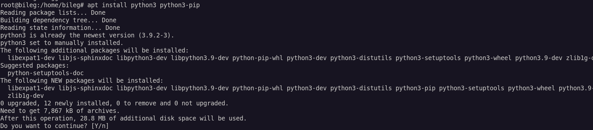
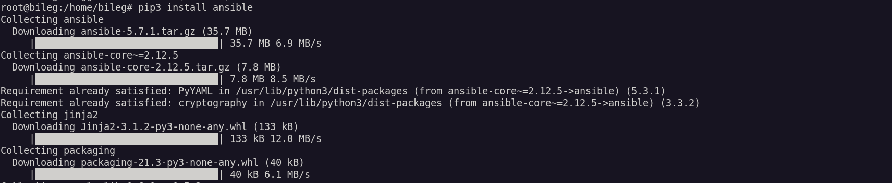
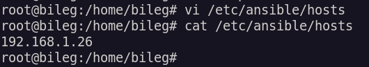
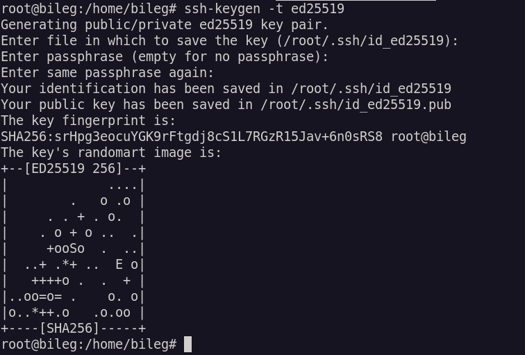
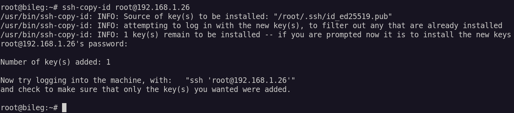
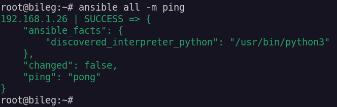
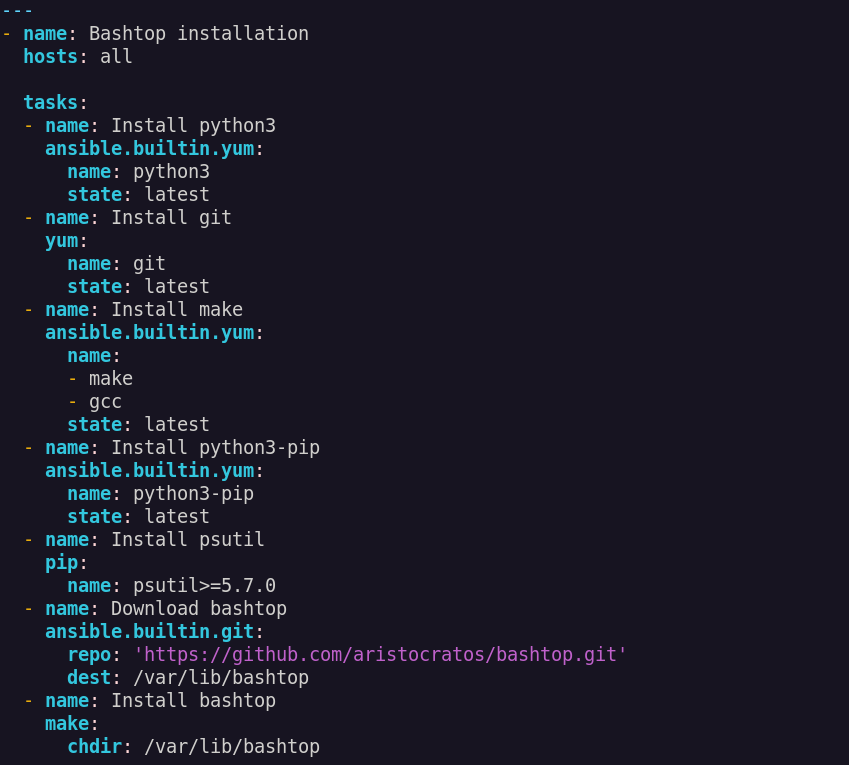
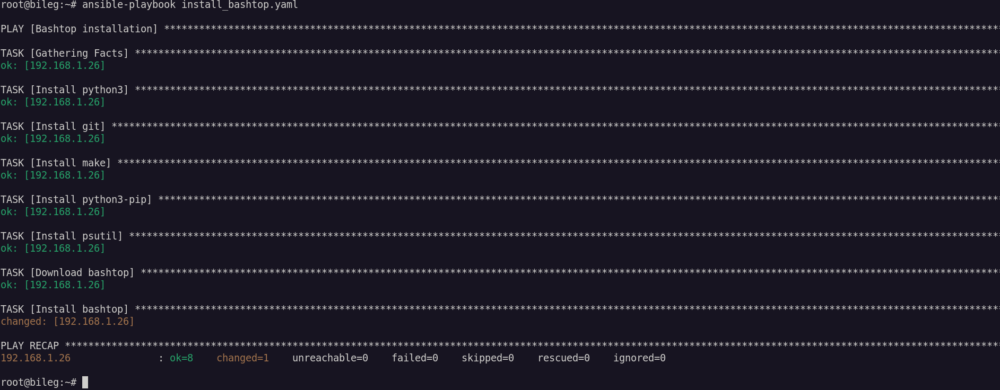
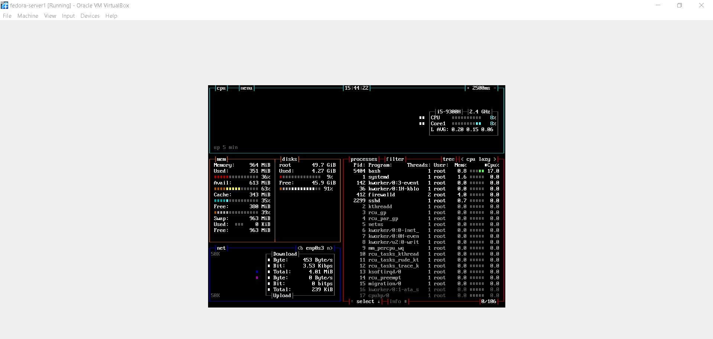

# Lab 10 - Paweł Waresiak

### Instalacja ansible

### Utworzenie pliku inwentaryzacji 
  
    

### Utworzenie i skopiowanie klucza ssh na serwer
  
  

### Sprawdzenie połączenia i działania ansible    
  

### Utworzenie playbooka instalującego program bashtop

### Odpalenie playbooka
 
  
### Sprawdzenie czy program działa na serwerze
  
