# Lab 11 - Paweł Waresiak

## Wstęp - Instalacja klastra Kubernetes
Aplikację będę uruchamiał na realnym klastrze, nie przy pomocy minikube.
Jako że wszystko mam już zainstalowane pokażę wersje narzędzi.

Zainstalowany kubectl

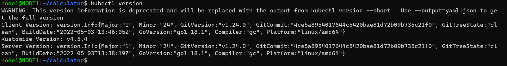

Mój klaster składa się z dwóch node'ów, jednego mastera i jednego workera

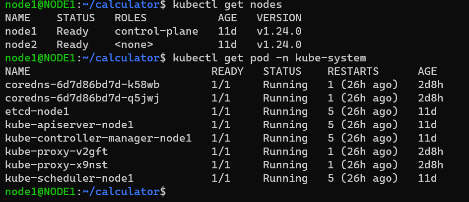

Jako że kluster był stawiany przy pomocy kubeadm'a, nie mam dostępu do dashboard'u

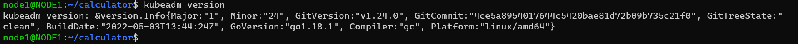

## Analiza posiadanego kontenera
Moja oryginalna aplikacja (bashtop) to była zwykła aplikacja konsolowa nie wyprowadzająca żadnych portów.\
W celu realizacji zadania użyłem aplikacji [Calculator](https://github.com/actionsdemos/calculator).

Dockerfile obrazu aplikacji

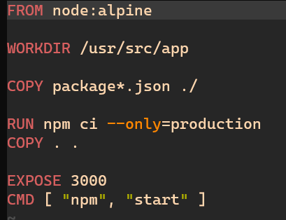

Odpalona aplikacja w kontenerze

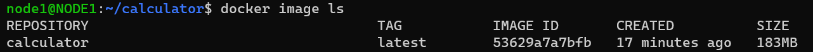
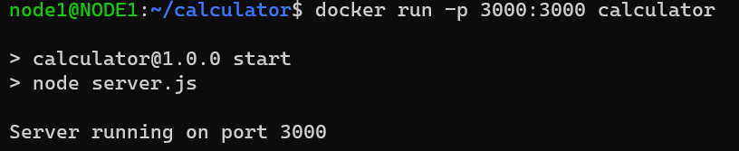

## Uruchamianie oprogramowania
Utworzenie pliku definicji poda dla aplikacji

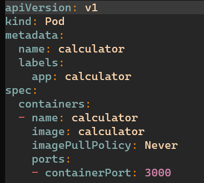

Utworzenie poda

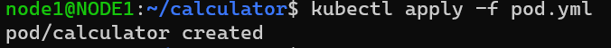
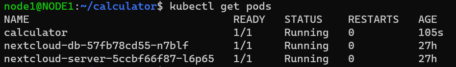

### Wyeksponowanie poda na "zewnątrz"

Utworzenie service'u

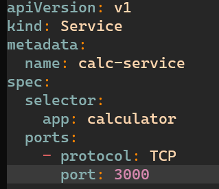

Utworzenie ingresu

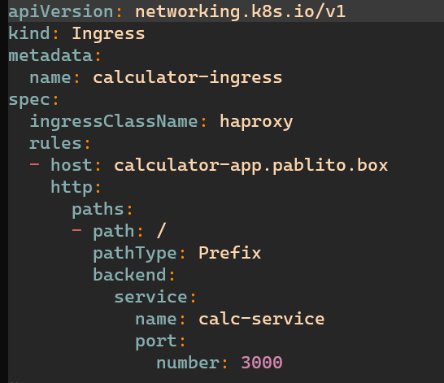

Utworzenie statycznej domeny dla aplikacji w routerze

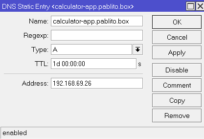

Pokazanie że aplikacja działa

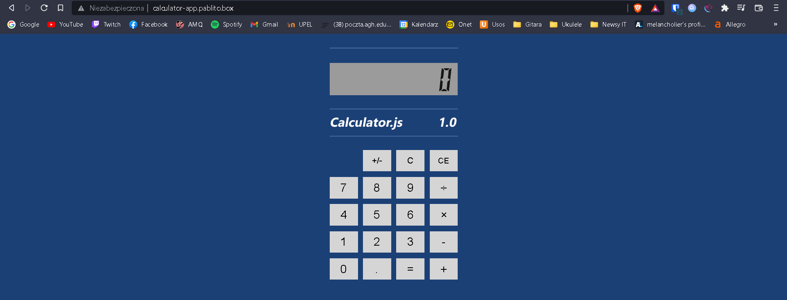

## Przekucie wdrożenia manualnego w plik wdrożenia (wprowadzenie)
Utworzenie deployment'u z wcześniej utworzonego poda

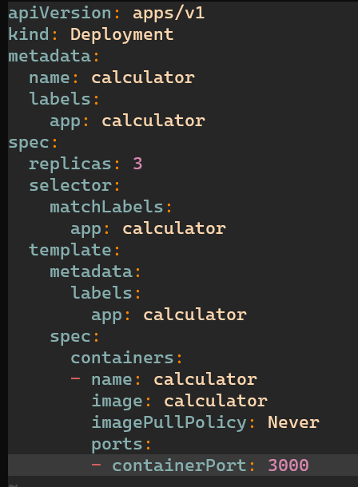

Sprawdzenie czy deployment działa

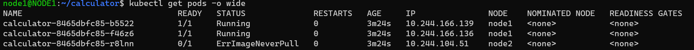

Deployment działa i nadal można się do aplikacji dostać z przeglądarki.\
Jedna z replik wstała z błędem ponieważ nie mam obrazu aplikacji na nodzie nr 2, ale to chyba nie problem :)

