# Lab 11 - Paweł Waresiak

## Konwersja wdrożenia ręcznego na wdrożenie deklaratywne YAML

Zdefiniowanie 4 replik w deploymencie oraz ustawienie node affinity na node nr 1 (tam mam obraz)
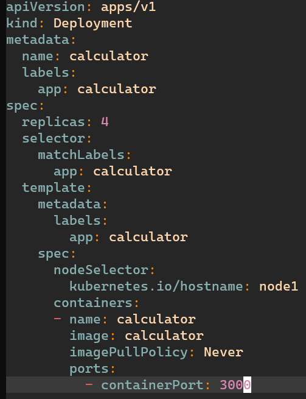

Sprawdzenie statusu deploymentu oraz podów
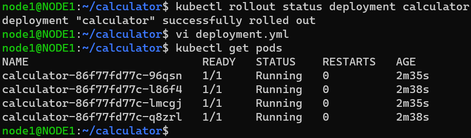

## Nowe wersje obrazu
Nowa wersja, dodałem tylko zmienną env w Dockerfile
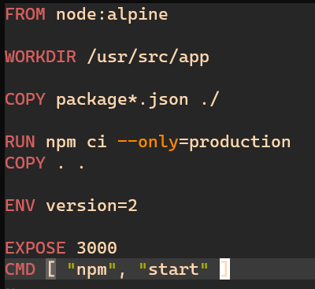

Wersja wadliwa, zwraca 1 zaraz po odpaleniu
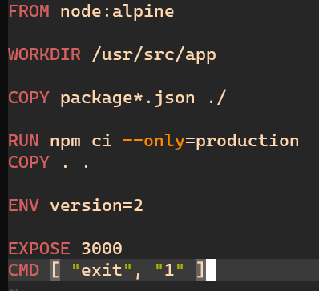

Sprawdzenie czy obrazy się utworzyły
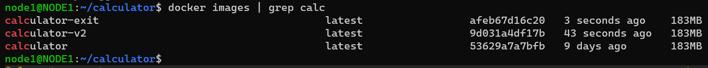

## Zmiany w deploymencie
1. Zwiększenie replik

2. Zmniejszenie replik do 1
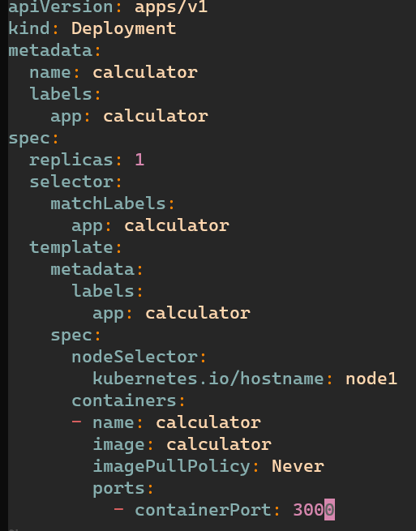
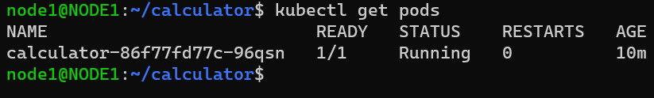

3. Zmniejszenie replik to 0
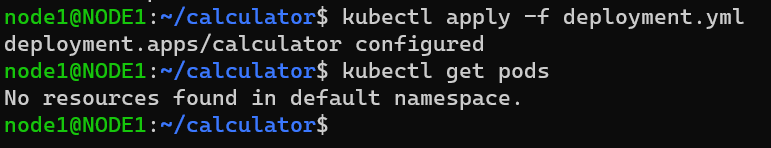

4. Zastosowanie nowej wersji obrazu
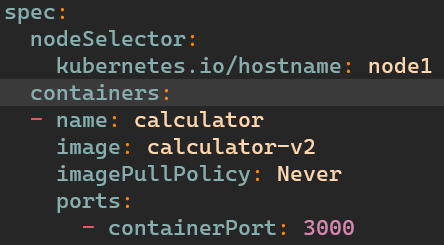
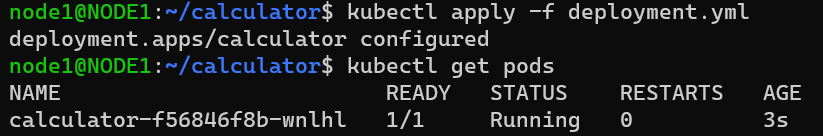
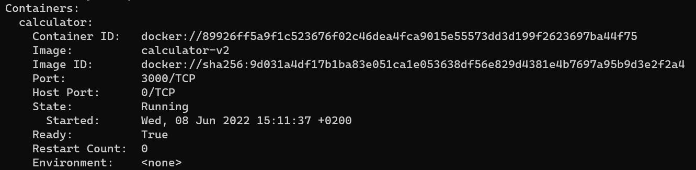

5. Zastosowanie starszej wersji obrazu (tutaj użyłem tej wadliwej)

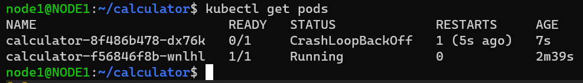

6. Przywracanie wersji
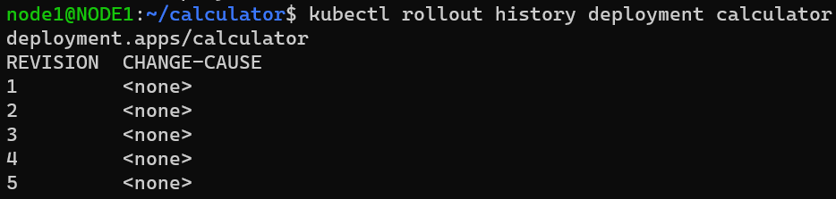
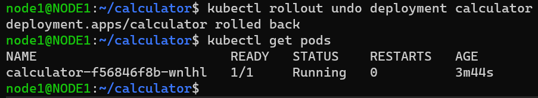

## Kontrola wdrożenia
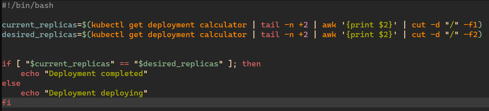
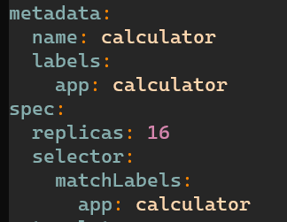
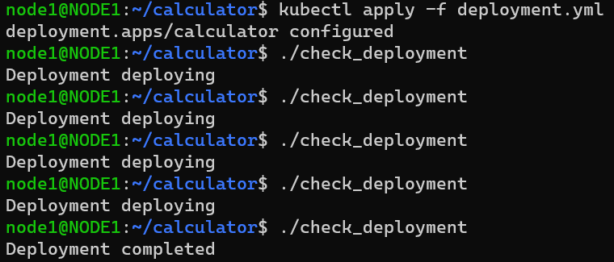

## Strategie wdrożenia
Recreate

Rolling update
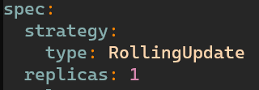

### Różnice
Recreate -> Wszystkie pody są usuwane jednocześnie oraz jednocześnie wstają
Rolling update -> Pody są usuwane pojedynczo lub w zdeklarowanych grupach, przez co użytkownik ma cały czas dostęp do usług
Canary deployment -> Tworzony jest nowy deployment z podami o zmienionych labelach. Gdy deployment się powiedzie, wtedy zmieniany jest tylko label selector w serwisie i w ten sposób traffic jest routowany na nowe pody praktycznie bez żadnego downtime'u.

