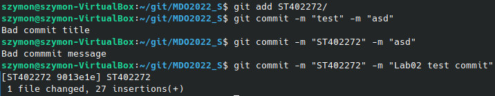
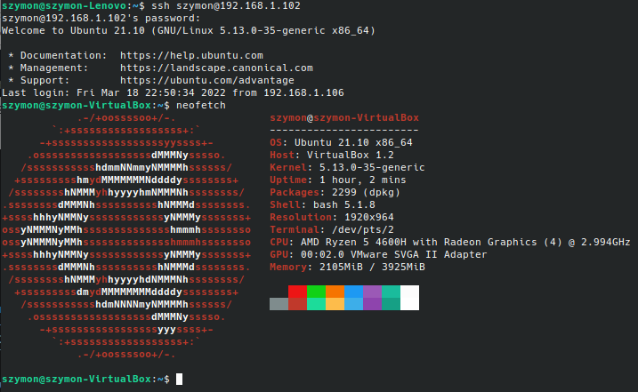
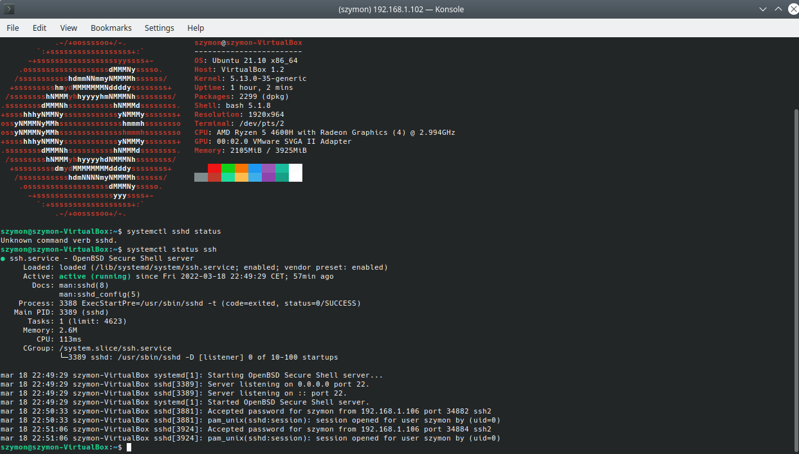
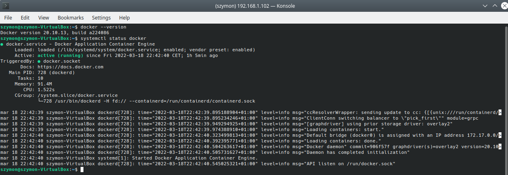
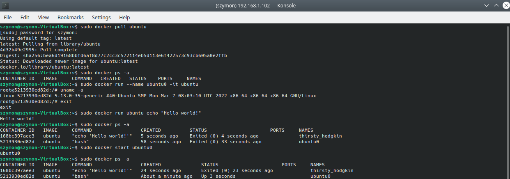
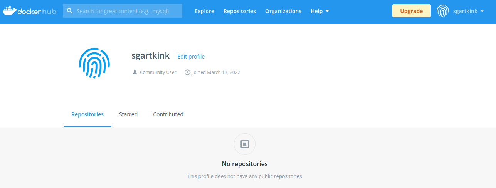

# Szymon Twardosz - Lab 02 DevOps

## Git hook odpowiedzialny za sprawdzenie poprawnosci tytulu i tresci commita. Uzyto do tego hooka "commit-msg"

```
#!/bin/bash

title=`head -n1 $1`
title_pattern="ST402272"

message=`tail -n1 $1`
message_pattern="(02)"

if ! [[ "$title" = $title_pattern ]]; then
    echo "Bad commit title"
    exit 1
fi

if ! [[ "$message" =~ $message_pattern ]]; then
    echo "Bad commmit message"
    exit 1
fi

```

### Sprawdzenie czy git hook dziala




## Zdalny dostep do maszyny wirtualnej (polaczenie sie z Linuxa za pomoca SSH)



## Uruchomiony server SSH (byl juz wczesniej zainstalowany)



## Wykazanie, ze Docker jest zainstalowany i dziala



## Uruchomienie kilku komend w dockerze:
1. pobranie obrazu Ubuntu
2. wyswietlenie wszystkich kontenerow dostepnych lokalnie
3. utworzenie kontenera o nazwie "ubuntu0" i wyswietlenie wersji kernela
4. wyjscie z kernela i ponowne wyswietlenie wszystkich kontenerow
5. uruchomienie Ubuntu z poleceniem `echo "Hello world!"`
6. widac wykonanie komendy
7. ponowne wykonanie punktu 2
8. wystartowanie kontenera o nazwie "ubuntu0" i sprawdzenie czy dziala



## Utworzenie konta na Docker Hub


