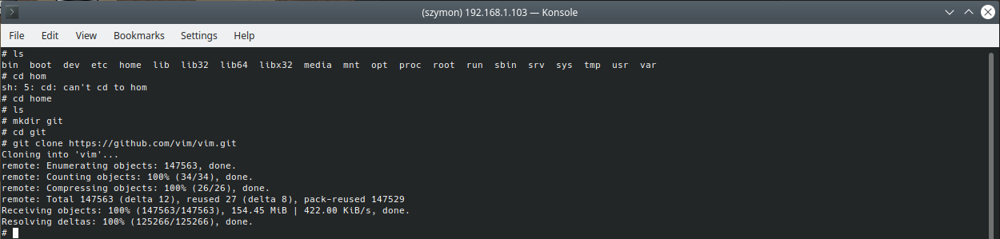
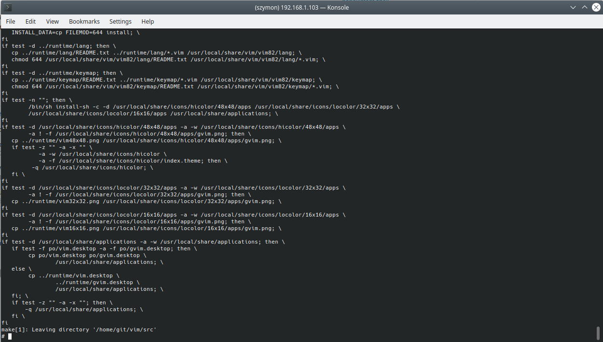
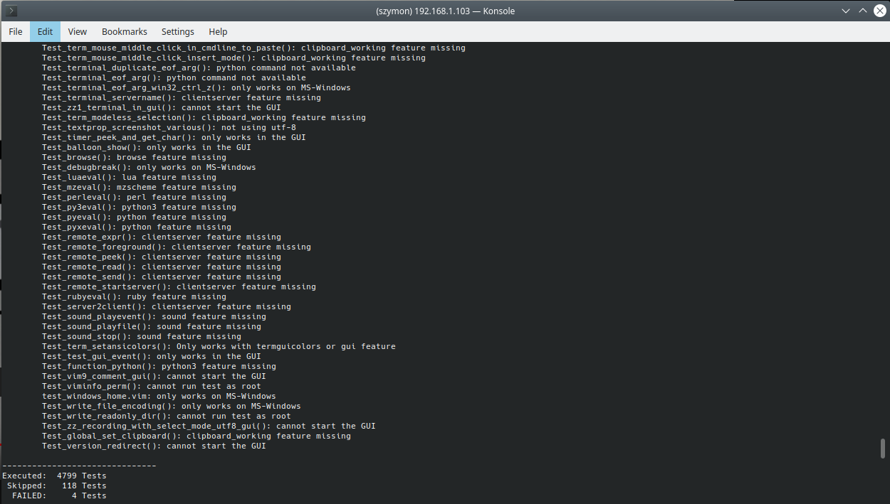
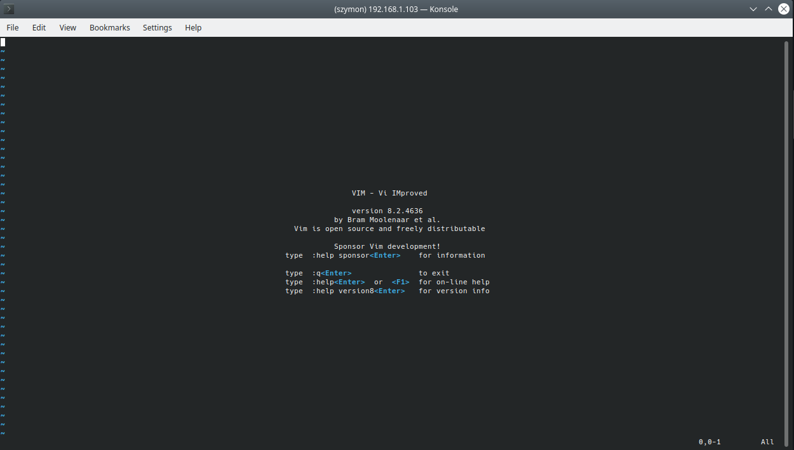
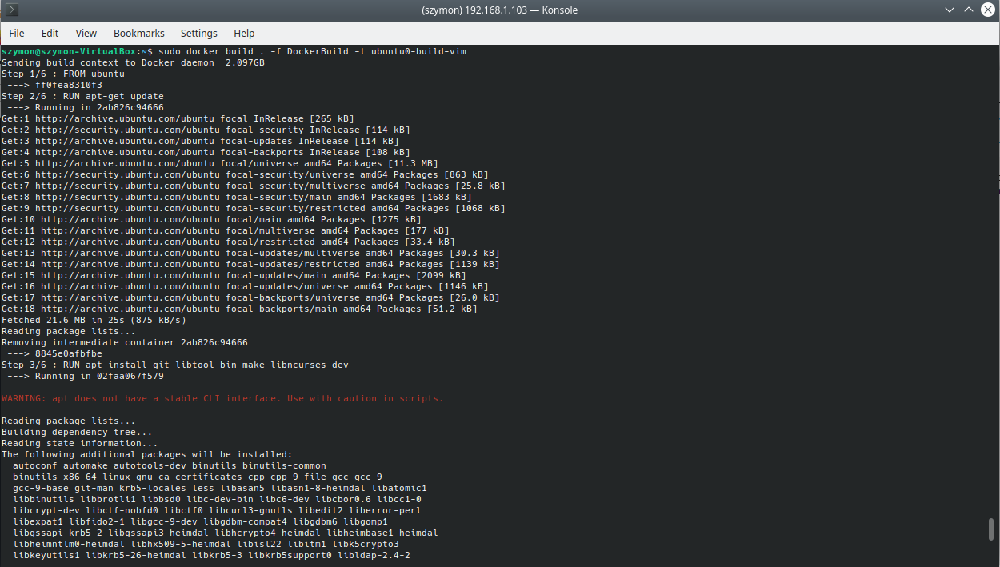
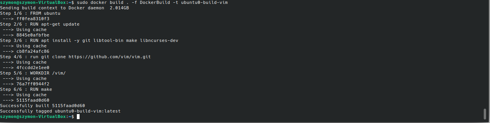
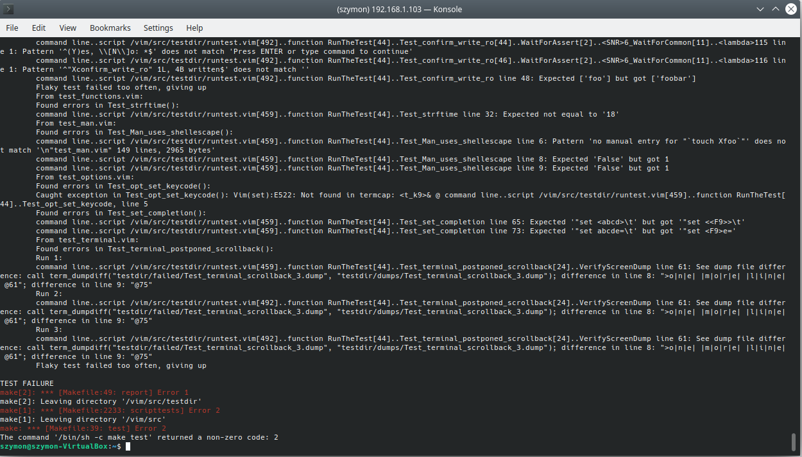
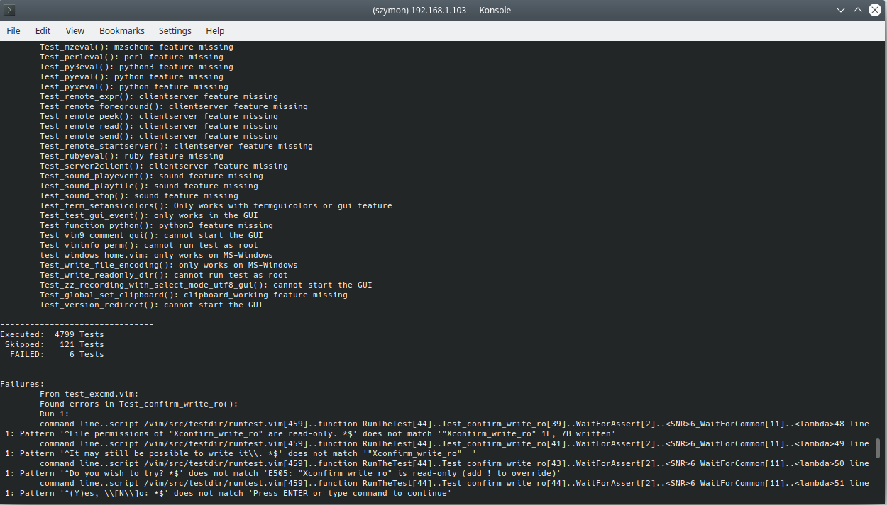
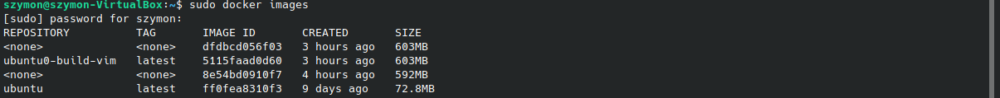

# Szymon Twardosz - Lab 03 DevOps

## Wybrane oprogramowanie

Wybor u mnie padl na VIMa. Program ten spelnia wszystkie wymagania i przy okazji jest znany, oraz uzywany, przez bardzo duza liczbe osob.

Wymagane pakiety do zainstalowania:
- git,
- libtool-bin (to jest potrzebne tylko do testow),
- make,
- libncurses-dev

### tutaj pokazane rozpoczacie klonowania repozytorium w kontenerze (korzystalem z Ubuntu)

Kontener uruchamiany byl za pomoca polecenia:
`sudo docker run -it --name ubuntu0 ubuntu`

Atrybut `-it` pozwala na uruchomienie interaktywnego terminala



### udalo sie pobrac to teraz budujemy

Wystarczy sama komenda `make`. Proces zakonczyl sie poprawnie.



### uruchomienie testow

Jedyne testy, ktore nie przeszly to te odpowiedzialne za dzialanie GUI. Korzystalem tylko z terminala, wiec nie mogly one przejsc pozytywnie.



### VIM dziala



## Teraz czas na zautomazywanie tego procesu za pomoca Dockerfile

Pierwszy Dockerfile, ktory automatycznie:
- instaluje potrzebne pakiety,
- klonuje repozytorium,
- uruchamia proces budowania i czeka na jego wynik koncowy, o czym informuje

Pelna tresc Dockerfile'a:

```
FROM ubuntu
RUN apt-get update
RUN apt install -y git libtool-bin make libncurses-dev
run git clone https://github.com/vim/vim.git
WORKDIR /vim/
RUN make
```

### Efekt dzialania pierwszego Dockerfile'a

Korzystam tutaj z komendy `sudo docker build . -f DockerBuild -t ubuntu0-build-vim`, aby go uruchomic. Argument `-f` pozwala na wskazanie nazwy Dockerfile'a, a `-t` okresla nazwe obrazu.



### A tutaj widoczny caly efekt dzialania Dockerfile'a

Repozytorium bylo juz sklonowane, wiec ten proces zostal pominiety.



## Dockerfile automatyzujacy uruchomienie testow

Drugi Dockerfile, ktory automatycznie:
- wybiera najnowszy obraz stworzonego wczesniej systemu,
- przechodzi do odpowiedniego katalogu,
- uruchamia testy

Pelna tresc Dockerfile'a:

```
FROM ubuntu0-build-vim:latest
WORKDIR /vim/
RUN make test
```

### Efekt dzialania

Korzystam tutaj z komendy `sudo docker build . -f DockerRunTests -t ubuntu0-vim-tests`, aby go uruchomic.



Tutaj rowniez nie przechodza testy odpowiedzialne za GUI (czyli tak samo jak w poprzednim przypadku). Mimo wszystko, mozemy uznac, ze testy zakonczyly sie powodzeniem.

Tutaj szczegoly dotyczace testow



## Efekt stworzenia nowego obrazu widac tutaj




