# Szymon Twardosz - Lab 04 DevOps

## Zachowywanie stanu

### Utworzenie 2 wolumenów o nazwach: *firstVolume* i *secondVolume*

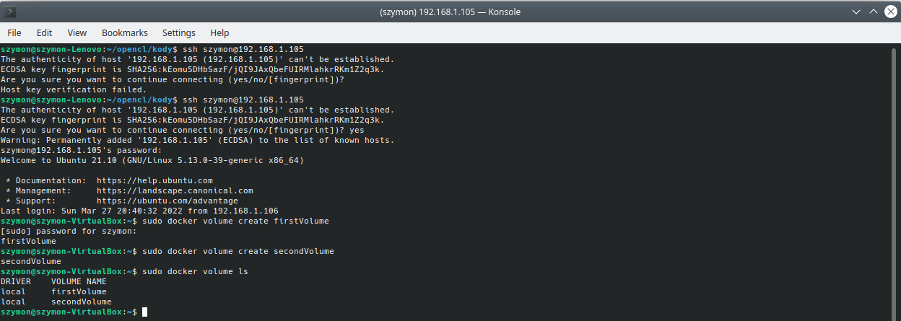

### Utworzenie kontenera na podstawie obrazu *ubuntu* i podpięcie do niego utworzonych wcześniej wolumenów

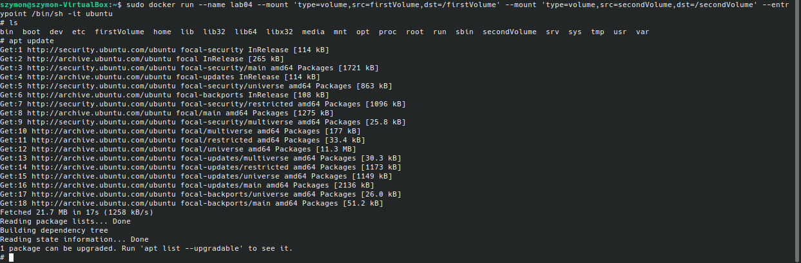

### Sklonowanie repozytorium vima do wolumenu pierwszego

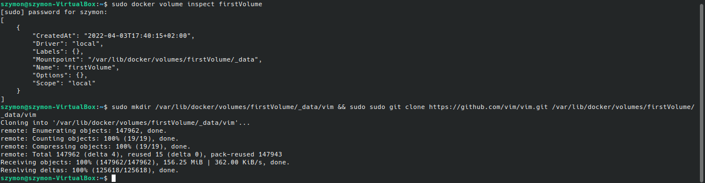

### Wykazanie, że w systemie plików znajduje się sklonowane repozytorium

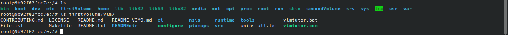

### Skopiowanie repozytorium z wolumenu pierwszego do drugiego i zbudowanie go za pomocą polecenia **make**

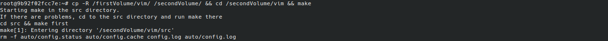

### Sprawdzenie czy pliki faktycznie się znajdują w wolumenie z poziomu hosta

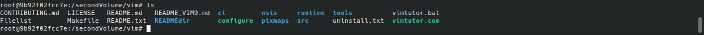

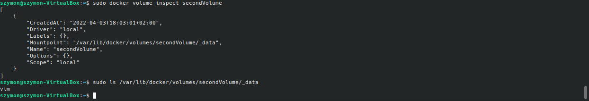

## Eksponowanie portu

### Uruchomienie kontenera na podstawie obrazu *ubuntu*

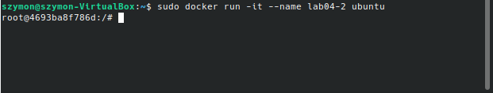

### Instalacja pakietu *iperf3* na kontenerze oraz instalacja *net-tools*

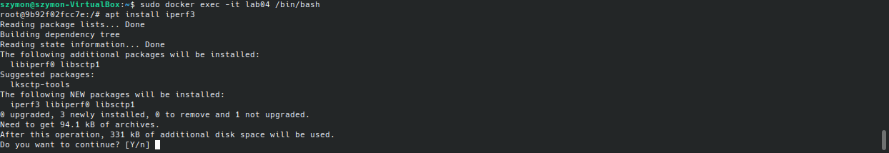

### Uruchomienie nasłuchiwania na porcie **2000**, utworzenie drugiego kontenera, zainstalowanie na nim również pakietu *iperf3* i sprawdzenie prękości transferu pomiędzy oboma serwerami

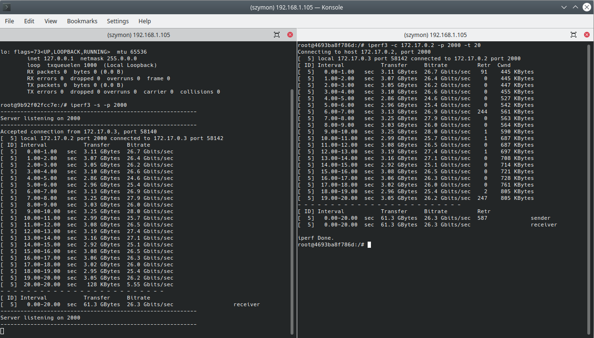

### Sprawdzenie prękości transferu pomiędzy hostem, a konterenem

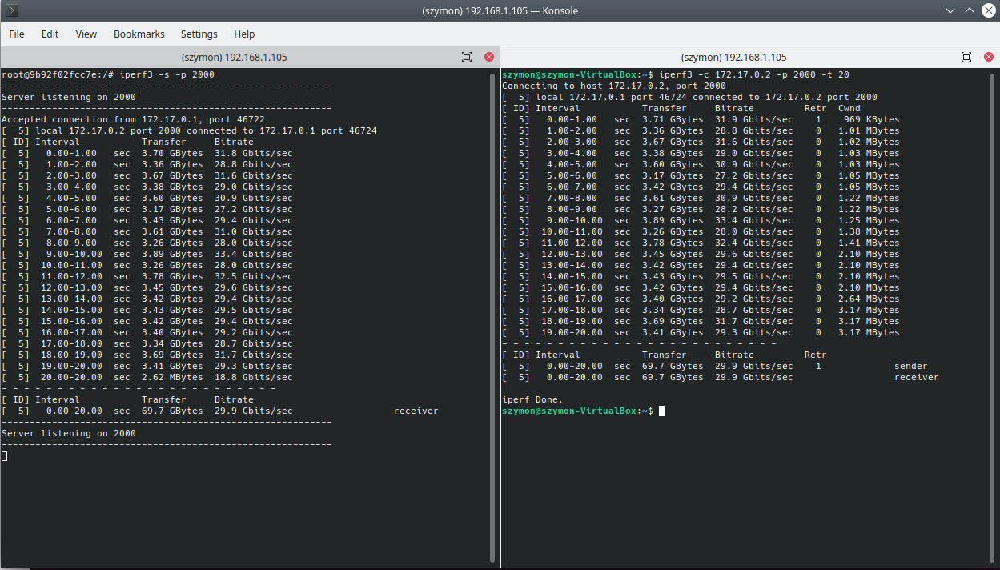

### Sprawdzenie prękości transferu pomiędzy hostem, a wirtualną maszyną

Sprawdzenie adresu ip

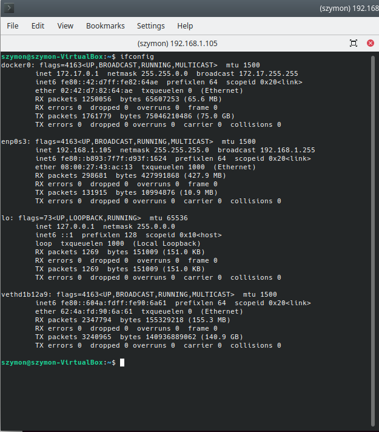

Próba połączenia - odrzucone

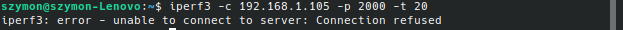

Rozwiązanie problemu odrzucenia połączenia oraz sprawdzenie nasłuchiwanych portów przez maszynę wirtualną

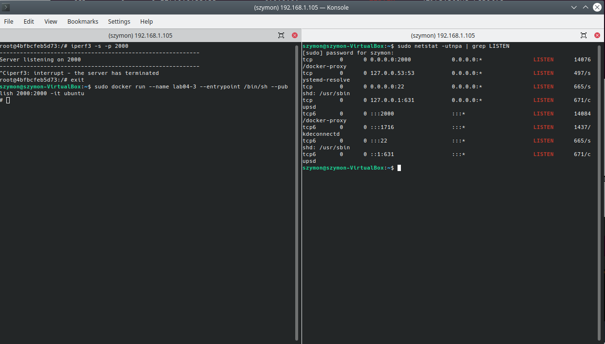

Uzyskane prędkości w tym połączeniu

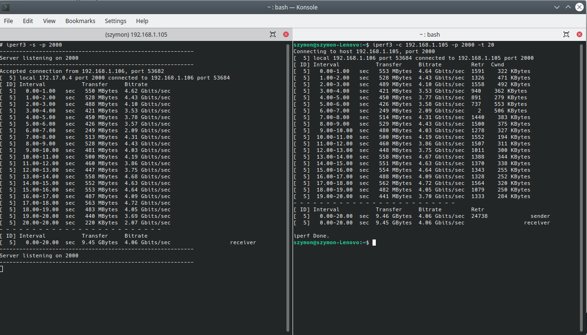

### Zestawienie wszystkich prędkości ze sobą

|              | kontener - kontener | host - kontener     | host - maszyna wirtualna |
|--------------|---------------------|---------------------|--------------------------|
| Interval [s] | Bitrate [Gbits/sec] | Bitrate [Gbits/sec] | Bitrate [Gbits/sec]      |
| 0-1          | 26.7                | 31.8                | 4.62                     |
| 1-2          | 26.4                | 28.8                | 4.43                     |
| 2-3          | 26.2                | 31.6                | 4.10                     |
| 3-4          | 26.6                | 29.0                | 3.53                     |
| 4-5          | 24.6                | 30.9                | 3.78                     |
| 5-6          | 25.4                | 27.2                | 3.57                     |
| 6-7          | 26.9                | 29.4                | 2.09                     |
| 7-8          | 27.9                | 31.0                | 4.31                     |
| 8-9          | 26.0                | 28.0                | 4.43                     |
| 9-10         | 28.0                | 33.4                | 4.03                     |
| 10-11        | 25.7                | 28.0                | 4.19                     |
| 11-12        | 26.5                | 32.5                | 3.86                     |
| 12-13        | 27.4                | 29.6                | 3.75                     |
| 13-14        | 27.1                | 29.4                | 4.68                     |
| 14-15        | 25.1                | 29.5                | 4.63                     |
| 15-16        | 26.5                | 29.4                | 4.64                     |
| 16-17        | 26.3                | 29.2                | 4.09                     |
| 17-18        | 26.0                | 28.7                | 4.72                     |
| 18-19        | 25.4                | 31.7                | 4.05                     |
| 19-20        | 26.2                | 29.3                | 3.69                     |
| Srednia      | 26.3                | 29.9                | 4.06                     |

### Wnioski:

Najszybsze połączenie to host z kontenerem. Wynika to z braku pośredników. Następne jest połączenie kontener - kontener (tutaj pośrednikiem jest tylko host, czyli system operacyjny. Najwolniejsze połączenie natomiast to host - maszyna wirtualna z powodu najdłuższej trasy jaką muszą przebyć pakiety.

## Instalacja Jenkinsa

### Utworzenie sieci mostkowanej w Dockerze

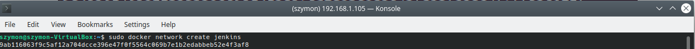

### Pobranie i uruchomienie obrazu docker:dind

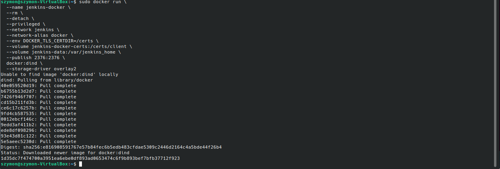

### Utworzenie pliku Dockerfile:

```
FROM jenkins/jenkins:2.332.1-jdk11
USER root
RUN apt-get update && apt-get install -y lsb-release
RUN curl -fsSLo /usr/share/keyrings/docker-archive-keyring.asc \
  https://download.docker.com/linux/debian/gpg
RUN echo "deb [arch=$(dpkg --print-architecture) \
  signed-by=/usr/share/keyrings/docker-archive-keyring.asc] \
  https://download.docker.com/linux/debian \
  $(lsb_release -cs) stable" > /etc/apt/sources.list.d/docker.list
RUN apt-get update && apt-get install -y docker-ce-cli
USER jenkins
RUN jenkins-plugin-cli --plugins "blueocean:1.25.3 docker-workflow:1.28"
```

### Utworzenie obrazu na podstawie Dockerfile

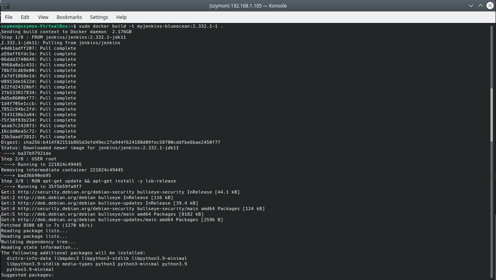

### Uruchomienie kontenera na podstawie utworzonego obrazu

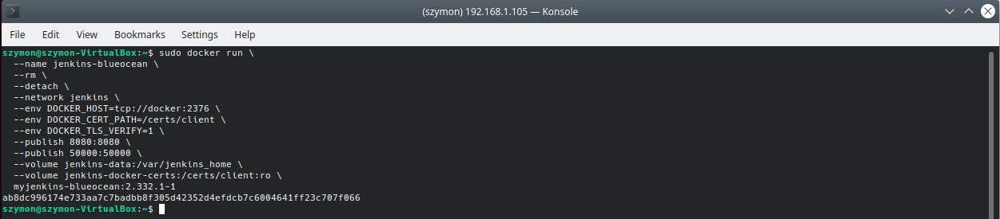

### Sprawdzenie uruchomionych kontenerów, wyświetlenie logów kontenera jenkins i skopiowanie hasła z nich (nie zmieściło się na screenie, jest na samym dole logów)

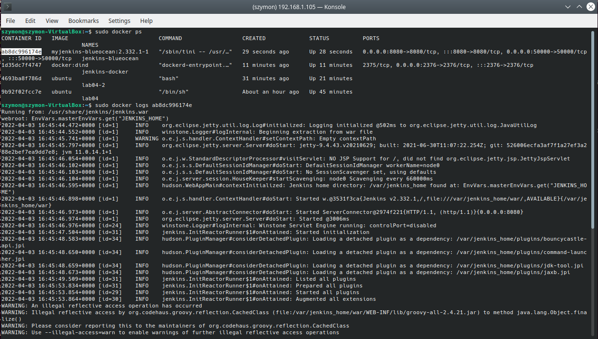

### Wyświetlenie ekranu logowania


