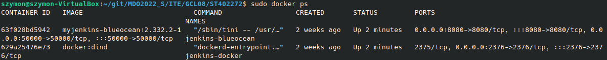
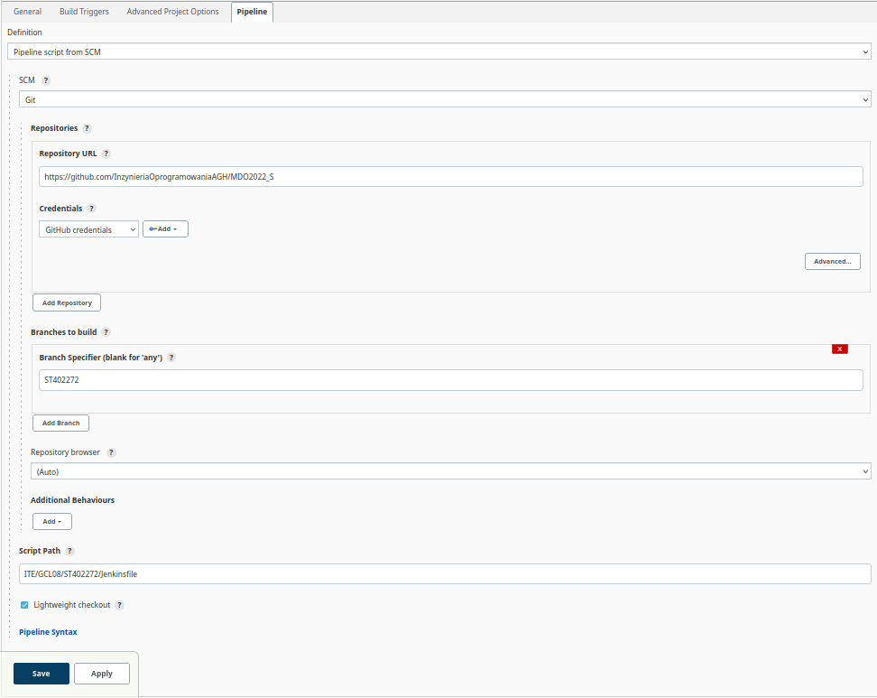
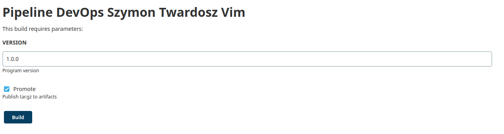
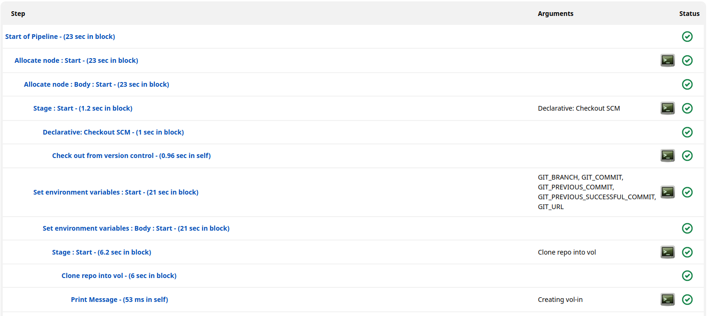
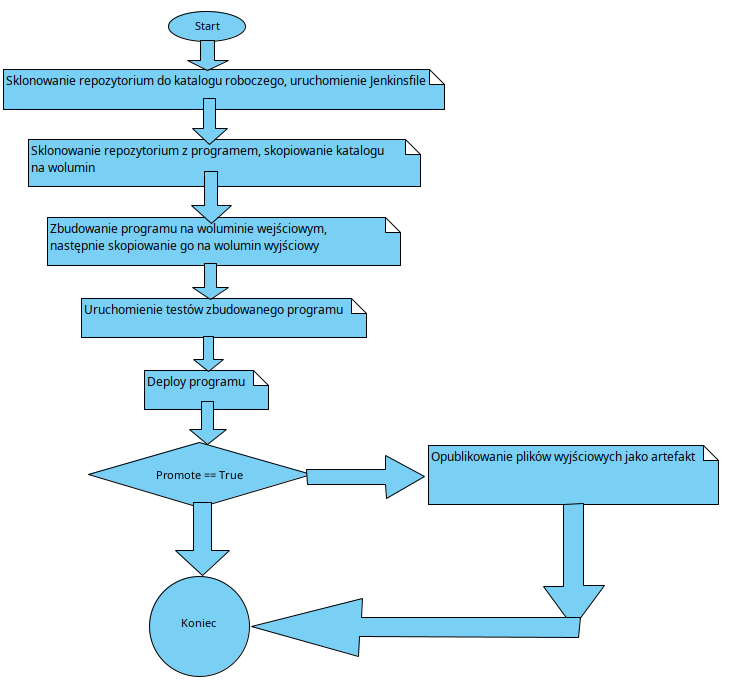

# Szymon Twardosz - Lab 05 DevOps

## Streszczenie projektu

Cel laboratoriów: Przygotowanie Pipeline'u przeprowadzającego build, test, deploy i publish programu używanego we wcześniejszych laboratoriach (Vim) za pomocą Jenkinsa, Dockera i gita.

Link do repozytorium Vima na gicie: https://github.com/vim/vim

Użyty obraz bazowy: Ubuntu

Do wykonania laboratorium niezbędne są skonfigurowane kontenery Jenkins i DIND. Instalacja została dokonana podczas wcześniejszych laboratoriów.

Działające kontenery Jenkins i DIND:

## Budowa Pipeline'u

Pierwszym krokiem jest utworzenie nowego pipeline'u, który zostanie pobrany z repozytorium Git (należy określić adres, lokalizację, nazwę pliku i branch). Oczywiście trzeba dodać możliwość zalogowania się na konto Github z poziomu Jenkinsa.

## Poszczególne etapy w Jenkinsfile

> **Stage: Clone**

Celem etapu Clone jest sklonowanie repozytorium programu vim z platformy github, oraz umieszczenie go na woluminie wejściowym vol-in.

Krok ten jest wykonany przy użyciu kontenera pomocniczego z racji braku bezpośredniego dostępu do folderu gdzie Docker przechowuje dane w woluminie. Jeśli kontener o użytej przeze mnie nazwie już istnieje to najpierw go usuwam. Następnie tworzę kontener na woluminie wejściowym, sprawdzam czy katalog z programem jest dostępny (za pomocą polecenia `ls`), a jeśli nie to klonuję repo. Po sklonowaniu jest ono kopiowane na wolumin wejściowy, a kontener usuwany. Do wykonania tego kroku użyto obraz Ubuntu z zainstalowanymi pakietami: git libtool-bin make libncurses-dev. Komenda `RUN apt-get upgrade` w Dockerfile'u była konieczna ponieważ występował jakiś dziwny problem przy pobieraniu pakietów i to polecenie go rozwiązało.

> **Stage: Build**

Celem etapu Build jest zbudowanie programu za pomocą programu make na woluminie wejściowym vol-in, a następnie skopiowanie zbudowanego programu na wolumin wyjściowy vol-out. W tym celu utworzono wolumin wyjściowy vol-out, oraz uruchomiono kontener z utworzonego wcześniej obrazu na podstawie Dockerfile (który znajduje się w tym samym katalogu co Jenkinsfile). Dockerfile korzysta z obrazu Ubuntu, ponieważ jest to najczęściej używana dystrybucja debianopochodna i bez problemu można w niej zbudować pliki napisane w języku C (tak jak Vim). Po udanym zbudowaniu, kopiujemy build na wolumin wyjściowy vol-out.

> **Stage: Test**

Celem etapu Test jest przetestowanie programu za pomocą programu `make` (z argumentem `test`) na woluminie wejściowym vol-in. Uruchomiono kontener na podstawie pliku DockerRunTests (nie jest używany ten sam co w w etapie budowania ponieważ testy potrzebują jednego pakietu więcej `libtool-bin`. Stąd użycie dwóch różnych Dockerfile'ów). Uruchomiono polecenie `make test` (które nie musi zwrócić prawdy, ponieważ w testach sprawdzane jest również GUI, które w wersji konsolowej wyrzuci błąd, stąd ten warunek).

> **Stage: Deploy**

Celem etapu Deploy jest uruchomienie pliku wykonywalnego na woluminie wyjściowym vol-out. Uruchomienie kontenera z wcześniej utworzonego obrazu, podpięcie woluminu wyjściowego, na którym jest plik wykonywalny i uruchomienie go. Po uruchomieniu kontenera następuje odczekanie 5 sekund (czas, który powinien wystarczyć w zupełności), a następnie sprawdzenie kodu błędu zwróconego przez kontener (jeśli różny od 0 to wystąpił błąd). Na końcu kontener jest usuwany (ponieważ może nadal działać jeśli nie wystąpił błąd).

> **Stage: publish**

Celem etapu Publish jest spakowanie zbudowanego programu do archiwum i zarchiwizowanie artefaktu. W tym etapie następuje utworzenie katalogu, w którym będą przechowywane artrfakty. Następnie tworzony jest kontener na woluminie wyjściowym vol-out. Generowane jest archiwum (z odpowiednim rozszerzeniem) zawierające plik wykonywalny, które w nazwie zawiera podaną wersję (jako jeden z parametrów). Artefakt jest wrzucany na serwer tylko w przypadku gdy parametr Promote jest równy True.

> **Post**

Wyświetlenie komunikatu o powodzeniu, lub niepowodzeniu pipeline'a.

## Uruchomienie Pipeline'a

## Działanie Pipeline'a

## Logi z Pipeline'a są w pliku logs.txt

## Diagram aktywności

