# Szymon Twardosz - Lab 09 DevOps

## Przygotowanie systemu pod uruchomienie

Najpierw pobrałem obraz Fedory w wersji 36 netinstall i zainstalowałem ją z następującymi parametrami:

- użytkownik

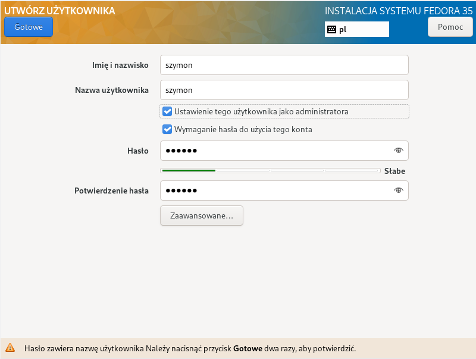

- minimalna instalacja

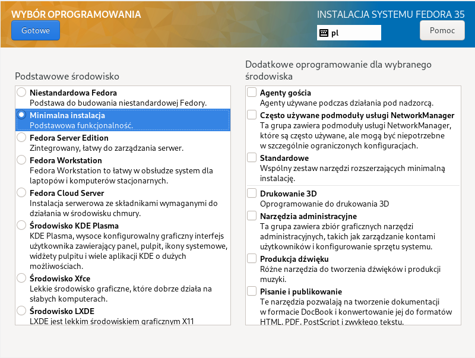

- ustawienia sieciowe

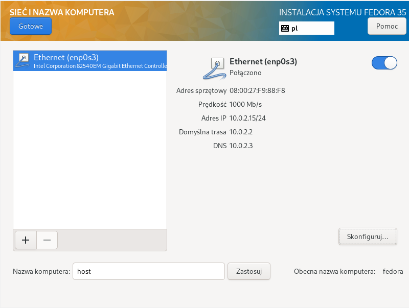

- ręczne partycjonowanie

- przesłanie pliku `anaconda-ks.cfg` za pomocą scp.

## Instalacja i konfiguracja serwera

- instalacja serwera http (`dnf install httpd`)

- dodanie portu 80 (`firewall-cmd --add-port=80/tcp`)

- konfiguracja pliku `/etc/httpd/conf/httpd.conf`

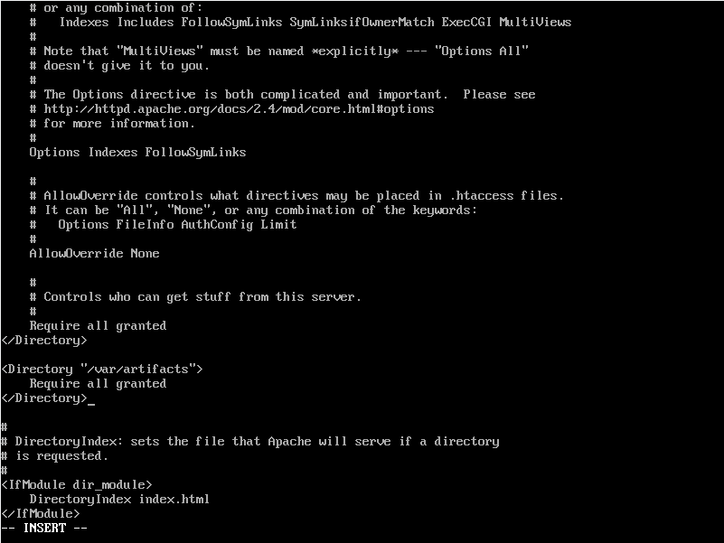

- wyłączenie SELinuxa

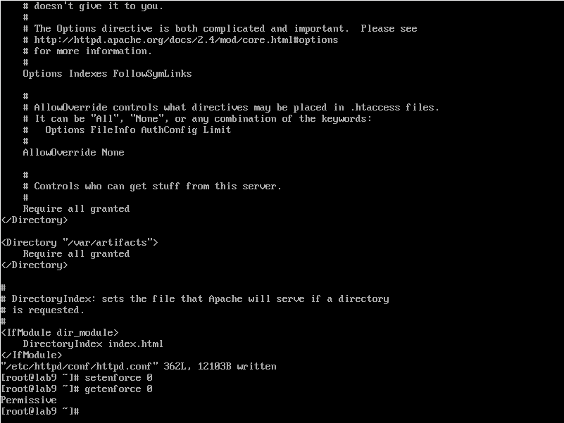

- uruchomienie serwera http (`systemctl start httpd`)

- przekopiowanie artefaktu na serwer

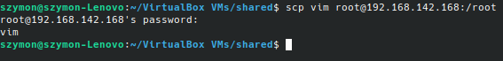

- skopiowanie artefaktu do katalogu `/var/artifacts`, który jest udostępiony w configu httpd

## Konfiguracja klienta

- instalacja pakietu wget

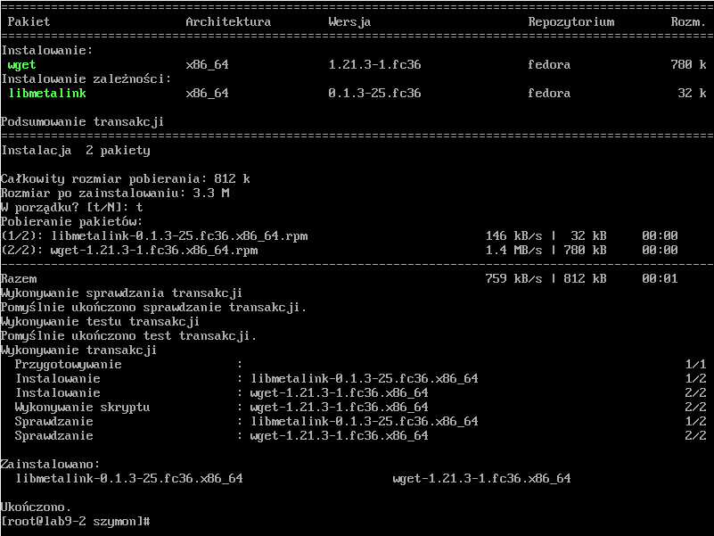

- pobranie artefaktu, używając wget, z serwera

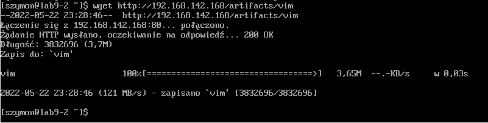

- sprawdzenie czy działa (uruchomienie)

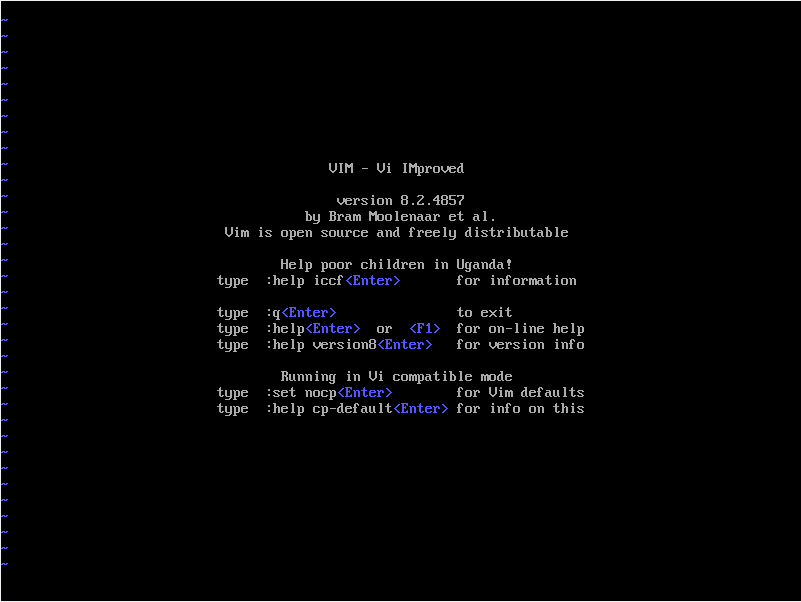

## Instalacja nienadzorowana

Dokonane zmiany w pliku `anaconda-ks.cfg`:

* zmiana trybu instalacji z graficznej na tekstową

* dodanie repozytoriów Fedory

* dodanie instalacji pakietu wget

* dodanie sekcji post, w której jest pobranie artefaktu z serwera

- komenda, którą należy użyć, aby podczas instalacji pobrać plik konfiguracyjny z serwera

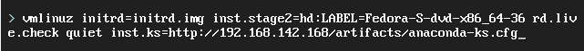

## Infrastructure as a code

- zamontowanie w napędzie optycznym obrazu Fedory (urządzenia -> napędy optyczne na górnym pasku)

- utworzenie katalogu `/media/iso` i zamontowanie w nim obrazu z napędu

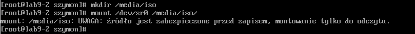

- utworzenie katalogu roboczego `/root/fedora_iso` i skopiowanie do niego obrazu z katalogu `/media/iso`

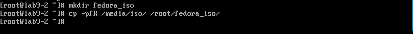

- skopiowanie pliku `anaconda-ks.cfg` do katalogu z obrazem i zmiana jego nazwy na `ks.cfg`

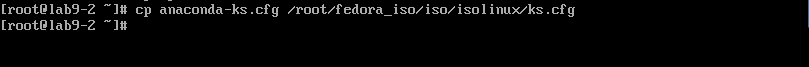

- modyfikacja pliku `isolinux.cfg`

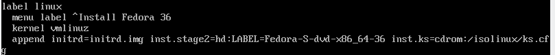

- zainstalowanie pakietu genisoimage

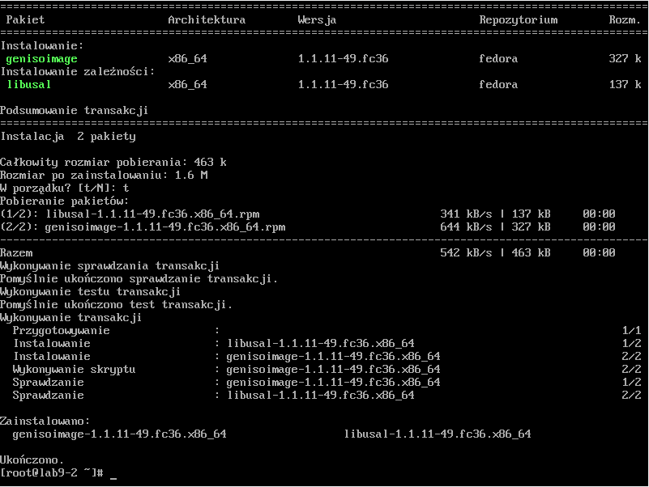

- utworzenie nowego obrazu ISO (na dole komenda, a nad nią efekt jej wywołania)

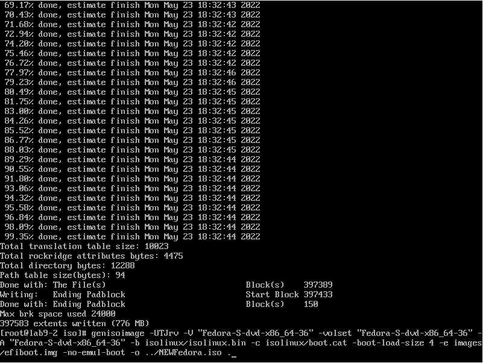

- pobranie utworzonego obrazu ISO, utworzenie maszyny wirtualnej i uruchomienie instalacji z poprzednio pobranego obrazu
