# Szymon Twardosz - Lab 11 DevOps

## Instalacja klastra Kubernetes

Instalacja stosu k8s (minikube oraz polecenie kubectl), potrzebny do tego jest program curl

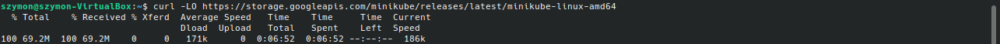

Instalacja minikube'a w katalogu `/usr/local/bin`

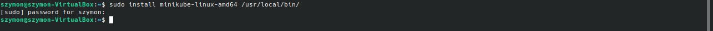

Pobranie pakietów instalacyjnych kubectl, sprawdzenie sumy kontrolnej (aby się upewnić czy na pewno dobry program jest zainstalowany), instalacja kubectl i sprawdzenie wersji

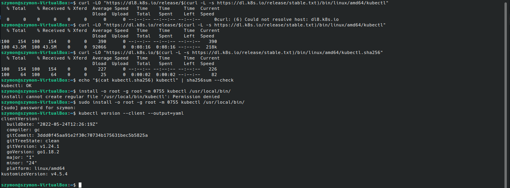

Instalacja stosu minikube i uruchomienie minikube żeby sprawdzić czy działa

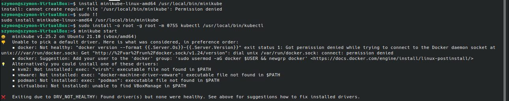

Próba się nie powiodła. Wykonanie zalecanej operacji (dodanie użytkownika do grupy docker) i ponowne uruchomienie minikube (tym razem skuteczne)

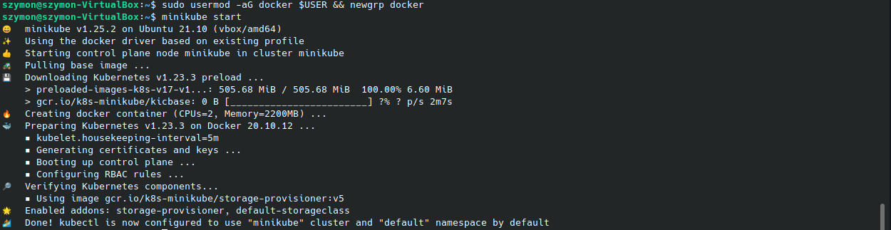

Wyświetlenie działających node'ów (w tym wypadku tylko jeden - master) i pod'ów

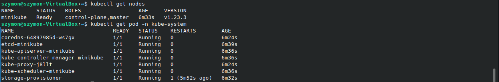

Uruchomienie dashbord'u

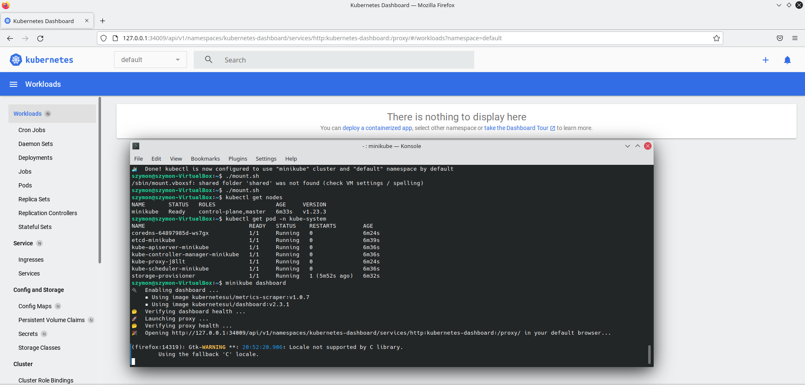

Wymagania minikube:

- 20 GB wolnego miejsca (jest to dość sporo jak dla maszyny wirtualnej)

- minimum 2 CPU

- minimum 2 GB pamięci ram

- połączenie z internetem

- środowisko konteneryzacji (Docker w naszym przypadku)

## Analiza posiadanego kontenera

Aby sprawdzić działanie kontenera użyłem aplikacji `the-example-app.nodejs`, która wyprowadza port (wcześniej używałem Vima, ale on nieestety nie korzysta z żadnego portu).

Najpierw musiałem utworzyć dla niej katalog i sklonować ją z gita

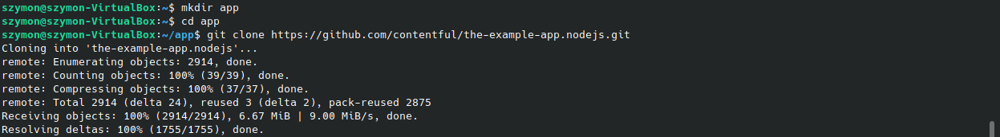

Aplikacja zawiera już w sobie gotowy Dockerfile

```
FROM node:latest

WORKDIR /app

RUN npm install -g contentful-cli

COPY package.json .
RUN npm install

COPY . .

USER node
EXPOSE 3000

CMD ["npm", "run", "start:dev"]
```

Build obrazu używając powyższego Dockerfile

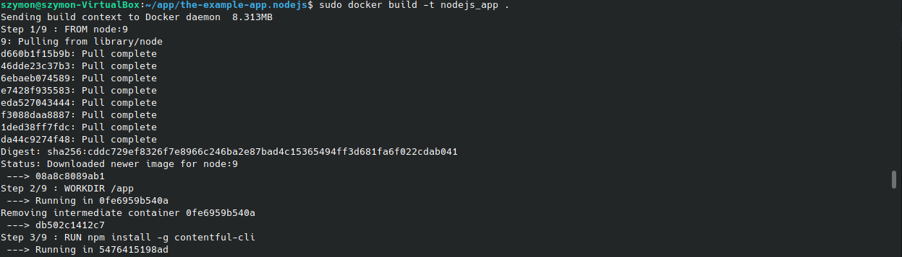

Uruchomienie kontenera i przekierowanie portu 3000 z kontenera na port 3200

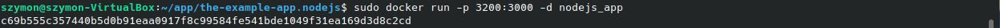

Przedstawienie działania - aplikacja działa na porcie 3200

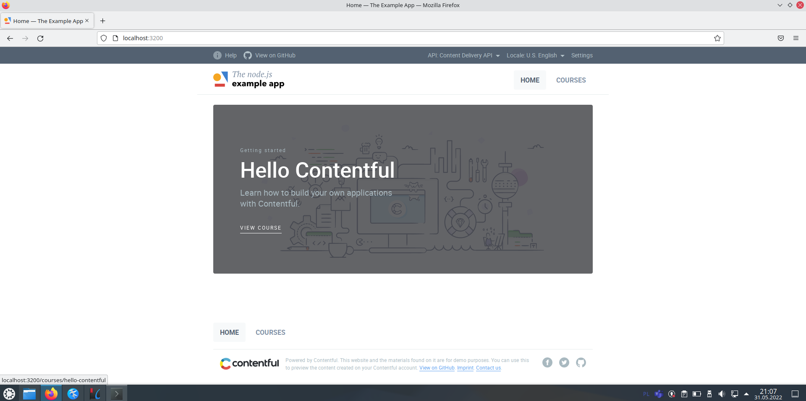

## Uruchamianie oprogramowania

Utworzenie pliku definicji pod.yml dla aplikacji

```
apiVersion: v1
kind: Pod
metadata:
  name: express
  labels:
    app: express
spec:
  containers:
    - name: express
      image: nodejs_app
      imagePullPolicy: Never
      ports:
      - containerPort: 3200
```

Utworzono poda za pomocą polecenia `kubectl apply -f pod-test.yml` i sprawdzono jego działanie (jak widać pod został utworzony)

Niestety, nie działa (`ErrImageNeverPull`). Wynika to z tego, że obraz jest utworzony w Dockerze lokalnym, a nie w Kubernetesie. Dodatkowo opcja `imagePullPolicy: Never` określa, że obraz nie będzie pobierany z internetu.


Aby naprawić problem należy użyć polecenia `eval` (powoduje to, że bash wprowadzi zestaw zmiennych środowiskowych służących do skonfigurowania lokalnego środowiska w celu ponownego użycia demona Dockera wewnątrz instancji Minikube)

Należy jeszcze zmienić uprawnienia pliku

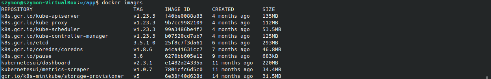

Podjęcie kolejnej próby i tym razem mamy wyczekiwany napis `running`


Potwierdzenie poprawnego działania w dashboardzie

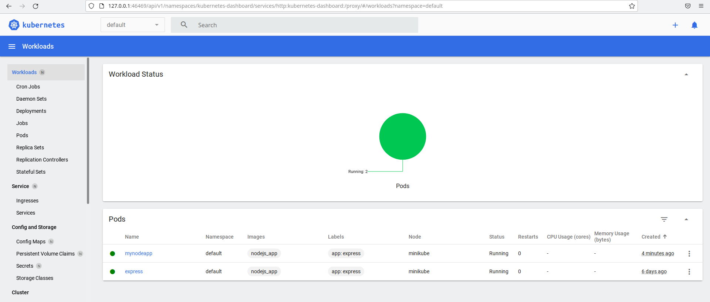

Wyprowadzenie portu celem dotarcia do eksponowanej funkcjonalności i przedstawienie działania w przeglądarce. Wszystko śmiga

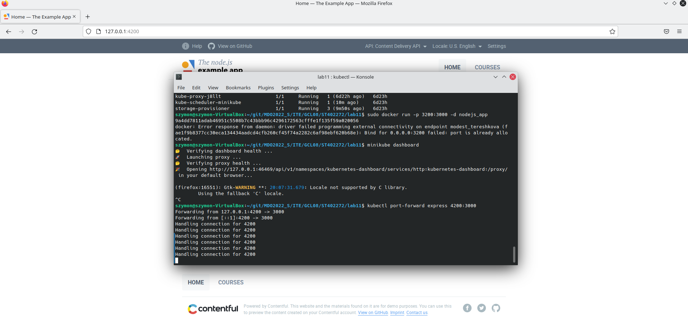

## Przekucie wdrożenia manualnego w plik wdrożenia

Utworzenie drugiego pliku `pod-test2.yml` do wdrożenia z 4 replikami:

```
apiVersion: apps/v1
kind: Deployment
metadata:
  name: myapp
  labels:
    app: example
spec:
  replicas: 4
  selector:
    matchLabels:
      app: example
  template:
    metadata:
      labels:
        app: example
    spec:
      containers:
        - name: myapp
          image: nodejs_app
          imagePullPolicy: Never
          ports:
          - containerPort: 3200
```

Utworzenie poda i przedstawienie działania

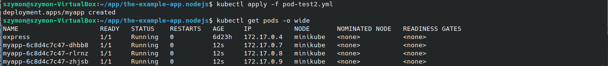

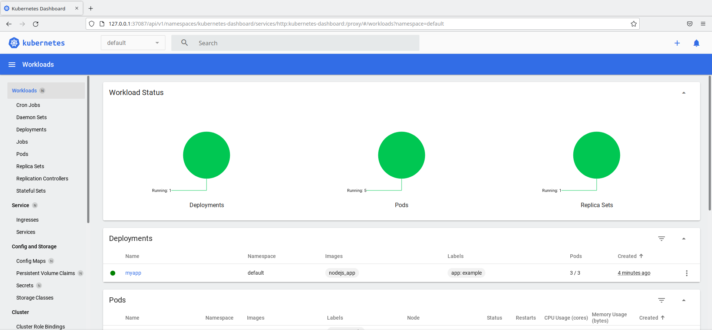
