# Szymon Twardosz - Lab 12 DevOps

## Konwersja wdrożenia ręcznego na wdrożenie deklaratywne YAML

Modyfikacja utworzonego w poprzednich laboratoriach pliku `pod-test2.yml` i zmienienie ilości replik na 4

```
spec:
  replicas: 4
```

Utworzenie poda oraz zbadanie jego stanu za pomocą polecenia `kubectl rollout status -f pod-test2.yml`

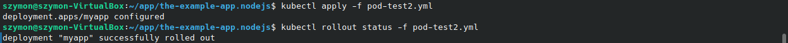

Wyświetlenie statusu w dashboardzie:

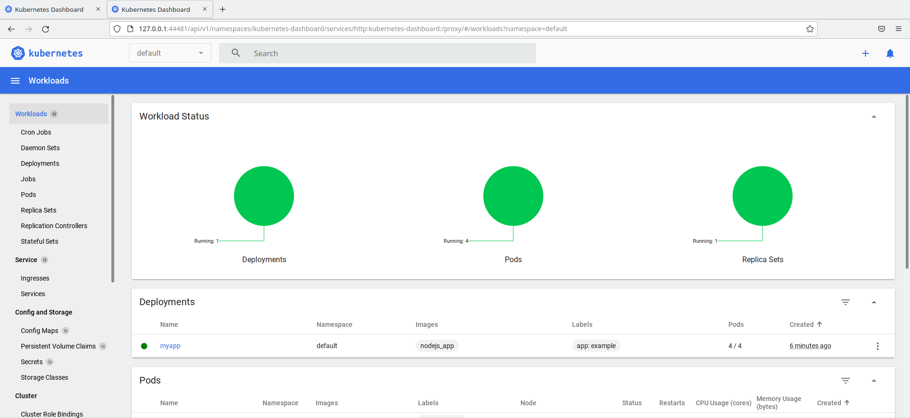

Modyfikacja utworzonego w poprzednich laboratoriach pliku `pod-test2.yml` i zmienienie ilości replik na 0

```
spec:
  replicas: 0
```

Dashboard:

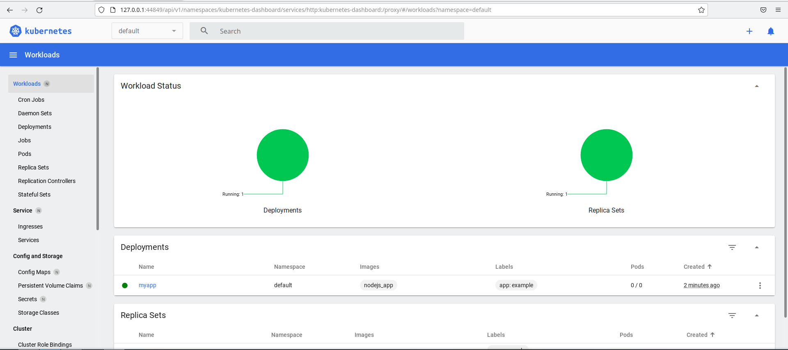

## Przygotowanie nowego obrazu

W celu skorzystania z DockerHub'a zalogowano się na maszynie wirtualnej do konta Dockera

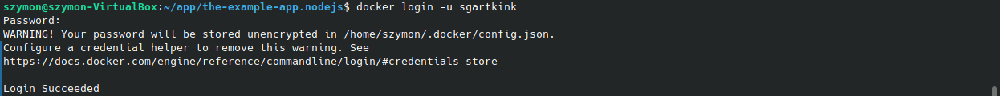

Utworzenie obrazu z dopiskiem `modified` (jest to ten sam Dockerfile, który był w poprzednych laboratoriach)

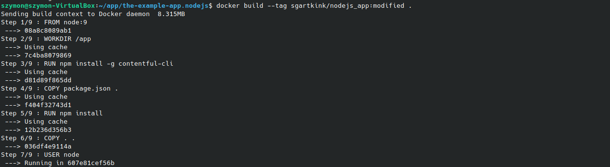

I wypchnięcie go na dockerhuba

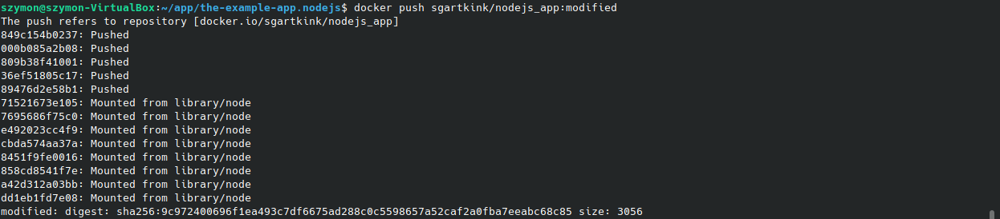

Usunięcie kilku niezbędnych linii w Dockefilu (na przykład tych, w których występuje instalacja za pomocą npm), a następnie znowu zbudowanie obrazu i wrzucenie go na dockerhub (tym razem z dopiskiem `fail`)

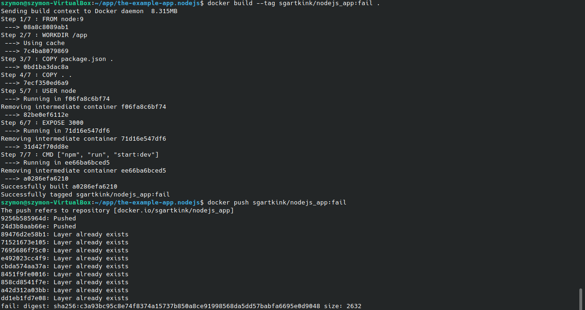

Obrazy udało się pomyślnie wrzucić (widok z przeglądarki z konta w dockerhubie)

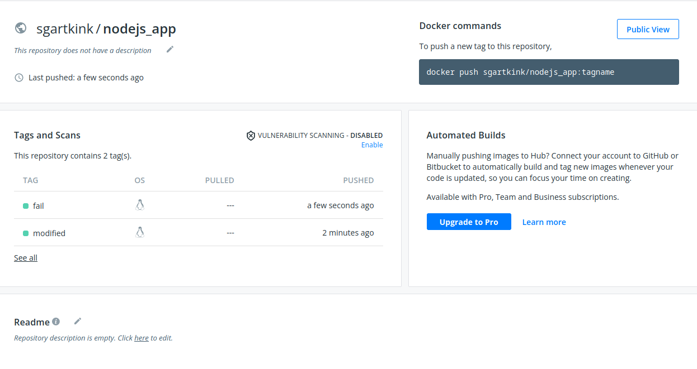

Zmiana kilku linii w pliku `pod-test2.yml` (usunięcie `imagePullPolicy: Never`, pobieranie obrazu z dockerhuba jeśli nie będzie go w repozytorium lokalnym)

```
apiVersion: apps/v1
kind: Deployment
metadata:
  name: express
  labels:
    app: express
spec:
  replicas: 1
  selector:
    matchLabels:
      app: express
  template:
    metadata:
      labels:
        app: express
    spec:
      containers:
      - name: express
        image: sgartkink/nodejs_app:modified
        ports:
        - containerPort: 3200
```

Działanie w dashboardzie (ta wersja jest wersją poprawną, więc na zielono)

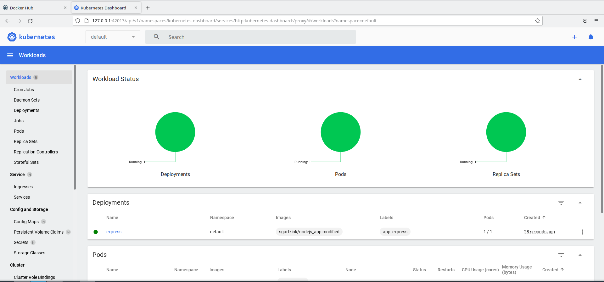

Teraz to samo, ale w `pod-test2.yml` zmieniam `image: sgartkink/nodejs_app:modified` na `image: sgartkink/nodejs_app:fail`, czyli wersję, która nie działa, i w efekcie mamy trochę czerwonego

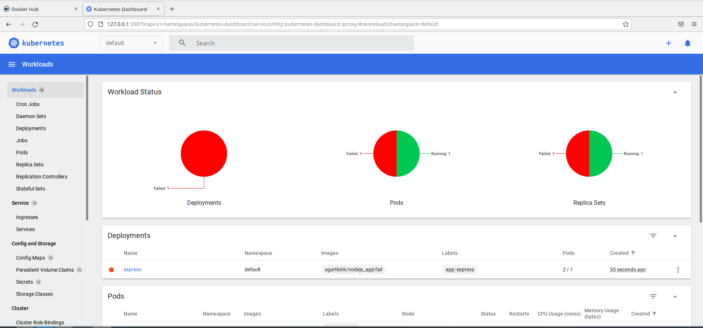

Przywrócenie poprzednich wersji wdrożeń (za pomocą polecenia `kubectl rollout history` (umożliwia wyświetlenie historii wersji w wersji ogólnej jak i trochę bardziej rozbudowanej)

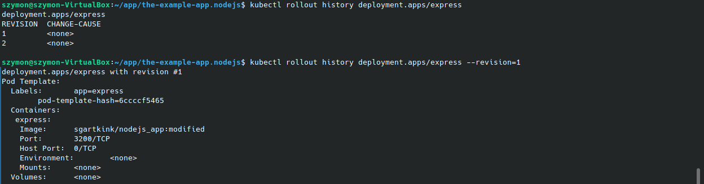

A następnie powrót do poprzedniej wersji (dokładnie to 1, czyli modified) za pomocę `kubectl rollout undo`

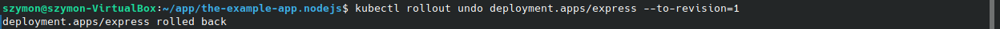

## Kontrola wdrożenia

W tym kroku utworzono prosty skrypt w bashu, który sprawdza czas tworzenia się wdrożenia. Jeśli czas jest większy niż 60 sekund skrypt zwraca informacje o błędzie

```
#!/bin/bash

if [ $# -ne 2 ]; then
	echo "This script requires exactly 2 arguments."
	exit 1
fi

name=$1
deployment=$2

kubectl apply -f $name
timeout 60 /usr/local/bin/minikube kubectl rollout status $deployment

if [ $? -eq 0 ]; then
	echo "SUCCESS."
    exit 0
else
	echo "FAILURE."
    exit 1
fi
```

Efekt uruchomienia skryptu (2 razy)

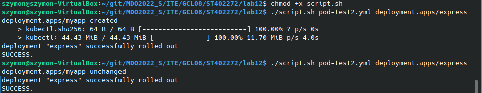
