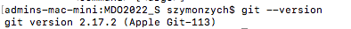
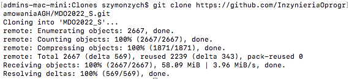
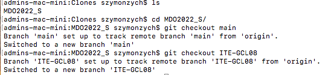
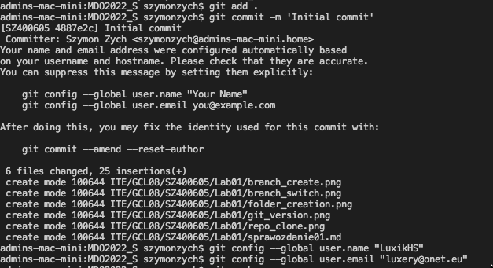
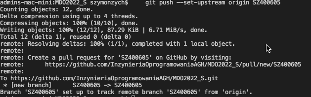

# Szymon Piotr Zych 400605 sprawozdanie

## 1. Instalacja klienta Git

## 2. Sklonowanie repozytorium

## 3. Klucze

W trakcie zajęć nie wykorzystuje maszyny wirtualnej dlatego ten punkt został pominięty.

## 4. Przełączenie na odpowiednia gałąź

## 5. Utowrzenie gałęzi o nazwie inicjały & nr indeksu

## 6. Rozpoczęcie pracy na gałęzi

## 7. Commit i push na repozytorium

