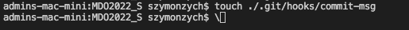
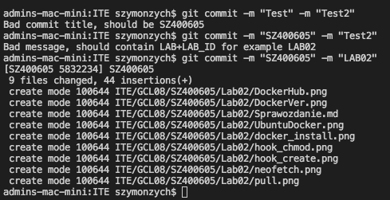
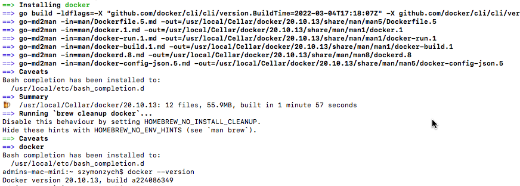
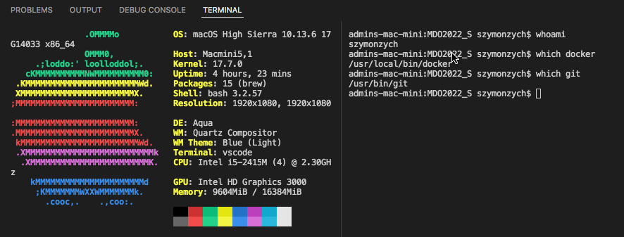
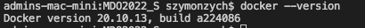
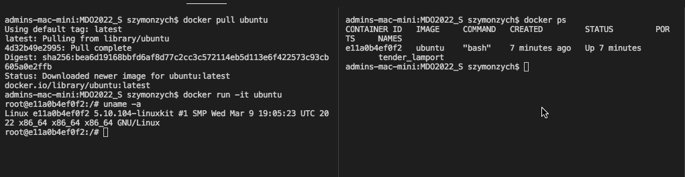
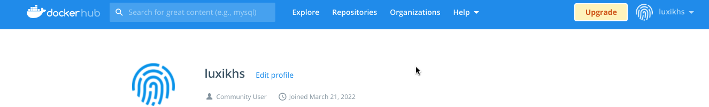

# Szymon Piotr Zych 400605 Sprawozdanie_Lab02

## 1. Przygotowanie git hooków sprawdzających poprawność tytułu i treści commita

Utworzenie w folderze .git/hooks hooka o odpowiedniej nazwie



```
#!/bin/bash

ID="SZ400605"
LAB=".*(LAB)[0-9][0-9]*."

if ! [[ $(cat $1) == $ID* ]] ;then
    echo "Bad commit title, should be $ID"
    exit 1
fi

if ! [[ $(tail -1  $1) =~ $LAB]] ;then
    echo "Bad message, should contain LAB+LAB_ID for example LAB02"
    exit 1
fi

```

Aby hook mógł zadziałać musimy zmienić jego uprawnienia




## 2. Instalacja środowiska dockerowego





## 3. Działanie środowiska




## 4. Załozenie konta na Docker Hub


