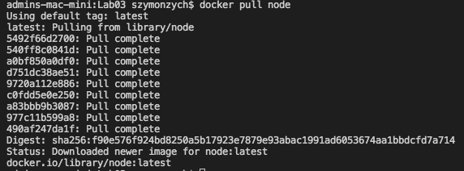
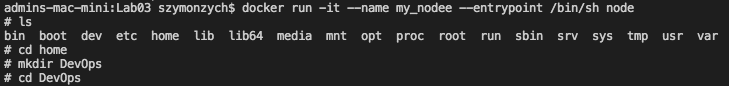
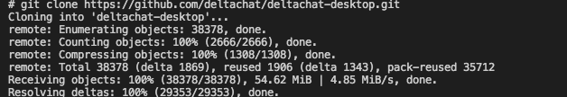
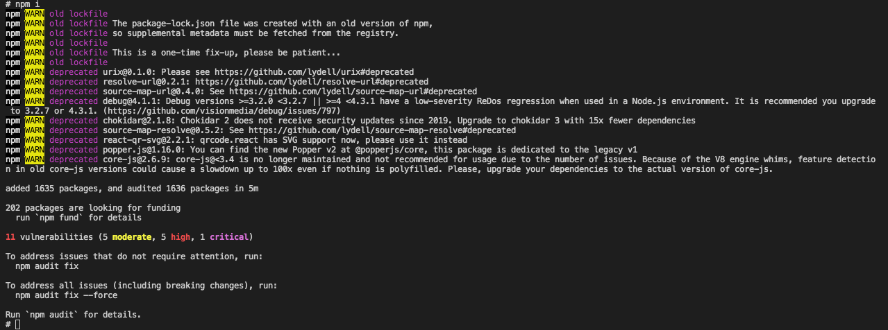
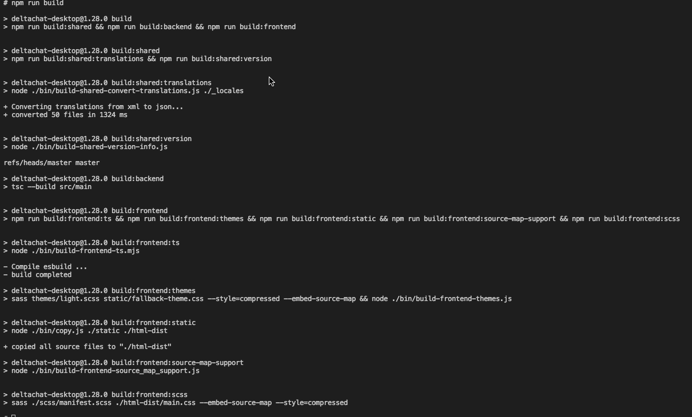
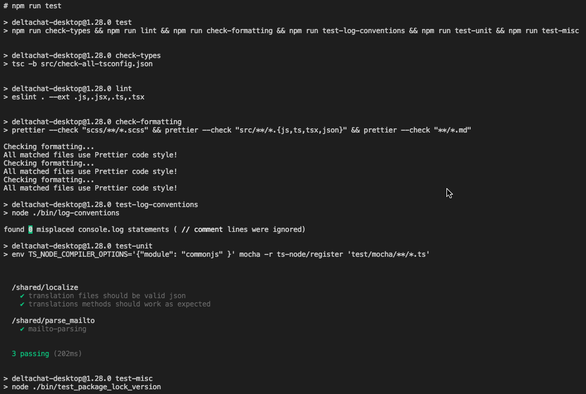
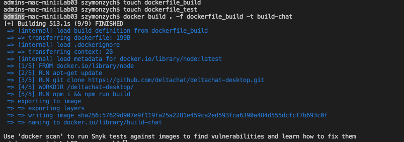
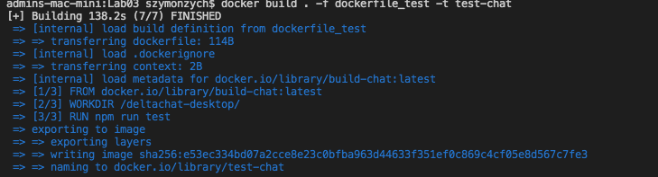
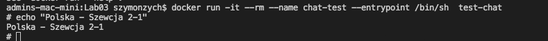

# Szymon Piotr Zych 400605 Sprawozdanie_Lab03

## Pobranie obrazu node, poniewa wybrałem project NodeJS



## Uruchomienie kontenera oraz sklonowanie wybranego repozytorium



## Sklonowanie repozytorium wybranego projektu



## Zainstalowanie paczek zdefiniowanych w package.json uzywając menadzera zalezności npm



## Uruchomienie buildu



## Uruchomienie testów



## Stworzenie Dockerfile realizującego wszystkie kroki az do builda

```
FROM node
RUN apt-get update
run git clone https://github.com/deltachat/deltachat-desktop.git
WORKDIR /deltachat-desktop/
RUN npm i && npm run build

```



## Stworzenie Dockerfile wykonującego testy

```
FROM build-chat:latest
WORKDIR /deltachat-desktop/
RUN npm run test

```



## Wykaż, że kontener wdraża się i pracuje poprawnie. Pamiętaj o różnicy między obrazem a kontenerem. Co pracuje w takim kontenerze?


