# Szymon Piotr Zych 400605 Sprawozdanie_Lab04

## Utworzenie woluminów wejściowych i wyjściowych

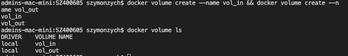

## Podłączenie ich do kontenera

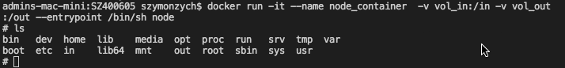

## Sklonowanie repozytorium na wolumin wejściowy

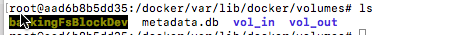

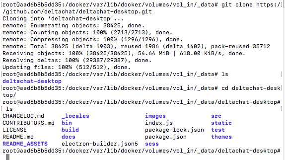

## Uruchomienie buildu w kontenerze i zapisanie ich na woluminie wyjściowym

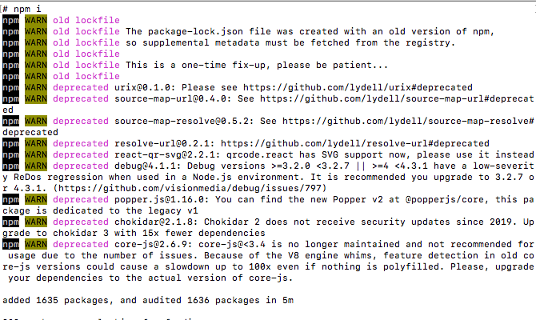


## Instalacja iperf3 oraz net-tools wewnątrz kontenera

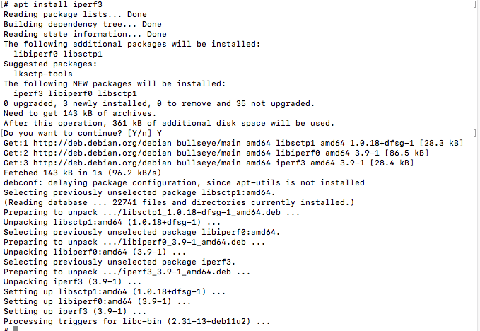

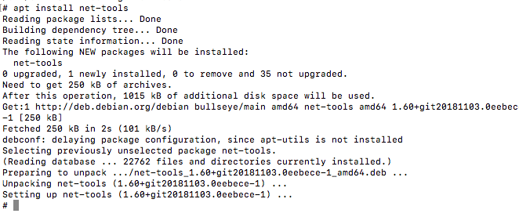

## Sprawdzenie połączenia z drugiego kontenera

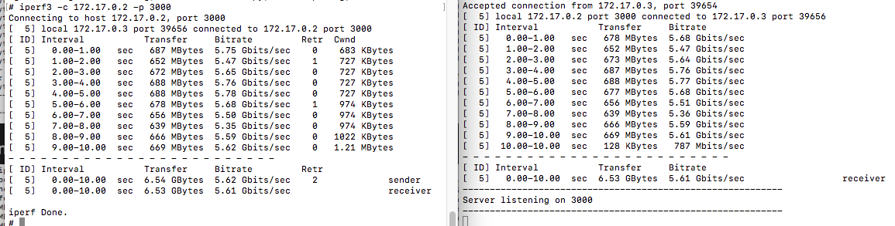

## Połączenie spoza kontenera

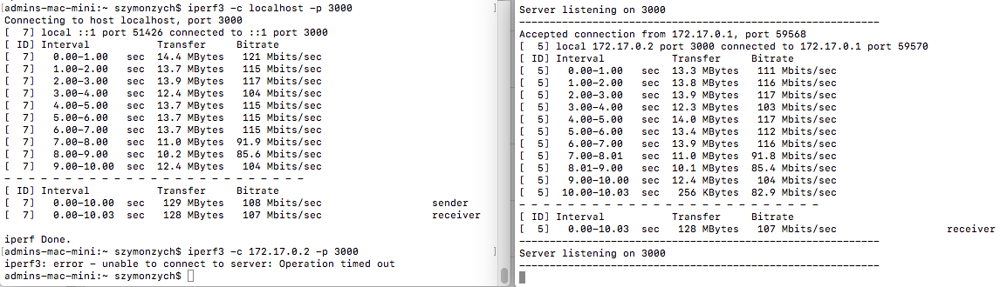

## Przepustowość komunikacji

### Drugi kontener

```
 Interval           Transfer     Bitrate         Retr  Cwnd
 0.00-1.00   sec   687 MBytes  5.75 Gbits/sec    0    683 KBytes
 1.00-2.00   sec   652 MBytes  5.47 Gbits/sec    1    727 KBytes
 2.00-3.00   sec   672 MBytes  5.65 Gbits/sec    0    727 KBytes
 3.00-4.00   sec   688 MBytes  5.76 Gbits/sec    0    727 KBytes
 4.00-5.00   sec   688 MBytes  5.78 Gbits/sec    0    727 KBytes
 5.00-6.00   sec   678 MBytes  5.68 Gbits/sec    1    974 KBytes
 6.00-7.00   sec   656 MBytes  5.50 Gbits/sec    0    974 KBytes
 7.00-8.00   sec   639 MBytes  5.35 Gbits/sec    0    974 KBytes
 8.00-9.00   sec   666 MBytes  5.59 Gbits/sec    0   1022 KBytes
 9.00-10.00  sec   669 MBytes  5.62 Gbits/sec    0   1.21 MBytes
```

### Spoza kontenera

```
Interval           Transfer     Bitrate
0.00-1.00   sec  13.3 MBytes   111 Mbits/sec
1.00-2.00   sec  13.8 MBytes   116 Mbits/sec
2.00-3.00   sec  13.9 MBytes   117 Mbits/sec
3.00-4.00   sec  12.3 MBytes   103 Mbits/sec
4.00-5.00   sec  14.0 MBytes   117 Mbits/sec
5.00-6.00   sec  13.4 MBytes   112 Mbits/sec
6.00-7.00   sec  13.9 MBytes   116 Mbits/sec
7.00-8.01   sec  11.0 MBytes   91.8 Mbits/sec
8.01-9.00   sec  10.1 MBytes   85.4 Mbits/sec
9.00-10.00  sec  12.4 MBytes   104 Mbits/sec
10.00-10.03 sec   256 KBytes   82.9 Mbits/sec
```

## Instancja Jenkins

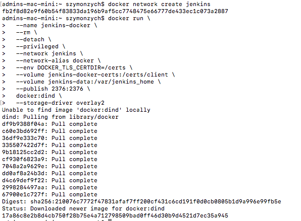

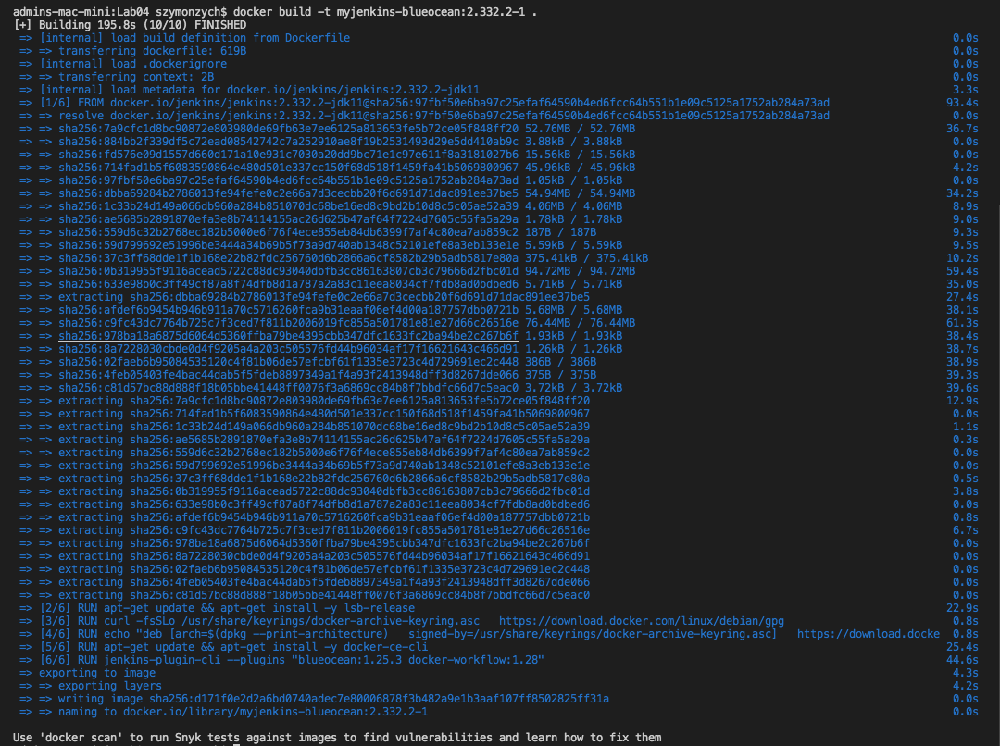

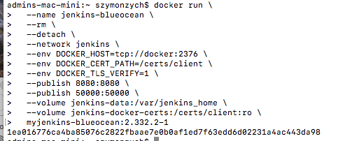

### Wykazanie działajacych kontenerów oraz logi

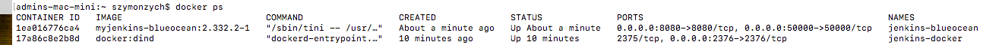

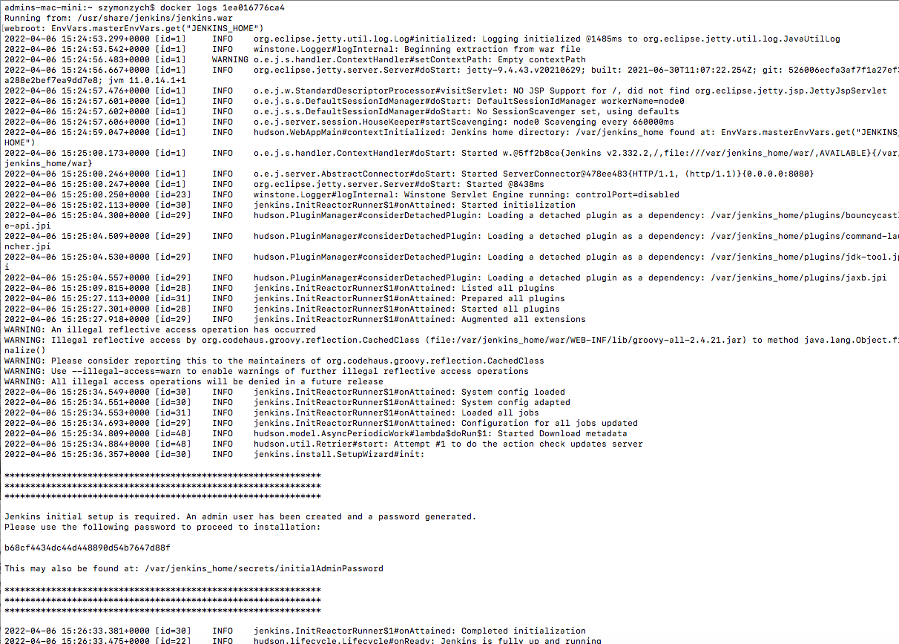

### Ekran logowania


