# Szymon Piotr Zych 400605 Sprawozdanie_projekt

## Konfiguracja kontenera Jenkins i DIND

Po konfiguracji w ramach poprzednich zajęć zgodnie z instruckją dostawcy oprogramowania, naszym zadaniem było po prostu uruchomienie kontenerów wykorzystując gotowe komendy.

Uruchomienie DINDA

```
docker run \
  --name jenkins-docker \
  --rm \
  --detach \
  --privileged \
  --network jenkins \
  --network-alias docker \
  --env DOCKER_TLS_CERTDIR=/certs \
  --volume jenkins-docker-certs:/certs/client \
  --volume jenkins-data:/var/jenkins_home \
  --publish 2376:2376 \
  docker:dind \
  --storage-driver overlay2
```

Uruchomienie Jenkinsa

```
docker run \
  --name jenkins-blueocean \
  --restart=on-failure \
  --detach \
  --network jenkins \
  --env DOCKER_HOST=tcp://docker:2376 \
  --env DOCKER_CERT_PATH=/certs/client \
  --env DOCKER_TLS_VERIFY=1 \
  --publish 8080:8080 \
  --publish 50000:50000 \
  --volume jenkins-data:/var/jenkins_home \
  --volume jenkins-docker-certs:/certs/client:ro \
  myjenkins-blueocean:2.332.3-1
```

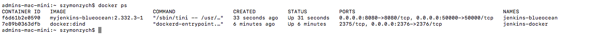

## Fork repo

Dla własnej wygody i nie chcąc zaśmiecać niepotrzebnymi commitami własnego brancha na przedmiotowym repozytorium postanowiłem skopiować repozytorium aplikacji na której pracowałem korzystając z operacji fork.

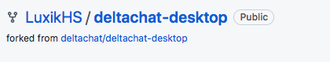

[Link do forkowanego repozytorium](https://github.com/LuxikHS/deltachat-desktop)

Pliki dockerfile oraz Jenkinsfile z których korzystałem podczas wykonywanego zadania zostały umieszczone zarówno na forkowanym repo(tam przeprowadzałem zmiany na plikach dockerfile i pliku Jenkinsfile) oraz w repozytorium przedmiotowym(tutaj umieściłem tylko finalną wersję plików)

## Zdefiniowany wewnątrz Jenkinsa obiekt projektowy „pipeline”

Należy zmienić defition z pipeline script na pipeline script from scm, ponieważ chcemy uzyskać pipeline z Source Control Managment(SCM), którym będzie nasze lokalnie sklonowane repozytorium.
Jako SCM wybieramy Git i podajemy link do naszego repozytorium.

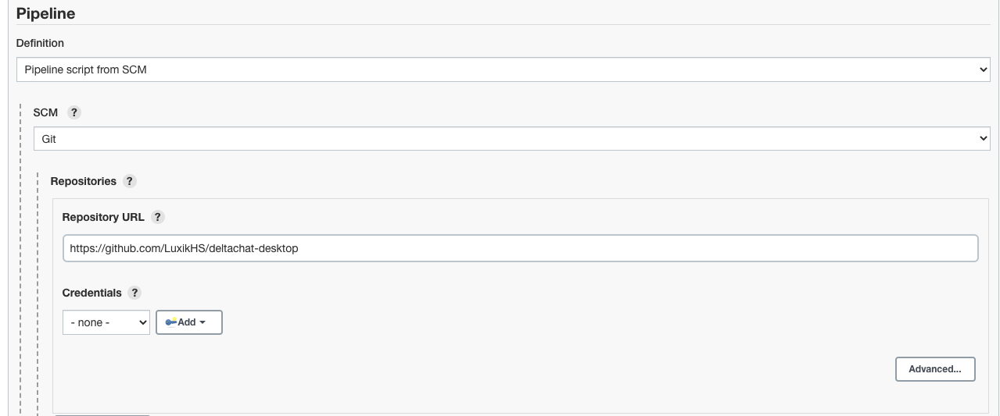

Jak wcześniej wspominałem korzystam z forkowanego repozytorium i tam dodawałem na branch master dockerfile i Jenkinsfile dlatego jako Branch Specifier podany jest master, gdybym krok wyżej podał link do repozytorium przemiotowego Branch Specifier musiałby być ustawiony na branch na którym pracuje na przedmiotowym repozytorium tj. SZ600605.
Podobnie sprawa ma się z polem Script Path tutaj podana jest tylko nazwa Jenkinsfile, ponieważ Jenkinsfile znajduje się bezpośrednio na masterze, w przypadku przedmiotowego repozytorium ścieżka wyglądałaby w następujący sposób:
ITE/GCL08/SZ400605/Lab05/Jenkinsfile


## Build

Dockerfile odpowiadający za build

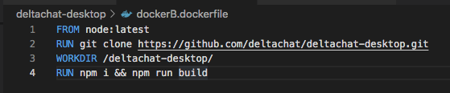

Fragment Jenkinfile z krokiem build

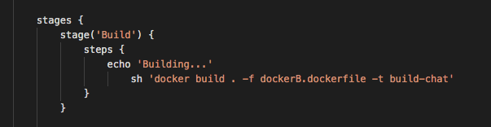

Logi z pipeline'a

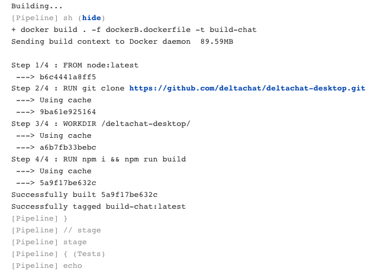

## Test

Dockerfile odpowiadający za testy

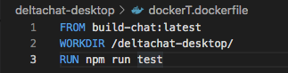

Fragment Jenkinfile z krokiem test

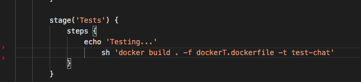

Logi z pipeline'a

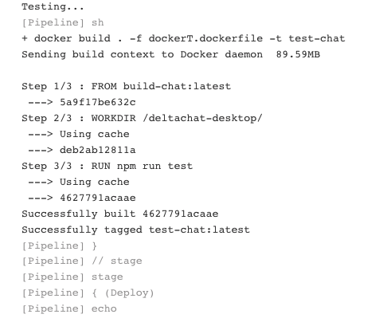

## Deploy

Z racji tego, że wybrana przeze mnie aplikacja jest aplikacją desktopową w ramach deploya postanowiłem pushować obraz na repozytorium DockerHubowe. Aby to osiągnąć musieliśmy w Jenkinsfile'u przekazać zmienną środowiskową, w której są nasze login i hasło do konta na dockerhubie.

Ustawienie w Jenkinsie referencji do loginu i hasła do konta na DockerHub

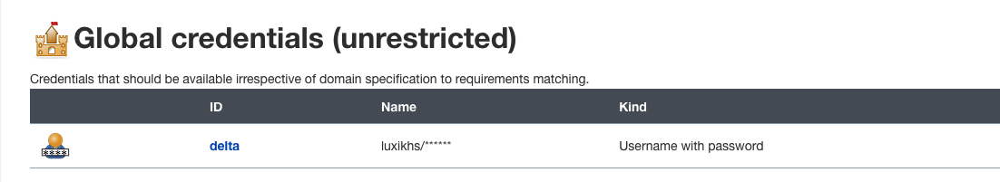

Fragment Jenknsfile, w którym przypisujemy referencje.

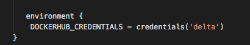

Fragment Jenkinfile z krokiem deploy

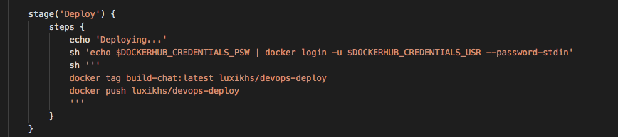

Logi z pipeline'a

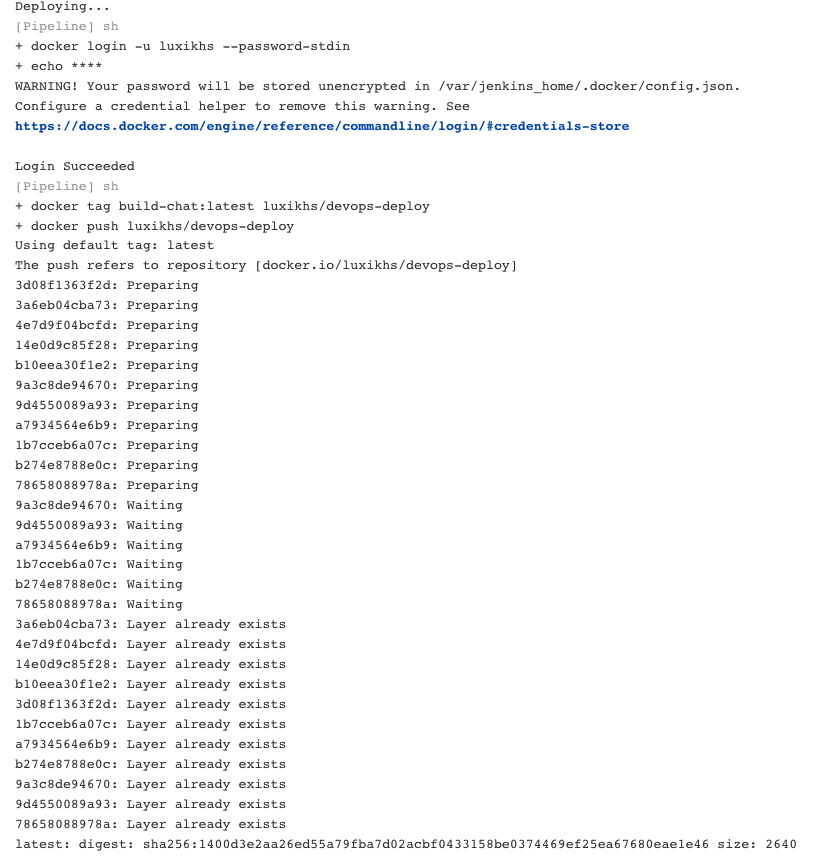

Potwierdzenie powodzenia pushowania obrazu na DockerHuba

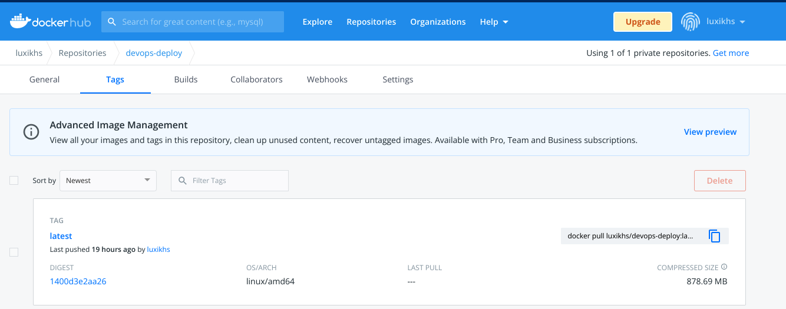

## Publish

W ramach kroku publish pakujemy nasz build do archiwum, a następnie przekazujemy je jako artefakt.

Dockerfile odpowiadający za publish

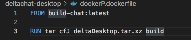

Fragment Jenknsfile, z korkiem publish

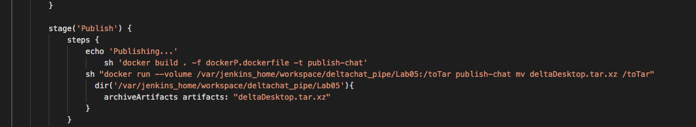

Uzyskany artefakt:


## Stage View

Potwierdzenie poprawności wykonania się wszytskich kroków

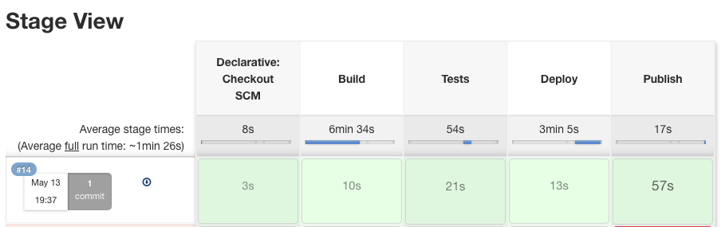
