# Szymon Piotr Zych 400605 Sprawozdanie_Lab04

## Sprawozdanie przesłane zostaje z opóźnieniem spowodowanym faktem, że jedynym urządzeniem do którego mam dostęp to Mac na którym jest problem z VirtualBoxem. Dopiero dzisiaj udało mi się skorzystać z urządzenia na którym mogłem swobodnie wykonac laboratorium nr 9.

# Przygotowanie systemu

Instalacja systemu Fedora:

- włączamy konto roota oraz zaznaczamy checkbox, aby możliwe było logowanie po SSH, ponieważ będziemy później korzystali z tej opcji.

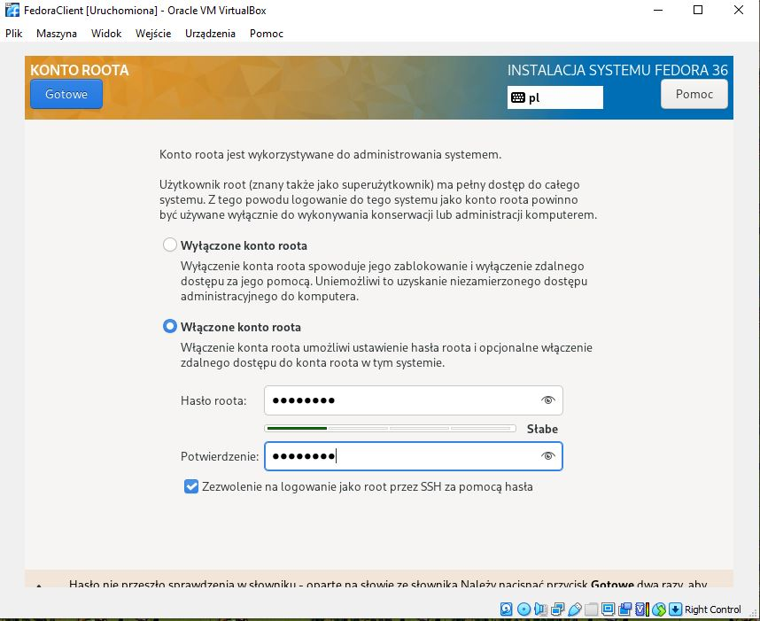

- wybieramy minimalną instalację

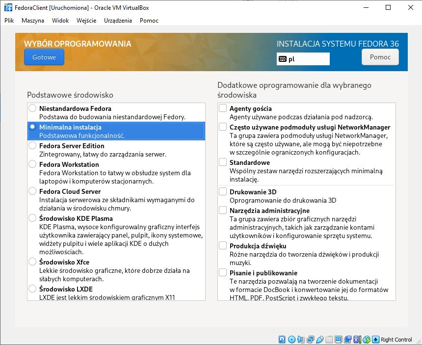

- nadajemy nazwę naszemu komputerowi

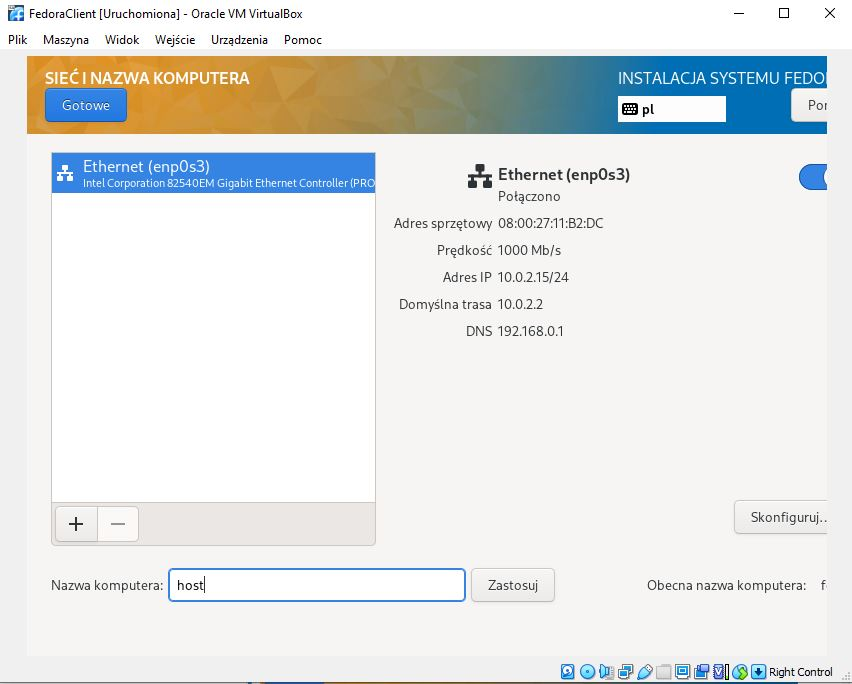

- Zaznczamy niestandardowa, aby utworzyć partycje

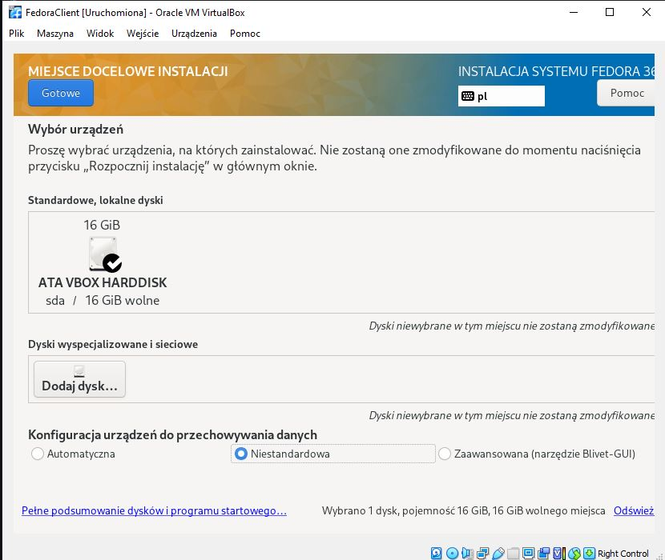

Po kliknięciu gotowe wyświetli nam się kolejne okno dialogowe, tam wybieramy "Kliknij tutaj, aby utworzyć utworzyć automatycznie". Po kliknięciu dostajemy gotowe partycje.

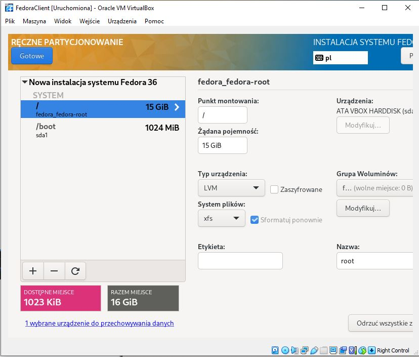

Następnie widzimy podsumowanie zmian które zleciliśmy.

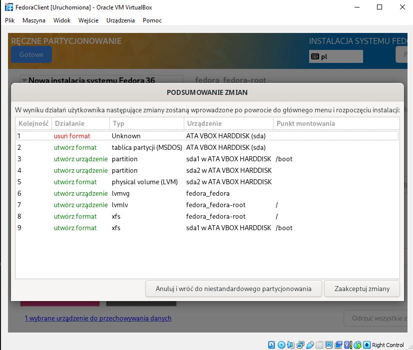

Po tych krokach konfiguracyjych możemy przejść do faktycznej instalacji.

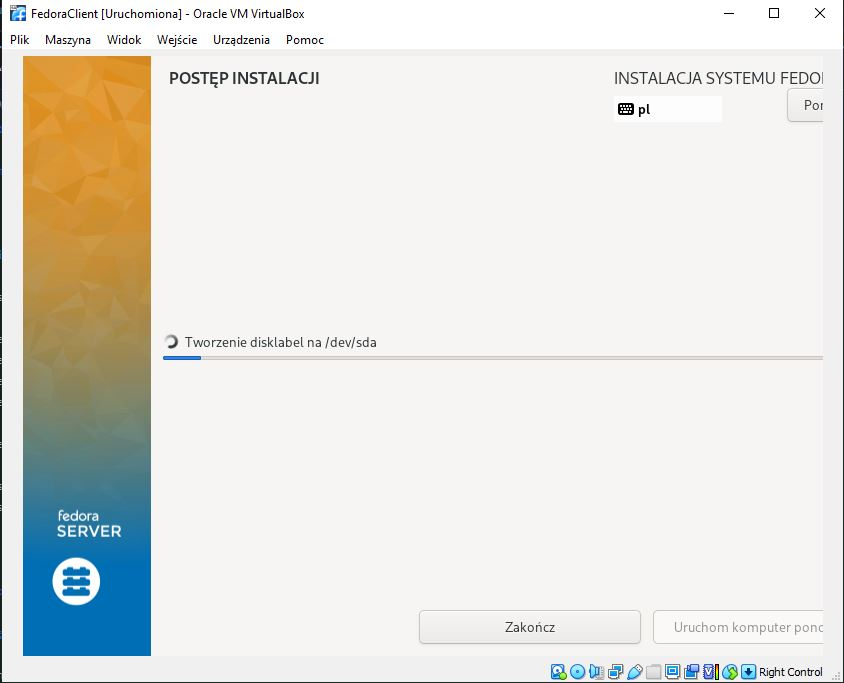

Po prawidłowo zakończnonej instalacji uruchamiamy ponownie i bootujemy z dysku twardego. Nastepnie sprawdzamy ip hosta. Aby nasz host otrzymał ip z odpowiednej puli adresów w ustawieniach maszyny wirtualnej w zakładce sieć może być konieczne ustawienie karty sieciowej na mostkowaną(bridged)

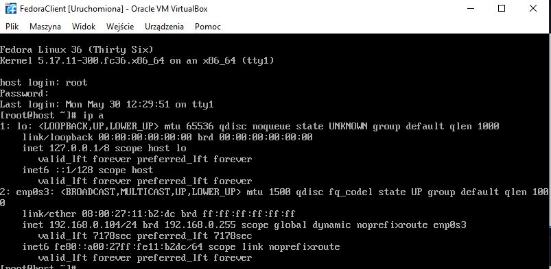

Do pobrania pliku konfiguracyjnego użyłem programu WinSCP.

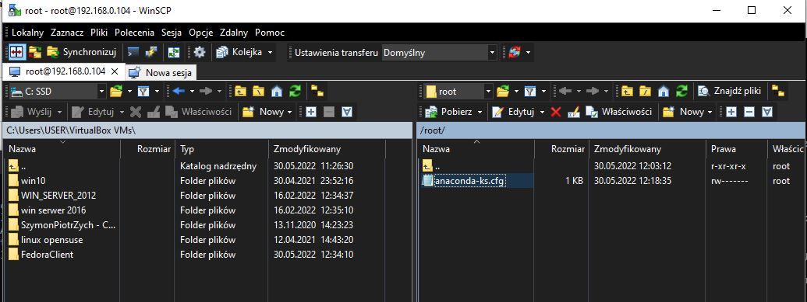

Instalacja serwera przebiegła dokładnie takim samym tokiem, jedyna zmiana to nadanie nazwy komputera server.

Po zainstalowaniu serwera mogliśmy przejść do instalacji i konfiguracji Serweera HTTP Apache(HTTPD). Aby zainstalować Apache korzystamy z polecenia

```
dnf install httpd
```

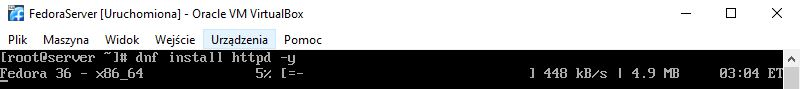

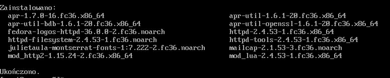

Nastpępnie musimy uruchomić usługę, ponieważ jest ona domyślnie wyłączona i niaktywna.
Posłużymy się więc poleceniem

```
systemctl enable httpd --now
```

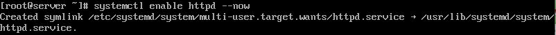

Sprawdzamy czy Apache działa bez błędów:

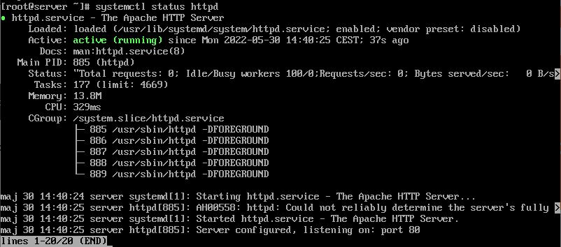

Apache nie dodaje automatycznie reguł zapory dla standardowych portów 80 lub 443. Dlatego przed korzystaniem z httpd musimy skonfigurować reguły zapory. Otwieramy porty, a następnie przeładowujemy zaporę, aby wprowadzić zmiany.

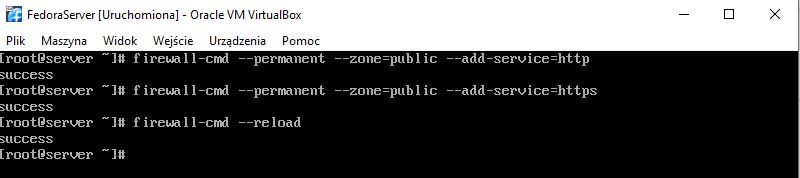

Po krokach konfiguracyjnych sprawdzamy adres ip serwera, abyśmy mogli przesłać na niego artefakt.

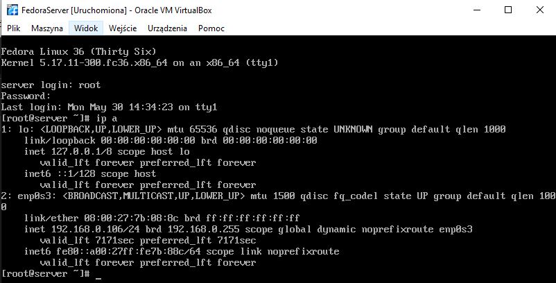

Z wykorzystaniem WinSCP tym razem przesyłamy artefakt na nasz server

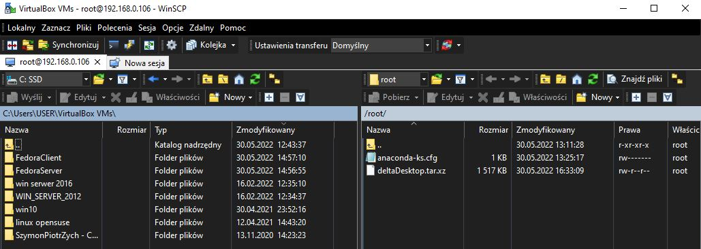

Przenosimy nasz artefakt do domyślnie udostępnianego przez httpd katalogu.

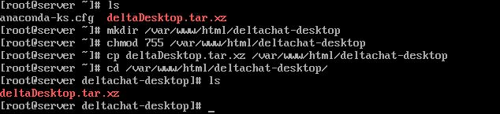

Teraz możemy przenieść się na hosta i pobrać artefakt z serwera. Aby było to możliwe musimy zainstalować wget i z jego wykorzystaniem pobrać artefakt.

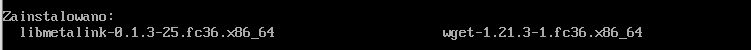

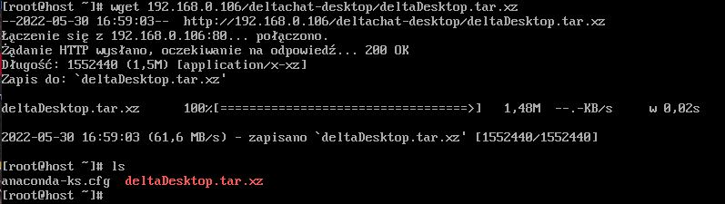

Do rozpakowania archiwum będącego artefaktem musimy zainstalować tar.


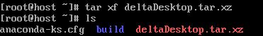

Następnie po zainstalowaniu npm oraz dependecji możemy pokazać działanie, niestety ja wybrałem apliakcję desktopową dlatego pomijam zrzut ekranu.

# Instalacja nienadzorowana

Do przeprowadzenia instalacji nienadzorowanej nalezało odpowiednio zmodyfikować plik konfiguracyjny, który następnie dodany został na repozytorium. Dodano elementy odpowiedzialne za potrzebne dependecje, zdefiniowano repozytoria, dodano sekcję w której pobiera się artefakt z repozytorium.

Instalacja za pomocą komendy sięgającej do pliku z githuba.

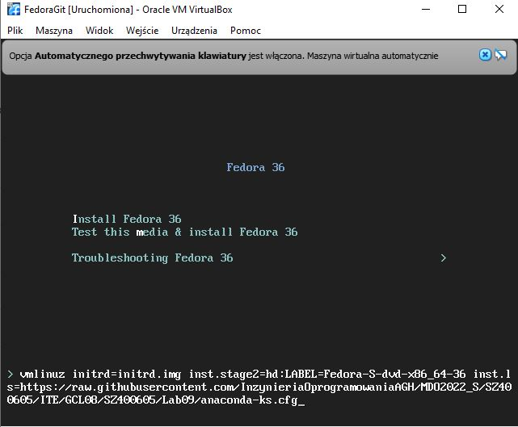

# Infrastructure as a code

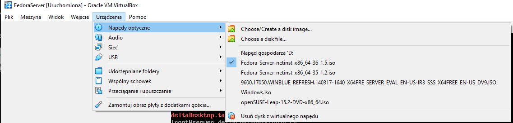

Utworzenie katalogu i mount do niego obraxu z napędu

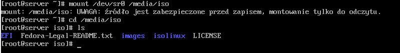

Utworzenie pomocniczengo katalogu, poniewaz montowanie było tylko do odczytu,a będziemy chcieli wprowadzić zmiany.

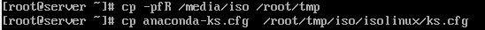

Sprawdzamy czy plik konfiguracyjny ze zmienioną nazwą znajduje się w odpowiednim katalogu.

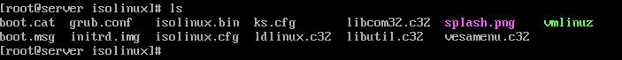

Modyfikacja pliku isolinux.cfg

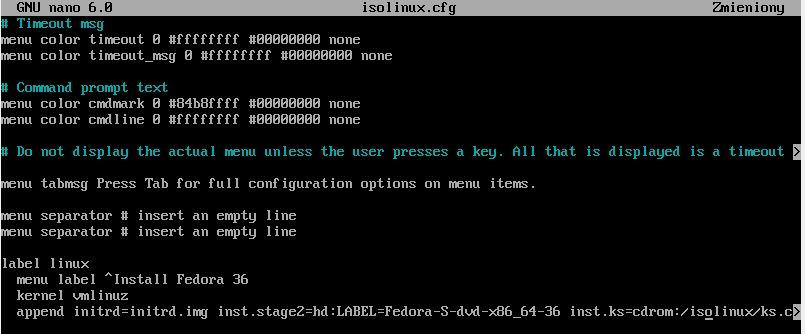

Instalacja pakietu genisoimage


Utworzenie nowego obrazu ISO

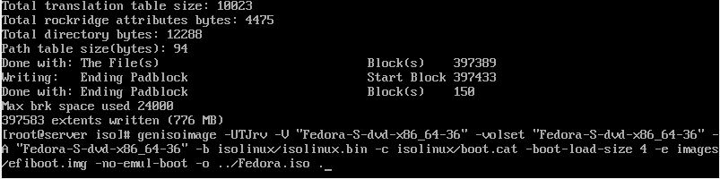

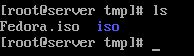
