# Szymon Piotr Zych 400605 Sprawozdanie_Lab011

# Instalacja klastra Kubernetes

## Zaopatrz się w implementację stosu k8s: minikube

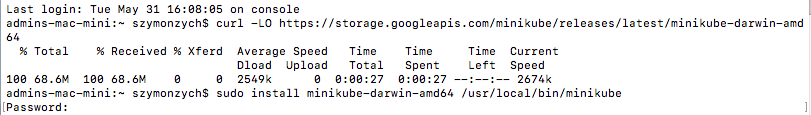

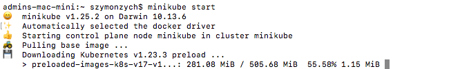

## Zaopatrz się w polecenie kubectl

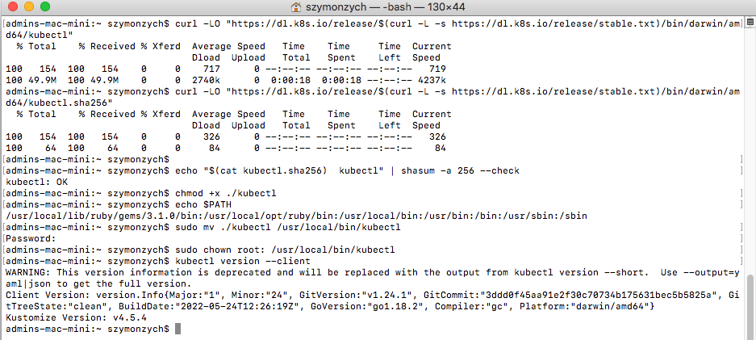

## Uruchom Kubernetes, pokaż działający kontener/worker

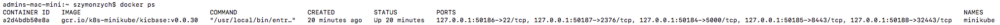

## Uruchom Dashboard, otwórz w przeglądarce, przedstaw łączność

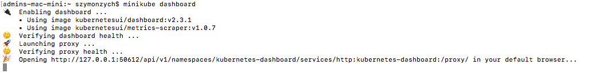

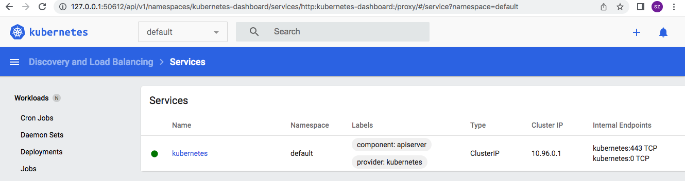

# Analiza posiadanego kontenera

Aplikacja, którą wybrałem nie wyprowadzała andych portów dlatego zmieniłem projekt na potrzeby tego zadania.

Stowrzyłem dockerfile który robił obraz.

```
FROM node:14.16.1-buster

RUN apt-get update
RUN apt-get install -y --no-install-recommends git nano

RUN git clone https://github.com/BuiDuyThanh/node-chat-app
WORKDIR ./node-chat-app
RUN npm install
EXPOSE 3000
ENTRYPOINT npm run start
```

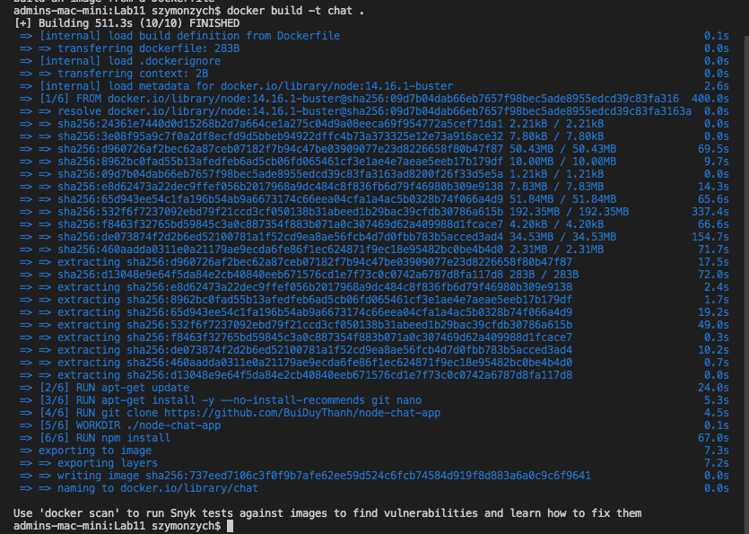

Następnie powstały obraz wrzuciłem na dockerhuba

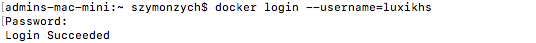

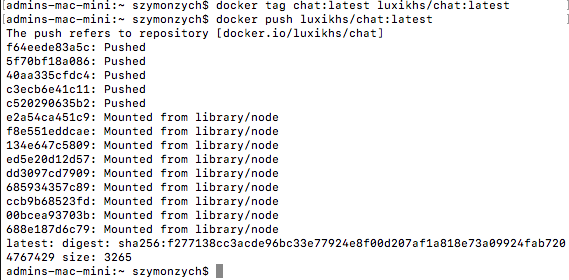

## Wykaż, że wybrana aplikacja pracuje jako kontener

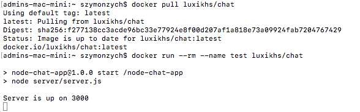

# Uruchamianie oprogramowania

## Uruchom kontener na stosie k8s

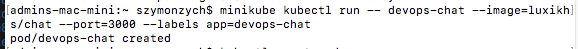

## Przedstaw że pod działa (via Dashboard oraz kubectl)

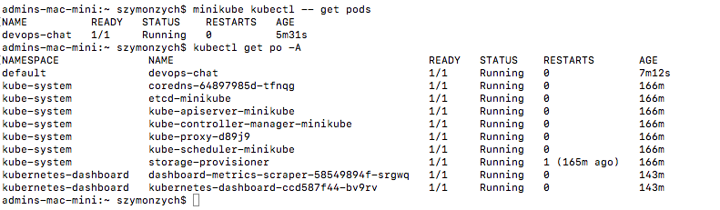

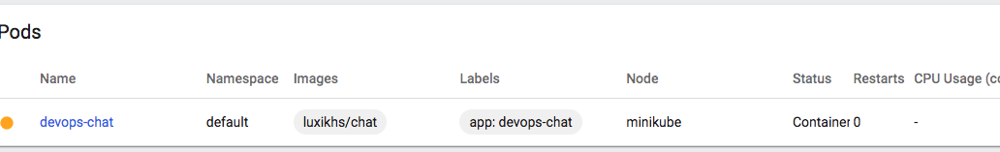

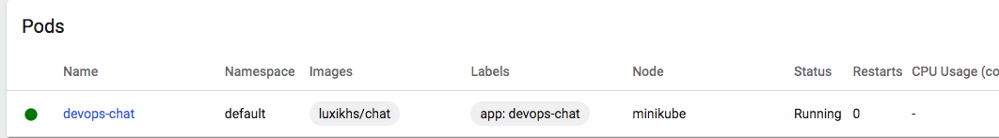

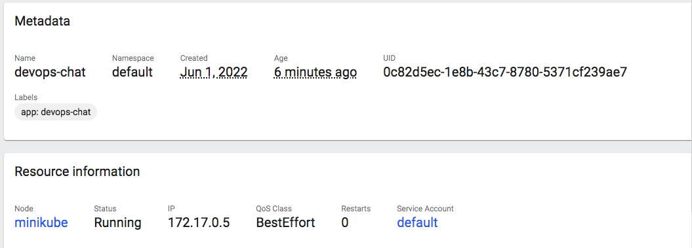

## Wyprowadź port celem dotarcia do eksponowanej funkcjonalności

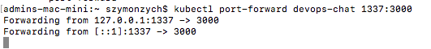

## Przedstaw komunikację z eskponowaną funkcjonalnością

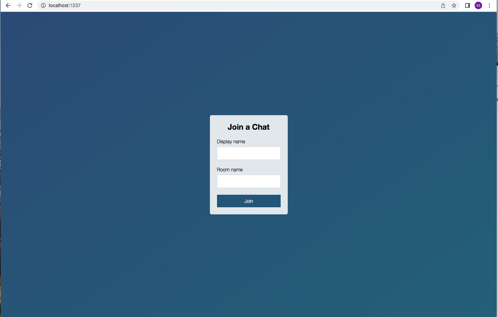

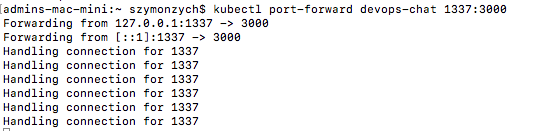

## Przekucie wdrożenia manualnego w plik wdrożenia (wprowadzenie)

```
apiVersion: apps/v1
kind: Deployment
metadata:
  name: devops-chat-deployment
  labels:
    app: devops-chat
spec:
  replicas: 4
  selector:
    matchLabels:
      app: devops-chat
  template:
    metadata:
      labels:
        app: devops-chat
    spec:
      containers:
        - name: devops-chat
          image: luxikhs/chat
          ports:
            - containerPort: 3000
```

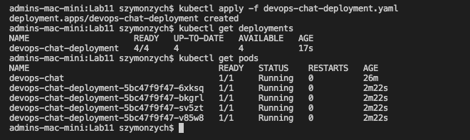

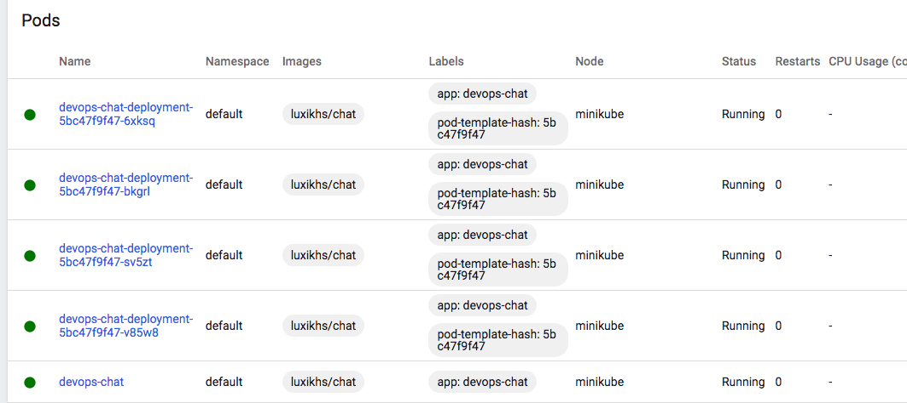

# Część 2

## Konwersja wdrożenia ręcznego na wdrożenie deklaratywne YAML

-Upewnij się, że posiadasz wdrożenie z poprzednich zajęć zapisane jako plik
-Wzbogać swój obraz o 4 repliki
-Rozpocznij wdrożenie za pomocą kubectl apply
-Zbadaj stan za pomocą kubectl rollout status

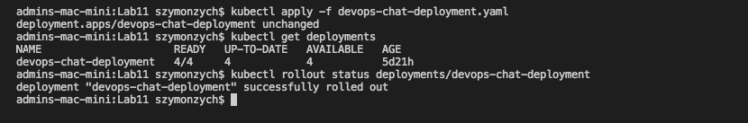

## Przygotowanie nowego obrazu

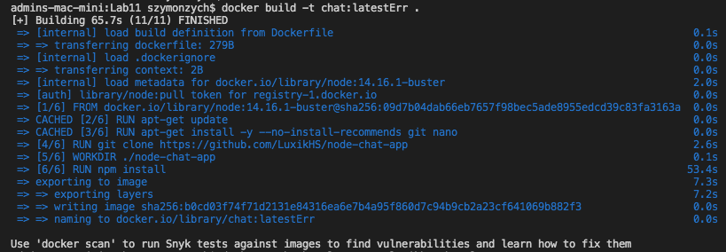

-Przygotuj wersję obrazu, którego uruchomienie kończy się błędem

Aby uruchomienie zakończyło się błędem po prostu usunąłem jeden niezbędny import.


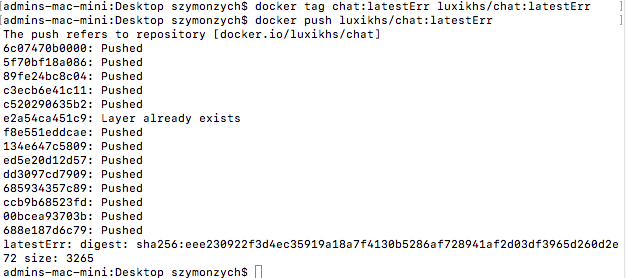

Wszytskie 3 obrazy na dockerhubie


## Zmiany w deploymencie

Aktualizuj plik YAML z wdrożeniem i przeprowadzaj je ponownie po zastosowaniu następujących zmian:

-zwiększenie replik

Zwiększyłem liczbę replik z 4 na 6

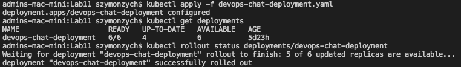

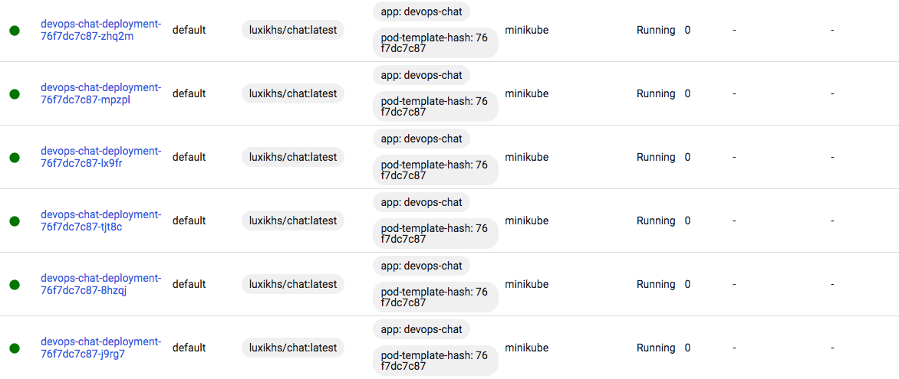

-zmniejszenie liczby replik do 1

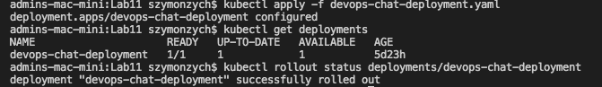

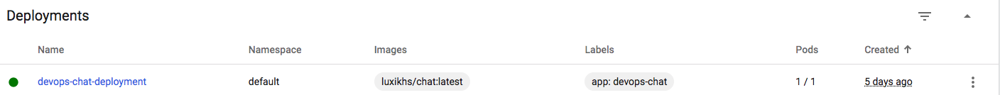

-zmniejszenie liczby replik do 0

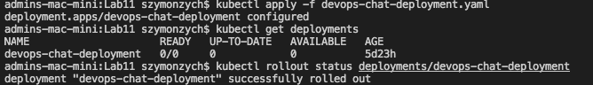

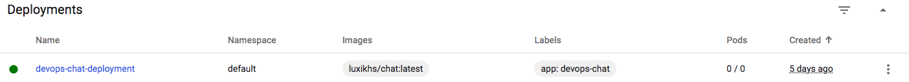

-zastosowanie nowej wersji obrazu

Aby zastosować nową wersję obrazu zmieniłem w pliku .yaml linijkę odnoszącą się do obrazu odwołując sie do tagu latest2, liczba podsów została na 0 tak jak w podpunkcie wyzej

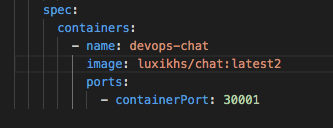

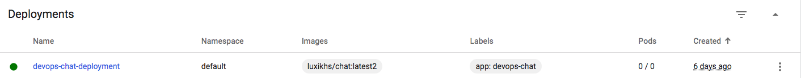

-zastosowanie starszej wersji obrazu

Został uzyty obraz wywołujący błąd

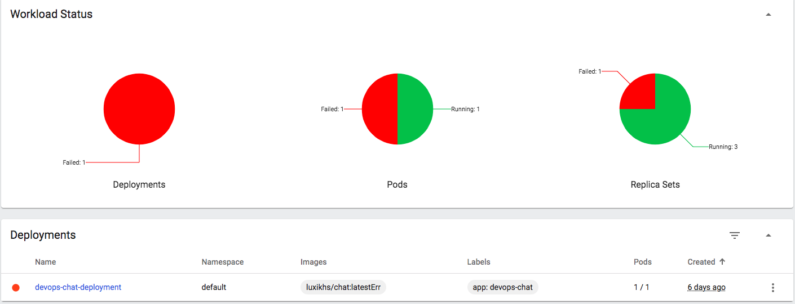

-Przywracaj poprzednie wersje wdrożeń za pomocą poleceń

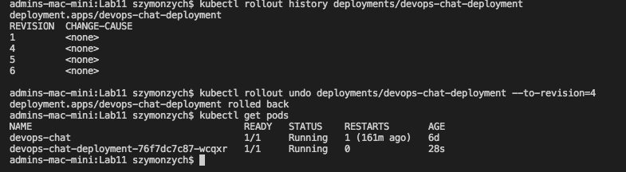

# Kontrola wdrożenia

Napisz skrypt weryfikujący, czy wdrożenie "zdążyło" się wdrożyć (60 sekund)

```
#!/bin/bash

cmd() {
  kubectl rollout status deployments/devops-chat-deployment
}

if cmd | grep -q 'deployment "devops-chat-deployment" successfully rolled out'; then
  echo "Deployment running"
else
  echo "Something went wrong"
fi
```

Działanie skryptu:

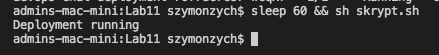

# Strategie wdrozenia

Przygotuj wersje wdrożeń stosujące następujące strategie wdrożeń:

-Recreate

StWorzono devops-chat-deployment-recreate.yaml na podstawie devops-chat-komunikator-deployment.yaml (strategia Recreate).

-Rolling Update

Stworzono strategie wdrazania RollingUpdate. Parametry maxSurage=1 oraz maxUnavailable=1

Początkowo stworzony został zestaw replik z nową wersją aplikacji następnie liczba replik starej wersji byla zmniejszana na rzecz nowych.

-Canary Deployment workload

Zapewnia to dzialanie dwoch serwisow obok siebie, a uzytkownik je przepina.
