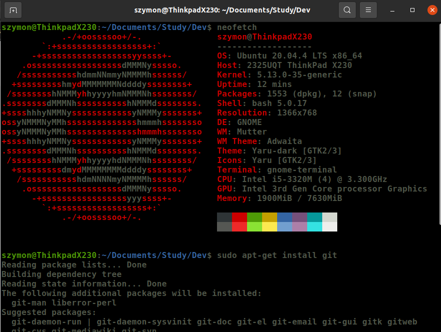
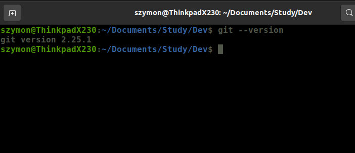
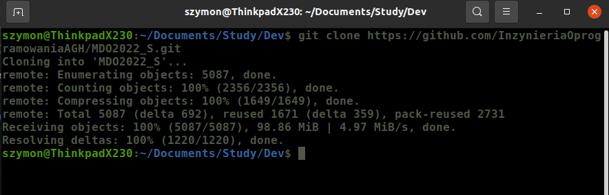
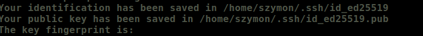
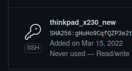
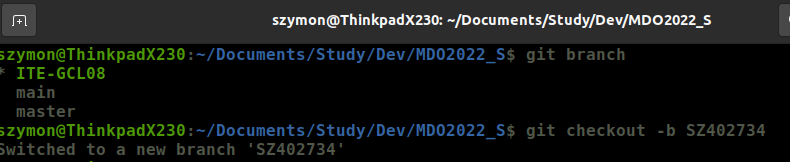
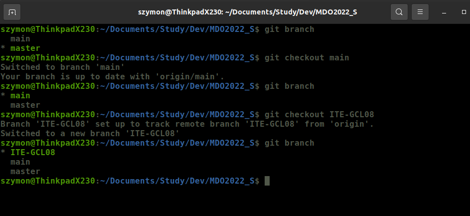
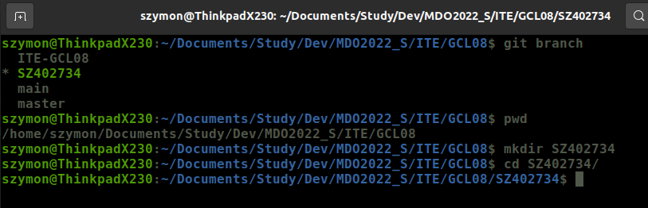
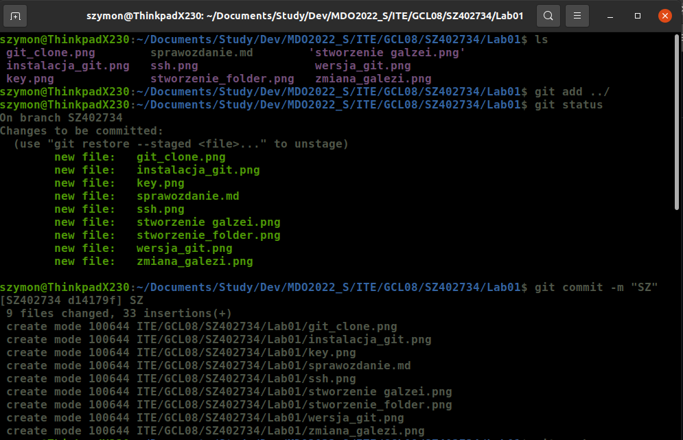
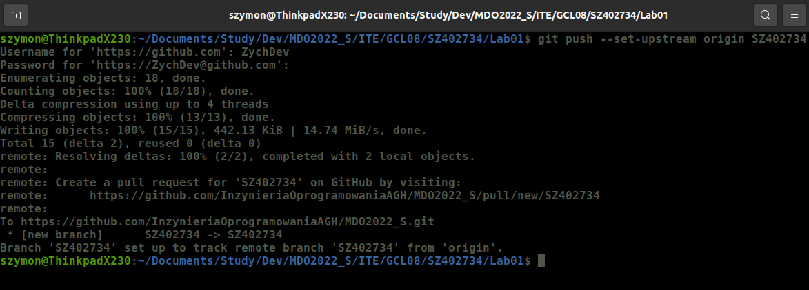

## Szymon Mateusz Zych 402734 Lab01

### Cel zadania
Konfiguracja klucza ssh oraz git w wersji terminalowej, stworzenie brancha oraz podstawowego folderu

### Kroki zadania
1. Zainstalowanie Git

2. Sklonowanie repozytorium poprzez HTTPS

3. Utworznie klucza SSH oraz pokazanie go

4. Ustawienie kluczy jako metoda dostepu do konta github

5. W folderze z clone repo przelaczenie sie na galez main oraz do katalogu grupy. Utworzenie wlasnego brancha oraz stworzenie wlasnego katalogu. We wlasnym katalogu stworzenie kolejno katalogu z numerem LAB.

6. Dodanie do katalogu naszych zmian oraz sprawozdania

### Wnioski

Uzyte komendy:
	sudo apt install git - instalacja pakietu git na linuxie 
	git --version - sprawdzenie wersji gita oraz czy istnieje 
	git clone - klon repozytorium do lokalnego 
	git branch - sprawdzanie na jakim branchu sie znajdujemy 
	git checkout name - zmiana brancha, flaga -b powoduje  			     dodanie nowego 
	git add name - dodanie pliku do repozytoruum 
	git commit -m -stworzenie commita flaga -m pozwala nam na 			       umieszczeni ekomentarza 
	git push --set-upstream origin name - wyslanie zmian do 						       repozytorium 

