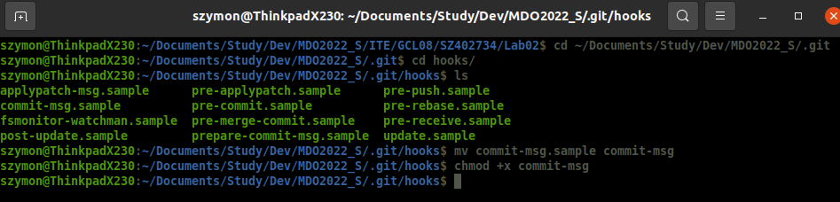
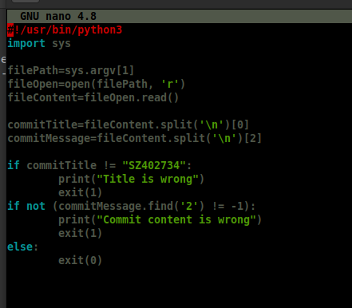
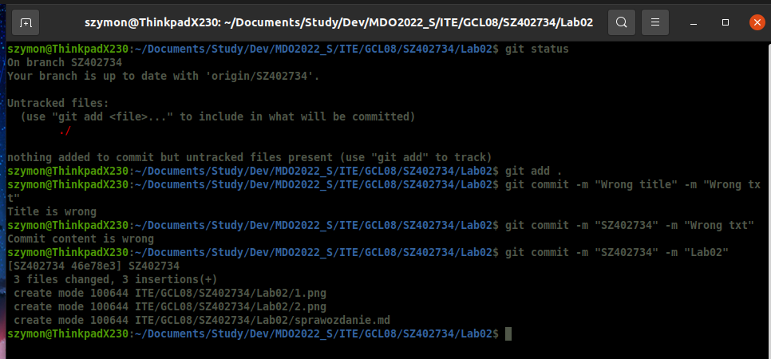
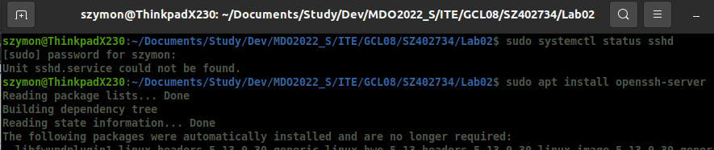
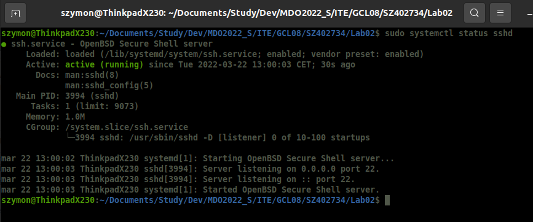
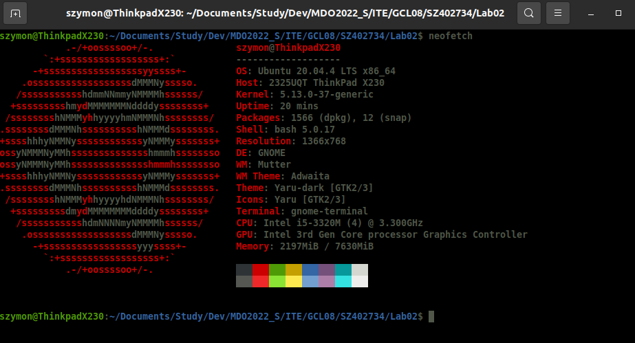
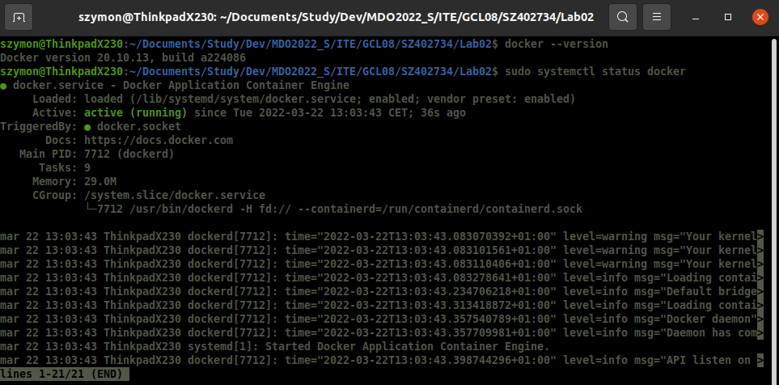
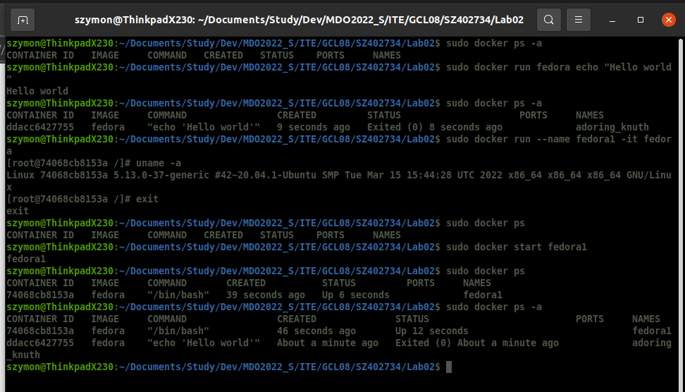
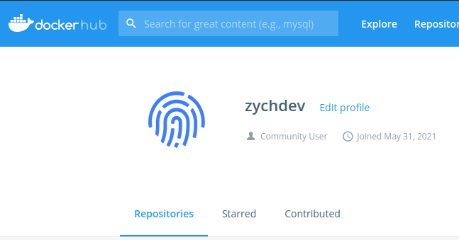

## Szymon Mateusz Zych 402734 Lab01

### Kroki zadania
1. Przygotowanie git hooka w celu sprawdzenia treści oraz tytułu commita (commit-msg).

### Kod:
 
2. Sprawdzenie działania git hooka. 
 
3. Przygotowanie środowiska Dockerowego, instalasja ssh. 

 
4. Uzycie Ubuntu jako bazy bez łaczenia sie z Windowsem. 
 
5. Zainstalowany Docker oraz jego działanie. 
 
6. Działanie Dockera oraz pobranie obrazu fedory. 
 
7. Start kontenera z Fedorą 
 
### Wykonane kroki:
- Lokalnie dostępne kontenery 
- Dla sprawdzenia działania uruchomienie z poziomu Fedory echo "Hello World" 
- Tworzenie kontenera fedora1 oraz sprawdzenie wersji systemu 
- Sprawdzenie kontenera 

8. Docker Hub Account 

