## Szymon Mateusz Zych 402734 Lab01

### Kroki zadania

0. Maszyna na której wszystko jest wykonywane (ThinkPad x61 better). 
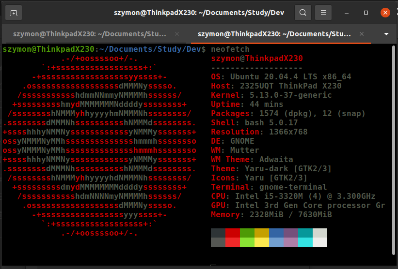 
1. Znalezienie projektu do wykonania laboratorium, środowisko Makefile w moim przypadku to npm. 

Link: https://github.com/microsoft/TypeScript.git 

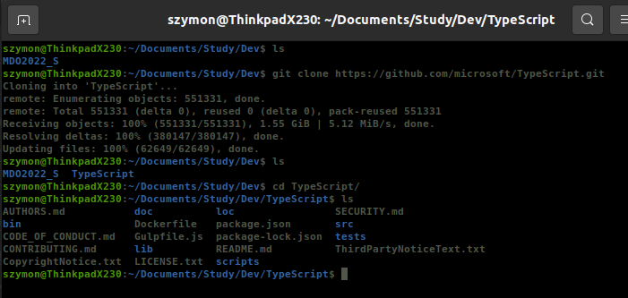 

2. Instalacja npm. 
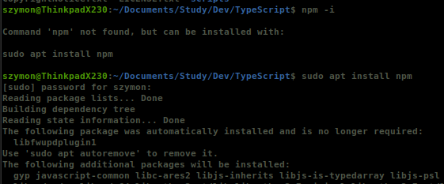 

3. Zbudowanie projektu za pomoca npm.  
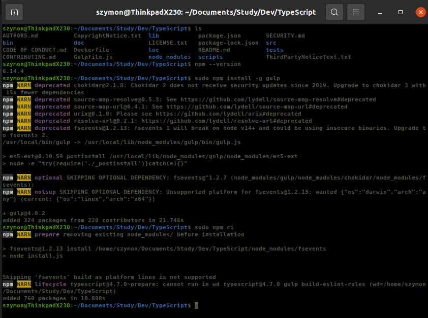 

4. Testowanie. 

### gulp tests - zbudowanie infrastruktury testów
 
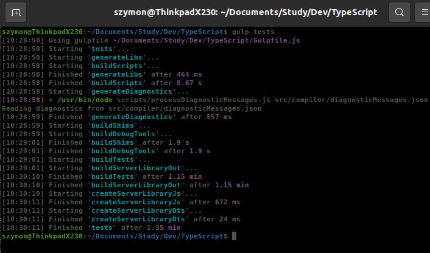 
### gulp runtests-parallel - uruchumoenie testów
 
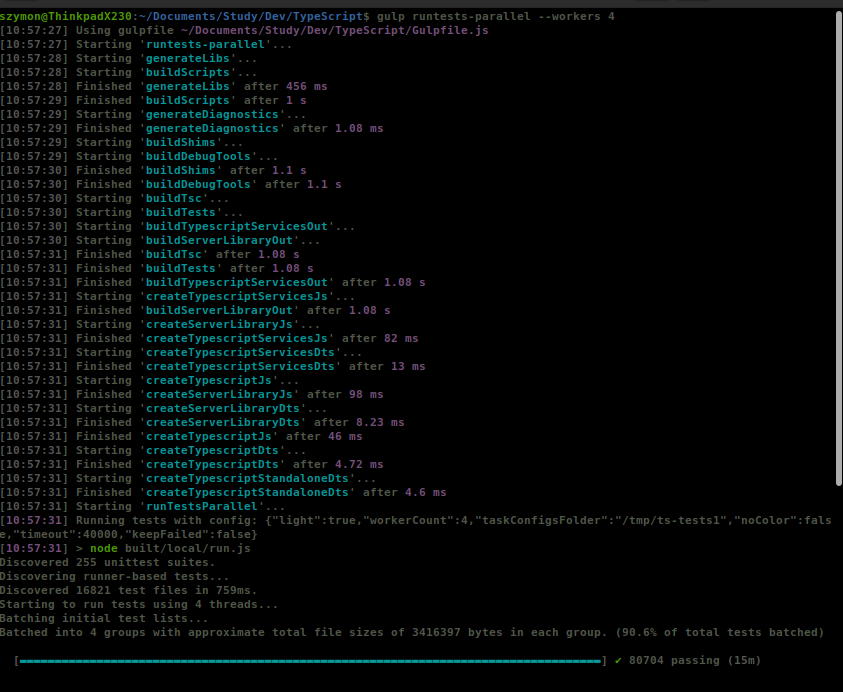 
 

5. Pobranie obrazu node. 
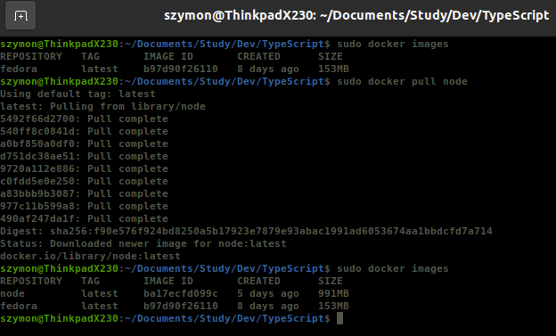 

6. Uruchomienie kontenera z obrazem node, podłączenie sie do niego za pomocą TTY, oraz sprawdzenie wymaganych aplikacji do zbudowania. 

###Sprawdzenie czy git i npm sa zainstalowane, skopiowanie projektu oraz zbudowanie.
 
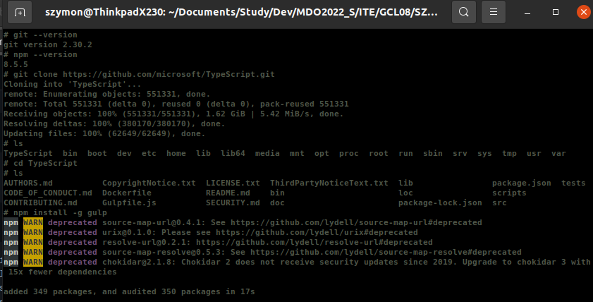 

7. Uruchomienie testów. 
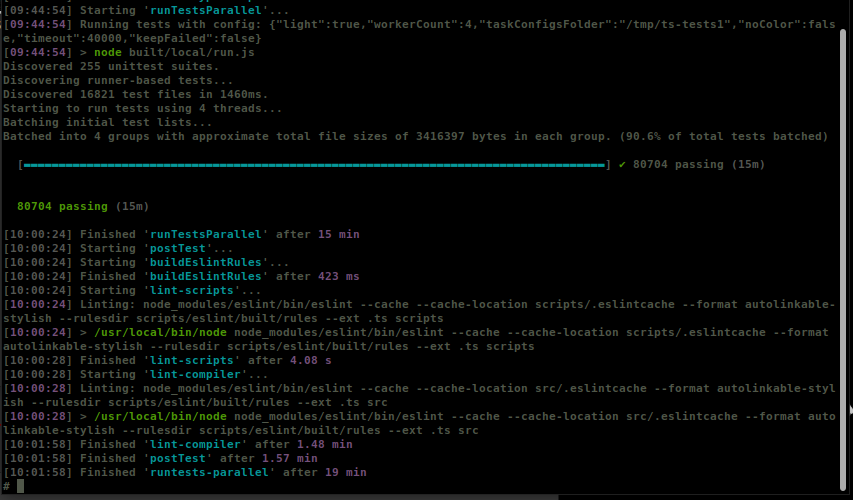 

8. Tworzenie Dockerfile az do builda. 
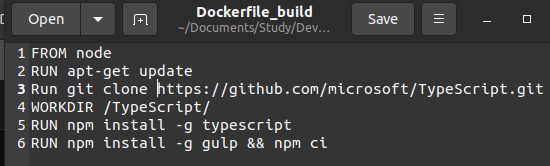 
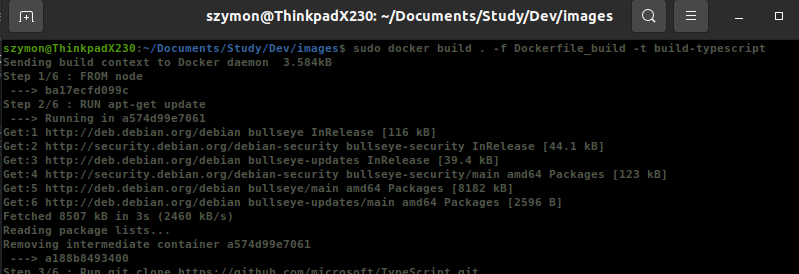 
 
8. Wykonanie testów. 
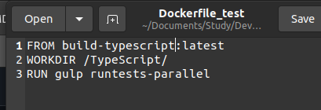 
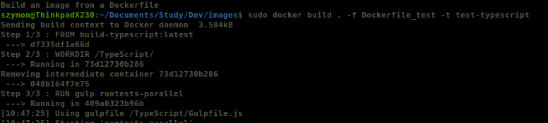 
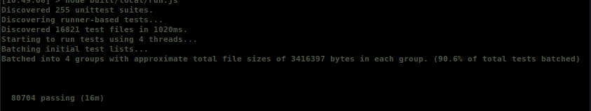 
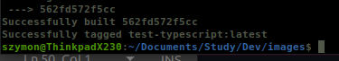 

9. Poprawność. 
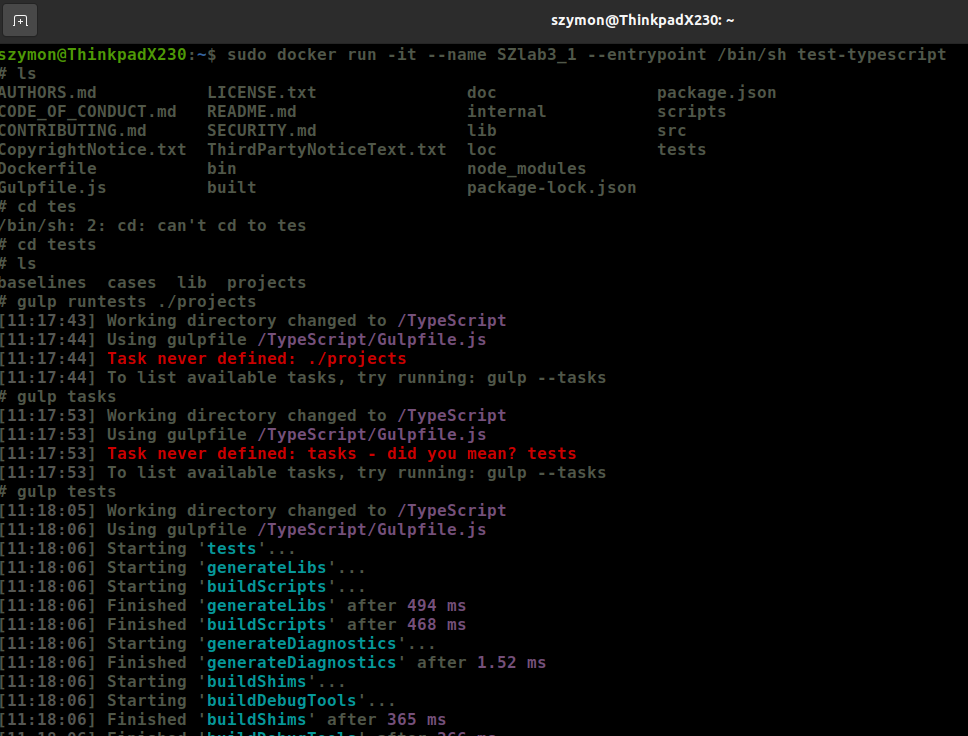 

10. Co pracuje w kontenerze utworoznym przez nas?. 
W środowisku odizolowanym w kontenerze pracuje nasz program. Jest to sposób na odizolowanie od systemu, obraz jest podstawą do utworzenia kontenera.

