# Szymon Mateusz Zych ITE-GCL08
## Sprawozdanie lab04
0. Prezentacja urzadzenia na którym jest wykonywane ćwiczenie

1. Woluminy o nazwach inputV oraz outputV.
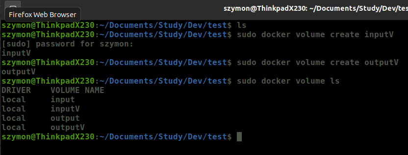

2. Tworzenie kontenera bazującego na node oraz podpięcie woluminów inputV, outputV.
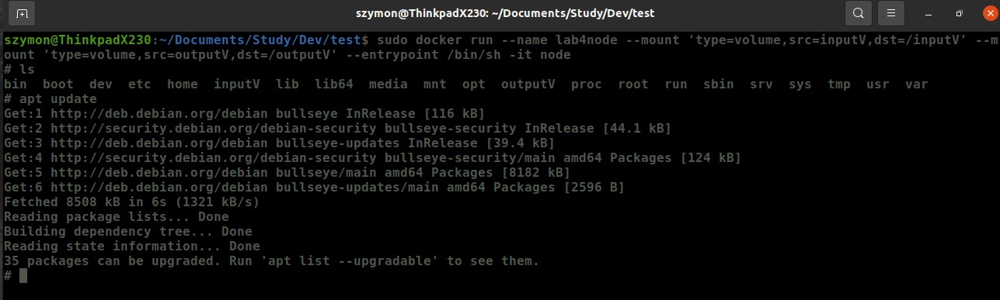

3. Sklonowanie do inputV repo git.

4. Repozytorium w kontenerze.
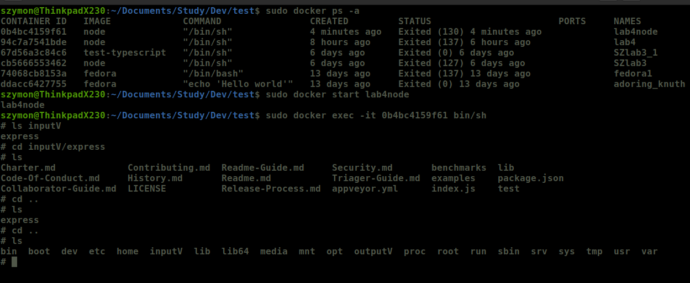

5. Kopiowanie repo z inputV do outputV oraz wykonianie builda.
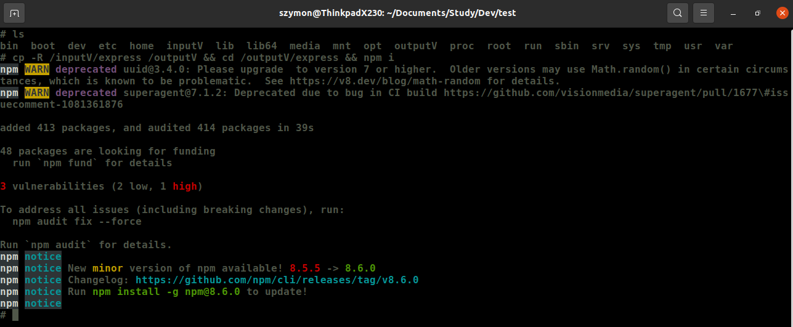
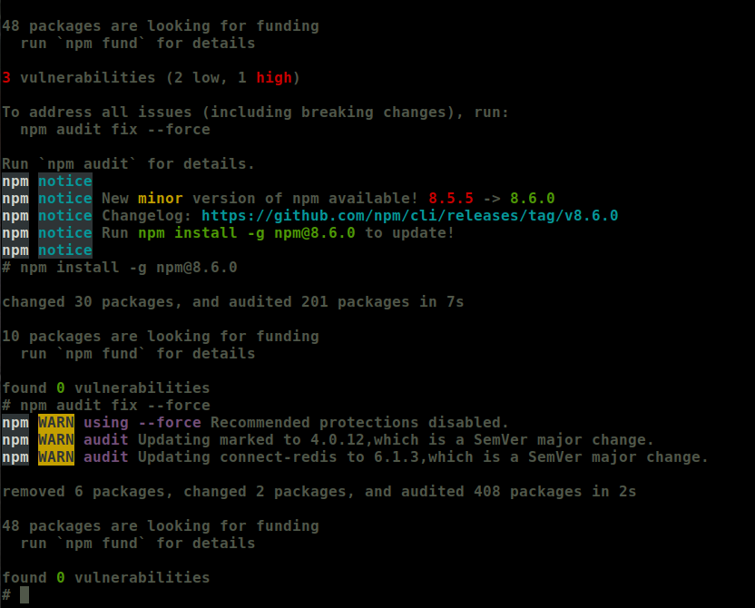

6. Sprawdzenie.
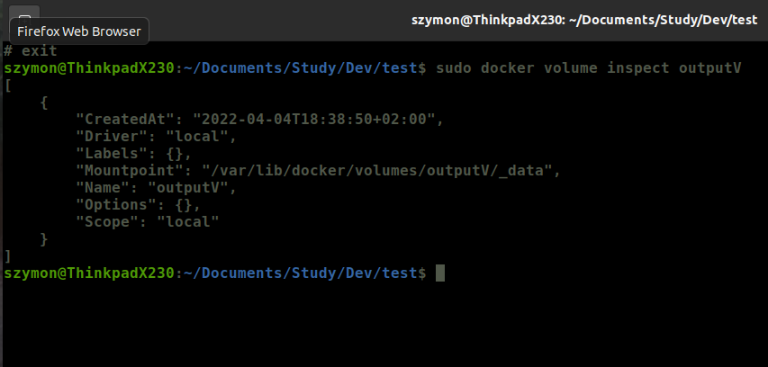
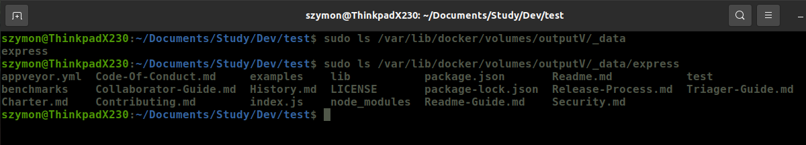

7. Pobranie iperf3 do kontenera, instalacja net-tools w celu sprawdzenia IP.
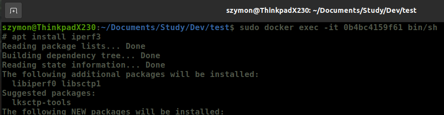

8. Nasłuchiwanie na porcie 2000 w kontenerze, stworzenie kolejnego kontenera zainstalowanie na nim iperf i sprawdzenie ruchu miedzy kontenerami.

9. Instalacja iperf3 na hoscie i sprawdzenie komunikacji.
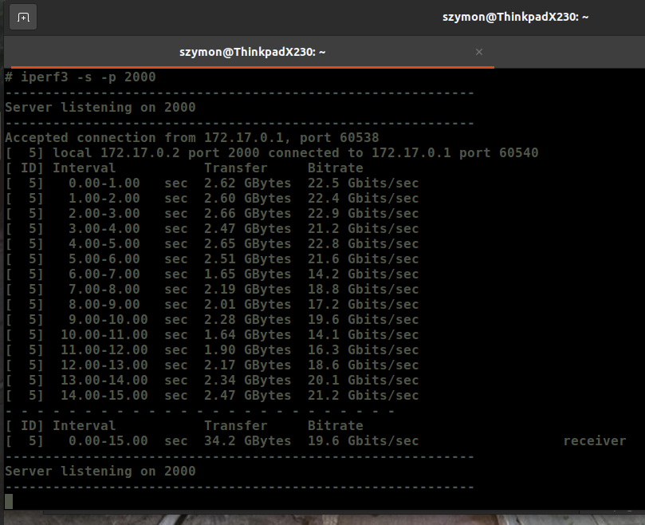
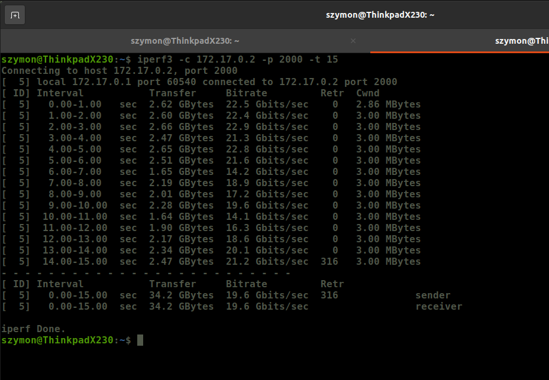

10. Sprawdzenie adresu IP hosta.
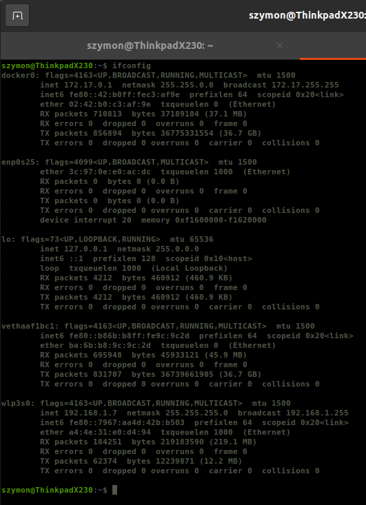

11. Pobranie iperf za pomoca brew na MacOS'a.
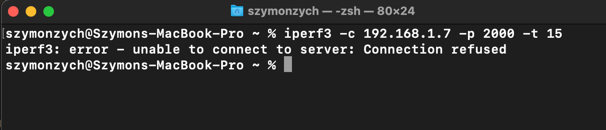
Kontener nie publikuje portu 2000 do hosta, czyli nie nasluchuje w tym porcie. Uruchamiamy kontener z opcja --publish.

12. Uruchomienie kontenera z opcja --publish dla 2000 i sprawdzenie.
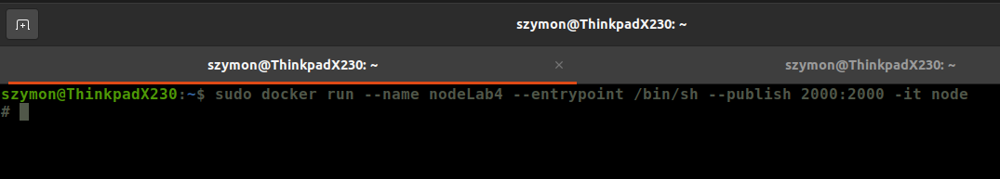
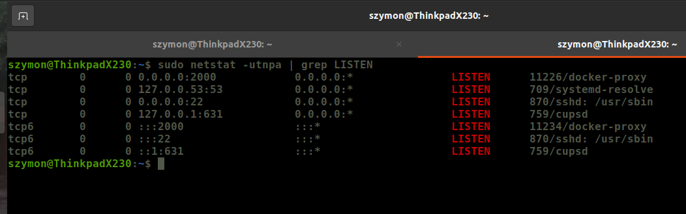

13. Sprawdzenie ruchu MacOS - host.
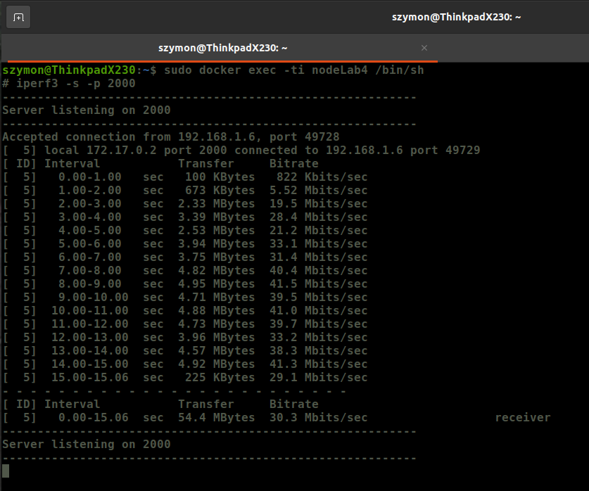
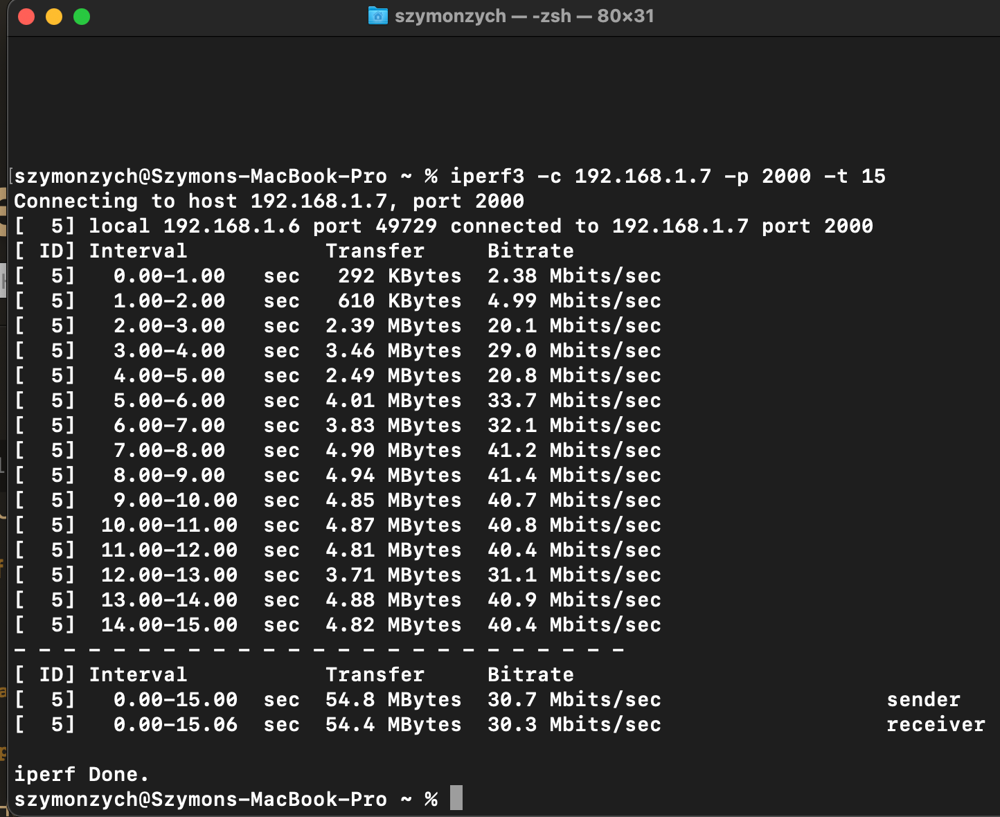

14. Zestawienie.
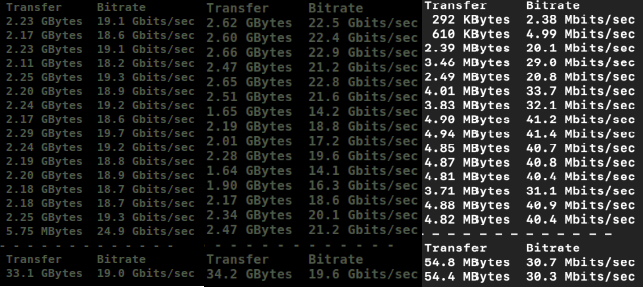

15. Stworzenie sieci mostkowej.
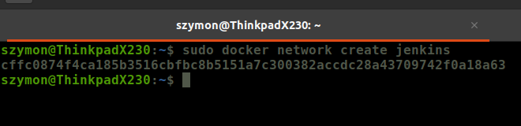

16. Pobranie i uruchomienie obrazu.
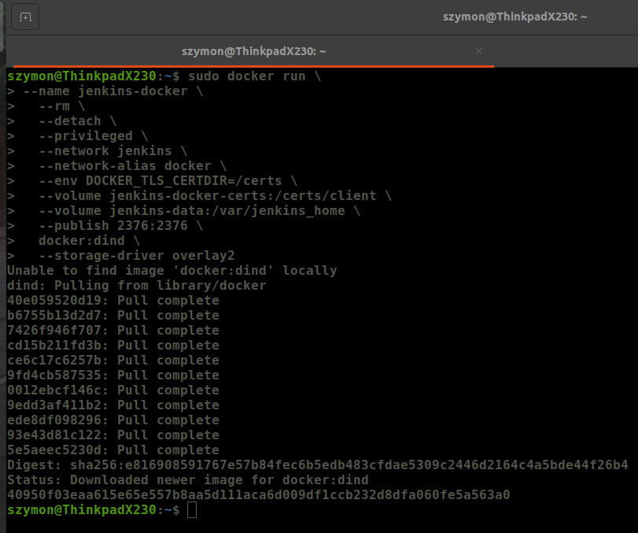

17. Stworzenie dockerfile.
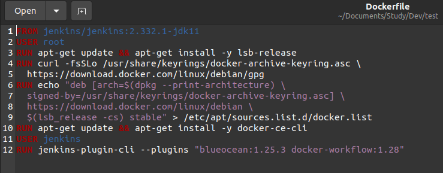

18. Obraz na podstawie Dockerfile.
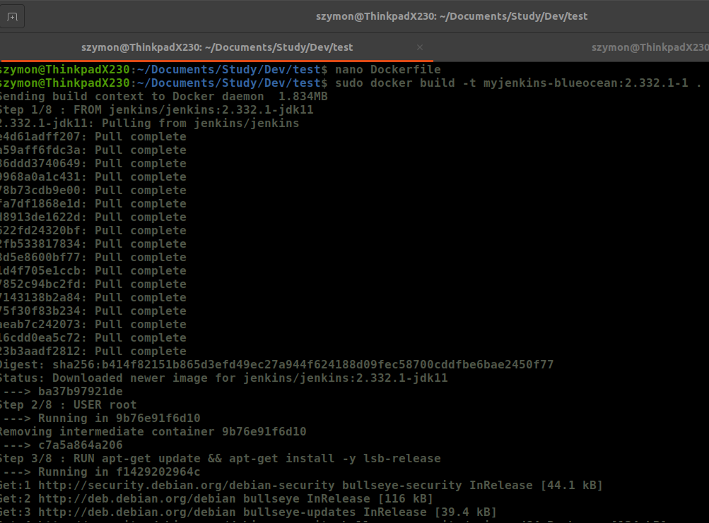

19. Star kontenera na podstawie obrazu.
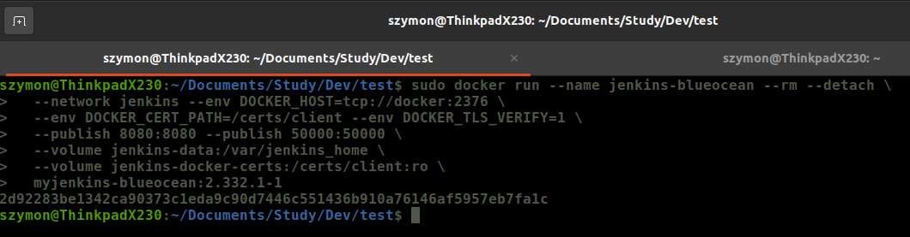

20. Sprawdzenie i pobranie hasła
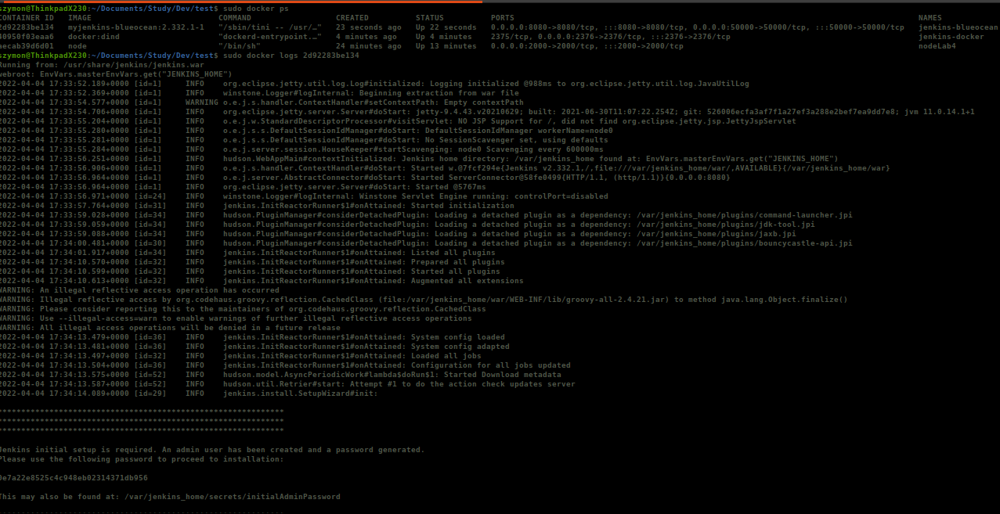

21. Wyświetlenie działania
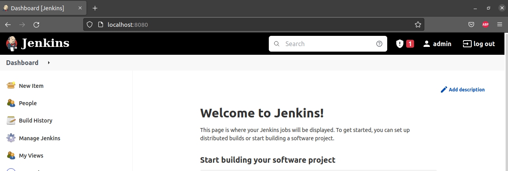
