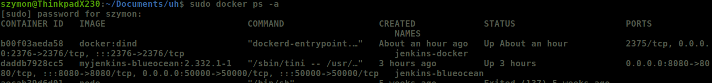
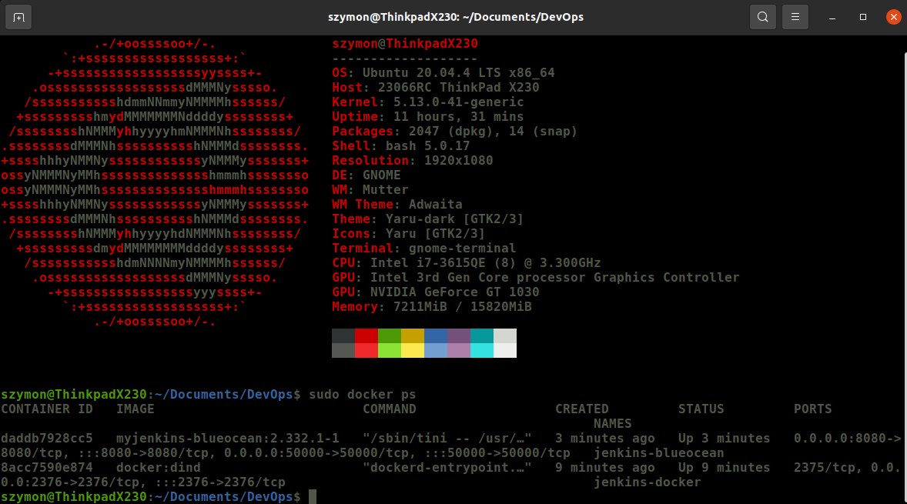
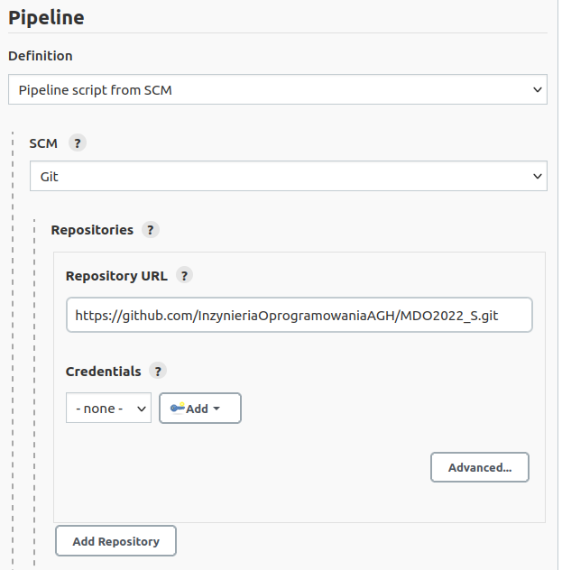
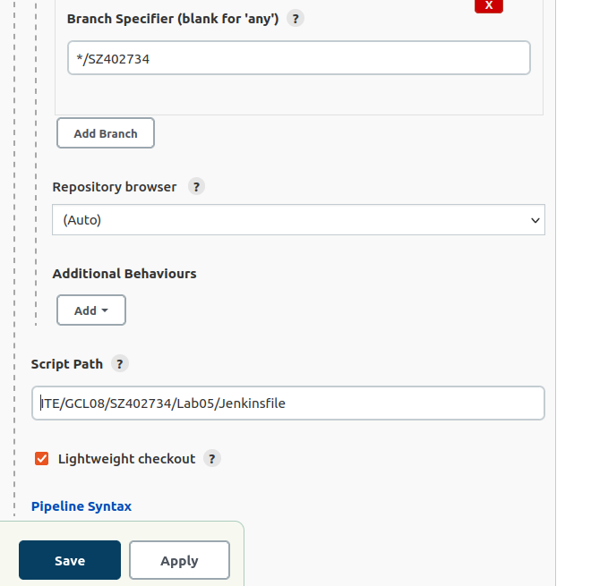
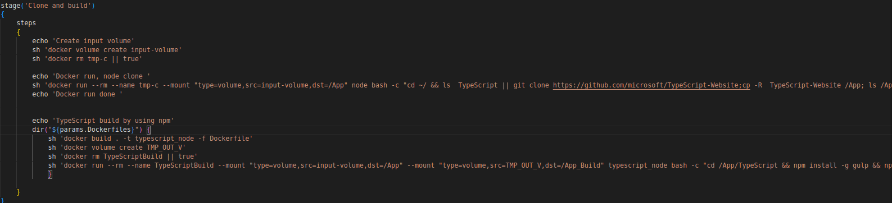
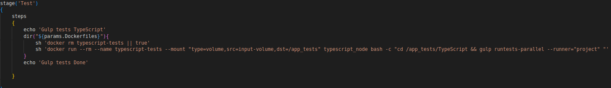
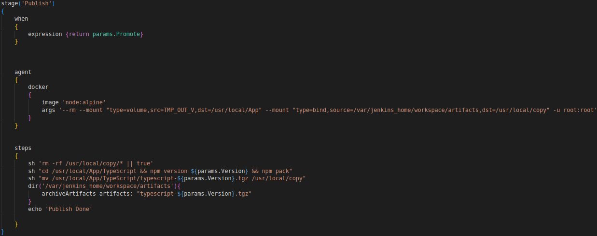
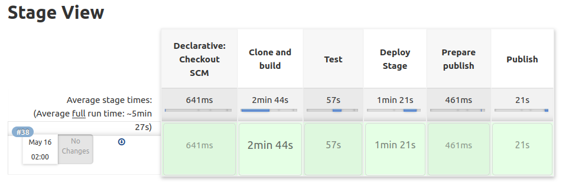
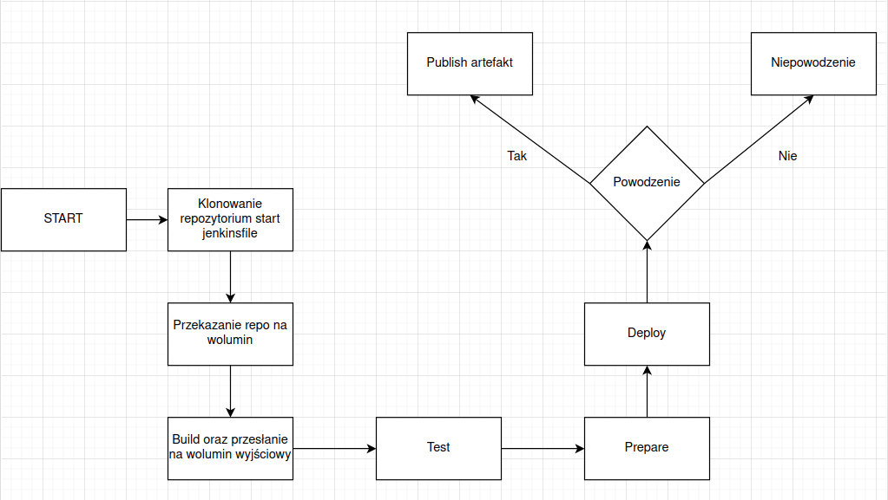

## Szymon Mateusz Zych 402734 Lab05

#### Cel: Przygotowanie Pipeline zawierającego build testy deploy oraz publish programu
#### Program: TypeScript
link: https://github.com/microsoft/TypeScript

#### Konfiguracja kontenera DIND oraz Jenkins


DIND
```
docker run \
  --name jenkins-docker \
  --rm \
  --detach \
  --privileged \
  --network jenkins \
  --network-alias docker \
  --env DOCKER_TLS_CERTDIR=/certs \
  --volume jenkins-docker-certs:/certs/client \
  --volume jenkins-data:/var/jenkins_home \
  --publish 2376:2376 \
  docker:dind \
  --storage-driver overlay2
```

Jenkins
```
docker run \
  --name jenkins-blueocean \
  --restart=on-failure \
  --detach \
  --network jenkins \
  --env DOCKER_HOST=tcp://docker:2376 \
  --env DOCKER_CERT_PATH=/certs/client \
  --env DOCKER_TLS_VERIFY=1 \
  --publish 8080:8080 \
  --publish 50000:50000 \
  --volume jenkins-data:/var/jenkins_home \
  --volume jenkins-docker-certs:/certs/client:ro \
  myjenkins-blueocean:2.332.3-1
```


### Start


0. Laptop na którym wszystko jest wykonywane 


1. Utworzenie pipeline'u oraz dodanie link do repozytorium. 


2. Dodanie nazwy brancha, ścieżka która definiuje położenie Jenkinsfile'a


### Etap Clone adn build
W wielkim skrócie celem tego etapu jest skopiowanie zawwartości tzn. programu z githuba producenta i umieszczenie go na woluminie wejściowym. Zbudowanie zawartości na wolumin wyjścowy. Zabezpieczenie wykonania przed nadpisaniem nazw kontenerów. Jeżeli kontener nie istnieje następuje utworzenie woluminu wejściowego oraz uruchomienie kontenera z woluminem. Sprawdzenie czy pliki takowe istnieja, jezeli nie zaczyna sie klonowanie repozytorium. Użyto obrazu node'a ze wzgledu na zawartość git, bash. Utworzenie woluminu wyjściowego jednocześnie uruchamiając kontener z utworzonego obrazu. Doinstalowanie niezbędnych zawartości oraz budowa na woluminie wyjściowym programu za pomoca gulp.




### Etap Test
Etap ma na celu sprawdzenie poprawności zbudowania naszego programu. TypeScript został testowany za pomocą **gulp runtests-parallel** który umozliwia wykorzystanie większej ilości wątków.



### Etap Deploy
Uruchomienie programu na woluminie wyjściowym. Wykorzystano zawartość plików do testowania oraz uruchomiono za pomocą **node built/local/tsc.js**
Usunięcie kontenera po wykonaniu


### Etap Prepare
Sprawdzenie czy wymagane katalogi istnieja, takie jak **artifacts**. 


### Etap Publish
Etap który ma na celu zapakować zbudowany program i zarchiwiziwać artefakt. Usuniecie plików z katalogu artifacts, oraz uzycie **npm pack**, przeniesienie w odpowiendie miejsce.


# Potwierdzenie działania Stage View


# Diagram



